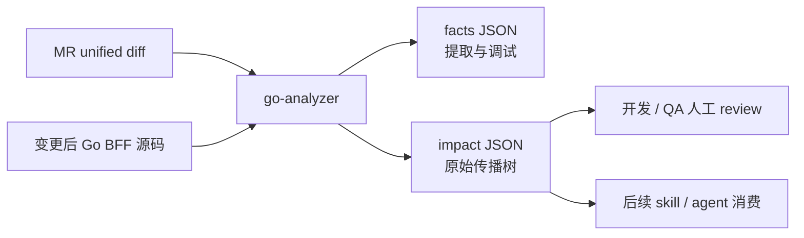
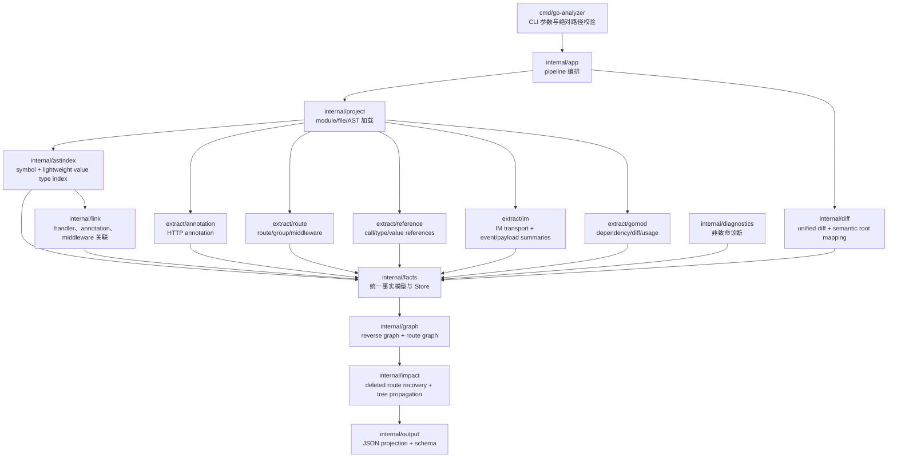
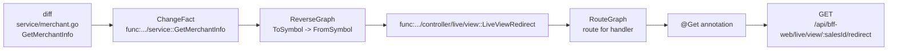
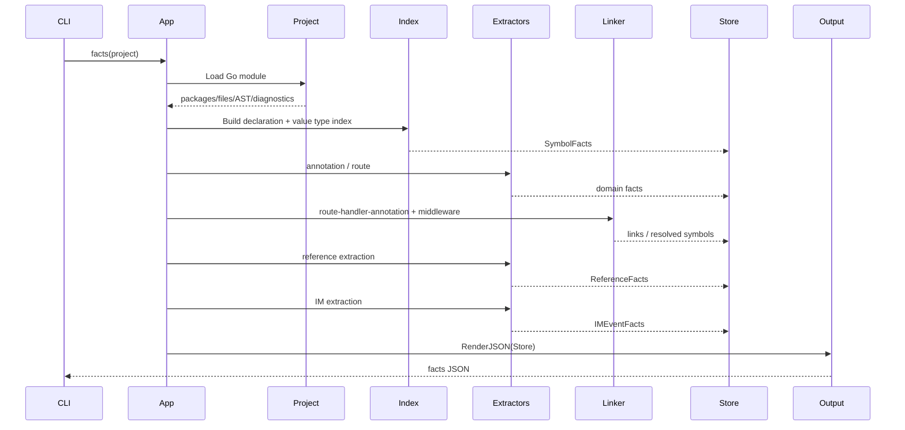
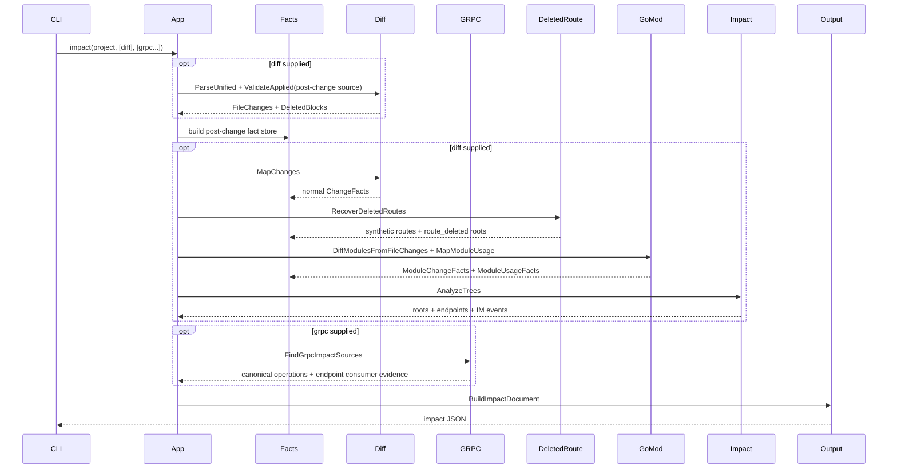

# go-analyzer 架构与开发指南

> 文档状态：当前实现基线，更新于 2026-07-13。
> 适用读者：项目维护者、代码评审者、首次接手的开发者，以及需要继续迭代本项目的 agent。
> 当前输出：facts JSON、统一 impact JSON，以及 endpoint-assets JSON。

## 1. 项目定位

`go-analyzer` 是面向单个 Go BFF 项目的静态影响范围分析工具。`impact` 读取变更后的项目源码，以及 unified diff 和/或发生变更的上游 gRPC operation；它将 diff 映射到 Go 语义符号，或将 gRPC operation 映射到可静态证明的 BFF consumer，最终输出受影响的 HTTP endpoint、出站 IM event 及完整证据。

核心问题只有一个：

```text
这次 Go BFF 变更，最终会影响哪些 HTTP 接口和 IM event？
```

当前分析模型是：

```text
diff
  -> changed symbol / route / middleware / annotation
  -> project-local reverse references
  -> route registration -> HTTP endpoint (annotation fallback)
  -> IM payload/event/control dependency -> IM transport -> IM event

grpc operation
  -> generated client + static receiver + project-local executable call chain
  -> route registration -> HTTP endpoint (annotation fallback)
```

项目刻意不分析“函数内部具体改了什么”，也不输出字段级变化描述。diff 的作用是定位最小完整语义根；影响分析从这个语义根向外扩散。

例如 struct 字段、字段类型或 tag 的变更统一归属于该 struct 的 `type` symbol：

```text
Address.City json tag changed
  -> type Address
  -> type CreateOrderRequest references Address
  -> controller OrderAPI.Create references CreateOrderRequest
  -> route registration
  -> POST /orders
```

对应端到端测试位于 `internal/app/pipeline_test.go` 的 `TestRunImpactMapsStructChangeToEndpointTree`。

## 2. 阅读路线

### 2.1 首次接手

建议依次阅读：

1. 本文第 3、4 节：建立系统和目录地图。
2. 第 6、7 节：理解 facts 与 impact 两条主流程。
3. 第 8、9、10 节：理解 diff、route、传播算法。
4. 第 13、14 节：运行命令并调试 fixture/真实项目。
5. 第 16 节：确认当前能力边界，避免错误假设。

### 2.2 代码评审

优先检查：

1. `internal/facts` 的数据契约是否变化。
2. extractor 是否只提取事实，没有混入传播逻辑。
3. 新关系是否进入 reverse graph 或 route graph。
4. 新 change kind 是否能在 `internal/impact` 中形成可解释路径。
5. JSON shape 是否同步 `internal/output/contract.go` 和 `docs/contracts/output-contract.md`。
6. 是否有最小 fixture、端到端测试和 smoke 场景。

### 2.3 排查“为什么没有命中接口”

按以下顺序定位：

1. `facts` 输出中是否存在目标 symbol。
2. 是否提取到 symbol reference。
3. route 是否存在、handler 是否解析为正确 symbol。
4. handler 是否存在 annotation。
5. diff 是否映射到预期 change root。
6. impact tree 在哪个节点终止；项目抽取不确定性到 facts 的 `diagnostics` 中检查，
   diff/module 降级则结合 impact root、`basis` 和 `confidence` 检查。

## 3. 系统上下文与边界



当前输入：

- 变更后的单份 Go module 源码。
- 一份标准 unified diff。

当前输出：

- `facts`：完整事实库，用于 extractor/linker 调试。
- `impact`：按 diff 来源组织的原始传播树、endpoint 摘要和 IM event 摘要。
- `schema`：facts/impact 的 JSON Schema。

当前不负责：

- 生成面向 QA 的自然语言报告。
- 分析前端页面。
- 还原运行时 route table。
- 下载并比较依赖包两个版本的源码/API。
- base/head 双快照对比。

## 4. 总体架构



纯终端下可简化理解为：

```text
CLI
  -> app
     -> project loader
     -> AST symbol/type index
     -> annotation/route/reference/IM/gomod extractors
     -> linker
     -> diff parser and semantic mapper
     -> deleted route and go.mod special roots
     -> reverse/route/IM graphs
     -> impact tree
     -> endpoint / IM event JSON contract
```

### 4.1 贯穿真实 BFF 的分析链路

下面用 `sl-sc1-bff-service` 的真实代码说明“diff 到 endpoint”的完整链路。假设 MR 改到了 `service.GetMerchantInfo`：

> 以下文件路径与代码片段来自兄弟仓 `sl-sc1-bff-service`，仅作链路示意，不随本仓提交；完整端到端验证由 `scripts/smoke-real-projects.sh` 在兄弟仓存在时执行。

- service 声明：`../sl-sc1-bff-service/service/merchant.go` 中的 `GetMerchantInfo`
- controller 调用：`../sl-sc1-bff-service/controller/live/view/redirect.go` 中的 `LiveViewRedirect`
- route 注册：`../sl-sc1-bff-service/router/live/view.go` 中的 `InitLiveViewRouter`
- endpoint 注释：`../sl-sc1-bff-service/controller/live/view/redirect.go` 中 `LiveViewRedirect` 的 `@Get`

真实代码关系：

```go
// service/merchant.go
func GetMerchantInfo(c context.Context, merchantId string) (*api.Merchant, error) { ... }

// controller/live/view/redirect.go
// @Get /api/bff-web/live/view/:salesId/redirect
func LiveViewRedirect(c context.Context, ctx *lego.RequestContext, req LiveViewRedirectReq) (*string, error) {
    merchantInfo, err := service.GetMerchantInfo(c, resp.MerchantId)
    ...
}

// router/live/view.go
group.GET("/:salesId/redirect", sa.ControllerWithReqResp(live_view.LiveViewRedirect))
```

对应 facts/impact 关系：

```text
astindex
  func:sc1-client-bff-service/service::GetMerchantInfo
  func:sc1-client-bff-service/controller/live/view::LiveViewRedirect

extract/reference
  FromSymbol = func:sc1-client-bff-service/controller/live/view::LiveViewRedirect
  ToSymbol   = func:sc1-client-bff-service/service::GetMerchantInfo
  Kind       = call

extract/annotation
  handler_symbol = func:sc1-client-bff-service/controller/live/view::LiveViewRedirect
  method/path    = GET /api/bff-web/live/view/:salesId/redirect

extract/route
  handler_raw    = live_view.LiveViewRedirect
  route          = GET /:salesId/redirect
  group prefix   = /api/bff-web/live/view

internal/link
  route -> handler symbol
  handler symbol -> annotation

internal/graph + internal/impact
  changed GetMerchantInfo
    -> ReverseGraph 找到 LiveViewRedirect
    -> RouteGraph 找到 route/annotation
    -> endpoint GET /api/bff-web/live/view/:salesId/redirect
```

同一条链路的图形化版本：



这也是当前实现的核心策略：`buildFacts` 先把项目里的声明、引用、路由和 link 都算出来；`RunImpact` 再把 diff 命中的 symbol 放进这些索引里反向传播。

## 5. 目录与模块职责

```text
go-analyzer/
├── cmd/go-analyzer/              CLI 入口和参数测试
├── internal/
│   ├── app/                      facts/impact 主流程编排
│   ├── astindex/                 declaration symbol 与轻量 value type 索引
│   ├── diagnostics/              可恢复问题的标准诊断模型
│   ├── diff/                     unified diff 解析、删除块保存、语义映射
│   ├── extract/
│   │   ├── annotation/           controller HTTP 注释提取
│   │   ├── grpc/                 generated catalog 与 BFF gRPC call 提取
│   │   ├── gomod/                go.mod dependency、diff 和本仓 usage
│   │   ├── im/                   IM 协议发现、event 求值和 payload 流摘要
│   │   ├── reference/            call/type/value 依赖提取
│   │   └── route/                route/group/middleware/wrapper 提取
│   ├── facts/                    跨模块共享的数据模型和事实 Store
│   ├── graph/                    反向引用、route、可执行调用与 IM event 查询图
│   ├── dependency/               endpoint 资产和 gRPC impact source 双向查询
│   ├── impact/                   传播树、endpoint、IM event、删除路由恢复
│   ├── link/                     route-handler-annotation 与 middleware symbol 关联
│   ├── output/                   JSON 文档、排序、schema contract
│   └── project/                  Go module 扫描与 AST 加载
├── testdata/
│   ├── fixtures/                 最小可复现 Go 项目
│   ├── diffs/                    fixture 对应 unified diff
│   └── golden/                   稳定 JSON 输出样本
├── docs/
│   ├── contracts/                输出契约
│   ├── design/                   历史设计与专项技术方案
│   ├── superpowers/specs/        历史设计规格
│   ├── superpowers/plans/        历史实施计划
│   └── validation/               真实项目验证记录
└── scripts/                      smoke/验收脚本
```

模块速查表：

| 模块                            | 做什么                                                             | 真实 BFF 示例                                                                                                        |
| ------------------------------- | ------------------------------------------------------------------ | -------------------------------------------------------------------------------------------------------------------- |
| `internal/project`            | 加载 Go module、文件、AST                                          | 读取`sl-sc1-bff-service` 的 `service/merchant.go`、`controller/live/view/redirect.go`、`router/live/view.go` |
| `internal/astindex`           | 给声明建立稳定 symbol ID                                           | `GetMerchantInfo` -> `func:sc1-client-bff-service/service::GetMerchantInfo`                                      |
| `internal/extract/reference`  | 找代码声明之间的依赖边                                             | `LiveViewRedirect` 调 `service.GetMerchantInfo` -> `call` reference                                            |
| `internal/extract/annotation` | 识别 handler 上的 HTTP 注释                                        | `@Get /api/bff-web/live/view/:salesId/redirect` -> annotation fact                                                 |
| `internal/extract/route`      | 识别 route group、route、middleware、wrapper                       | `group.GET("/:salesId/redirect", sa.ControllerWithReqResp(live_view.LiveViewRedirect))` -> route fact              |
| `internal/extract/im`         | 发现 IM transport，求值 event 并追踪 payload/控制依赖              | `GetMessageItem` -> `inbox_msg` / `inbox_customer_msg`；`LockInventoryUpdateMsg` -> `POST/LOCK_INVENTORY_UPDATE` |
| `internal/extract/grpc`       | 读取 generated client catalog，提取具备静态 receiver 证据的调用 | `channelConfigGrpc.Bind` -> `/com.shopline.sc.api.channel.StoreChannelConfigService/Bind` |
| `internal/link`               | 把 route raw handler、handler annotation、middleware symbol 接起来 | `live_view.LiveViewRedirect` -> `func:...::LiveViewRedirect`，再连到 `@Get`                                    |
| `internal/diff`               | 把 unified diff 映射到语义 root                                    | 改`service/merchant.go` 的函数体 -> `symbol_changed` root                                                        |
| `internal/graph`              | 构造传播查询视图                                                   | reverse reference、handler -> route/annotation、sender -> 精确 IM event                                           |
| `internal/dependency`         | endpoint -> gRPC 资产与 gRPC -> endpoint impact source 查询       | `POST /api/bff-web/sc/channel/config/bind` <-> `StoreChannelConfigService/Bind` |
| `internal/impact`             | 从 change root 扩散并产出 endpoint / IM event                      | `GetMerchantInfo` 落到 HTTP endpoint；IM payload type 落到具体 event                                               |
| `internal/output`             | 输出稳定 JSON/schema                                               | 输出原始传播树、module/grpc sources、endpoint 和 IM event 摘要                                                     |

### 5.1 `cmd/go-analyzer`

入口是 `cmd/go-analyzer/main.go`。

职责：

- 注册 `facts`、`impact`、`endpoint-assets`、`schema`、`help` 命令。
- 校验 CLI 的 project/diff 路径必须为绝对路径。
- `impact` 至少接受一个 `--diff` 或可重复的 `--grpc`；`endpoint-assets` 接受可重复的 `--endpoint`。
- 接受可选 Go build context 参数：`--goos`、`--goarch`、`--tags`、`--cgo`。
- `--timings` 只向 stderr 输出 pipeline 阶段耗时，不污染 JSON stdout。
- CLI help 使用中文描述，命令名和参数名保持英文，避免影响自动化脚本。
- 将参数转换为 `internal/app` options。
- 只负责进程输入输出，不承载分析逻辑。

### 5.2 `internal/app`

主编排位于 `internal/app/pipeline.go`：

- `RunFacts` / `RunFactsWithMetrics`：facts 入口。
- `RunImpact` / `RunImpactWithMetrics`：impact 入口。
- `buildFacts`：共享事实构建。

它是唯一应了解完整 pipeline 顺序的模块。extractor 之间不应互相调用，特殊 diff 逻辑也不应下沉到 CLI。
metrics API 记录阶段耗时用于性能观测；默认 facts/impact JSON 不携带耗时，保持输出确定性。

`RunFacts`、`RunImpact` 和 `RunEndpointAssets` 复用 facts 构建；它们是同一条 pipeline 的不同投影：

```text
RunFacts
  = buildFacts(project)
  -> 输出完整项目事实快照

RunImpact
  = buildFacts(project, grpc strict only when --grpc is present)
  -> optional diff: parse/map ChangeFact/deleted route/go.mod compensation/impact tree
  -> optional grpc: gRPC impact source query
  -> 输出同一份 JSON 中的 file/module/grpc sources 与汇总 endpoint / IM event

RunEndpointAssets
  = buildFacts(project, grpc strict)
  -> endpoint -> gRPC dependency projection
```

因此 `RunFacts` 更像“项目事实调试/观测入口”，用于确认当前项目中 symbol、route、annotation、reference、gRPC call、IM event、link 是否被正确抽取；`RunImpact` 在这份事实基础上叠加 MR diff 和/或上游 gRPC source，并产出最终人/agent 关心的接口和 IM 影响结果。若 gRPC 关系不对，先看 strict facts 中的 generated catalog、`GrpcOperationFact` 与 `GrpcCallFact`；facts 对再检查 endpoint 查询链路。

### 5.3 `internal/project`

入口：`internal/project/loader.go` 的 `Load`。

职责：

- 读取根目录 `go.mod` 的 module path。
- 递归扫描 `.go` 文件。
- 跳过 `_test.go`、Go 工具链忽略的 `_`/`.` 前缀文件和目录，以及 vendor/testdata 等目录。
- 使用显式或默认 Go build context 过滤 build constraints。
- 使用 `go/parser` + `parser.ParseComments` 生成 AST。
- 单个非变更源码解析失败时保留 `package_load_failed` diagnostic，继续分析其他文件。
- impact 所涉及的变更后 Go 文件若无法解析则直接失败，避免静默输出不完整范围。

所有 `project.File.Path` 在内存中是绝对路径；进入 facts/output 后统一转换为项目相对路径。

### 5.4 `internal/astindex`

入口：`internal/astindex/index.go` 的 `Build`。

索引以下 declaration：

- function。
- receiver method。
- type。
- package-level var/const。

稳定 symbol ID 形式：

```text
func:<package>::<name>
method:<package>:<receiver>:<name>
type:<package>::<name>
var:<package>::<name>
const:<package>::<name>
```

同一索引还保存轻量 value type：

- `var X T`
- `var X = T{}`
- `var X = &T{}`
- `var X = new(T)`
- `var X = NewT()`
- `const X NamedType = ...`
- imported type，如 `var X auth.Auth`
- struct field type，如 `type Dependencies struct { Auth auth.Auth }`

该索引用于解析常见的：

```text
pkg.Var.Method
pkg.Var.Field.Method
```

这里的设计重点是：`astindex` 首先是“声明符号索引”，其次才带一层“常见 selector receiver 解析”能力。

当前的 impact 粒度只需要定位到声明级 symbol：function、receiver method、type、package-level var/const。函数内部某一行、某个字段的精细 diff 不是本项目当前目标；结构体字段、tag、协议相关注释等落在 type declaration 内时，会先映射为 `type:<package>::<name>` 这个 symbol，再沿 type reference 继续传播。

轻量 value type 是为了解决 BFF 项目里非常常见的 package-level singleton / provider 写法。例如：

```go
var Default auth.Auth
g.Use(provider.Default.Middleware)

type Dependencies struct { Auth auth.Auth }
var Default = Dependencies{}
g.Use(provider.Default.Auth.Middleware)
```

如果只保存 declaration symbol，`provider.Default.Auth.Middleware` 只能看到一串 selector，无法知道最终是 `method:<auth package>:Auth:Middleware`。因此索引里额外保存：

- package-level var 的静态类型。
- 显式 typed const 的静态类型。
- struct field 的静态类型。
- callable 的首个返回值类型。

解析 selector 时既支持从 package-level var/显式 typed const 开始，也支持当前方法 receiver、显式类型参数/局部变量、`new(T)`，以及由项目内 constructor 返回值推断出的局部变量；随后按 field 链一路走到最终 receiver type，再拼出 method symbol。

局部变量绑定使用 `go/parser` 建立的 `ast.Object` 词法对象关系，而不是只按名称和
声明行号选择。内层 block 的同名变量退出作用域后，不会污染外层变量的方法解析。
package-level constructor 优先使用项目内 callable 的真实首返回值类型；外部
constructor 只用于确认依赖边界，不猜测一个可传播的项目内具体类型。

包级接口变量采用严格赋值证据：索引 loader 实际加载的非测试源码中的直接赋值，只有至少存在一个具体候选、已发现赋值都能高置信度解析且最终只有一个具体类型时，才把接口调用连接到具体方法。多实现或未知 RHS 一律不猜测；多实现输出 `symbol_reference_ambiguous_interface`，未知 RHS 输出 `symbol_reference_unknown_interface_binding`，其他无法归因的项目内调用仍输出 `symbol_reference_unresolved`。`_test.go` 不参与绑定；普通 `.go` 中的 mock 赋值仍视为真实候选。反射或项目源码之外的运行时注入不在这个闭世界模型内。

它不是 `go/types` 的替代品，只覆盖项目内、静态可解释的常见 BFF pattern；接口参数/字段、复杂控制流和运行时注入不在当前精度目标内。

以当前“diff 发生在哪个符号，然后扩散到 endpoint”的目标来看，这组 declaration symbol 是足够的；后续如果要做多实现动态绑定或 flow-sensitive 接口分析，才需要引入 `go/types` / SSA。

### 5.5 `internal/facts`

`internal/facts/store.go` 定义统一 Store。主要事实如下：

| Fact                      | 含义                              | 主要生产者                               |
| ------------------------- | --------------------------------- | ---------------------------------------- |
| `ProjectFact`           | project root/module/build context | app                                      |
| `SymbolFact`            | declaration symbol                | astindex                                 |
| `AnnotationFact`        | handler HTTP method/path          | annotation extractor                     |
| `RouteGroupFact`        | route group/prefix/parent         | route extractor                          |
| `RouteGroupFlowFact`    | group 参数/返回值的跨函数流向；仅传播用，不进入公开 facts JSON（Store 标 `json:"-"`） | route extractor                          |
| `RouteRegistrationFact` | method/path/handler/wrapper       | route extractor / deleted route recovery |
| `MiddlewareBindingFact` | group middleware 及顺序           | route extractor + linker                 |
| `ReferenceFact`         | call/type/value 边                | reference extractor                      |
| `LinkFact`              | route-handler、handler-annotation | linker                                   |
| `ChangeFact`            | diff 对应的传播根                 | diff/app/impact                          |
| `Module*Fact`           | dependency/change/local usage     | gomod extractor                          |
| `IMEventFact`           | 出站 event、sender 与精确依赖     | IM extractor                             |
| `GrpcOperationFact`     | canonical gRPC operation 与 generated transport 证据 | gRPC catalog extractor |
| `GrpcCallFact`          | BFF 调用点、静态 client binding 与 operation 关联 | gRPC call extractor |
| `DiagnosticFact`        | 可恢复的不确定性                  | 所有阶段                                 |

`facts.Store` 是 pipeline 内的共享事实总线；模块间通过 facts 通信，而不是直接共享私有 AST 状态。
`ReferenceFact` 和 `RouteRegistrationFact` 带统一 `evidence` 数组，记录关键 AST 表达式的 kind/raw/span/confidence，供 facts 调试和后续解释能力复用。

### 5.6 `internal/extract/annotation`

入口：`internal/extract/annotation/extractor.go` 的 `Extract`。

内置支持 `GET`、`POST`、`PUT`、`DELETE`、`PATCH`、`HEAD`、`OPTIONS`
对应的 `@Get`、`@Post` 等注释，输出 method/path/handler symbol；业务方不提供
annotation 语法配置。

annotation span 精确到注释行，而不是整个函数体：

- 改注释行 -> `annotation_changed`。
- 改函数签名或函数体 -> 所属 function/method symbol。

这条约束保证“diff 定位符号”的核心语义不被 annotation 覆盖。

### 5.7 `internal/extract/route`

入口：`internal/extract/route/extractor.go` 的 `Extract`。

提取：

- `g.Group("/prefix")`。
- `g.GET/POST/...("/path", handler)`。
- `g.Use(middleware)`。
- Group 调用中的 middleware 参数。
- handler wrapper stack。
- route group wrapper。
- route 子函数调用上下文中的唯一 group 前缀。
- group 参数传递和直接返回值形成的跨函数 group flow。
- statement order。

`internal/extract/route/call.go` 是正常 AST 提取和 deleted-route recovery 共用的 route call parser，避免两套语法漂移。
项目内 `Add*`/`Create*`/`New*`/`Build*` group helper 还会校验其返回类型：
必须是明确的 `RouterGroup`，或与首个 `*Group` 参数类型一致，避免仅凭函数名把普通
业务函数误识别为 route group wrapper。

### 5.8 `internal/extract/reference`

入口：`internal/extract/reference/extractor.go` 的 `Extract`。

输入是当前项目的完整 AST、`astindex.Index` 和共享 `facts.Store`：

```text
project.Project + astindex.Index + facts.Store
```

它在 `buildFacts` 阶段执行，也就是 `RunFacts` 和 `RunImpact` 都会先做这一步；并不是等 diff 出现以后才分析引用关系。

提取三类 reference：

- `call`：函数/方法调用。
- `type`：参数、返回值、字段、组合字面量、泛型参数等类型引用。
- `value`：var/const/function value。

selector/call/value 的解析集中在 `resolver` 边界内；extractor 负责遍历 AST 和写 facts，resolver 负责 typeflow、接口绑定诊断和 value/method 候选解析。
函数体提取先构建 `functionBodyContext`，再用一次 emission walk 同时处理 call/type/value 引用；`resolver` 仍然只负责候选符号解析和接口绑定诊断。

边方向是：

```text
FromSymbol depends on ToSymbol
```

其中 `FromSymbol` 是当前正在扫描的声明：

- 函数/方法签名或函数体内的引用，`FromSymbol` 是该 function/method。
- type declaration 内的字段、嵌入、组合等引用，`FromSymbol` 是该 type。
- package-level var/const 的显式类型、初始化表达式中的组合字面量类型引用、
  call 引用和 value 引用，`FromSymbol` 是该 var/const。

`ToSymbol` 是通过 `astindex` 能解析到的项目内目标 symbol。举例：

```go
func (c *OrderController) Get() {
    service.QueryOrder()
}
```

会产生类似：

```text
FromSymbol = method:<controller package>:OrderController:Get
ToSymbol   = func:<service package>::QueryOrder
Kind       = call
```

这条边的含义是“controller method 依赖 service function”。当 service function 被 diff 命中时，impact 传播要反向找依赖者，因此后续 `internal/graph` 会把它转成 `ToSymbol -> []FromSymbol` 查询视图。

传播时 `internal/graph` 会构造反向索引：

```text
ToSymbol -> all FromSymbol
```

### 5.9 `internal/extract/gomod`

职责分三层：

1. `extractor.go`：读取当前 `go.mod` dependency/replace。
2. `diff.go` 的 `DiffModulesFromFileChanges`：从 go.mod diff 的新增/删除行恢复 module changes。
3. `usage.go` 的 `MapModuleUsage`：把 changed module 映射到本仓 import usage。

支持：

- 单行 require。
- require block 中单独变化的依赖行，即使 hunk 不包含 `require (`。
- 单行 replace 和 replace block。
- replace-only hunk。
- added/removed/upgraded/downgraded/replaced。

本仓 usage 精度：

- 函数/方法体直接使用 import alias -> precise symbol。
- 只能确认 importing file -> file/declaration fallback。
- 本仓没有 import -> unreferenced，不产生 endpoint root。

### 5.10 `internal/extract/im`

入口：`internal/extract/im/extractor.go` 的 `Extract`。

`internal/extract/im/summary.go` 负责 IM summary propagation，`internal/extract/im/template.go` 负责包内私有的 value-template 模型、表达式模板化、模板替换和模板去重键。

职责分为四层：

1. 协议发现：只有项目同时存在 `broadcast://` 和 `/broadcast/send` 锚点时，才把本仓调用链识别为 IM transport。
2. SDK 适配：对公共 IM SDK 使用精确 import path、函数名和参数位置，不按相似函数名猜测。
3. 静态求值：支持字符串 literal、typed const、拼接、`iota + String()` 字符串表；无法确定的表达式保留 unresolved。
4. 函数摘要：通过 fixed-point 把 event、payload、wrapper 和控制依赖沿本仓调用链向上传播。

payload 依赖不仅包括直接类型，还包括 selector 字段类型、泛型
`jsonx.Unmarshal[T]` 的结果、本地转换函数的返回类型和 producer function。这样同一
函数发送多个 event 时，只命中确实使用变更 payload 的 event，不会因为共享 sender
产生误报。

当前内置 SDK 适配覆盖
`gopkg.inshopline.com/sc1/commons/utils/bus/notify/im` 的 `SendIm`、
`SendImAsync`、`SendImToUid` 和 `SendImToUidAsync`。Lego BFF 自有封装通过协议锚点
和函数摘要自动发现，不要求业务方配置函数名。

分析边界是当前 BFF 仓的 post-change AST 和 unified diff。不会读取 sc1-server，
也不会从上游 proto/schema 版本变化推断 BFF 的 IM 影响。

### 5.11 `internal/link`

入口：`internal/link/linker.go` 的 `Run`。

职责：

- route handler raw expression -> handler symbol。
- route -> handler link。
- handler -> annotation link。
- middleware raw expression -> middleware function/method symbol。

handler/middleware selector 共用 `astindex` 的 value type 解析，因此可以跨包解析：

```go
var Default auth.Auth
g.Use(provider.Default.Middleware)
```

也可以解析一层或多层已索引 struct field：

```go
var Default = Dependencies{}
g.Use(provider.Default.Auth.Middleware)
```

它解决的是“不同 extractor 产出的事实如何接到同一条 endpoint 链路上”的问题。

几个 extractor 的关注点不同：

- `route` extractor 只负责从路由注册语法里抽出 `GET /path -> handler raw expression`。
- `annotation` extractor 只负责从 handler 注释里抽出 `@Get /path -> handler symbol`。
- `reference` extractor 只负责代码 symbol 之间的依赖边。

这些事实如果不 link，route 里只会留下 `controller.GetOrder` 这样的 raw string，无法稳定传播到 handler symbol；annotation 也无法和 route 注册关联起来。`internal/link` 的作用就是把 raw expression 解析成 symbol，并补充：

```text
route registration -> handler symbol
handler symbol -> annotation
middleware binding -> middleware function/method symbol
```

后续 `RouteGraph` 才能回答：

- 某个 handler 变了，影响哪些 route。
- 某个 middleware 方法变了，影响哪些挂载了该 middleware 的 route。
- route 找到 handler 后，以已解析 route method/path 确认 endpoint；仅在没有可解析 route 时回退到 handler annotation。

真实 BFF 例子：

```go
// router/live/view.go
group.GET("/:salesId/redirect", sa.ControllerWithReqResp(live_view.LiveViewRedirect))

// controller/live/view/redirect.go
// @Get /api/bff-web/live/view/:salesId/redirect
func LiveViewRedirect(...) (*string, error) { ... }
```

`route` extractor 只能先得到：

```json
{
  "method": "GET",
  "local_path": "/:salesId/redirect",
  "resolved_path": "/api/bff-web/live/view/:salesId/redirect",
  "handler_raw": "live_view.LiveViewRedirect",
  "wrappers": [
    {
      "name": "ControllerWithReqResp",
      "raw": "sa.ControllerWithReqResp(live_view.LiveViewRedirect)"
    }
  ]
}
```

这里的 `handler_raw` 仍然只是 route 文件里的表达式文本。`link` 会结合 route 文件 import：

```go
import live_view "sc1-client-bff-service/controller/live/view"
```

把它解析成稳定 handler symbol，并写回 route：

```json
{
  "handler_symbol": "func:sc1-client-bff-service/controller/live/view::LiveViewRedirect"
}
```

同时补两条 link：

```json
{
  "kind": "route_to_handler",
  "from_id": "route:func:sc1-client-bff-service/router/live::InitLiveViewRouter:GET:/:salesId/redirect:2",
  "to_id": "func:sc1-client-bff-service/controller/live/view::LiveViewRedirect"
}
```

```json
{
  "kind": "handler_to_annotation",
  "from_id": "func:sc1-client-bff-service/controller/live/view::LiveViewRedirect",
  "to_id": "annotation:func:sc1-client-bff-service/controller/live/view::LiveViewRedirect:GET:/api/bff-web/live/view/:salesId/redirect:0"
}
```

因此 `internal/link` 不是做“函数调用依赖”的模块；函数调用依赖归 `internal/extract/reference`。`link` 解决的是 route 领域里的身份对齐：把 route 文件里的 handler 表达式、controller 文件里的 handler 声明、handler 注释里的 endpoint 归并到同一个 handler symbol 上。

### 5.12 `internal/diff`

入口：

- `internal/diff/parser.go` 的 `ParseUnified`
- `internal/diff/mapper.go` 的 `MapChanges`

parser 保存：

- old/new path。
- added/deleted/modified status。
- 新版本行号范围。
- deletion-only anchor。
- 连续删除块的旧行号、新版本锚点和原文本。
- 每个文件的原始 patch。

mapper 按领域事实优先级选择最精确 root：

```text
annotation
  -> route group
  -> route
  -> middleware
  -> smallest containing symbol
  -> file fallback
```

### 5.13 `internal/graph`

包含四个运行时查询视图。它们都基于同一个 `facts.Store` 临时构造，不是新的事实来源，也不会写回业务事实：

- `ReverseGraph`：被依赖 symbol -> 依赖它的 symbol references。
- `RouteGraph`：handler/group/middleware -> routes/annotations。
- `IMGraph`：sender -> IM facts，并按当前传播 path 上的 payload/event/control 依赖精确匹配。
- `CallGraph`：只保留项目内 `call` reference 与 gRPC call terminal，供 endpoint/gRPC 双向查询。

graph 不生产业务事实，只对 Store 建立高效查询视图。

需要拆成两个视图，是因为两类关系的语义不同：

```text
ReverseGraph: 代码依赖传播
  changed service symbol
    -> caller controller symbol
    -> caller route init symbol ...

RouteGraph: HTTP 路由域传播
  handler symbol
    -> route registration
    -> annotation
    -> endpoint

  middleware binding
    -> same group 且 statement order 更靠后的 routes

  middleware symbol
    -> middleware binding
    -> same group 且 statement order 更靠后的 routes

  route-scoped dependency
    -> reference span 所在的具体 route registration

  assigned-group dependency
    -> group 创建表达式引用的 guard/factory
    -> 该 group 及跨函数 descendant group routes

  route group
    -> descendant routes
```

impact tree 构造时会同时使用它们：

```text
ChangeFact(symbol)
  -> ReverseGraph.ReferencesTo(symbol)
  -> 上游 symbols
  -> RouteGraph.RoutesForHandler(handler)
  -> annotation / endpoint

ChangeFact(route/middleware/group/annotation)
  -> 直接进入 RouteGraph
  -> endpoint

ChangeFact(symbol)
  -> ReverseGraph propagation path
  -> IMGraph.EventsForPath(sender, path)
  -> concrete or unresolved IM terminal
```

如果没有 `ReverseGraph`，从 service/type 无法反推到 controller 或 sender；如果没有
`RouteGraph`，从 handler/middleware/group 无法进入最终 HTTP endpoint；如果没有
`IMGraph` 的 path 依赖匹配，同一 sender 内的多个 event 会产生误报。拆开后每个视图
保持单一查询语义，也避免在传播阶段反复 O(n) 扫描 Store。

### 5.14 `internal/dependency`

入口：`internal/dependency/query.go`。

职责：

- `FindEndpointAssets`：从 endpoint handler 沿项目内可执行调用链查找 gRPC terminal。
- `FindGrpcImpactSources`：从输入的 canonical full method 查找当前 BFF 的 HTTP consumer。
- endpoint 优先以已解析 route 确定；无可解析 route 时才使用 controller annotation。
- gRPC source 保留合法输入，即使当前 BFF 未消费该 operation 也返回空 consumer 数组。
- 只接受 generated transport、receiver 静态类型和项目内可执行调用链共同证明的关系；不推断外部 SDK 的隐藏调用。

### 5.15 `internal/impact`

入口：

- `internal/impact/deleted_route.go` 的 `RecoverDeletedRoutes`
- `internal/impact/tree_builder.go` 的 `AnalyzeTrees`

职责：

- 从 diff 删除块恢复已删除 route registration。
- 为每个 ChangeFact 构造独立 impact tree。
- 从 symbol 传播到引用者。
- 从 handler、route group、middleware、route 注册表达式内的 helper 进入 route graph。
- 以 annotation 为首选 endpoint。
- 在缺少 annotation 时保留 route method/path fallback。
- 把匹配的 IM fact 投影为 `im_event` 或 `im_event_unresolved` 终端。
- 处理 cycle。

### 5.16 `internal/output`

入口：

- `internal/output/impact_tree.go` 的 `BuildImpactDocument`
- `internal/output/impact_tree.go` 的 `RenderImpactTreeJSON`
- `internal/output/contract.go` 的 `SchemaJSON`

职责：

- 把内部 tree 投影为稳定 JSON。
- 按 file、module、gRPC source 聚合影响证据。
- 去重 endpoint 和已解析 IM event。
- 稳定排序，降低 golden/consumer 抖动。
- 保留人工 review 所需的 raw evidence 和原始 diff。
- 暴露 facts/impact JSON Schema。

### 5.17 `internal/diagnostics`

diagnostic 是可恢复的不确定性，不等同于程序失败。impact JSON 不输出
diagnostics。运行 `facts` 可以检查 project/index/extractor/link 阶段的项目事实
diagnostics；diff、删除恢复和 go.mod usage 阶段只在 `impact` 内执行，其 diagnostics
当前不属于公开 JSON 契约。

facts 中可观察的典型情况：

- route 动态 path。
- handler/symbol/type 无法精确解析。
- strict interface dispatch 发现多实现或未知赋值，因而拒绝猜测具体方法。
- 单个非变更 Go 文件解析失败。

impact 内部还会记录删除声明降级、go.mod diff 无法识别 module、module usage
file fallback 等信息；最终报告通过 root、`basis` 和 `confidence` 表达可见的降级
结果，而不是输出 diagnostics。

诊断码定义以 `internal/diagnostics/codes.go` 为准。

## 6. Facts 构建流程



实际调用顺序见 `internal/app/pipeline.go` 的 `buildFacts`：

1. `project.Load`。
2. `astindex.Build`。
3. 当前 go.mod dependencies。
4. project load diagnostics。
5. symbols。
6. annotation。
7. route。
8. link。
9. reference。
10. IM event。

## 7. Impact 构建流程



`RunImpact` 的源码入口是 `internal/app/pipeline.go` 的同名函数。

## 8. Diff 到语义根

当提供 `--diff` 时，`RunImpact` 要求 diff 已应用到 `--project` 指向的源码快照。parser 会保留 hunk
中的新版本 context/added lines，`ValidateApplied` 在构建 AST 前逐行核对；删除文件
必须已不存在，路径越界、空 diff、旧快照或不匹配快照都会直接失败。相同项目快照和
相同 diff 因而具有确定的分析输入。

### 8.1 普通新增/修改

新增行使用新版本行号直接命中变更后 AST 的领域事实或 symbol。

如果一个 range 同时落在多个 declaration span 中，选择行跨度最小的 symbol，保证优先命中最具体 declaration。

### 8.2 struct 字段和 tag

astindex 不生成 field symbol。整个 `type` declaration 的 span 包含字段：

```text
field/tag diff -> owning type symbol
```

随后 type references 会将影响传播到使用该类型的其他 type/function/method。

### 8.3 删除普通声明

当前没有完整 base snapshot。删除行先映射到新版本 anchor：

- anchor 仍位于 surviving declaration -> medium confidence symbol root。
- declaration 整体已不存在 -> file root + `deleted_symbol_unresolved`。

这是单快照的明确边界，不应把 file fallback 解释成精确 symbol 恢复。

### 8.4 删除 route registration

删除 route 是定向增强：

1. diff parser 保留删除块原文。
2. deleted route parser 将完整删除块包装成临时 Go function。
3. 支持单行和多行 route call。
4. 复用正常 route call parser。
5. 尝试从变更后 route/group facts 恢复 group/prefix。
6. 尝试恢复 handler symbol 与 annotation。
7. 添加 synthetic route 和 `route_deleted` root。

优先 endpoint：

```text
deleted route -> handler annotation -> endpoint
```

无法解析 annotation 时：

```text
deleted route -> route method/path fallback endpoint
```

fallback relation 是 `deleted_route_endpoint`，confidence 为 `medium`。

### 8.5 go.mod

go.mod 不直接形成普通 file root，而是：

```text
changed module
  -> local import usage
  -> local symbol/file ChangeFact
  -> normal impact propagation
```

升级/降级方向按 semantic version 规则判断，覆盖 prerelease、pseudo version 和
`+incompatible` build metadata，不能用原始字符串排序。

公开 impact 输出将两类来源分开：

- 普通文件逻辑变更进入 `fileSources`。
- go.mod 语义模块变更进入 `moduleSources`，其中 `sourceFiles` 是实际命中的本仓 usage 入口。

可选 impact 配置允许过滤明确不需要按版本升级传播的 module 变更，例如当前 BFF 中由外部流程保障兼容的 proto 包。过滤只作用于 `moduleSources`：

```json
{
  "analyzeModuleChanges": true,
  "ignoredModuleChanges": [
    "gopkg.inshopline.com/sc1/app/modules/*/proto"
  ]
}
```

`analyzeModuleChanges` 默认 `true`；`ignoredModuleChanges` 支持精确 module path 和 glob。配置文件使用严格字段校验，未知字段、拼错字段或旧的 route/annotation/middleware schema 会直接失败，避免业务方误以为配置生效。被过滤的 go.mod module change 不生成 `moduleSources`，也不会退化成 `fileSources` 中的 go.mod 噪音；同一个 MR 的普通源码改动仍然进入 `fileSources`。这不是 route/annotation/middleware 语法配置，BFF 接入仍不要求业务方维护框架规则。

成功解析出 module change 后，`go.mod` 不再作为低置信度 `__non_symbol__` root 出现在 `fileSources`。内部 Store 仍分别保留 `ModuleChanges` / `ModuleUsages` 供传播使用，公开 facts JSON 不输出这些在 facts 命令中恒为空的数组，impact projection 将模块语义合并成面向消费方的 `moduleSources`。

## 9. Route 与 endpoint 语义

当前综合 route 和 controller annotation 决定 endpoint method/path：

- 能完整解析前缀或属于明确旧路径 group 的 route，以 route 为准。
- route 只包含局部路径、annotation 补充了父级前缀时，以 annotation 为准。
- route 无法提供 endpoint 时，以 annotation 为准。
- annotation 缺失时使用 route method/path fallback。

route facts 的作用：

- 证明 handler 被注册。
- 建立 route group/middleware/wrapper 传播关系。
- 在 annotation 缺失时提供 method/path fallback。

正常链路：

```text
changed symbol
  -> dependent symbols
  -> registered route
  -> handler annotation
  -> endpoint
```

middleware 链路：

```text
changed middleware method
  -> middleware binding
  -> same group and later statement routes
  -> handler annotation
  -> endpoint
```

`statement_index` 只在同一个 route function 内用于 middleware 顺序判断。

## 10. Impact Tree 算法

每个 `ChangeFact` 独立生成一个 root，多个 roots 不会互相覆盖。

symbol 展开规则：

1. 通过 ReverseGraph 找引用当前 symbol 的 symbols。
2. 通过 RouteGraph 找以当前 symbol 为 handler 的 routes。
3. 查找 route 注册表达式 span 内引用当前 symbol 的 routes，例如 `AddLiveWriteGuard(g).POST(...)`。
4. 查找引用当前 symbol 的 middleware bindings。
5. 通过 IMGraph 检查当前 sender 下与传播 path 精确相交的 payload/event/control 依赖。
6. 递归展开。

领域 root：

- route -> annotation/endpoint。
- route group -> group 内及 child group routes。
- middleware -> 在其后注册的 routes。
- annotation -> endpoint。
- IM fact -> `im_event`；动态 event -> `im_event_unresolved`。
- file fallback -> 无子节点，但仍保留在报告。

终止策略：

- 当前 DFS path 已存在 symbol -> child 标记 `cycle`。
- 不提供深度或目录裁剪配置，传播始终完整展开到可解析边界。

## 11. 输出契约

### 11.1 Impact

`impact` 是变更影响的唯一主入口。业务方和平台侧传入变更后项目路径，以及 unified diff 和/或上游 canonical gRPC operation，读取受影响 HTTP 接口和 IM event 摘要及完整证据。至少提供一个 `--diff` 或 `--grpc`；两者可组合并输出一份 JSON。

```bash
go run ./cmd/go-analyzer impact \
  --project /absolute/path/to/project \
  --diff /absolute/path/to/change.diff \
  --grpc "/package.Service/Method" \
  --impact-config /absolute/path/to/go-impact.config.json \
  --format json
```

`--impact-config` 可选；未传时会尝试读取项目内 `.analyzer/go-impact.config.json`，不存在则使用默认配置。

顶层：

```json
{
  "summary": {
    "impactedEndpointCount": 0,
    "impactedEndpoints": [],
    "impactedIMCount": 0,
    "impactedIMEvents": []
  },
  "fileSources": [],
  "grpcSources": [],
  "endpointSourcesSummary": []
}
```

`moduleSources` 是可选字段；只有 go.mod diff 成功形成 module change 时才输出。`grpcSources` 始终输出数组；仅提供 diff 时为空数组。
`endpointSourcesSummary` 固定作为顶层最后一个字段输出；没有受影响接口时为空数组。

每个 `fileSources[]` 保留：

- `sourceFile`。
- 原始 `diff`。
- `symbols`：按 changed root ID 组织的递归传播树。
- `impactedEndpoints`：去重 endpoint 摘要。
- `impactedIMEvents`：已解析且去重的 IM event 字符串。

顶层 `summary` 是全局去重后的轻量结果，面向默认消费场景：`impactedEndpointCount`
表示影响接口数量，`impactedEndpoints` 列出这些接口；`impactedIMCount` 和
`impactedIMEvents` 表示可静态确定的 IM event。endpoint 摘要是 `fileSources`、
`moduleSources` 与 `grpcSources` 对应摘要的并集；gRPC source 不产生 IM event。

每个 `grpcSources[]` 保留输入 gRPC 的 canonical identity、当前 BFF 的 `consumers` 和 `impactedEndpoints`。consumer 的 `relation` 固定为 `may_call`：调用链在静态上可达，但不承诺每次 HTTP 请求都会执行。每条 consumer 还保留 handler、client binding 和 endpoint 到 gRPC call-site 的项目内链路，便于回归与业务排查。

每个 `moduleSources[]` 保留：

- `modulePath`、`changeType`、`versionBefore`、`versionAfter`。
- replace 变化时的可选 `replacementBefore` / `replacementAfter`。
- `basis`：模块传播入口的依据。
- `sourceFiles`：实际引用该 module 的本仓文件、递归传播树、接口和 IM event 摘要，不重复 go.mod diff。

`endpointSourcesSummary[]` 是面向平台与人工 review 的轻量反查视图，按 endpoint
汇总影响来源：

- `method`、`path`：受影响接口。
- `sources[]`：触发该接口的来源，`sourceType` 为 `file`、`module` 或 `grpc`。
- file source 带 `sourceFile`；module source 带 `modulePath`、`changeType`、
  `versionBefore`、`versionAfter`，并保留命中的本仓 `sourceFile`；grpc source 带 `grpcFullMethod`。
- `rootSymbols[]`：该来源内能到达接口的 changed root；grpc 来源使用 consumer chain 的 handler 作为入口。
- `chains[]`：每个 root 到 endpoint 的最短人读链路摘要，只用于快速解释原因。
- `confidence`：所选链路上的最弱静态证据强度。

每个 source 的 `symbols` 都保留从 changed root 到 endpoint / IM event 的完整
`children` 递归链路，消费者不需要再与顶层图做 join。已解析 IM 终端的 kind 是
`im_event`；动态 event 使用 `im_event_unresolved`，保留在树中但不计入任何 IM
摘要。节点保留 relation、raw、confidence、level 和 cycle 等 review 证据，但不输出
span。

公开报告只输出 event 字符串，不输出 appId、mode、payload expression 或字段级变化；
具体变化由原始 diff 和完整传播树供人工或后续 agent review。

impact 顶层不输出 diagnostics，避免把 extractor 调试信息混入接口影响报告。完整项目 diagnostics 通过 facts 输出检查；变更文件语法错误和 diff/源码快照不一致属于致命输入错误，命令直接失败。

`confidence` 表示 analyzer 对某个 fact、change root 或传播节点的静态证据强度，不是概率分数；impact 阶段不会按 confidence 自动截断已经建立的传播边：

- `high`：来自明确 AST/fact 证据，例如 diff 命中现存 symbol/route/annotation、reference/link 精确解析。
- `medium`：来自定向 fallback 或推断，例如 deletion anchor 命中 surviving declaration、deleted route 用 method/path fallback endpoint、go.mod usage 降级到 importing file declarations。
- `low`：只能保留弱 fallback，例如无法映射到语义 fact 的 file-level root。

下游消费者可以用它做展示和人工复核优先级：`high` 正常采信，`medium` 标记为建议复核，`low` 视为分析器未能精确定位的信号。

详细字段见 `docs/contracts/output-contract.md`。

### 11.2 内部调试契约

`facts` 和 `schema` 命令保留为 analyzer 开发调试能力，不作为业务方接入说明展示。
`facts` 用于检查 symbol、route、reference、IM event、linker 和 diagnostics 是否被正确抽取；
`schema` 用于维护稳定 JSON 输出契约。

新增/修改 JSON 字段时必须同步：

1. Go output struct。
2. `internal/output/contract.go`。
3. `docs/contracts/output-contract.md`。
4. output tests/golden。

## 12. 零配置接入

正式接入目标是一键分析 lego BFF。CLI 不接受项目语法配置或传播裁剪配置；route、
annotation、handler wrapper、route group wrapper 规则由对应 extractor 包内置，并
通过最小 fixture 与真实项目 smoke 持续校准。新增语法只有在 lego 项目族中形成稳定
约定后才进入内置规则，不能要求业务仓维护 analyzer 配置。

IM 同样不开放项目配置：协议实现依靠 `broadcast://` 与 `/broadcast/send` 双锚点自动
发现，公共 SDK 依靠 analyzer 内置的精确 adapter。只有多个 Lego BFF 出现无法由稳定
协议特征或公共 SDK 描述的新模式时，才重新评估配置边界。

## 13. 构建、运行和测试

前置条件：

- Go 1.24 或更高。
- 项目本身只有 Go 标准库依赖。
- CLI path 参数使用绝对路径。

常用命令：

```bash
go test ./...
go vet ./...
go build ./cmd/go-analyzer
gofmt -l .
git diff --check
```

严格 lint（本机已安装兼容版本时）：

```bash
golangci-lint run --no-config --go 1.24 ./...
```

本机 `staticcheck` 如果由低于 Go 1.24 的 toolchain 构建，会报 unsupported version；应升级工具，而不是将该错误解释为源码失败。

## 14. 调试指南

### 14.1 从最小 fixture 调试

facts：

```bash
PROJECT="$(pwd)/testdata/fixtures/type-impact"
go run ./cmd/go-analyzer facts \
  --project "${PROJECT}" \
  --format json > /tmp/go-analyzer-facts.json
python3 -m json.tool /tmp/go-analyzer-facts.json > /dev/null
```

impact：

```bash
PROJECT="$(pwd)/testdata/fixtures/type-impact"
PATCH="$(pwd)/testdata/diffs/type-impact.diff"
go run ./cmd/go-analyzer impact \
  --project "${PROJECT}" \
  --diff "${PATCH}" \
  --format json > /tmp/go-analyzer-impact.json
python3 -m json.tool /tmp/go-analyzer-impact.json > /dev/null
```

三个专项 fixture：

```text
deleted-route       多行删除 route + handler annotation 恢复
gomod-impact        require block 版本变化 -> local usage -> endpoint
middleware-selector package var/struct field/method -> middleware -> endpoint
```

替换上面的 fixture/diff 名即可单独复现。

### 14.2 聚焦单元测试

```bash
go test ./internal/diff -run TestParseUnifiedPreservesDeletedBlocks -v
go test ./internal/extract/gomod -run TestDiffModulesFromFileChanges -v
go test ./internal/link -run TestRunLinksPackageVar -v
go test ./internal/impact -run TestRecoverDeletedRoutes -v
go test ./internal/app -run TestRunImpact -v
```

### 14.3 使用 Delve

```bash
dlv debug ./cmd/go-analyzer -- \
  impact \
  --project "$(pwd)/testdata/fixtures/type-impact" \
  --diff "$(pwd)/testdata/diffs/type-impact.diff" \
  --format json
```

推荐按函数设置断点，避免源码行号漂移：

- `app.RunImpact`
- `diff.MapChanges`
- `impact.AnalyzeTrees`
- `impact.RecoverDeletedRoutes`

### 14.4 基于真实项目生成 diff

分析器要求 project 是“变更后状态”。在目标项目已经 checkout 到 MR head 后：

```bash
git diff --no-ext-diff --unified=3 <base-ref>...HEAD > /tmp/mr.diff

go run /absolute/path/to/go-analyzer/cmd/go-analyzer impact \
  --project "$(pwd)" \
  --diff /tmp/mr.diff \
  --format json > /tmp/mr-impact.json
```

注意：

- `--project` 和 `--diff` 都必须是绝对路径。
- diff path 应相对目标项目根目录。
- 不要用未应用到 working tree 的 head diff 配合旧源码，否则行号和 AST 不匹配。
- 如果分析 deletion-only 变更，保留标准 hunk context 有助于 anchor 与 group 恢复。

### 14.5 三个真实 BFF smoke

项目集合目录应为：

```text
workspace/
├── go-analyzer/
├── sl-sc1-bff-service/   # legacy 名 sc1-bff-service 也支持
├── sl-sc1-admin-bff/     # legacy 名 sc1-admin-bff 也支持
└── sl-sc2-admin-bff/
```

执行：

```bash
bash scripts/smoke-real-projects.sh
```

脚本会：

1. 对三个真实项目运行 facts。
2. 校验 JSON。
3. 输出 symbol/annotation/route/route_link/diagnostic 数量，并校验每条 route 都有 handler 和 resolved path。
4. 运行 type-impact、deleted-route、gomod-impact、middleware-selector。
5. 验证每个专项 fixture 的 endpoint。
6. 临时真实改动三个 BFF 的多个业务文件，通过目标项目 `git diff` 生成 patch。
7. 保持业务源码处于 post-change 状态连续分析两次，字节级比较 JSON，并精确校验 endpoint / IM event 集合后恢复源码。

输出写入 `.analyzer-smoke/`，该目录被 git ignore。

facts 基线校验策略：提取不变量（每条 route 有 handler 和 resolved path、`route_links == routes`）始终强制，diagnostics 按“不回归”校验（出现新诊断码或已知诊断码数量增加即失败，减少视为改进放行）。symbol/annotation/route 等原始计数默认按容差校验，允许真实 BFF 正常演进带来的小幅漂移，仅当漂移超过 `SMOKE_FACTS_TOLERANCE`（小数，默认 `0.05`）才失败，容差内漂移打印提示不阻断。刻意刷新基线时用 `SMOKE_STRICT=1` 恢复精确相等校验，并同步更新 `testdata/baselines/real-project-facts.json`。

### 14.6 推荐排查命令

检查目标 symbol：

```bash
python3 - <<'PY'
import json
data = json.load(open("/tmp/go-analyzer-facts.json"))
for item in data["symbols"]:
    if "Order" in item["id"]:
        print(item)
PY
```

检查 endpoint；解析 diagnostics 请改看 facts JSON：

```bash
python3 - <<'PY'
import json
data = json.load(open("/tmp/go-analyzer-impact.json"))
print(data["summary"]["impactedEndpointCount"])
for endpoint in data["summary"]["impactedEndpoints"]:
    print(endpoint["method"], endpoint["path"])
print(data["summary"]["impactedIMCount"])
for event in data["summary"]["impactedIMEvents"]:
    print(event)
PY
```

## 15. 测试与验证矩阵

| 层级            | 位置                                     | 验证内容                           |
| --------------- | ---------------------------------------- | ---------------------------------- |
| parser/index    | 各 package`_test.go`                   | AST、diff、快照校验、module        |
| extractor       | `internal/extract/*`                   | annotation/route/reference/gomod/IM |
| linker/graph    | `internal/link`, `internal/graph`    | handler/middleware/route/IM 关联   |
| impact          | `internal/impact`                      | tree、cycle、route helper、deleted route、IM terminal |
| pipeline E2E    | `internal/app/pipeline_test.go`        | diff -> endpoint / IM event 完整闭环 |
| contract/golden | `internal/output`, `testdata/golden` | JSON shape 和稳定排序              |
| real smoke      | `scripts/smoke-real-projects.sh`       | 三个真实 BFF + 四个 impact fixture + 27 组真实文件 diff |

2026-07-02 验证快照：

| Project/Fixture         | 结果                                                       |
| ----------------------- | ---------------------------------------------------------- |
| `sl-sc1-bff-service`  | symbols=781, annotations=32, routes=32, diagnostics=0      |
| `sl-sc1-admin-bff`    | symbols=5132, annotations=463, routes=559, diagnostics=5   |
| `sl-sc2-admin-bff`    | symbols=1397, annotations=98, routes=136, diagnostics=0    |
| `type-impact`         | 1 endpoint (`POST /orders`)                              |
| `deleted-route`       | 2 endpoints（删除 route `POST /internal/orders` + deletion anchor 命中的 `GET /health`） |
| `gomod-impact`        | 1 endpoint (`GET /api/checkIn`)                          |
| `middleware-selector` | 1 endpoint (`GET /orders`)                               |

真实 BFF 文件 diff smoke 当前覆盖 27 个 case：

| Case | Endpoint |
| ---- | -------- |
| `real-admin-customer-empty-path` | `GET /admin/api/bff-web/mc/customer/:customerId` |
| `real-admin-customer-wrapper` | `PUT /admin/api/bff-web/mc/customer/:customerId` |
| `real-admin-product-set-list` | `GET /admin/api/bff-web/trade/product/product_set/list` |
| `real-admin-user-info` | `GET /admin/api/bff-web/user/info` |
| `real-admin-app-live-statistics` | `GET /admin/api/bff-app/live/sale/:salesId/statistics` |
| `real-admin-route-helper` | `AddLiveWriteGuard` 变更精确命中 20 个 inline/assigned-group 写路由 |
| `real-admin-assigned-route-helper` | `AddLiveReadGuard` 变更精确命中 activity/sale 中 37 个 inline/assigned-group routes |
| `real-admin-returned-group-middleware` | `MiddlewareWithAuthLocal` 经 `createAdminAuthGroup` 返回值和 child router 传播到 424 个 auth-group endpoints |
| `real-admin-route-param-group` | `AuthRedis.RemoveToken` -> 第二个 route group 参数注册的 `POST /admin/api/bff-web/auth/revokeToken/:clientId` |
| `real-admin-path-param-flow-control` | `createPathParamsFlowControlMid` 包级初始化依赖 -> 4 个限流中间件 route |
| `real-admin-conversation-action-map` | `conversationAction` 静态 map interface dispatch -> app/web 两个会话上报 endpoint |
| `real-admin-user-annotation-drift` | controller 注释 path 漂移时回查注册 route，仍输出 `GET /admin/api/bff-web/user/info` |
| `real-client-common-checkin` | `POST /api/bff-web/common/checkIn` |
| `real-client-checkin-annotation-drift` | controller 注释 path 漂移时回查注册 route，仍输出 `POST /api/bff-web/common/checkIn` |
| `real-client-gomod-and-checkin` | `POST /api/bff-web/common/checkIn` + `github.com/shopspring/decimal` upgraded |
| `real-client-multi-module-and-multi-source` | 3 个业务文件 root + `decimal` / `uuid` / `otel/trace` 3 个模块升级，共 31 个 endpoint |
| `real-client-live-view` | `GET /api/bff-web/live/view/:salesId/redirect` |
| `real-client-interface-dispatch` | `oaClient.GetMerchant` 精确命中 3 个 GET endpoint |
| `real-admin-new-builtin` | `AuthRedis.GetRedirectData` -> `GET /admin/api/bff-web/auth/oauth/callback` |
| `real-admin-typed-const` | `MerchantSettingCode.String` -> `POST /admin/api/bff-web/uc/merchant/setting/get` |
| `real-sc2-channel-count` | SC2 常量拼接 route group + 括号包裹 handler -> `GET /admin/api/bff-web/sc/channel/count/:type` |
| `real-sc2-deleted-sms-record-route` | 删除 SC2 route registration 后恢复完整 `GET /admin/api/bff-web/sc/message/sms/records` |
| `real-sc2-generic-error-wrapmsg` | `NewGenericError() IGenericError` 收窄到 `*GenericError.WrapMsg`，真实传播到 109 个 endpoint |
| `real-client-im-message` | `GetMessageItem` -> `inbox_msg`、`inbox_customer_msg`，不误报 `inbox_conv` |
| `real-admin-im-lock` | `LockInventoryUpdateMsg` -> `POST/LOCK_INVENTORY_UPDATE` |
| `real-admin-im-voucher` | 本地 converter 多返回值 payload -> `ACTIVITY/VOUCHER_WINNER` |
| `real-sc2-im-message` | SC2 泛型 topic/msg wrapper -> `mc/message` |

## 16. 当前能力边界

### 16.1 明确支持

- 单快照 Go AST/facts 构建。
- function/method/type/var/const symbol。
- call/type/value 反向传播。
- struct 字段/tag 归属 type 后传播。
- controller HTTP annotation。
- route/group/middleware/wrapper。
- route handler 与 common package-var method。
- 常量拼接 route group 前缀和括号包裹 handler expression。
- package var、constructor、imported explicit type、struct field 的轻量 receiver 推断。
- `new(T)`、显式 typed const、当前方法 receiver、显式类型局部变量、constructor 返回值局部变量的方法调用解析。
- 声明返回项目内 interface、但函数体所有 return 都高置信度指向同一个项目 concrete type 的 constructor 返回值收窄。
- loader 已加载源码中赋值集合唯一且全部可解析、且声明类型为项目内 interface 的 package-level dispatch。
- 声明值类型为项目内 interface、且所有 value 都可解析为具体项目类型的 package-level static map dispatch。
- 包级 var/const 初始化表达式中的 call/value/type 依赖。
- 多 route-group 参数和唯一调用上下文下的 route 子函数前缀传播。
- route group 赋值表达式中的 guard/factory 依赖传播到该 group 及其子 group routes。
- route group 参数和直接返回值在 route function 间的静态流向传播。
- 删除 route registration 的单行/多行恢复。
- go.mod require/replace（含 block）diff 到本仓 usage 和 endpoint。
- BFF 本仓 payload type/selector/converter、event 常量和控制依赖到具体出站 IM event。
- `broadcast://` + `/broadcast/send` 协议实现、常用 IM SDK、泛型 topic/msg wrapper、legacy `iota + String()` 与 closure wrapper。
- 同一 sender 多 event 的 payload 级精确区分；静态 event 排序、去重和确定性输出。
- cycle 检测与完整传播。
- 按来源组织的可追踪 impact tree、endpoint 和 IM event 摘要。
- 按 `--goos`/`--goarch`/`--tags`/`--cgo` 指定的单一 Go build context 加载源码并过滤 build constraints（未指定时按 `go/build` 默认值）。

### 16.2 有降级但不会静默丢失

- 非变更 Go 文件解析失败 -> 记录 `package_load_failed` 诊断（通过 `facts` JSON 检查；`impact` 不输出 diagnostics，但会继续分析而不中断）。
- 动态 route path -> raw + diagnostic。
- 无法解析 handler/symbol/type -> diagnostic。
- 删除普通 declaration -> anchor 或 file fallback。
- module import 只能定位文件 -> fallback usage。
- 动态 IM event -> `im_event_unresolved` 终端，不计入 IM 摘要。

### 16.3 尚不支持

- base/head 双快照。
- 删除整个普通 function/type/service/controller 的旧 AST 精确恢复。
- 外部 module 两个版本之间的 API/source diff。
- 二方包跨仓传播。
- sc1-server 或其他上游仓变化到 BFF IM 的跨仓传播。
- `go/types`、SSA、多实现/未知赋值的 interface 动态分发和完整 call graph。
- 反射、运行时 DI、运行时 route 构造。
- 任意控制流赋值下的完整 flow-sensitive local variable receiver type inference。
- 配置驱动的 middleware exclude 分支和其他 path-sensitive 控制流。
- 一次分析覆盖多个 GOOS×GOARCH 组合的条件编译矩阵；当前按单一（默认或显式指定的）build context 过滤文件，不批量枚举平台组合。
- `_test.go` 分析。
- 任意控制流中的完整 route table 还原；当前 route 提取重点覆盖 route function 的顺序式注册。

这些限制不会阻止当前目标：

```text
post-change diff -> project-local semantic propagation -> affected BFF endpoints / IM events
```

## 17. 扩展与修改原则

### 17.1 新语法场景

优先顺序：

1. 添加最小 fixture。
2. 写失败测试。
3. 扩展对应 extractor 的内置规则或可复用 parser。
4. 输出明确 fact。
5. 无法精确时添加 diagnostic。
6. 增加 E2E impact 测试。
7. 必要时加入 smoke。

不要把真实业务仓的 package/path/controller 名硬编码进 analyzer。

### 17.2 新传播关系

必须回答：

- source fact 是什么。
- target fact 是什么。
- edge relation 名称是什么。
- confidence 是什么。
- cycle/depth 如何处理。
- output 如何解释。

### 17.3 新输出字段

必须同步 Go struct、schema、contract 文档、测试和 golden。消费者需要确定性排序和明确迁移说明。

### 17.4 保持模块边界

- `project/astindex/extract/link` 负责“代码中有什么”。
- `diff` 负责“哪里变了”。
- `graph/impact` 负责“影响如何传播”。
- `output` 负责“如何稳定表达”。
- `app` 负责“按什么顺序执行”。

不要在 extractor 中直接计算 impacted endpoints，也不要在 output 中补业务关系。

## 18. Agent 接手清单

开始修改前：

```bash
git status --short --branch
go test ./...
bash scripts/smoke-real-projects.sh
```

开发时：

- 先定位属于哪个事实层。
- 先写失败测试。
- fixture 保持最小，不复制真实业务项目。
- 复用 route parser/value type resolver，不建立平行实现。
- 新的不确定场景输出 diagnostic。

完成前：

```bash
gofmt -l .
go test -count=1 ./...
go vet ./...
golangci-lint run --no-config --go 1.24 ./...
git diff --check
bash scripts/smoke-real-projects.sh
```

再检查：

- 当前工作区是否只包含本任务改动。
- JSON schema/contract 是否同步。
- README、本架构文档、验证记录是否仍然准确。
- `.analyzer-smoke/` 是否未进入 git。

## 19. 相关文档

- `README.md`：项目定位和快速使用。
- `docs/contracts/output-contract.md`：JSON 输出契约。
- `docs/validation/real-project-validation.md`：真实项目验收记录。
- `docs/reviews/`：架构与代码审核记录及优化 backlog（不作为当前实现状态真值，面向未来的改进项）。
- `docs/design/`：历史设计与专项方案。
- `docs/superpowers/specs/`：历史设计规格，不作为当前状态真值。
- `docs/superpowers/plans/`：历史实施计划，不作为当前状态真值。

当前实现状态、模块边界和接手说明以本文件为准。
