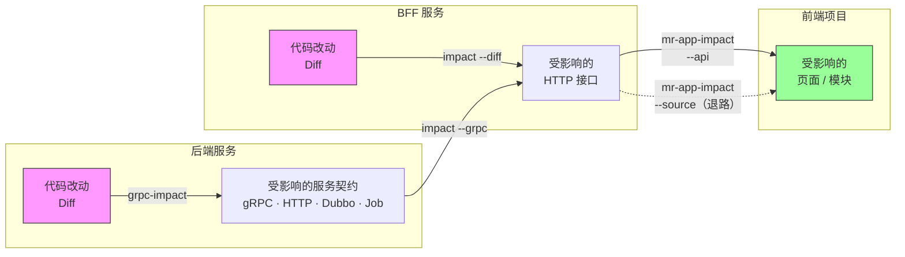
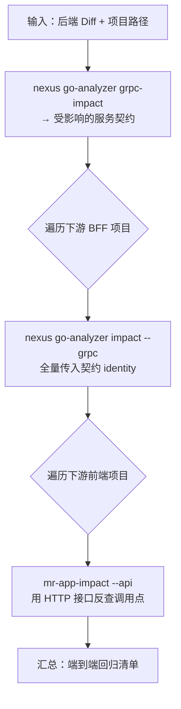

# Go 服务全链路影响范围评估

> 后端改了一行代码，到底哪些前端页面需要回归？
>
> go-analyzer 补齐 Go 层（BFF + 后端服务）的静态影响分析能力，与已有的前端分析工具 mr-app-impact 串联，
> 形成 **后端代码改动 → 服务契约 → BFF HTTP 接口 → 前端页面** 的全链路追溯。

---

## 1. 在 Nexus 里落地

go-analyzer 作为顶层命令组接入 Nexus，与 `nexus bff`、`nexus grpc`、`nexus doc` 并列：

```text
nexus go-analyzer <subcommand> [flags]
```

代码自包含在 `internal/goanalyzer/`，不依赖也不被 Nexus 已有包调用。

三个子命令：

| 命令                   | 输入                                    | 输出                                                  |
| ---------------------- | --------------------------------------- | ----------------------------------------------------- |
| `impact --diff`      | Diff                                    | BFF 受影响的 HTTP 接口 + IM 事件                      |
| `impact --grpc`      | gRPC identity（可重复）                 | 上游 gRPC 变更波及的 BFF HTTP 接口                    |
| `grpc-impact --diff` | Diff                                    | 后端服务受影响的注册契约（gRPC / HTTP / Dubbo / Job） |
| `endpoint-assets`    | `--endpoint "METHOD /path"`（可重复） | 指定 HTTP 接口的上游 gRPC 依赖清单                    |

`impact` 的 `--diff` 和 `--grpc` 可同时传，合并输出、证据分开记录。

---

## 2. 方案全景

一次后端改动可能穿透三层才到达用户能感知的界面。go-analyzer 补的是中间两层——后端服务和 BFF——的分析能力：



三层各自独立分析，通过**稳定身份**串联：

| 层间衔接    | 传递的身份    | 格式                                   | 示例                                               |
| ----------- | ------------- | -------------------------------------- | -------------------------------------------------- |
| 后端 → BFF | gRPC identity | `<import_path>.<Service>/<GoMethod>` |  `inbox_biz.BizInboxService/DeleteMessage`       |
| BFF → 前端 | HTTP endpoint | `METHOD /path`                       | `DELETE /admin/api/bff-web/mc/message/inbox/:id` |

两种身份都是稳定的字符串，上层输出直接作为下层输入，不需要转换或人工映射表。

---

## 3. 全链路设计

用一个真实场景贯穿三层：`sc1-server` 的消息 DTO 加了一个字段，追溯到底影响了哪些前端页面。

### 3.1 后端层：代码改动 → 服务契约

**工具**：`nexus go-analyzer grpc-impact --diff`

**场景**：`sc1-server` 的 `GetMessageItem` DTO 加了 `AttachmentName` 字段——只碰了一个 struct，分析器沿反向引用链逐层上推，找到所有引用了这个 DTO 的注册契约。

```diff
--- a/modules/inbox/internal/model/inbox/ec_get_message_dto.go
+++ b/modules/inbox/internal/model/inbox/ec_get_message_dto.go
@@ -68,6 +68,7 @@ type GetMessageItem struct {
 	AttachmentUrl  string             `json:"attachment_url,omitempty"`
+	AttachmentName string             `json:"attachment_name,omitempty"`
 	ConversationId string             `json:"conversation_id"`
```

**分析结果**：

| 契约类型 | 命中数 | 命中的契约                                                                                                                                                                     |
| -------- | ------ | ------------------------------------------------------------------------------------------------------------------------------------------------------------------------------ |
| gRPC     | 6      | `BizInboxService/DeleteMessage`、`GetMessageList`、`PageSelectedMsg`、`SendMessageByConversation`；`MessageClientService/SendMessage`、`TriggerSendWelcomeMessage` |
| HTTP     | 3      | `GET /sc1-internal/officialmsg/v1/customer/messages`、`GET .../messages`、`POST .../customer/messages`                                                                   |
| Dubbo    | 0      | —                                                                                                                                                                             |
| Job      | 0      | —                                                                                                                                                                             |

传播路径示例（`DeleteMessage`）：

```text
GetMessageItem（DTO，改动起点）
  └─ InboxImEvent
      └─ SendConversationImWithType（biz 层）
          └─ DeleteMessage（provider，实现 gRPC 接口）
              └─ BizInboxService/DeleteMessage ← RegisterXxxServer 注册点
```

链路终点是 `RegisterXxxServer` 注册出去的契约——只有该实现确实被注册过才会形成结论。

这 6 条 gRPC identity 就是下一步传给 BFF 的输入。

### 3.2 BFF 层：gRPC 契约 → HTTP 接口

**工具**：`nexus go-analyzer impact --grpc`（可重复传多条 identity）

**做法**：4.1 产出的 6 条 identity **全量一次性**传给每个下游 BFF——不逐条试探，不预判哪条会命中。没命中的 identity 在结果里是空 `consumers`，不报错、不污染汇总。

```bash
nexus go-analyzer impact --project /path/to/sl-sc1-admin-bff \
  --grpc "...inbox_biz.BizInboxService/DeleteMessage" \
  --grpc "...inbox_biz.BizInboxService/GetMessageList" \
  --grpc "...inbox_biz.BizInboxService/PageSelectedMsg" \
  --grpc "...inbox_biz.BizInboxService/SendMessageByConversation" \
  --grpc "...inbox_client.MessageClientService/SendMessage" \
  --grpc "...inbox_client.MessageClientService/TriggerSendWelcomeMessage"
# 同样的 6 条对 sl-sc1-bff-service 再跑一次
```

**分析结果**：

| gRPC 方法                                          | sl-sc1-admin-bff                                                                            | sl-sc1-bff-service                                       |
| -------------------------------------------------- | ------------------------------------------------------------------------------------------- | -------------------------------------------------------- |
| `BizInboxService/DeleteMessage`                  | `DELETE /admin/api/bff-web/mc/message/inbox/:idDELETE /inbox/v1/admin/admin/messages/:id` | —                                                       |
| `BizInboxService/GetMessageList`                 | `GET /officialmsg/v1/admin/messages`                                                      | —                                                       |
| `BizInboxService/PageSelectedMsg`                | `POST /inbox/v1/admin/admin/message/select/list`                                          | —                                                       |
| `BizInboxService/SendMessageByConversation`      | `POST /messages`                                                                          | —                                                       |
| `MessageClientService/SendMessage`               | —                                                                                          | `POST /sc1-internal/.../customer/message/send`         |
| `MessageClientService/TriggerSendWelcomeMessage` | —                                                                                          | `POST /sc1-internal/.../customer/message/send/welcome` |

两个 BFF 各自只认自己调过的方法。`admin-bff` 命中 5 个接口，`bff-service` 命中 2 个，没有交叉。

**BFF 自身代码改动也能同时传**：`--diff` 和 `--grpc` 是两个独立触发源，可以同时给——比如一次 MR 既改了业务代码又赶上上游通知，两条证据分别记录在 `fileSources` / `grpcSources`，`summary` 全局去重。实测 ProductSet 改动（`--diff` 命中 3 个接口）+ `ExportCommentReport`（`--grpc` 命中 2 个接口）同时传入，结果是 5 个接口，正好是两组的并集。

### 3.3 前端层：HTTP 接口 → 页面

**工具**：`mr-app-impact`（已有能力，`agent-factory/.agents/skills/mr-app-impact`）

接续 4.2 的结果。以 `admin-bff` 产出的 `DELETE /admin/api/bff-web/mc/message/inbox/:id` 为例，在前端项目 `message-center` 中的真实调用点：

```ts
// src/feature/messageCenter/hooks/useDeleteChatroomMsg.ts
await bffClient.fetch('DELETE /admin/api/bff-web/mc/message/inbox/:id', {
  platform: PlatformKey[platform],
  conversationId: currentConversationId,
  id: String(curMessage.id),
});
```

`bffClient.fetch(...)` 的第一个参数是字符串字面量，与 go-analyzer 输出的 `METHOD /path` 精确匹配——走 `--api` 模式直接反查，不需要人工介入。

| 模式                            | 前提                     | 说明                               |
| ------------------------------- | ------------------------ | ---------------------------------- |
| `--api "METHOD /path"`        | 项目已收敛到统一请求实例 | 最稳，go-analyzer 输出直接作为输入 |
| `--source "/file.ts::symbol"` | 未完成统一请求实例改造   | 过渡方案，需 AI 先梳理调用符号     |

mr-app-impact 的最终产物是一份面向测试人员的**前端影响分析报告**（`.analyzer/output/report/impact-analysis-report.md`），包含：

| 报告组成 | 内容 |
| --- | --- |
| 总结 | 核心结论 + 优先回归页面 |
| 页面级汇总 | 按页面聚合受影响模块，每个模块给出操作步骤、预期结果、关联入口 |
| 逐入口回归清单 | 按变更文件展开：变更影响、影响范围、验证建议、回归优先级 |
| 无业务影响项 | 类型改动、增量常量等不需要回归的变更汇总 |

以下是一份真实报告的页面级汇总片段（来自贴文活动 post/activity 接口迁移 BFF 网关的 MR）：

> **贴文销售创建 / 编辑页**
> - 关联帖子 - 编辑帖子弹窗：新建 / 编辑 / 保存关联帖子，并上传配图。预期：保存成功、列表回填新帖、配图上传成功；接口走 BFF 网关，失败按配置弹重试提示。覆盖 FB / IG 两个渠道。
> - 关联帖子 - 预览弹窗：预览已发布 / 排程帖子并执行"立即发布"。预期：帖子详情正确展示；立即发布后帖子状态变更成功。
>
> **抽奖活动页**
> - 头部操作区：执行"结束活动""终止活动"。预期：操作成功后活动状态正确变更、列表刷新。
> - 中奖名单：查看中奖名单列表并导出。预期：名单正确加载、导出文件正常生成。
>
> 该 MR 最终命中 3 个业务页面、12 个入口文件、约 7 条数据写入 / 状态变更链路。

### 3.4 全链路总览

```text
sc1-server: GetMessageItem 加字段
  └─ grpc-impact → 6 gRPC + 3 HTTP 契约
      ├─ admin-bff: impact --grpc → 5 个 HTTP 接口
      │   └─ mr-app-impact --api → 前端回归清单
      └─ bff-service: impact --grpc → 2 个 HTTP 接口
          └─ mr-app-impact --api → 前端回归清单
```

每一步都是**输出身份 = 下一层输入**，不需要人工对齐、不需要跨仓映射表。全链路的最终交付物就是上述前端影响分析报告——测试人员拿到后可直接按页面和入口执行回归，不需要再读代码。

---

## 4. 编排方案

三层分析目前各自独立运行。计划用一个 skill 串联 Nexus go-analyzer 和 mr-app-impact，一次输入产出端到端回归清单。

### 4.1 编排流程



### 4.2 skill 职责边界

skill 负责**编排**，不负责分析：

- 维护一份静态配置：后端 → 下游 BFF → 下游前端项目的映射
- 依次调用三层命令，把每层的输出 identity 接到下一层的输入
- 汇总成测试人员能直接读的回归清单

分析器的职责边界不变——每层只回答自己链路的问题，跨仓串联永远是编排层的事。

`agent-factory` 当前已集成前端影响链路分析（`.agents/skills/mr-app-impact`），后续全链路编排（Go 层 + 前端）也将在 `agent-factory` 中集成落地。

---

## 5. 补充能力：BFF 接口资产查询

`endpoint-assets` 不是影响评估，是**资产台账**——查一个 HTTP 接口当前依赖了哪些上游 gRPC，不需要任何改动作为输入。

```bash
nexus go-analyzer endpoint-assets \
  --project /path/to/sl-sc1-admin-bff \
  --endpoint "GET /admin/api/bff-web/live/sale/:salesId/comments/report/export"
```

**真实结果**：该接口按 `ReportType` 分支调用了三个不同的导出方法：

| gRPC 方法                                  | 触发条件                    |
| ------------------------------------------ | --------------------------- |
| `SalesReportService/ExportCommentReport` | `ReportType == "COMMENT"` |
| `SalesReportService/ExportCartReport`    | `ReportType == "CART"`    |
| `SalesReportService/ExportSalesReport`   | 默认分支                    |

与 `impact --grpc` 构成**双向不变量**：

> `endpoint-assets(接口 A)` 包含 gRPC B ⟺ `impact --grpc B` 包含接口 A

两个方向查的是同一份数据，不会给出矛盾结论。拿 `ExportCommentReport` 反查 `impact --grpc`，该接口原样出现在结果里——这在 4.2 的场景中已经验证过。

此能力也可用于**接口文档生成**——给定一组 BFF 接口，自动产出每个接口的上游 gRPC 依赖清单，作为接口文档中"依赖服务"部分的数据源。

当前只覆盖 gRPC 依赖，不包含 HTTP / Dubbo / MQ 等其他依赖类型。
