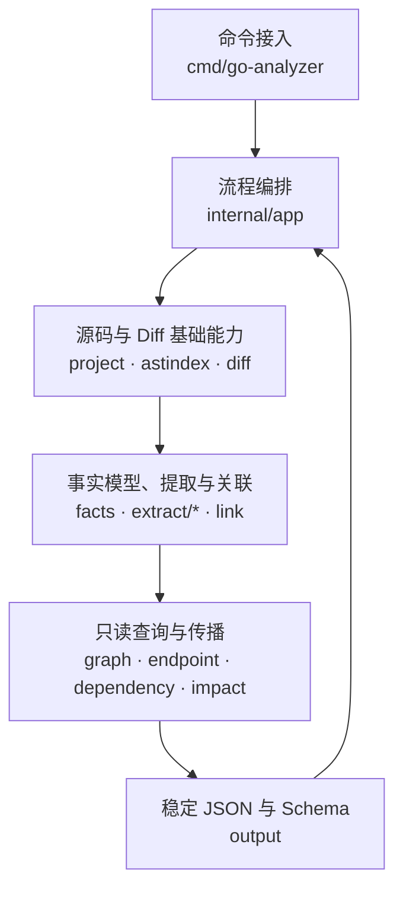
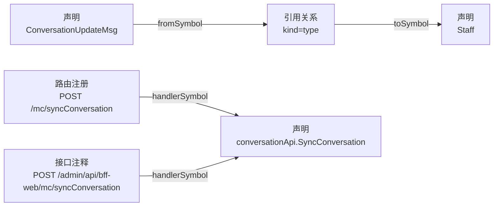
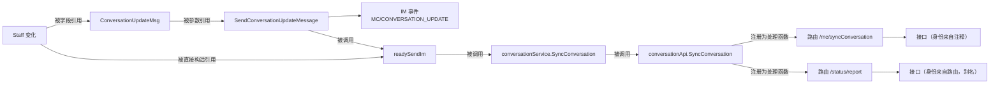

# Go 服务影响范围分析技术方案

> **这份文档回答什么**：`go-analyzer` 接收什么、产出什么、内部怎么组织，以及影响是怎么从一行代码传播到一个对外入口的。
>
> **两条独立链路**：分析器支持两类 Go 项目。它们回答不同的问题、走不同的命令、产出不同的契约，**互不依赖**：
>
> | 链路 | 问题 | 命令 | 专属章节 |
> | --- | --- | --- | --- |
> | BFF | 改动影响哪些**出站** HTTP 接口和 IM 事件？ | `impact`、`endpoint-assets` | 第 1–3 节 |
> | 后端服务 | 改动影响哪些**入站**服务契约（gRPC / HTTP / Dubbo / Job）？ | `grpc-impact` | 第 7 节 |
>
> 两条链路的业务规则完全分开：终点不同、身份规则不同、输出契约不同。它们共用的是底座——项目加载、声明索引、Diff 映射和影响传播机制，对应第 4–6 节。跨仓串联（后端 → BFF → 前端）由上层系统按接口身份完成，不在分析器内部。
>
> **怎么读**：
>
> | 章节 | 范围 |
> | --- | --- |
> | 第 1–3 节 | BFF 链路的能力、协议和一个贯穿全文的真实例子 |
> | 第 4–6 节 | 架构、数据模型、影响传播——两条链路共用，BFF 专有之处会就地标出 |
> | 第 7 节 | 后端服务链路，自包含 |
> | 第 8–9 节 | 错误语义与交付里程碑，两条链路共用 |
>
> 想快速了解全貌，读第 1、3、7 节。

---

## 1. BFF 链路能做什么

> 第 1–3 节只讲 BFF 链路。后端服务链路见第 7 节。

### 1.1 一句话

给定一个 Go BFF 项目和一份 Git Diff，回答：

> 这次改动，需要回归哪些 HTTP 接口和出站 IM 事件？

处理主线是一条直线：

```text
读取 BFF 源码
  -> 记录有哪些声明、谁用了谁
  -> 把 Diff 的行号定位到具体声明
  -> 反查所有使用者
  -> 走到路由 / IM 事件 / gRPC 调用点
  -> 输出受影响的接口和原因
```

### 1.2 BFF 链路的四条能力

| 命令 | 回答的问题 | 输入 |
| --- | --- | --- |
| `impact --diff` | 这次代码改动影响哪些 HTTP 接口和 IM 事件？ | Diff |
| `impact --grpc` | 上游某个 gRPC 接口变了，本 BFF 哪些接口会受影响？ | 完整 gRPC 接口名 |
| `endpoint-assets` | 某个 BFF 接口依赖哪些上游 gRPC 接口？ | `METHOD /path` |
| `facts` | 分析器到底从源码里读出了什么？（排查用） | 仅项目目录 |

`impact` 的两种输入可以同时给，合并成一份 JSON 输出。

`impact --grpc` 和 `endpoint-assets` 是同一份数据的正反两个方向，必须满足**双向不变量**：

```text
endpoint-assets(接口 A) 包含 gRPC B
        等价于
impact --grpc B 的结果包含接口 A
```

这四条能力的终点都是**出站**方向：本项目对外提供的 HTTP 接口、本项目主动发出的 IM 事件、本项目调用的上游 gRPC。后端服务关心的是相反方向（谁能调进来），因此走独立命令，见第 7 节。

### 1.3 能力边界

| 维度 | 口径 | 具体表现 |
| --- | --- | --- |
| 影响含义 | 源码里存在一条走得通的依赖路径，就算"可能受影响" | 改一个 DTO 字段，所有在请求或响应里用到它的接口都会被报出来 |
| 分析方式 | 只读代码，不运行代码 | 不启动服务、不发请求、不采集运行时调用链 |
| 条件分支 | 能看出谁调用了谁，看不出条件真假 | `if 灰度开关 { 调 A }` 算作"可能调用 A"，不判断开关线上是否打开 |
| 动态写法 | 拼不出确定值时保留原始表达式，不猜 | 路由写成 `prefix + name` 时记录表达式并留诊断，不编造路径 |
| 分析范围 | 只看本项目的生产代码 | 不分析测试文件、第三方依赖源码 |
| 注册可达性 | 认路由注册语句，不追它是否真被启动流程调用 | 注册函数写了但没人调，其路由仍会被识别 |

结论表示"在支持的写法范围内可以证明的影响"，既不是运行时追踪，也不承诺覆盖所有动态写法。

---

## 2. BFF 的输入与输出协议

> 本节所有输出示例都是同一个真实例子的实际输出：在 `sl-sc1-admin-bff` 上给 IM 会话成员结构 `im.Staff` 加一个头像字段（3 行改动），结果影响了 **2 个 HTTP 接口 + 1 个出站 IM 事件**。这个例子怎么一步步推出来的见第 3 节；它会一直用到第 6 节。

### 2.1 输入

| 输入 | 说明 | 必需性 |
| --- | --- | --- |
| BFF 项目目录 | 含 `go.mod`、**且已应用本次改动**的源码；要求绝对路径 | 必需 |
| Unified Diff | 描述改了哪些文件哪些行；要求绝对路径 | Diff 分析时必需 |
| 完整 gRPC 接口名 | 形如 `/proto包名.服务名/方法名`，可重复传 | gRPC 反查时必需 |
| 影响过滤配置 | 忽略指定 go.mod 依赖的版本变化 | 可选 |

项目目录必须是**改动后**的快照，Diff 只负责告诉分析器"哪几行变了"。行号或上下文与源码对不上时直接失败，不会拿错误的行号推出看似合理的结论。

"影响过滤配置"对应一个真实场景：部分 BFF 频繁升级 proto 依赖，而这类升级往往只是重新生成代码。如果每次都把引用了它的接口全部标记为受影响，回归范围会被版本号噪音淹没。配置支持精确路径和 glob，默认读项目内 `.analyzer/go-impact.config.json`。

### 2.2 `impact` 输出协议

顶层是四个键。下面是那个真实例子的实际输出，`summary` 原样展开，两个证据字段体量大、放到 3.4 展示：

```jsonc
{
  "summary": {                       // 结论：影响了什么
    "impactedEndpointCount": 2,
    "impactedEndpoints": [
      {
        "method": "POST",
        "path": "/admin/api/bff-app/mc/conversation/status/report",
        "routes": [
          {"method": "POST", "path": "/admin/api/bff-app/mc/conversation/status/report"},
          {"method": "POST", "path": "/admin/api/bff-web/mc/syncConversation"}
        ]
      },
      {
        "method": "POST",
        "path": "/admin/api/bff-web/mc/syncConversation",
        "routes": [
          {"method": "POST", "path": "/admin/api/bff-app/mc/conversation/status/report"},
          {"method": "POST", "path": "/admin/api/bff-web/mc/syncConversation"}
        ]
      }
    ],
    "impactedIMCount": 1,
    "impactedIMEvents": ["MC/CONVERSATION_UPDATE"]
  },
  "fileSources": [ /* 每个变更文件的 Diff + 完整传播树，见 3.4 与 6.3 */ ],
  "grpcSources": [],                 // 本次没传 --grpc，故为空数组
  "endpointSourcesSummary": [ /* 按接口反查影响来源，见 3.4 */ ]
}
```

本次 `go.mod` 没变，所以顶层没有 `moduleSources`——这个键只在 go.mod 形成有效依赖变化时才出现，其余四个键恒定存在。

三层深度对应三种用法：`summary` 给 CI 判断回归范围；`fileSources` 给人工核对证据；`endpointSourcesSummary` 回答"这个接口为什么被报出来"。计数字段恒等于对应数组的长度。

从上面的 `impactedEndpoints` 能看出**HTTP 接口条目同时给两组信息**：`method/path` 是对外正式身份，来自 Controller 上方的接口注释；`routes` 是代码里实际怎么注册的。这个例子里两个接口的 `routes` 都列出了**同样的两条**路由，因为它们本就是同一个 Controller 方法的两个注册点——注册证据不因接口身份不同而丢失。为什么要并列输出两组，见 4.3 第②条。

**IM 事件**只输出事件名字符串数组。事件名拼不出静态值时不进 `summary`，只在传播树里以未解析节点保留。

**稳定性**：同一份源码 + Diff + 配置，必须产出字节级稳定的 JSON。数组有固定排序、Map 按稳定键序列化、空集合输出 `[]` 而非 `null`。

### 2.3 `endpoint-assets` 输出协议

接口到 gRPC 的正向查询，独立契约。

这一条能力换了个接口举例：第 3 节那个例子的链路里没有 gRPC 调用，展示不了这个契约。下面是同一个项目里另一个真实接口的实际输出：

```jsonc
{
  "project": {"module": "sc1-admin-bff"},
  "endpointAssets": [{
    "endpoint": {"method": "GET", "path": "/admin/api/bff-web/post/sale/:salesId/activity/winners"},
    "routes": [{"method": "GET", "path": "/admin/api/bff-web/post/sale/:salesId/activity/winners"}],
    "handlers": [{
      "id": "func:sc1-admin-bff/controller/post/activity::ListWinner",
      "kind": "func", "name": "ListWinner", "file": "controller/post/activity/activity.go"
    }],
    "dependencies": {
      "grpc": [{
        "fullMethod": "/gopkg.inshopline.com.sc1.app.modules.medium.activity_user.proto.ActivityUserService/listWinnerBySalesId",
        "protoPackage": "gopkg.inshopline.com.sc1.app.modules.medium.activity_user.proto",
        "service": "ActivityUserService",
        "method": "listWinnerBySalesId",
        "clients": [{"clientType": "ActivityUserServiceClient", "goMethod": "ListWinnerBySalesId"}],
        "chains": [{
          "symbols": [{"name": "ListWinner"}, {"name": "ListWinnerBySalesId"}],
          "callSite": {"file": "remote/grpc/post/activity.go", "line": 42, "column": 19}
        }]
      }]
    }
  }]
}
```

这段是真实输出。注意 `clients[].goMethod` 是 `ListWinnerBySalesId`（大写开头），而 `method` 是 `listWinnerBySalesId`（小写开头）——**gRPC 接口身份只能从 protobuf 生成代码里的字符串常量读，不能从 Go 方法名或目录名推**。这条链路里三处都对不上：

| 对不上的地方 | Go 侧 | proto 侧 |
| --- | --- | --- |
| 方法名 | `ListWinnerBySalesId` | `listWinnerBySalesId` |
| 服务名 | 变量叫 `ActivityUserClient` | `ActivityUserService` |
| 包名 | 目录叫 `activity_user_api` | `gopkg.inshopline.com.sc1.app.modules.medium.activity_user.proto` |

`impact --grpc` 的反查方向共享同一份数据，consumer 关系固定标记为 `may_call`——静态可达，但不承诺每次请求都执行到。

### 2.4 `facts` 与 `schema`

`facts` 打印分析器读出的全部原子事实，用于回答"结论不对，是数据抽错了还是推错了"。在 `sl-sc1-admin-bff` 上的真实规模：

```text
symbols              5342      route_groups           86
references          12823      middleware             33
annotations           483      im_events              34
routes                581      grpc_operations       426
links                1064      grpc_calls            366
modules               249      diagnostics            17
```

`schema --type facts|impact|endpoint-assets|grpc-impact` 输出对应的 JSON Schema，供调用方校验契约。

### 2.5 CLI 与 CI 集成

```bash
go-analyzer impact --project <绝对路径> --diff <绝对路径> --format json
go-analyzer endpoint-assets --project <绝对路径> --endpoint "GET /admin/api/..."
go-analyzer impact --project <绝对路径> --grpc "/proto包.Service/method"
```

集成约定：

- JSON 写 stdout，错误和 `--timings` 写 stderr，两者不混。
- 成功退出码 0；"没有受影响接口"是**成功**结果（空数组 + 计数 0），不用错误表达。
- 失败时不输出半份 JSON，只给稳定错误码（`invalid_argument`、`diff_snapshot_mismatch`、`dependency_load_failed` 等），调用方按码分类，不解析自然语言。
- 可选 `--diagnostics-output <绝对路径>` 把本次分析的诊断单独写一个文件，不污染正式 JSON。
- 影响 JSON 不内嵌分析器版本和构建条件。需要跨环境复现时，CI 侧要把「分析器版本 + 项目 commit + Diff 摘要 + 配置摘要」和 JSON 一起存档。

---

## 3. BFF 真实例子走完全程

本节的所有数据都是在 `sl-sc1-admin-bff` 上真实跑出来的，不是构造的。

### 3.1 改动

给会话成员结构加一个头像字段：

```diff
--- a/service/im/im.go
+++ b/service/im/im.go
@@ -25,8 +25,9 @@ type ConversationUpdateMsg struct {
 type Staff struct {
-	Id   string `json:"id"`
-	Name string `json:"name"`
+	Id     string `json:"id"`
+	Name   string `json:"name"`
+	Avatar string `json:"avatar"`
 }
```

三行改动，只碰了一个结构体，没有碰任何 Controller 或路由。

### 3.2 源码链路

`Staff` 被 IM 广播消息体引用，这个消息体又被会话服务和 Controller 一路用上去：

```go
// service/im/im.go —— IM 消息体引用 Staff
type ConversationUpdateMsg struct {
	LookList  []*Staff `json:"lookList"`
	InputList []*Staff `json:"inputList"`
}

func SendConversationUpdateMessage(ctx context.Context, msg *ConversationUpdateMsg) {
	im.SendImBroadcastMessage(ctx, &msg.MerchantID, constant.ConversationUpdate, constant.MC, fn)
}

// service/mc/conversation_service.go —— 组装消息并发送
// 注意这里直接构造了 im.Staff，所以 readySendIm 也直接引用了被改的类型
func (c *conversationService) readySendIm(...) {
	lookList = append(lookList, &im.Staff{Id: splits[1], Name: name})
	im.SendConversationUpdateMessage(ctx, msg)
}

func (c *conversationService) SyncConversation(...) { ...; c.readySendIm(...) }

// controller/conversation/conversation_api.go —— HTTP 入口
// @Post /admin/api/bff-web/mc/syncConversation
func (c *conversationApi) SyncConversation(...) (bool, error) {
	mc.ConversationService.SyncConversation(...)
}
```

所以 `Staff` 有**两条**通往上层的路径：一条经消息体 `ConversationUpdateMsg`，一条被 `readySendIm` 直接构造引用。3.4 会再回到这一点——精简链路只展示最短的那条。

同一个 Controller 方法被注册在**两条路由**上：

```go
// router/mc/conversation.go
adminWebGroup.POST("/mc/syncConversation", sa2.ControllerWithReqResp(conversation.ConversationApi.SyncConversation))

// router/app/mc/conversation.go
appGroup.POST("/status/report", sa2.ControllerWithReqResp(conversation.ConversationApi.SyncConversation))
```

### 3.3 真实运行

```bash
go-analyzer impact --project /path/to/sl-sc1-admin-bff --diff /tmp/demo.diff --format json --timings
```

全程 0.59 秒，输出 69 KB。各阶段耗时（真实 stderr）：

```text
timing project_load=162ms       timing reference_extract=45ms
timing ast_index=9ms            timing im_extract=58ms
timing route_extract=16ms       timing impact_analyze=104ms
```

### 3.4 真实输出

结论部分（`summary`）已在 2.2 原样展开：2 个 HTTP 接口 + 1 个 IM 事件 `MC/CONVERSATION_UPDATE`。这里看它的**来源证据**——真实 `endpointSourcesSummary`，两条路径的尾部差异是关键：

```json
[
  {
    "method": "POST", "path": "/admin/api/bff-app/mc/conversation/status/report",
    "sources": [{
      "sourceType": "file", "sourceFile": "service/im/im.go",
      "rootSymbols": [{"id": "type:sc1-admin-bff/service/im::Staff", "kind": "type", "name": "Staff"}],
      "chains": [[
        "type Staff", "method readySendIm", "method SyncConversation", "method SyncConversation",
        "route POST /admin/api/bff-app/mc/conversation/status/report",
        "POST /admin/api/bff-app/mc/conversation/status/report"
      ]]
    }]
  },
  {
    "method": "POST", "path": "/admin/api/bff-web/mc/syncConversation",
    "sources": [{
      "sourceType": "file", "sourceFile": "service/im/im.go",
      "rootSymbols": [{"id": "type:sc1-admin-bff/service/im::Staff", "kind": "type", "name": "Staff"}],
      "chains": [[
        "type Staff", "method readySendIm", "method SyncConversation", "method SyncConversation",
        "route POST /admin/api/bff-web/mc/syncConversation",
        "annotation POST /admin/api/bff-web/mc/syncConversation",
        "POST /admin/api/bff-web/mc/syncConversation"
      ]]
    }]
  }
]
```

### 3.5 从这份输出能读出三件事

**① 三行改动同时命中了两类终点。** 两个 HTTP 接口，加一个 IM 事件 `MC/CONVERSATION_UPDATE`。改动本身完全没有碰路由和 Controller，全靠类型引用链推出来。

**② 两条路径的尾部不一样，这正是接口身份规则在起作用。**

```text
web 那条：  ... -> route -> annotation -> endpoint
app 那条：  ... -> route -> endpoint          （少了 annotation 一步）
```

Controller 上的注释只写了 web 那条路径。web 路由与注释对得上，接口身份取自注释；app 路由（`/admin/api/bff-app/mc/conversation/status/report`）没有对应注释，于是按路由兜底，成为一个独立的**别名接口**。两个接口的 `routes` 字段都会列出两条路由——同一个 Controller 方法的注册证据不因身份不同而丢失。

**③ 链路里看不到 `ConversationUpdateMsg`。** 因为 `chains` 对每个来源根只保留**一条最短路径**，而 `Staff → readySendIm` 比绕经消息体那条更短。经消息体的那条（也是 IM 事件的由来）完整保留在 `fileSources` 的传播树里，6.3 会展示它。

**④ 链路里出现了两个同名的 `method SyncConversation`。** 它们是 service 层和 controller 层两个不同的方法，恰好同名。这是 `chains` 这个精简视图的已知局限：它只保留 `kind + name` 便于人读，不带包名。需要区分时看 `fileSources` 里的完整传播树，那里每个节点都有唯一 ID 和文件路径。

---

## 4. 架构设计

> 本节的分层对两条链路都适用。4.2 的执行顺序以 BFF 为例，其中第 7、9 步（接口身份目录、gRPC 反查）是 BFF 专有的。4.3 三条决策中第②条也只属于 BFF，后端服务用注册证据定身份，见 7.2。

### 4.1 分层



| 层 | 负责 | 不负责 |
| --- | --- | --- |
| 命令接入 | 参数、绝对路径校验、stdout/stderr 分离 | 任何分析规则 |
| 流程编排 | 按顺序驱动各阶段、错误归一化、耗时统计 | 具体语法识别 |
| 基础能力 | 加载项目、建声明索引、解析校验 Diff | 判断业务影响 |
| 事实与关联 | 从语法树提取原子事实，连接稳定身份 | 产出最终结论 |
| 查询与传播 | 建只读索引、双向查询、生成传播树 | 修改事实 |
| 输出 | 排序、去重、渲染 JSON | 补造代码关系 |

依赖方向单向向下，禁止反向：输出层不能回头调提取器，提取器不能调传播层，CLI 里不写分析逻辑。

### 4.2 一次分析的执行顺序

```text
1. 校验参数与绝对路径
2. 解析并校验 Diff（与源码快照比对，不一致直接失败）
3. 加载项目、建立声明索引
4. 提取事实（声明、引用、注释、路由、中间件、IM、可选 gRPC）
5. 关联事实（路由表达式 -> Controller 方法 -> 接口注释）
6. 冻结成只读快照
7. 建查询索引与接口身份目录
8. 从变更起点传播
9. 可选执行 gRPC 反查
10. 渲染稳定 JSON
```

只有 `--grpc`、`endpoint-assets` 和 `facts` 需要加载 gRPC 生成代码依赖；纯 Diff 分析跳过这一步，避免拖慢主路径、也避免引入依赖拉取失败面。

### 4.3 三条关键决策

**① 先抽事实，再做查询。** 分析器不是读一遍源码直接回答"哪些接口受影响"，而是先把源码翻译成一堆原子事实（"某个类型被某个方法当返回值用了"、"某条路由注册了某个方法"），之后所有查询只读这些事实。

这样带来四个好处：每个提取器只认一类写法，新增协议不牵动已有规则；传播时不用反复重新解析源码；可以用 `facts` 单独验证"数据抽对了没有"；输出层没有机会临时补造一条代码关系。

**② 接口身份以接口注释为准，路由并列输出。** 原因在 3.5 那个例子里能直接看到：同一个 Controller 方法挂了两条路由，而注释只声明了其中一条。真实 BFF 的路由前缀往往分散在多层 Group、跨多个函数传递——例子里 App 端那条 `/status/report` 的完整路径 `/admin/api/bff-app/mc/conversation/status/report` 就是逐层拼出来的，静态拼接随时可能残缺；而接口注释是给下游系统看的对外契约，本身写全了。但也不能只输出注释——注释可能和实际注册漂移，所以两者并列，让漂移暴露出来。

这条规则只允许有一个实现入口（`internal/endpoint` 产出的只读接口身份目录）。影响传播、gRPC 正查、gRPC 反查是三条独立代码路径，如果各自实现一遍"注释优先、没注释用路由、别名怎么算"，三者迟早给出不同的接口集合，2.2 节那条双向不变量就守不住了。

**③ 正式结论与诊断分开放。** 路径是拼出来的、接口有多个实现分不清、删除块只能恢复一半证据——这些既不是错误（分析能继续），也不能当结论报出去。它们进 `facts` 输出或独立诊断文件，正式影响 JSON 里只放能证明的东西。

---

## 5. 数据模型

> 事实容器与 ID 规则对两条链路都适用；下面列举的事实类型以 BFF 为例，后端服务的入口事实见 7.2。

### 5.1 事实分组

事实类型不少，但按"回答什么问题"分成五组就不用一次记住：

| 分组 | 包含 | 为什么需要 |
| --- | --- | --- |
| 代码骨架 | 声明、引用 | 一切传播的基础：有哪些声明、谁用了谁 |
| 路由与接口 | 接口注释、路由注册、Group、Group 跨函数流转、中间件绑定、关联关系 | 把代码声明落到 HTTP 接口上 |
| 出站依赖 | IM 事件、gRPC 接口、gRPC 调用点 | HTTP 之外的另两类终点 |
| 依赖清单 | go.mod 依赖 | 支撑 go.mod 变化分析 |
| 本次分析产物 | 变更起点、依赖变化、依赖使用点、诊断 | 只属于这一次分析，不描述项目本身 |

表里是 BFF 链路用到的事实。后端服务链路在同一个事实容器里另有一组入口注册事实（gRPC Provider、Dubbo Provider、Job 注册），由它自己的提取器写入，与 BFF 这几组互不干扰，见第 7 节。

路由那组拆得细，是被真实写法逼出来的：前缀分散在多层 Group（要 Group 事实记录各层前缀和父子关系），其中若干层通过函数参数传入、返回值传出（要 Group 跨函数流转事实，否则跨函数就断链），中途还挂中间件（要中间件绑定事实，记录它挂在哪、影响其后哪些路由）。只留一个"路由"事实的话，完整注册路径拼不出来。

### 5.2 例子里产生了哪些事实

第 3 节那次改动涉及的事实（真实 ID）：

| 事实 | 内容 |
| --- | --- |
| 声明 | `type:sc1-admin-bff/service/im::Staff` |
| 声明 | `type:sc1-admin-bff/service/im::ConversationUpdateMsg` |
| 声明 | `method:sc1-admin-bff/service/mc:conversationService:readySendIm` |
| 声明 | `method:sc1-admin-bff/controller/conversation:conversationApi:SyncConversation` |
| 引用 | `ConversationUpdateMsg` --类型--> `Staff` |
| 引用 | `readySendIm` --类型--> `Staff`（直接构造 `&im.Staff{...}`） |
| 引用 | `readySendIm` --调用--> `SendConversationUpdateMessage` |
| 接口注释 | `SyncConversation` 声明 `POST /admin/api/bff-web/mc/syncConversation` |
| 路由注册 | 两条，分别在 `router/mc/conversation.go` 和 `router/app/mc/conversation.go` |
| IM 事件 | `im_event:MC/CONVERSATION_UPDATE` |
| 变更起点 | Diff 命中 `Staff`（仅本次分析有效，不出现在 `facts` 输出） |

声明 ID 的形式是固定的，可作为输出里的关联键，但应当被视为不透明字符串——重命名或移动文件后不承诺不变：

```text
func:<包路径>::<名字>
method:<包路径>:<接收者>:<名字>
type:<包路径>::<名字>
```

### 5.3 用稳定 ID 串起来

事实之间不互相嵌套复制，而是各记一个 ID 相互指向：



好处是同一个声明被很多地方引用时，不会产生多份可能互相不一致的副本。3.5 节那两条路由能同时挂到一个 Controller 方法上，也是因为它们各自记的是同一个 ID。

### 5.4 生命周期

| 数据 | 存活范围 | 是否进 `facts` 输出 |
| --- | --- | --- |
| 源码事实（声明、路由、注释、IM、gRPC…） | 随项目源码变化 | 是 |
| 本次分析事实（变更起点、依赖变化与使用点） | 只属于这一次带 Diff 的分析 | 否 |
| 只读查询索引与接口身份目录 | 只属于一次命令执行 | 否 |
| 传播树与来源摘要 | 只属于一次命令执行 | 进 `impact` 输出 |

所有写入结束后建立冻结边界，之后的查询阶段只拿到只读快照，不能再追加或覆盖事实。

---

## 6. 影响是怎么传播的

> 本节对两条链路都适用：反向引用方向、变更起点优先级、遍历算法和预算保护是共用的，差异只在"终点是什么"。

### 6.1 方向：反查使用者

写代码时依赖从上层指向底层；影响传播正好相反，从被改的声明出发反查"谁用了它"：



为此建四种只读索引，它们都只读第 5 节的事实，不复制第二套数据：

| 索引 | 作用 | 在本例中 |
| --- | --- | --- |
| 反向引用索引 | 从被用的声明反查所有使用者 | 从 `Staff` 找到 `ConversationUpdateMsg`、`readySendIm` |
| 路由索引 | 从代码声明落到路由与接口注释 | 从 `SyncConversation` 找到两条路由 |
| 调用索引 | 沿可执行调用关系正反查 | 本例未用到——它只服务 gRPC 双向查询 |
| IM 索引 | 判断当前路径是否命中某个 IM 事件 | 命中 `MC/CONVERSATION_UPDATE` |

### 6.2 从 Diff 行到变更起点

Diff 只说"某文件第几行变了"，映射阶段要回答"这一行属于谁"。规则是**取最具体的目标**，从上往下匹配、命中即止：

```text
接口注释 -> 路由 Group -> 路由注册 -> 中间件绑定
        -> 最小的那个函数 / 方法 / 类型 / 变量 / 常量
        -> 只能定位到文件
```

为什么要分优先级？第 3 节那个例子的改动只落在类型上，粒度差异体现不出来。换同一个仓库里另一段真实的路由注册函数，四行改动分别落在四种粒度上：

```go
func InitPostSaleRouter(adminWebGroup *lego.RouterGroup) {
	saleGroup := adminWebGroup.Group("/post/sale/:salesId")   // 改这行 -> 起点是这个 Group
	readGuard := AddPostReadGuard(saleGroup)
	readGuard.Use(newFlowControlMid())                        // 改这行 -> 起点是这条中间件绑定
	readGuard.GET("/activity/winners", ...)                   // 改这行 -> 起点是这条路由
	log.Info("router ready")                                  // 改这行 -> 没有更具体的目标，起点是整个函数
}
```

如果一律归到最外层函数，改任意一行都等价于"这个文件里所有路由都可能受影响"——而这个函数注册了十几条路由，回归范围会被放大十倍。

两条补充规则：改结构体字段或 Tag 时，起点是所在的类型（第 3 节就是这样从一行 Tag 走到 `Staff`）；同一目标上的相邻改动行会合并成一个起点，不会因为改了三行就产生三个重复起点。

### 6.3 遍历与终点

每个变更起点独立生成一棵树，用递归深度优先遍历：

```text
展开(当前声明, 当前路径):
  查找所有直接使用当前声明的上层声明
  对每个上层声明:
    若它已在当前路径中 -> 标记成环，不再递归
    否则 -> 加入路径，递归展开，返回后移出路径
  查找当前声明关联的路由、中间件和 IM 事件
  产出能证明的接口或 IM 终点
  合并同一父节点下 ID 与关系都相同的子节点
```

约束：路径集合只用于识别环，同一个声明可以出现在不同的有效分支里；接口和已解析的 IM 事件在 `summary` 里全局去重，但每个来源各自保留自己的证据。

真实传播树片段（第 3 节那次改动的 IM 分支，字段为实际输出）：

```jsonc
{
  "id": "type:sc1-admin-bff/service/im::Staff",
  "kind": "type", "name": "Staff", "level": 0,
  "children": [{
    "id": "type:sc1-admin-bff/service/im::ConversationUpdateMsg",
    "kind": "type", "relation": "type_ref", "raw": "Staff", "level": 1,
    "children": [{
      "id": "func:sc1-admin-bff/service/im::SendConversationUpdateMessage",
      "kind": "func", "relation": "type_ref", "raw": "ConversationUpdateMsg", "level": 2,
      "children": [
        {"id": "im_event:MC/CONVERSATION_UPDATE", "kind": "im_event",
         "relation": "im_payload", "level": 3, "children": []},
        {"id": "method:sc1-admin-bff/service/mc:conversationService:readySendIm",
         "kind": "method", "relation": "call", "raw": "im.SendConversationUpdateMessage",
         "level": 3, "children": []}
        // 省略：readySendIm 之下继续走到 SyncConversation、Controller 和两条路由，
        // 并在该层再次挂出同一个 IM 事件节点
      ]
    }]
  }]
}
```

`relation` 说明每个节点是怎么被父节点带出来的：`type_ref`（类型引用）、`call`（调用）、`value_ref`（作为值使用）、`registered_handler`（被路由注册）、`handler_annotation`（关联注释）、`annotation_endpoint` / `route_endpoint`（接口身份来源）、`im_payload`（命中 IM 消息体依赖）。

**一个必须正视的代价**：三行改动产生了 69 KB 输出。原因是完整证据树保留了每条到达路径，而 `Staff` 在本例中被三处直接引用（消息体 `ConversationUpdateMsg`、`readySendIm`、以及一个排序辅助函数），于是同一棵下游子树在三条分支下各展开一遍。这是"要可解释性"的直接成本。因此运行时必须有节点预算、深度预算和超时保护，任何超限都返回明确错误——**不允许静默截断后输出一份看起来完整的 JSON**。

### 6.4 三类特殊来源

| 来源 | 处理方式 |
| --- | --- |
| 删除路由 | 改动后的源码里已经看不到它了，所以从 Diff 删除块反向恢复方法、路径、Controller 等必要证据，合成一条"已删除路由"事实再传播。证据不足时留诊断，不猜接口。 |
| go.mod 依赖变化 | 只看版本号无法知道哪些代码真正用了它，直接标记全项目会淹没结论。因此先定位本项目里真实的 import 使用点，再从那里按普通代码变化继续传播；没有任何引用的依赖不产生接口影响。 |
| gRPC 接口输入 | 不走 Diff，而是从完整接口名找到 BFF 的调用点，再沿调用索引反查到 Controller 和接口。要求同时满足三条证据：生成代码对照表里有这个方法、调用接收者的静态类型能唯一解析到对应生成 Client、调用发生在项目内的函数里。 |

---

## 7. 后端服务链路

> 本节自包含。它与第 1–3 节是**两套独立的业务规则**：终点不同、身份规则不同、输出契约不同。共用的是第 4–6 节那套底座——项目加载、声明索引、Diff 映射和影响传播机制。

### 7.1 它解决的是相反方向的问题

BFF 关心"我对外提供什么、我调用了谁"；后端服务关心的是**谁能调进来**：

```text
BFF：      改动 -> 出站 HTTP 接口 / 出站 IM 事件 / 上游 gRPC 调用
后端服务：  改动 -> 入站服务契约（别人通过什么入口能触达这段代码）
```

因此它是独立命令，不复用 BFF 的接口身份规则，也**不查询任何 BFF 项目**：

```bash
go-analyzer grpc-impact --project <绝对路径> --diff <绝对路径> --format json
```

命令名沿用历史，实际覆盖四种入口，不只 gRPC。跨仓串联（后端契约 → 哪些 BFF 在调 → 哪些页面）属于上层编排，分析器只按稳定接口身份产出自己这一段。

### 7.2 四类入口契约

正式终点只有四种，都要求有**真实注册证据**才进结论：

| 入口类型 | 身份 | 注册证据要求 |
| --- | --- | --- |
| `grpc_operation` | 完整 gRPC 接口名 | 生成代码里的 `ServiceDesc` + 实际的 `RegisterXxxServer` 调用 |
| `http_endpoint` | 请求方法 + 完整路径 | 静态路由注册语句 |
| `dubbo_method` | Dubbo 接口名 + 方法名 | `ServiceConfig`、`SetProviderService`、`MethodMapper` 三类证据齐备 |
| `job` | 任务名 | 静态任务名 + 唯一 handler |

真实入口条目（`sc1-server` 实际输出）：

```json
{
  "id": "grpc:/gopkg.inshopline.com.sc1.app.modules.inbox.biz.proto.BizInboxService/GetMessageList",
  "kind": "grpc_operation",
  "identity": "/gopkg.inshopline.com.sc1.app.modules.inbox.biz.proto.BizInboxService/GetMessageList",
  "identityResolution": "static",
  "fullMethod": "/gopkg.inshopline.com.sc1.app.modules.inbox.biz.proto.BizInboxService/GetMessageList",
  "registration": {"file": "modules/inbox/internal/grpc/wire_set.go", "line": 35, "column": 2}
}
```

```json
{
  "id": "http:route:method:sc1-server/modules/inbox/internal/web:Router:InitInternal:GET:/messages:5",
  "kind": "http_endpoint",
  "identity": "GET /sc1-internal/officialmsg/v1/messages",
  "identityResolution": "static",
  "method": "GET",
  "path": "/sc1-internal/officialmsg/v1/messages",
  "localPath": "/messages",
  "registration": {"file": "modules/inbox/internal/web/router.go", "line": 30, "column": 2}
}
```

两个字段值得注意：

- `registration` 指向**注册那行代码**，而不是业务实现——这是判断"这个入口是否真的对外开放"的依据。
- `identityResolution` 标记身份是静态确定的还是符号化的。动态 HTTP 路径或 Dubbo version 表达式标记为 `symbolic`，保留原始表达式，**不伪造运行时值**。

### 7.3 输出协议

顶层与 BFF 同形，但结论按协议分组：

```jsonc
{
  "summary": {                  // 全局去重的入口契约，固定四个分组
    "grpc": [], "dubbo": [], "http": [], "job": []
  },
  "fileSources": [],            // 每个变更文件的 Diff + 完整传播树
  "moduleSources": [],          // 仅 go.mod 形成有效依赖变化时出现
  "entrySourcesSummary": {      // 反查：某个入口为什么受影响，同样四分组
    "grpc": [], "dubbo": [], "http": [], "job": []
  }
}
```

分组固定存在，没有命中的协议输出空数组而不是省略字段，调用方不用做存在性判断。

### 7.4 一个真实例子

在 `sc1-server` 上给一个消息 DTO 加一个字段：

```diff
--- a/modules/inbox/internal/model/inbox/ec_get_message_dto.go
+++ b/modules/inbox/internal/model/inbox/ec_get_message_dto.go
@@ -68,6 +68,7 @@ type GetMessageItem struct {
 	AttachmentUrl  string `json:"attachment_url,omitempty"`
+	AttachmentName string `json:"attachment_name,omitempty"`
 	ConversationId string `json:"conversation_id"`
```

真实结果：**6 个 gRPC 入口 + 3 个 HTTP 入口**，dubbo 和 job 未命中。全程 3.9 秒，输出 250 KB。

入口反查里的真实链路：

```text
type GetMessageItem
  -> type InboxImEvent
  -> method SendConversationImWithType
  -> method DeleteMessage          （biz 层）
  -> method DeleteMessage          （provider 层，实现 gRPC server 接口）
  -> grpc_operation /gopkg.inshopline.com...BizInboxService/DeleteMessage
```

这条链路说明了两件事：一是同一个 DTO 会同时被 gRPC provider 和内部 HTTP 路由用到，所以一次改动跨越了两类入口；二是链路终点是**注册出去的契约**，而不是 provider 方法本身——只有该实现确实被 `RegisterXxxServer` 注册过，才会形成正式结论。

### 7.5 与 BFF 链路的关键差异

| 维度 | BFF 链路 | 后端服务链路 |
| --- | --- | --- |
| 终点方向 | 出站（我提供什么、我调谁） | 入站（谁能调进来） |
| 终点类型 | HTTP 接口、IM 事件、上游 gRPC | gRPC / HTTP / Dubbo / Job 入口契约 |
| 接口身份来源 | Controller 注释优先，路由兜底 | 注册证据本身，没有注释优先的概念 |
| 双向查询 | 有（接口 ↔ gRPC） | 无，只有 Diff → 入口一个方向 |
| 结论分组 | 扁平列表 | 固定按四种协议分组 |

差异只在这张表列出的几项。两条链路**共用同一套传播机制**——第 6 节讲的反向引用方向、变更起点优先级、DFS 遍历和预算保护全部适用，所以本节不重复，读第 6 节即可。

---

## 8. 错误与诊断

> 本节对两条链路都适用。

**直接失败**（不输出任何正式 JSON）：路径不是绝对路径；项目缺少或无法解析 `go.mod`；Diff 为空、格式非法或是合并提交的多父格式；Diff 路径逃逸项目根；Diff 与源码快照不一致；本次改动命中的 Go 文件无法解析；严格 gRPC 查询建不起对照表；输出无法按契约渲染。

**记录诊断并继续**：未改动的文件局部解析失败；Controller 或接收者无法唯一解析；路由路径或 IM 事件名是动态表达式；删除块只能恢复局部证据；依赖变化在本项目没有真实引用点。

真实项目上的诊断量级很小（`sl-sc1-admin-bff` 共 17 条，其中 12 条是路由 Wrapper 推断、5 条是接口多实现歧义），说明主流写法覆盖是够的，剩下的是需要人工确认的边角。

`impact` 成功只表示流水线跑完，不表示所有动态写法都被覆盖到。排查可疑缺口时用同一份项目和构建条件跑 `facts`，两份结果一起看。

---

## 9. 交付里程碑

| 里程碑 | 产物 | 退出条件 |
| --- | --- | --- |
| M1 项目与事实底座 | 项目加载、声明索引、事实容器、`facts` 输出 | 多文件声明、构建条件、稳定 ID 与 Schema 可验收 |
| M2 接口身份 | 接口注释、Group、路由、中间件、关联、接口身份目录 | 三类查询共用同一份接口身份，覆盖 BFF 典型注册写法 |
| M3 Diff 与传播 | Diff 解析校验、变更映射、反向引用索引、传播树 | 函数/类型/DTO/路由变化都能到达接口 |
| M4 特殊来源 | 删除路由恢复、go.mod 使用点、IM 事实 | 三类来源进入统一输出 |
| M5 gRPC 双向查询 | 生成代码对照表、调用点、调用索引、`endpoint-assets` 契约 | 满足 2.2 节的双向不变量 |
| M6 输出与真实验证 | 稳定排序、Schema 对齐、Golden 样本、真实项目验证 | 三个真实 BFF 完成标注样本验证 |
| M7 工程化加固 | 诊断、耗时、路径安全、取消与资源预算 | CI 可重复运行，错误与终止行为稳定 |
| M8 后端服务链路 | 四类入口注册事实、入口契约投影、`grpc-impact` 契约与 Schema | 四类入口都要求真实注册证据；动态身份标记为符号化而非伪造；两个真实后端项目完成验证 |

M1 和 M3 是两条链路的共同底座，M8 依赖它们但不依赖 M2、M5——接口身份和 gRPC 双向查询是 BFF 专有的。

每个里程碑都要同时交付：领域事实、提取器、查询关系、对外 JSON 投影、Schema 对齐测试，以及正例反例各一个端到端样本。

---

## 附录：术语

括号里是代码和 JSON 输出中使用的标识符。

| 名词 | 是什么 |
| --- | --- |
| Controller 方法 | 真正处理一个 HTTP 请求的 Go 函数或方法（输出里写作 `handler`） |
| 接口注释 | 写在 Controller 方法上方、声明它对外是哪个接口的注释（`annotation`） |
| 路由注册 | 把 Controller 方法挂到路由上的那行代码（`route`） |
| HTTP 接口 | 归一化后的「请求方法 + 路径」，本方案对外的正式结论单位（`endpoint`） |
| 别名接口 | 同一个 Controller 方法上，没有对应接口注释的那些路由各自形成的独立接口 |
| 完整 gRPC 接口名 | `/proto包名.服务名/方法名`，来自生成代码里的字符串常量，不是 Go 方法名 |
| 出站 IM 事件 | BFF 主动发给前端或消息通道的事件名（`im_event`） |
| 静态事实 | 从源码读出的一条原子数据（`fact`） |
| 变更起点 | Diff 定位到的那个具体声明，传播从它开始 |
| 诊断 | 某处写法静态上无法唯一确定时留下的记录；不阻断分析，也不进正式结论（`diagnostic`） |
| 可能调用 | 源码中存在一条能走到某处的调用路径，但不保证每次请求都走到（`may_call`） |

后端服务链路专有：

| 名词 | 是什么 |
| --- | --- |
| 入口契约 | 后端服务对外暴露的一个可被调用的入口，是该链路的正式结论单位 |
| 注册证据 | 证明某段实现真的被挂到对外入口上的那行代码（如 `RegisterXxxServer` 调用） |
| 静态身份 | 入口身份能从源码唯一确定（`identityResolution: static`） |
| 符号化身份 | 入口身份含运行时才确定的部分，保留原始表达式不伪造（`identityResolution: symbolic`） |
