# Go BFF 影响范围分析技术方案

> 文档定位：描述 `go-analyzer` 如何从 Go BFF 源码、Git Diff 和可选的上游 gRPC 接口，得到可解释的 HTTP 接口与出站 IM 事件影响范围。
>
> 设计口径：本文描述方案应具备的行为和模块职责，不记录开发进度。后端服务的 gRPC Provider、Dubbo 和 XXL-Job 分析使用独立方案，本文只保留命令边界。

## 0. 阅读指南

这套方案可以先记成一条主线：

```text
读取 BFF 源码
  -> 记录代码声明和依赖关系
  -> 把 Diff 定位到具体声明
  -> 反查所有使用者
  -> 到达路由或 IM 事件
  -> 输出受影响接口和原因
```

不同读者可以按下面的顺序阅读：

| 读者             | 建议章节                     | 能回答的问题                             |
| ---------------- | ---------------------------- | ---------------------------------------- |
| 业务与测试负责人 | 第 0.1、1、2 节和第 8.7 节   | 名词、输入什么、输出什么、为什么某个接口受影响 |
| 架构与技术评审   | 第 0.2、3、5、7、8、12、15 节 | 需要拍板什么、核心决策、数据模型、传播算法、输出契约、模块边界、交付切分 |
| 开发与维护人员   | 第 5 至 15 节、附录          | 每个模块怎样实现、怎样调试和验收         |
| 接入方           | 第 8、11、14 节              | JSON 契约、错误语义、CLI 使用方式        |

全文按以下层次组织：

1. 先说明系统边界和一条完整案例。
2. 再明确最容易产生歧义的关键设计决策。
3. 然后展开事实模型、处理流水线和传播算法。
4. 最后说明输出契约、模块分层、错误语义、测试和交付里程碑。

### 0.1 先认识几个名词

全文只有这几个词是必须先认识的，后面所有章节都建立在它们之上。括号里是代码和 JSON 输出中使用的英文标识符，正文尽量用中文表述。

| 名词             | 是什么                                                                                             |
| ---------------- | -------------------------------------------------------------------------------------------------- |
| Controller 方法  | 真正处理一个 HTTP 请求的那个 Go 函数或方法，例如`activity.ListWinner`（输出契约中写作 `handler`） |
| 接口注释         | 写在 Controller 方法上方、声明它对外是哪个接口的注释，例如`// @Get /admin/api/bff-web/...`（`annotation`） |
| 路由注册         | 真正把 Controller 方法挂到路由上的那行代码，例如`group.GET(“/activity/winners”, ...)`（`route`）  |
| HTTP 接口        | 归一化后的一对“请求方法 + 路径”，是本方案对外的正式结论单位（`endpoint`）                        |
| gRPC 方法身份    | `<生成包 import 路径>.<Service>/<GoMethod>` 形式的跨仓库唯一身份，全部来自本项目自己的源码，不读生成代码（见 10.1） |
| 出站 IM 事件     | BFF 主动发给前端或消息通道的事件名（`im_event`）                                                  |
| 静态事实         | 从源码里读出来的一条原子数据，例如“某个类型被某个方法当参数用了”（`fact`）                       |
| 诊断             | 某处写法静态上无法唯一确定（动态路径、反射、多实现接口等）时留下的记录；它不阻断分析，也不进入正式结论（`diagnostic`） |
| 可能调用         | 源码中存在一条能走到某处的调用路径，但不保证每次请求都会走到（输出里标记为`may_call`）           |

“可能调用”是理解全文结论口径的关键：例如某个 gRPC 调用写在 `if` 分支里，分析器能证明请求处理代码**可以**走到它，但不能证明每次请求都会执行该分支。所有此类关系统一按“可能”表达，不承诺必然发生。

### 0.2 本次评审需要拍板的点

全文篇幅较长，但真正需要评审给出结论的是下面这些取舍。每一条都有对应章节可以展开争论：

| # | 需要拍板的问题                                                             | 方案取向                                                | 章节  |
| - | -------------------------------------------------------------------------- | ------------------------------------------------------- | ----- |
| 1 | 对外接口身份用 Controller 上的接口注释，还是静态解析出的路由注册路径？     | 接口注释优先，路由作为并列证据，两者不互相覆盖          | §3.3  |
| 2 | 接口身份规则是否强制收敛到唯一实现入口？                                   | 是，由`internal/endpoint` 唯一实现，其它模块不得各自复制 | §3.3  |
| 3 | gRPC 反查的关系语义是否接受“静态可达但不承诺每次都执行”？                | 接受，输出中统一标记为“可能调用”                      | §1.5  |
| 4 | go.mod 噪音过滤采用黑名单还是白名单语义？                                  | 黑名单，未配置的依赖仍按真实引用点传播                   | §7.7  |
| 5 | 诊断信息是否允许进入正式`impact` JSON？                                  | 不允许，本次分析产生的诊断走独立文件                     | §3.5、§11.2 |
| 6 | 传播树是否允许为了不超时而静默截断？                                       | 不允许，超预算必须报错退出                               | §7.10 |
| 7 | 影响分析 JSON 是否内嵌分析器版本、构建条件等复现信息？                     | 不内嵌，由 CI 侧的运行清单承载                           | §14.6 |
| 8 | 输出契约的四个视图是否必须满足集合相等不变量？                             | 必须，并作为流水线测试项                                 | §8.8  |
| 9 | 里程碑切分与顺序是否可接受？                                               | M1 底座 -> M2 路由 -> M3 传播 -> M4 特殊来源 -> M5 gRPC -> M6 验证 -> M7 加固 | §15   |

## 1. 问题、输入与输出

### 1.1 要解决的问题

`go-analyzer` 面向单个 Go BFF 项目回答：

> 一次代码变更，静态上可能影响哪些 HTTP 接口和出站 IM 事件？

它还提供 BFF 与上游 gRPC 接口之间的双向查询：

- 给定一个 BFF HTTP 接口，查询代码中能够到达的上游 gRPC 接口。
- 给定一个完整 gRPC 接口名，反查当前 BFF 中能够到达该调用的 HTTP 接口。

### 1.2 系统边界

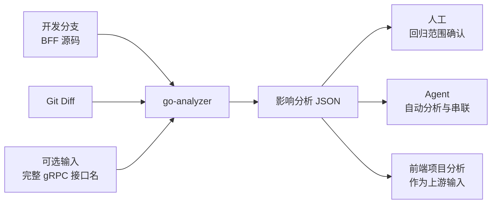

分析器只处理一个项目目录，输出一份 JSON。这份 JSON 有三类消费方：人工用它确认回归范围；Agent 用它做进一步分析；前端项目分析把它当作上游输入，继续往页面方向串联。

跨仓串联由消费方使用 HTTP 请求方法、路径和完整 gRPC 接口名完成，分析器自身不聚合多个仓库。

### 1.3 输入

| 输入              | 说明                                                               | 是否必需        |
| ----------------- | ------------------------------------------------------------------ | --------------- |
| BFF 项目目录      | 包含`go.mod`、且已经应用本次代码修改的项目目录；CLI 要求绝对路径 | 是              |
| Unified Diff 文件 | 描述当前代码相对基线的文件和行变化；CLI 要求绝对路径               | Diff 分析时必需 |
| 完整 gRPC 接口名  | 例如`/gopkg.inshopline.com.sc1.app.modules.medium.activity_user.proto.ActivityUserService/listWinnerBySalesId`，可以重复传入 | gRPC 反查时必需 |
| 影响过滤配置      | 忽略指定 go.mod 依赖的版本变化，减少噪音；场景见下                 | 否              |

`impact` 命令至少需要 Diff 或 gRPC 接口之一，两者也可以同时提供。

“影响过滤配置”对应一个真实场景：部分 BFF 会频繁升级 proto 依赖，而这类升级往往只是重新生成代码、并不改变 BFF 自身逻辑。如果每次都把引用了该依赖的接口全部标记为受影响，回归范围就会被这类版本号噪音淹没。因此允许按依赖路径把它们排除在传播之外，规则见第 7.7 节。

此外，CLI 还接受 `--goos`、`--goarch`、`--tags`、`--cgo` 四个可选参数，用于指定按哪套构建条件筛选参与分析的 Go 文件。不传时使用当前 Go 环境默认值；除了目标环境与本机不一致的场景，日常分析不需要关心。

### 1.4 输出

一次 `impact` 分析输出一个 JSON 文档，顶层按阅读顺序组织：

```jsonc
{
  "summary": {
    // 全局去重后的 HTTP 接口和 IM 事件
  },
  "fileSources": [
    // 普通源码文件的 Diff、传播树和来源内摘要
  ],
  // 仅在 go.mod 形成有效模块变化时出现
  "moduleSources": [],
  "grpcSources": [
    // 输入的 gRPC 接口及其 BFF 消费链路
  ],
  "endpointSourcesSummary": [
    // 按 HTTP 接口反查文件、模块或 gRPC 来源
  ]
}
```

其中：

- `summary` 用于快速回答“影响了什么”。
- `fileSources`、`moduleSources`、`grpcSources` 用于回答“影响从哪里来”。
- `endpointSourcesSummary` 用于回答“这个接口为什么受影响”。

输出组织方式与 `ts-analyzer` 保持相同的阅读层次，但 Go 语言的事实节点和 TypeScript 不完全相同。

### 1.5 静态分析口径

为了避免把能力边界误读为准确率承诺，本文统一采用以下口径：

| 维度       | 方案口径                                             | 具体表现                                                                       |
| ---------- | ---------------------------------------------------- | ------------------------------------------------------------------------------ |
| 影响含义   | 只要源码中存在一条能走通的依赖路径，就算“可能受影响” | 改了一个 DTO 字段，所有在请求或响应里用到它的接口都会被报出来                   |
| 分析方式   | 只读代码，不运行代码                                 | 分析器解析源码文本得出结论，不启动服务、不发请求、不采集运行时调用链            |
| 条件分支   | 能看出谁调用了谁，看不出条件是真还是假               | `if 灰度开关 { 调用 A }` 会被算作“可能调用 A”，不判断这个开关线上是否打开    |
| 动态写法   | 拼不出确定值时保留原始写法，不猜                     | 路由路径写成`prefix + name` 时，记录这个表达式并留下诊断，不编造一个具体路径  |
| 分析范围   | 只看本项目自己的生产代码                             | 不分析测试文件和第三方依赖源码，详见第 6.1 节                                   |
| 注册可达性 | 认路由注册语句，不追它是否真的被启动流程调用         | 一个注册函数写好了但没人调用，其路由仍会被识别；是否真正生效由人工判断          |
| 删除分析   | 只从 Diff 的删除行恢复必要证据，不还原旧版本项目     | 删掉一行路由注册能报出“这个接口被删了”，但不会重建整个旧分支来对比            |

因此，结果表示“在本方案支持的写法范围内可以证明的影响”，既不是运行时调用追踪，也不承诺覆盖所有动态写法。

## 2. 一条完整分析链路

本节用 `sl-sc1-admin-bff` 里一条真实链路，回答一件事：

> 改了一个响应体字段的 JSON Tag，为什么会报告 `GET /admin/api/bff-web/post/sale/:salesId/activity/winners` 受影响？

选这条链路是因为它同时覆盖了 BFF 里最常见的几种写法：四层路由 Group 嵌套、Group 跨函数传递、中间件、Wrapper 包裹的 Controller、DTO 嵌套引用，以及一次上游 gRPC 调用。

### 2.1 真实源码

本次改动落在活动获胜者列表的响应体上：

```go
// ---------- controller/post/activity/activity_dto.go ----------
package activity

type ActivityWinnerWithAvatar struct {
	PlatformChannelId string `json:"platformChannelId"`
	UserId            string `json:"userId"`
	NickName          string `json:"nickName"`
	CommentAt         string `json:"commentAt"`   // ← 本次改这一行的 Tag
	CreateTime        string `json:"createTime"`
}

type PageActivityWinnerWithAvatarResp struct {
	List     []ActivityWinnerWithAvatar `json:"list"`   // ← 字段引用上面的类型
	PageNum  int32                      `json:"pageNum"`
	Total    int64                      `json:"total"`
	LastPage bool                       `json:"lastPage"`
}
```

这个响应体被一个 Controller 方法作为返回类型使用，方法上方的注释声明了它对外是哪个接口：

```go
// ---------- controller/post/activity/activity.go ----------

// ListWinner 获取获胜者列表
// @Get /admin/api/bff-web/post/sale/:salesId/activity/winners
func ListWinner(c context.Context, ctx *lego.RequestContext, req ListWinnerReq) (*PageActivityWinnerWithAvatarResp, error) {
	user, _ := auth.GetUserFromContextWithError(ctx)
	resp, err := postGrpc.ListWinnerBySalesId(c, &activityUser.ListWinnerBySalesIdReq{
		SalesId: req.SalesId, MerchantId: user.MerchantID, Token: user.Token,
		Page: req.Page, Limit: req.Limit,
	})
	if err != nil {
		return nil, err
	}
	return convertPageActivityWinnerWithAvatarResp(resp), nil
}
```

路由注册分散在四层 Group 中，其中两层是通过函数参数和返回值传递的：

```go
// ---------- router/router.go ----------
const WEB_BFF_PREFIX = "/admin/api/bff-web"

func createAdminAuthGroup(g *lego.RouterGroup, prefix string) *lego.RouterGroup {
	adminGroup := g.Group(prefix)   // Group 由参数传入，再作为返回值传出
	// ... 挂载鉴权中间件
	return adminGroup
}

func InitRouter(g *lego.RouterGroup) {
	adminWebGroup := createAdminAuthGroup(g, WEB_BFF_PREFIX)
	// ...
}

// ---------- router/post/sale.go ----------
func AddPostReadGuard(g *lego.RouterGroup) *lego.RouterGroup {
	group := g.Group("")
	group.Use(middleware.Permission(middleware.Post, middleware.PostSale, middleware.Read, false))
	return group                     // 又一次跨函数传递，并在中途挂了读权限中间件
}

func InitPostSaleRouter(adminWebGroup *lego.RouterGroup) {
	saleGroup := adminWebGroup.Group("/post/sale/:salesId")
	saleGroupInPostReadGuard := AddPostReadGuard(saleGroup)

	// Controller 被 Wrapper 包裹后才注册
	saleGroupInPostReadGuard.GET("/activity/winners", sa2.ControllerWithReqResp(activity.ListWinner))
}
```

本次 Diff 只改了一行 Tag：

```diff
 type ActivityWinnerWithAvatar struct {
-    CommentAt  string `json:"commentedAt"`
+    CommentAt  string `json:"commentAt"`
 }
```

Controller 和路由都没有被碰到，但这个字段最终会出现在 `GET .../activity/winners` 的响应体里，所以该接口需要进入回归范围。

### 2.2 六个处理阶段

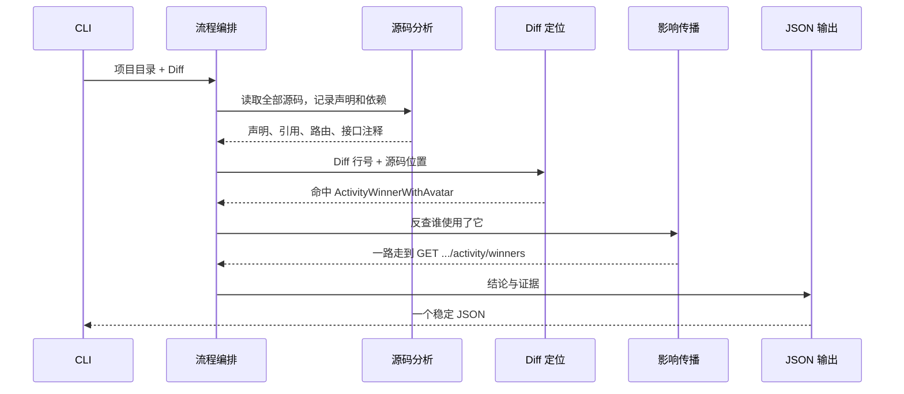

| 阶段      | 这一步在做什么                                     | 在本例中得到什么                                                        |
| --------- | -------------------------------------------------- | ----------------------------------------------------------------------- |
| 项目加载  | 按构建条件筛出参与分析的 Go 文件并解析             | `activity_dto.go`、`activity.go`、`sale.go`、`router.go` 等文件 |
| 事实提取  | 记录有哪些声明、谁用了谁、路由怎么注册、注释写了什么 | “`PageActivityWinnerWithAvatarResp` 的字段用了 `ActivityWinnerWithAvatar`” 这类关系 |
| 事实关联  | 把路由里的表达式解析成确定的 Controller 方法        | 认出`sa2.ControllerWithReqResp(activity.ListWinner)` 注册的是 `ListWinner` |
| Diff 定位 | 用文件名和行号找到最具体的那个声明                  | 改动行落在`ActivityWinnerWithAvatar` 内部，变更起点就是这个类型         |
| 影响传播  | 从变更起点反向查找所有使用者，直到路由或 IM         | 走到`GET /admin/api/bff-web/post/sale/:salesId/activity/winners`       |
| 输出投影  | 去重、排序，并按来源整理证据                        | 一份含结论、传播树和接口反查的 JSON                                     |

### 2.3 依赖方向与影响方向

写代码时，依赖是从上层指向底层的：

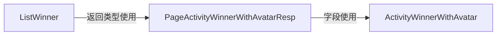

本次要从底层的 `ActivityWinnerWithAvatar` 出发，反查“谁用了它”，所以影响传播方向与依赖方向相反。注意这里是有分叉的——同一个类型还被两个转换函数引用，它们各自成为一条独立分支：

```mermaid
flowchart LR
    ITEM["ActivityWinnerWithAvatar 变化"]
    PAGE["PageActivityWinnerWithAvatarResp"]
    CONV1["convertActivityWinnerWithAvatarList"]
    CONV2["convertPageActivityWinnerWithAvatarResp"]
    LIST["ListWinner"]
    ROUTE["路由注册 GET /activity/winners"]
    ANNO["接口注释 @Get /admin/api/bff-web/..."]
    ENDPOINT["HTTP 接口<br/>GET /admin/api/bff-web/post/sale/:salesId/activity/winners"]

    ITEM -->|"被字段引用"| PAGE
    ITEM -->|"被返回值引用"| CONV1
    PAGE -->|"被返回值引用"| CONV2
    PAGE -->|"被返回类型引用"| LIST
    CONV1 -->|"被调用"| CONV2
    CONV2 -->|"被调用"| LIST
    LIST -->|"作为函数值注册"| ROUTE
    ROUTE -->|"关联所属方法的注释"| ANNO
    ANNO -->|"声明接口身份"| ENDPOINT
```

后文所说的“反向引用查询”，就是从被修改的声明开始，持续查找直接或间接使用它的上层声明，直到抵达路由或 IM 事件这类终点。

多条分支最终汇聚到同一个接口时，接口只报一次，但每条路径都作为证据保留下来。

### 2.4 完整输出示例

下面是这条真实链路对应的完整 JSON。`symbols` 里除了代码声明节点，也会递归包含路由、接口注释和接口终点节点；字段名沿用输出契约的既有名称。这是本文唯一一处完整的 impact 产物示例，字段级说明见第 8 节。

为了篇幅可读，下面只展开了「字段引用 → 响应体 → Controller → 路由 → 注释 → 接口」这一条主分支，两个转换函数分支的结构与之同形。

```json
{
  "summary": {
    "impactedEndpointCount": 1,
    "impactedEndpoints": [
      {
        "method": "GET",
        "path": "/admin/api/bff-web/post/sale/:salesId/activity/winners",
        "routes": [
          {
            "method": "GET",
            "path": "/admin/api/bff-web/post/sale/:salesId/activity/winners"
          }
        ]
      }
    ],
    "impactedIMCount": 0,
    "impactedIMEvents": []
  },
  "fileSources": [
    {
      "sourceFile": "controller/post/activity/activity_dto.go",
      "diff": "diff --git a/controller/post/activity/activity_dto.go b/controller/post/activity/activity_dto.go\n--- a/controller/post/activity/activity_dto.go\n+++ b/controller/post/activity/activity_dto.go\n@@ -42,3 +42,3 @@\n \tCommentId         string `json:\"commentId\"`\n-\tCommentAt         string `json:\"commentedAt\"`\n+\tCommentAt         string `json:\"commentAt\"`\n",
      "symbols": {
        "type:sc1-admin-bff/controller/post/activity::ActivityWinnerWithAvatar": {
          "id": "type:sc1-admin-bff/controller/post/activity::ActivityWinnerWithAvatar",
          "kind": "type",
          "name": "ActivityWinnerWithAvatar",
          "file": "controller/post/activity/activity_dto.go",
          "package": "sc1-admin-bff/controller/post/activity",
          "level": 0,
          "children": [
            {
              "id": "type:sc1-admin-bff/controller/post/activity::PageActivityWinnerWithAvatarResp",
              "kind": "type",
              "name": "PageActivityWinnerWithAvatarResp",
              "file": "controller/post/activity/activity_dto.go",
              "package": "sc1-admin-bff/controller/post/activity",
              "relation": "type_ref",
              "raw": "[]ActivityWinnerWithAvatar",
              "level": 1,
              "children": [
                {
                  "id": "func:sc1-admin-bff/controller/post/activity::ListWinner",
                  "kind": "func",
                  "name": "ListWinner",
                  "file": "controller/post/activity/activity.go",
                  "package": "sc1-admin-bff/controller/post/activity",
                  "relation": "type_ref",
                  "raw": "*PageActivityWinnerWithAvatarResp",
                  "level": 2,
                  "children": [
                    {
                      "id": "func:sc1-admin-bff/router/post::InitPostSaleRouter",
                      "kind": "func",
                      "name": "InitPostSaleRouter",
                      "file": "router/post/sale.go",
                      "package": "sc1-admin-bff/router/post",
                      "relation": "value_ref",
                      "raw": "activity.ListWinner",
                      "level": 3,
                      "children": []
                    },
                    {
                      "id": "route:func:sc1-admin-bff/router/post::InitPostSaleRouter:GET:/activity/winners:67",
                      "kind": "route",
                      "name": "GET /activity/winners",
                      "file": "router/post/sale.go",
                      "relation": "registered_handler",
                      "raw": "sa2.ControllerWithReqResp(activity.ListWinner)",
                      "level": 3,
                      "method": "GET",
                      "path": "/admin/api/bff-web/post/sale/:salesId/activity/winners",
                      "children": [
                        {
                          "id": "annotation:func:sc1-admin-bff/controller/post/activity::ListWinner:GET:/admin/api/bff-web/post/sale/:salesId/activity/winners:0",
                          "kind": "annotation",
                          "name": "GET /admin/api/bff-web/post/sale/:salesId/activity/winners",
                          "file": "controller/post/activity/activity.go",
                          "relation": "handler_annotation",
                          "raw": "@Get /admin/api/bff-web/post/sale/:salesId/activity/winners",
                          "level": 4,
                          "method": "GET",
                          "path": "/admin/api/bff-web/post/sale/:salesId/activity/winners",
                          "children": [
                            {
                              "id": "endpoint:GET:/admin/api/bff-web/post/sale/:salesId/activity/winners",
                              "kind": "endpoint",
                              "name": "GET /admin/api/bff-web/post/sale/:salesId/activity/winners",
                              "file": "controller/post/activity/activity.go",
                              "relation": "annotation_endpoint",
                              "level": 5,
                              "method": "GET",
                              "path": "/admin/api/bff-web/post/sale/:salesId/activity/winners",
                              "children": []
                            }
                          ]
                        }
                      ]
                    }
                  ]
                }
              ]
            }
          ]
        }
      },
      "impactedEndpoints": [
        {
          "method": "GET",
          "path": "/admin/api/bff-web/post/sale/:salesId/activity/winners",
          "routes": [
            {
              "method": "GET",
              "path": "/admin/api/bff-web/post/sale/:salesId/activity/winners"
            }
          ]
        }
      ],
      "impactedIMEvents": []
    }
  ],
  "grpcSources": [],
  "endpointSourcesSummary": [
    {
      "method": "GET",
      "path": "/admin/api/bff-web/post/sale/:salesId/activity/winners",
      "sources": [
        {
          "sourceType": "file",
          "sourceFile": "controller/post/activity/activity_dto.go",
          "rootSymbols": [
            {
              "id": "type:sc1-admin-bff/controller/post/activity::ActivityWinnerWithAvatar",
              "kind": "type",
              "name": "ActivityWinnerWithAvatar",
              "file": "controller/post/activity/activity_dto.go"
            }
          ],
          "chains": [
            [
              "type ActivityWinnerWithAvatar",
              "type PageActivityWinnerWithAvatarResp",
              "func ListWinner",
              "route GET /activity/winners",
              "annotation GET /admin/api/bff-web/post/sale/:salesId/activity/winners",
              "GET /admin/api/bff-web/post/sale/:salesId/activity/winners"
            ]
          ]
        }
      ]
    }
  ]
}
```

### 2.5 三种阅读方式

同一份结果支持三种阅读深度：

```text
summary
  -> 只看最终影响了哪些接口和 IM 事件

fileSources / moduleSources / grpcSources
  -> 查看来源、原始输入和递归传播证据

endpointSourcesSummary
  -> 从某个接口反查影响它的来源和最短人读链路
```

`endpointSourcesSummary[].chains` 为每个来源根只选择一条最短链路，方便快速确认；全部已展开分支仍保留在详细 Source 证据中。

## 3. 关键设计决策

这一节集中说明最容易产生歧义的方案口径。后续模块都必须遵守这些决策。

### 3.1 先抽事实，再做查询（Facts-first）

“Facts-first” 指的是：分析器**不是**读一遍源码就直接回答“哪些接口受影响”，而是先把源码翻译成一堆结构化的小事实（“某个类型被某个方法当返回值用了”、“某条路由注册了某个 Controller 方法”），存进一个统一容器，之后所有查询都只读这些事实，不再回头翻源码。

负责“从源码里认出某一类事实”的模块叫 **Extractor（事实提取器）**：一个 Extractor 只认一类东西——路由提取器只认路由注册，接口注释提取器只认注释，IM 提取器只认 IM 发送。它们之间不互相调用，各写各的那一类事实。

流程上是这样：

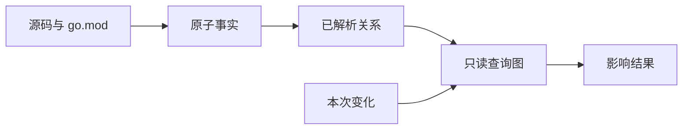

这样做的好处：

- 每个提取器只管一类写法，新增一种协议不会牵动已有的规则。
- 影响传播只查事实，不需要反复重新解析源码。
- 可以用 `facts` 命令单独把事实打出来，先确认“数据抽对了没有”，再排查“结论推错了没有”。
- 路由、IM、gRPC 这些能力共用同一套声明和引用事实，不各自维护一份。
- 输出层只能整理已有结论，没有机会临时补造一条代码关系出来。

### 3.2 只做够用的类型推断

分析器用 Go 标准库把源码解析成语法树，读出声明、注释和每处代码的行列位置，并为函数、方法、类型、包级变量和常量各建立一个身份。

在此之上，它需要回答一个问题：**代码里写的这个名字，到底指向哪个声明？** 比如 `postGrpc.ListWinnerBySalesId` 里的 `postGrpc` 是哪个包，`live.ActivityUserClient` 这个变量是什么类型。判断依据只有四种：

| 依据           | 例子                                                                |
| -------------- | ------------------------------------------------------------------- |
| import 语句    | `postGrpc` 是 `sc1-admin-bff/remote/grpc/post` 的别名           |
| 写明的类型     | 结构体字段或变量声明上直接写了类型                                  |
| 构造函数返回值 | `NewXxxClient(...)` 的返回类型能确定这个变量是什么                |
| 唯一的接口实现 | 某接口在项目里只有一个实现时，可以确定调用落到哪里                  |

只有依据充分、候选唯一时才建立确定关系。这套推断刻意做得比 Go 编译器弱——它不做完整类型检查，因此下面这些写法它认不出来：

- 反射，或运行时才注入的依赖。
- 一个接口有多个实现、运行时才决定调哪个。
- 藏在第三方 SDK 内部的调用。
- 运行时拼出来的 Controller、路由路径或事件名。
- 接收者类型无法静态确定的方法调用。

认不出来时留一条诊断，不会因为名字像就挑一个候选顶上。

### 3.3 接口身份以接口注释为准（Annotation-first）

一个 Controller 方法对外是“哪个接口”，有两个可能的来源：写在它上方的接口注释，和把它挂上去的那行路由注册代码。本方案规定：**以接口注释为正式身份，路由注册作为并列证据一起输出，两者不互相覆盖**。这条规则就叫 Annotation-first。

之所以不用路由注册当身份，是因为第 6.5 节那种情况很常见——路径分散在四层 Group、跨了三个函数，中间还可能经过运行时才确定的拼接。静态解析拼不全时结果就是残缺的；而接口注释是给下游系统看的对外契约，本身就写全了。

反过来也不能只输出注释，因为注释可能和实际注册漂移。所以两者并列输出，HTTP 接口的输出里同时包含这两组信息：

```json
{
  "method": "GET",
  "path": "/admin/api/bff-web/post/sale/:salesId/activity/winners",
  "routes": [
    {
      "method": "GET",
      "path": "/admin/api/bff-web/post/sale/:salesId/activity/winners"
    }
  ]
}
```

本例中两者一致。如果某个 Controller 的注释写成 `/admin/api/bff-web/orders`，而静态拼出来的注册路径是 `/api/bff-web/orders`，输出会把两个都留着——正式身份用注释那个，`routes` 里如实写注册那个，让人能看出这里有漂移。

两组字段的职责不同：

| 字段            | 来源                                             | 含义                             |
| --------------- | ------------------------------------------------ | -------------------------------- |
| `method/path` | 接口注释优先；没有注释时才用路由注册路径         | 对外的正式接口身份               |
| `routes`      | 静态解析出的路由注册路径                         | 这个方法在代码里实际是怎么注册的 |

具体匹配规则：

| Controller 方法的情况                            | 正式接口身份取自                 | `routes` 里放什么       |
| ------------------------------------------------ | -------------------------------- | ------------------------- |
| 没有接口注释                                     | 每条能解析出的路由各算一个接口   | 能解析出的路由            |
| 注释和路由对得上                                 | 注释                             | 该方法能解析出的路由      |
| 注释和路由不一致                                 | 注释，不用路由悄悄覆盖           | 不一致的那条路由，如实展示 |
| 同一个方法注册了多条路由，注释只对上其中一条     | 注释；对不上的那些路由**不另算接口** | 全部路由                  |
| Diff 直接改了接口注释                            | 注释本身即为影响终点             | 附上能解析到的路由        |

归纳成两条：**只要方法上有接口注释，注释就是它唯一的对外身份来源**，注释没覆盖到的注册路径只作为 `routes` 证据；只有方法完全没有注释时，才按路由兜底、每条路由各成一个接口。

这样定的理由是注释没覆盖到的路由绝大多数并不是"另一个接口"：真实项目里它们是同一个接口的另一种写法或历史遗留——路径参数写法不同（`{id}` 与 `:id`）、前缀没拼全、老 Java 转发路径、注释相对注册漂移。各自算一个接口等于把这些噪音当结论报出去。

需要说明的是，Annotation-first 是本方案约定的业务口径，不代表注释一定比实际注册正确。并列输出两类证据，本身就是为了让漂移暴露出来——漂移落在同一个接口条目的 `routes` 里，而不是被拆成两个看起来无关的接口。

注册路径虽然不构成接口身份，但仍可直接用于查询：接口身份目录在按身份查不到时会按注册证据回退，返回该路由所属的正式接口。调用方手上往往只有从前端代码或网关日志拿到的真实 URL，这条回退保证它们查得到。

**这条规则只允许有一个实现。** 由 `internal/endpoint` 统一根据接口注释、路由、关联关系和 Controller 方法算出一份只读的“接口身份目录”，其它模块都从这份目录里读，不允许各自再写一套判断：

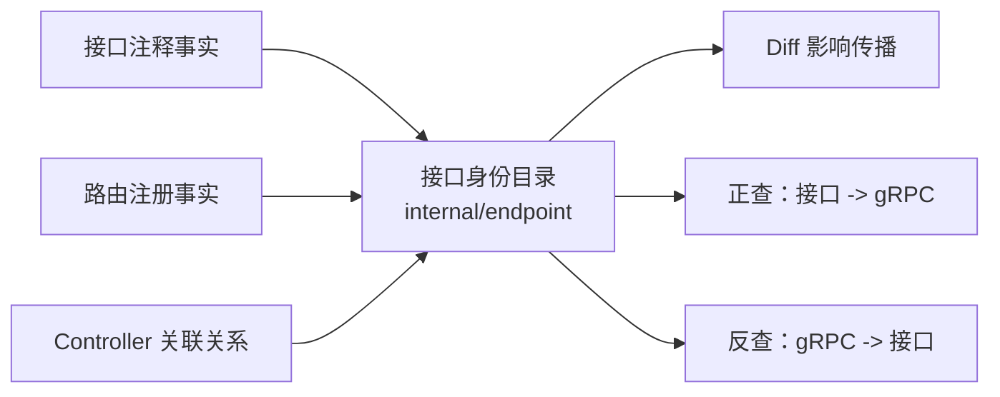

为什么必须强制唯一实现？因为影响分析、正向 gRPC 查询、反向 gRPC 查询是三条独立代码路径，如果各自实现一遍“注释优先、没注释才按路由兜底、拿注册路径怎么回退”，三者迟早给出不同的接口集合，同一个接口在一处叫 A、在另一处叫 B，输出之间就对不上了。收敛到一份目录后可以保证：

```text
接口身份目录里有接口 A
  -> A 可以作为 Diff 影响的终点
  -> A 可以作为 endpoint-assets 的查询输入
  -> A 可以出现在 gRPC 反查的结果里
```

### 3.4 两类图服务不同问题

Diff 影响传播和 gRPC 依赖查询不能混用一张无类型图：

| 查询                      | 使用的边                                 | 原因                                |
| ------------------------- | ---------------------------------------- | ----------------------------------- |
| 代码变化影响哪些 Endpoint | Call、Value、Type 的反向引用边           | DTO、变量和函数值变化都可能影响入口 |
| Endpoint 调用了哪些 gRPC  | 只使用可执行 Call 边                     | Type/Value 依赖不代表会执行 RPC     |
| gRPC 影响哪些 Endpoint    | 从 gRPC 调用点沿调用边反查 Controller 方法 | 保证链路表达的是可执行调用关系      |

### 3.5 正式结论与诊断分开放

“诊断”指的是分析过程中遇到的、静态上没法确定的地方：路由路径是拼出来的、某个接口有多个实现分不清调哪个、删除块只能恢复一半证据等等。它们既不是错误（分析可以继续），也不是结论（不能当成受影响接口报出去），所以需要单独一个去处。

规则是：

- 影响分析 JSON 里只放正式结论——受影响的接口、IM 事件和来源证据。
- 读源码、抽事实阶段产生的诊断，放进 `facts` 命令的输出里。
- 如果本次改动的文件本身都解析不了，直接失败，不出半份结果。
- 没被改动的文件局部解析失败，记一条诊断然后继续。

有一类诊断是 `facts` 命令拿不到的：Diff 映射、删除恢复、依赖使用点定位，这些只在“带 Diff 跑一次分析”时才产生，事后单独跑 `facts` 复现不出来。因此这类诊断按第 11.2 节的方式随本次分析单独输出一份文件，而不是塞进正式 JSON，也不能只打日志了事。

## 4. 总体架构与运行顺序

### 4.1 模块协作

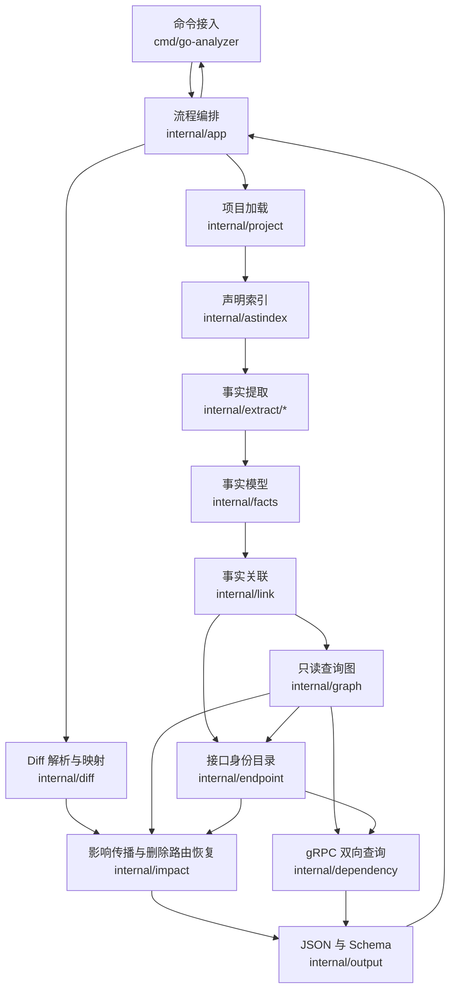

### 4.2 一次 `impact` 的执行顺序

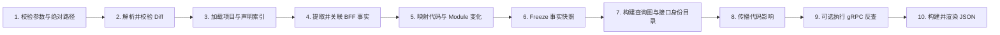

没有 Diff、只有 gRPC 输入时，跳过第 2、5、8 步，也不加载 Module Change 配置。

gRPC 调用提取本身不加载任何依赖包，纯 Diff 分析和带 `--grpc` 的分析走的是同一套源码加载路径，见 10.5。

### 4.3 阶段输入与产物

| 阶段                 | 读取                       | 写入或返回                                    |
| -------------------- | -------------------------- | --------------------------------------------- |
| Project Load         | 项目目录、Build Context    | Package、File、AST、Module Path               |
| AST Index            | AST                        | Symbol 和轻量类型索引                         |
| Fact Extraction      | AST、Index                 | Annotation、Route、Reference、IM、gRPC 等事实 |
| Link                 | 路由、Controller、接口注释 | 关联事实和已解析出的 Controller 方法        |
| Diff Map             | Diff 行、源码事实          | `ChangeFact`                                |
| Module Map           | go.mod Diff、Import        | `ModuleChangeFact`、`ModuleUsageFact`     |
| Freeze 与 Query View | 完整 Fact Store            | 只读 Snapshot、查询图、接口身份目录           |
| Impact               | Change、只读查询图         | 每个变化根的传播树                            |
| gRPC Query           | 完整接口名、Call Graph     | BFF Consumer 和调用链                         |
| Output               | 传播树和查询结果           | 稳定 JSON                                     |

## 5. 数据模型

### 5.1 五层数据

为了理解数据生命周期，可以把一次分析分成五层：

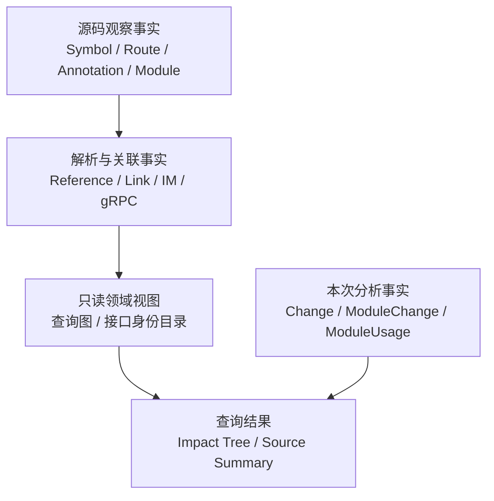

| 层             | 生命周期                 | 是否进入`facts` JSON |
| -------------- | ------------------------ | ---------------------- |
| 源码观察事实   | 随项目源码变化           | 是                     |
| 解析与关联事实 | 随项目源码和解析规则变化 | 是                     |
| 只读领域视图   | 随完整 Fact 快照变化     | 否                     |
| 本次分析事实   | 只属于一次 Diff 分析     | 否                     |
| 查询结果       | 只属于一次命令输出       | 进入`impact` JSON    |

### 5.2 核心事实

事实类型看起来不少，但它们是按“回答什么问题”分组的，并不需要一次全记住：

| 分组         | 包含                                                                 | 为什么需要                                   |
| ------------ | -------------------------------------------------------------------- | -------------------------------------------- |
| 代码骨架     | 声明、引用                                                           | 一切传播的基础：有哪些声明、谁用了谁         |
| 路由与接口   | 接口注释、路由注册、Group、Group 跨函数流转、中间件绑定、关联关系     | 把代码声明落到 HTTP 接口上                   |
| 出站依赖     | IM 事件、gRPC 接口、gRPC 调用点                                       | 除 HTTP 接口外的另两类影响终点               |
| 依赖清单     | go.mod 依赖                                                          | 支撑 go.mod 变化分析                         |
| 本次分析产物 | 变更起点、依赖变化、依赖使用点、诊断                                  | 只属于这一次分析，不描述项目本身             |

路由那一组之所以拆得比较细，是被真实写法逼出来的。以第 6.5 节那条链路为例：前缀分散在四层 Group（需要 Group 事实记录各层前缀和父子关系），其中两层通过函数参数传入、返回值传出（需要 Group 跨函数流转事实，否则跨函数就断链，拼不出完整路径），中途还挂了权限中间件（需要中间件绑定事实，记录它挂在哪个 Group、影响其后哪些路由）。如果只保留一个“路由”事实，这些信息就没有地方存，完整注册路径也就拼不出来。

完整列表：

| Fact                      | 回答的问题                                             |
| ------------------------- | ------------------------------------------------------ |
| `ProjectFact`           | 分析的是哪个 Module，使用什么构建条件                  |
| `SymbolFact`            | 项目中有哪些函数、方法、类型、包级变量和常量           |
| `ReferenceFact`         | 哪个 Symbol 以 Call、Value 或 Type 方式依赖哪个 Symbol |
| `AnnotationFact`        | 哪个 Controller 方法的注释声明了什么 HTTP 接口         |
| `RouteGroupFact`        | Group 的变量、Prefix 和父子关系是什么                  |
| `RouteGroupFlowFact`    | Group 如何跨函数参数或返回值流转                       |
| `RouteRegistrationFact` | 哪个 Group 注册了什么请求方法、路径和 Controller 方法   |
| `MiddlewareBindingFact` | 哪个 Group 在什么顺序绑定了什么 Middleware             |
| `LinkFact`              | 路由、Controller 方法和接口注释如何对应                |
| `IMEventFact`           | 哪个 Sender 发送什么 Event，依赖什么 Payload 或条件    |
| `GrpcOperationFact`     | 一个 gRPC 方法身份，`<生成包 import 路径>.<Service>/<GoMethod>` |
| `GrpcCallFact`          | BFF 中哪个 Caller 调用了哪个 gRPC 方法身份             |
| `ModuleDependencyFact`  | go.mod 声明了哪些 require，以及它们关联的 replace      |
| `ChangeFact`            | 本次 Diff 命中了哪个传播起点                           |
| `ModuleChangeFact`      | 哪个 Module 发生新增、删除、升级、降级或替换           |
| `ModuleUsageFact`       | 变化 Module 在本项目的真实 Import 使用入口             |
| `DiagnosticFact`        | 哪条静态证据无法解析、存在歧义或发生降级               |

### 5.3 事实之间如何关联

事实之间不互相嵌套复制，而是通过稳定 ID 相互指向。以第 2 节那条链路为例，各条事实是这样串起来的（箭头上的文字就是字段名）：

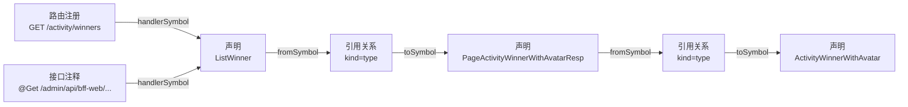

这样做的好处是：同一个声明被很多地方引用时，不会产生多份互相可能不一致的副本，改一处不必同步多处。

主要关联字段：

- `ReferenceFact.fromSymbol` 指向引用者。
- `ReferenceFact.toSymbol` 指向被引用声明。
- `RouteRegistrationFact.handlerSymbol` 指向被注册的 Controller 方法。
- `AnnotationFact.handlerSymbol` 指向该注释所属的 Controller 方法。
- `LinkFact.fromID/toID` 保存已经解析清楚的关系。
- `ChangeFact.symbolID/targetID` 指向本次变化根。
- `GrpcCallFact.callerSymbol/operationID` 连接业务调用点和 gRPC 接口。

### 5.4 ID 的稳定含义

Symbol ID 采用以下形式：

```text
func:<package>::<name>
method:<package>:<receiver>:<name>
type:<package>::<name>
var:<package>::<name>
const:<package>::<name>
```

“稳定”表示同一份源码快照和同一解析规则会得到相同 ID。它是输出中的关联键，应被调用方视为不透明字符串，不承诺代码重命名、文件移动或路由语句顺序变化后仍保持不变。

Route、Annotation、IM 和 gRPC Fact 也有各自的确定性 ID，用于去重和证据关联。

### 5.5 Store 生命周期

`facts.Store` 是一次流水线内的共享事实容器。为避免误读，先明确它不是什么：

- 它不是数据库，不跨命令持久化，也不承担查询能力。
- 它不是事件总线或消息队列，Extractor 之间不通过它互相通知或触发。
- 它不执行影响传播，也不产生任何业务结论。
- 它只按类型保存从源码、依赖和本次 Diff 得到的静态数据。

“共享”的含义仅仅是：各模块共用同一份事实，而不必各自重新解析源码。

它在流水线中的写入与读取顺序为：

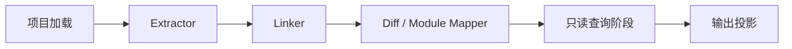

约束：

1. `internal/app` 是唯一了解完整执行顺序的编排层。
2. Extractor 只能写入自己负责的事实。
3. Extractor 不直接调用其它 Extractor。
4. Linker 只连接已经存在的事实。
5. Change 和 Module Usage 在源码事实完成后写入。
6. 所有写入结束后建立逻辑 Freeze 边界；Graph、Endpoint、Dependency 和 Impact 只接收只读快照。
7. Output 不重新扫描 AST，也不补推业务关系。

“Freeze”是架构约束，不应只依赖调用顺序约定。事实构建 API 应把可写 Builder 与只读 Snapshot 分离，避免查询阶段意外追加或覆盖 Fact。

## 6. 项目加载与事实提取

### 6.1 项目加载

项目根目录必须包含 `go.mod`。加载阶段：

1. 从 `go.mod` 读出模块路径，它是后续所有声明 ID 的前缀。
2. 递归扫描项目目录下的 `.go` 文件。
3. 跳过不属于本项目业务代码的部分（见下）。
4. 解析源码，同时保留注释——接口注释就靠这一步读到。
5. 按包路径把文件组织起来。
6. 嵌套 `go.mod` 下的源码，用它自己的模块路径建立声明身份。

第 3 步跳过的内容及原因：

| 跳过的目标                       | 原因                                                                     |
| -------------------------------- | ------------------------------------------------------------------------ |
| `_test.go`                     | 测试代码不对外提供接口，改测试不产生接口回归范围                          |
| `vendor/`                      | Go 的依赖内联目录：把第三方依赖的源码整份复制进仓库。它是别人的代码，不是本项目声明 |
| `testdata/`                    | Go 工具链约定的测试数据目录，里面的`.go` 文件不参与正常构建             |
| `node_modules/`                | 少数 BFF 仓库同时放了前端工程，这个目录体量大且与 Go 分析无关，直接跳过   |
| 以`.` 或 `_` 开头的文件、目录 | Go 构建本身就忽略它们                                                     |

此外，加载时会按构建条件（GOOS、GOARCH、Build Tags、cgo）过滤文件，只保留本次目标环境下真正参与编译的那些。不指定时用当前 Go 环境默认值，日常分析不需要关心。

需要注意，“参与分析”只表示这个文件通过了构建条件过滤，不表示它所在的包一定真的被启动流程用到。

CLI 的一次分析单元仍是 `--project` 根目录对应的根 Module：

- 根 `go.mod` 决定项目身份、Module Change 和 Generated Dependency 发现。
- 嵌套 Module 的源码可以获得正确 Package Identity，但嵌套 `go.mod` 不并入根 Module 的依赖变化分析。
- 需要完整分析多个 Module 时，编排层必须分别以每个 Module 根目录调用分析器，再按稳定接口身份汇总。

### 6.2 声明索引

索引为下面这些声明各建立一个稳定身份：

- 包级函数（例如 `ListWinner`）。
- 带接收者的方法。
- 类型声明（例如 `ActivityWinnerWithAvatar`）。
- 包级变量（例如 `live.ActivityUserClient`）。
- 包级常量（例如 `WEB_BFF_PREFIX`）。

Struct Field 和局部变量不建立独立 Symbol，但会作为类型或值解析证据。Struct Field 或 Tag 的 Diff 归属到所在 Type。

### 6.3 引用关系提取

只分析函数调用不足以覆盖 BFF：

```go
// ListWinner 被当作函数值传给路由，而不是在这里被调用
saleGroupInPostReadGuard.GET("/activity/winners", sa2.ControllerWithReqResp(activity.ListWinner))

// ListWinner 使用了响应体类型，但没有"调用"它
func ListWinner(...) (*PageActivityWinnerWithAvatarResp, error)
```

如果只记录函数调用，上面两行都会被漏掉：路由那行不是调用 `ListWinner`，返回类型也不是调用。因此引用分三类：

| 类型   | 本例中的样子                                                | 能回答的问题                          |
| ------ | ----------------------------------------------------------- | ------------------------------------- |
| 调用   | `ListWinner` 里调用 `convertPageActivityWinnerWithAvatarResp` | 改了被调函数，哪些调用方受影响        |
| 值使用 | `activity.ListWinner` 作为参数传给 `GET(...)`             | 改了 Controller 方法，它注册在哪条路由 |
| 类型使用 | `ListWinner` 的返回类型是 `*PageActivityWinnerWithAvatarResp` | 改了 DTO 的字段或 Tag，哪些接口受影响 |

目标必须唯一解析到项目内 Symbol 才形成确定 Reference。外部调用不会伪造为项目内 Symbol。

### 6.4 接口注释提取

接口注释提取器从 Controller 方法上方的注释中读出请求方法和路径：

```go
// ListWinner 获取获胜者列表
// @Get /admin/api/bff-web/post/sale/:salesId/activity/winners
func ListWinner(...) (*PageActivityWinnerWithAvatarResp, error)
```

接口注释必须绑定到一个明确的函数或方法声明。同一个方法上方可以有多条接口注释（例如新老路径并存），每条各自产生一个接口身份；不带这类标记的普通注释不产生任何接口。

### 6.5 路由、Group 与中间件提取

真实 BFF 的路由前缀往往不在一处写完。以第 2 节那条链路为例，它跨了四层 Group、两个文件、三个函数：

```go
// router/router.go
adminWebGroup := createAdminAuthGroup(g, "/admin/api/bff-web")   // 前缀第 1 段，Group 由函数返回

// router/post/sale.go
saleGroup := adminWebGroup.Group("/post/sale/:salesId")          // 前缀第 2 段
readGuard := AddPostReadGuard(saleGroup)                          // Group 传入函数，挂中间件后再返回
readGuard.GET("/activity/winners", sa2.ControllerWithReqResp(activity.ListWinner))  // 末段路径
```

分析器需要把这四段拼起来，才能得到完整注册路径：

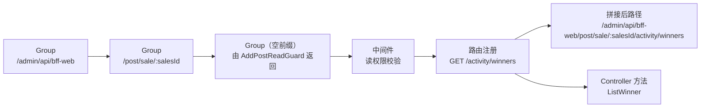

需要支持的静态写法包括：

- Group 前缀拼接与父子 Group 嵌套。
- Group 作为函数参数传入（`AddPostReadGuard(saleGroup)`）。
- Group 作为函数返回值传出（`return group`）。
- Wrapper 包裹的 Controller（`sa2.ControllerWithReqResp(...)`）。
- 以包级变量、结构体字段或方法值形式出现的 Controller。
- 同一 Group 内路由与中间件的源码先后顺序。

中间件的影响范围按源码顺序判定：

- 同一个函数内，`.Use()` 只影响写在它之后的路由；写在前面的不受影响。
- 跨函数传递的同一个 Group，不再用某个函数内部的语句顺序去比较先后。
- 不判断分支条件是否互斥，结果保持“可能受影响”的口径。

### 6.6 事实关联

路由注册那行代码，最初只是一个表达式，分析器还不知道它指向哪个声明：

```go
sa2.ControllerWithReqResp(activity.ListWinner)
```

关联阶段负责剥掉 Wrapper、解析出真正的 Controller 方法，再接上它的接口注释：

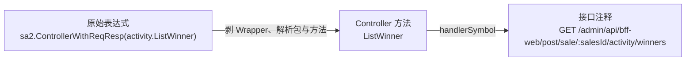

无法唯一确定 Controller 方法时（例如表达式来自运行时构造，或同名候选有多个）：

- 路由事实保留原始表达式。
- 指向 Controller 方法的字段留空。
- 留下一条诊断。
- 不按名字相近去猜一个候选。

## 7. Diff、Module 与影响传播

### 7.1 Unified Diff 解析

Diff Parser 接受标准 Git Unified Diff，提取：

- `OldPath`、`NewPath` 和文件状态。
- 新版本中的新增行范围。
- 删除块的旧行号、新版本锚点和原始文本。
- 每个文件的原始 Patch。
- 用于校验变更后源码的上下文和新增行。

有两类 Diff 不做 Go 语义映射：

- **Combined Diff**：`git diff` 在处理合并提交时会产生的一种特殊格式，同时对比多个父提交，每行前面有两个及以上的 `+`/`-` 标记。它的行号语义和普通 Diff 不同，无法可靠地对应到某一个版本的源码，因此直接拒绝，而不是按普通 Diff 硬解析出错误的行号。
- **二进制 Patch**：内容不是文本，没有可映射的声明。

### 7.2 Diff 与源码快照校验

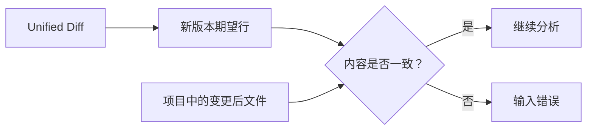

校验包括：

- Diff 路径在词法清理和符号链接解析后都必须位于项目根目录内。
- Diff 命中的源码文件不得通过符号链接指向项目目录之外。
- 删除文件在变更后目录中必须不存在。
- 新增和上下文行必须与变更后源码一致。
- 纯删除区域使用删除块与锚点补充校验。
- 变更后的 Go 文件必须能够解析。

路径安全属于输入契约，不是部署建议。即使分析目录来自受信任的 CI Checkout，也不能只用 `filepath.Clean` 代替真实路径边界校验。

### 7.3 变化行映射

Diff 只告诉分析器“某个文件的第几行变了”，映射阶段要回答的是“这一行属于谁”。规则是**取最具体的那个目标**，从上往下匹配，命中即止：

```text
接口注释
  -> 路由 Group
  -> 路由注册
  -> 中间件绑定
  -> 后端协议扩展位（Job 注册、Dubbo 方法、Dubbo 服务）
  -> 最小的那个函数 / 方法 / 类型 / 变量 / 常量声明
  -> 只能定位到文件
```

为什么要分优先级？看这段真实代码，四行改动落在四个不同粒度上：

```go
func InitPostSaleRouter(adminWebGroup *lego.RouterGroup) {
	saleGroup := adminWebGroup.Group("/post/sale/:salesId")          // ← 改这行：变化根是这个 Group
	readGuard := AddPostReadGuard(saleGroup)
	readGuard.Use(newFlowControlMid())                                // ← 改这行：变化根是这条中间件绑定
	readGuard.GET("/activity/winners", sa2.ControllerWithReqResp(activity.ListWinner))  // ← 改这行：变化根是这条路由
	log.Info("post sale router ready")                                // ← 改这行：没有更具体的目标，变化根是 InitPostSaleRouter 这个函数
}
```

如果不分优先级、一律归到最外层的 `InitPostSaleRouter`，那么改任意一行都会等价于“这个文件里所有路由都可能受影响”——而这个函数注册了十几条路由，回归范围会被放大十倍。反过来，改最后那行日志时也确实找不到更具体的目标，此时归到函数是正确的。

同一个目标上的相邻变化行会合并成一条变更记录，不会因为改了三行就产生三个重复起点。

需要说明三点：

- 三个后端协议扩展位在 BFF 分析里永远没有候选——BFF 不产生 Job 和 Dubbo 事实。它们之所以留在这份优先级里，是因为 Diff 映射逻辑与后端服务分析共用一套，本文不展开它们的传播规则。
- 落在声明范围内的普通注释或纯格式改动，同样会归到该声明。方案不比较改动前后语义是否等价，因此“只改了个空格”也会算作该声明发生变化。
- 改结构体字段或 Tag 时，变化根是它所在的类型，而不是字段本身——第 2 节那个例子就是这样从一行 Tag 走到 `ActivityWinnerWithAvatar` 的。

### 7.4 Diff 支持边界

| 变化                                | 处理                                                  |
| ----------------------------------- | ----------------------------------------------------- |
| 新增或修改 Go 行                    | 映射到变更后源码事实                                  |
| 删除 Route                          | 从删除块恢复请求方法、路径、Controller 等必要证据     |
| 删除 Controller 方法与接口注释      | 在删除块证据足够时恢复合成事实                        |
| 删除普通 Symbol                     | 尽量映射到存活声明；否则降级为 File 并记录 Diagnostic |
| 删除整个文件                        | 保留文件来源；只有可恢复的领域证据进入正式结论        |
| 只有路径变化、没有 Hunk 的纯 Rename | 不产生声明级传播根                                    |
| Binary Diff                         | 不进行 Go 语义传播                                    |
| Combined Diff（合并提交的多父对比） | 直接拒绝，行号语义不可靠                              |

### 7.5 删除路由的恢复

假设本次改动删掉了获胜者列表这条路由：

```diff
 func InitPostSaleRouter(adminWebGroup *lego.RouterGroup) {
-    saleGroupInPostReadGuard.GET("/activity/winners", sa2.ControllerWithReqResp(activity.ListWinner))
 }
```

删除后的源码里已经看不到这条路由了，如果只看当前代码，这个接口会在结论中凭空消失。因此需要从 Diff 的删除行反过来恢复证据：

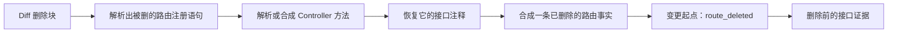

恢复只使用删除块、当前声明索引和可证明的 Group 上下文，不构造完整旧版本项目。证据不足时保留 Diagnostic，不猜测接口。

### 7.6 go.mod 变化

假设 `go.mod` 把某个 Module 从 `v1.2.0` 升到 `v1.3.0`。仅凭这一行版本号，分析器并不知道本项目哪些代码真正使用了它。如果按“依赖变了所以整个项目都受影响”处理，一次例行升级就会把全部接口标记为需要回归，结论失去筛选价值。

因此 `go.mod` 版本变化不能直接扩散到整个项目，必须先落到真实使用点。处理过程为：

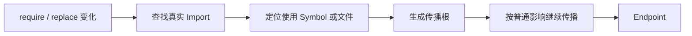

Module Usage 分为：

| Basis                    | 含义                                        |
| ------------------------ | ------------------------------------------- |
| `matched_import_usage` | 可以定位到使用该 Module 的具体 Symbol       |
| `matched_file_usage`   | 只能定位到 Import 所在文件中的声明          |
| `module_unreferenced`  | 项目中没有匹配 Import，不产生 Endpoint 影响 |

Module 结论表示“依赖清单变化可能通过本仓 Import 使用点影响接口”，不表示分析器比较了依赖升级前后的 API 实现。

### 7.7 Module 噪音配置

配置只控制 `go.mod` Module Change：

```json
{
  "analyzeModuleChanges": true,
  "ignoredModuleChanges": [
    "gopkg.inshopline.com/sc1/app/modules/*/proto"
  ]
}
```

规则：

- `analyzeModuleChanges` 未配置时默认为 `true`。
- `false` 表示关闭全部 Module Change 分析。
- `ignoredModuleChanges` 是忽略列表，支持精确 Module Path 和 `path.Match` 风格 Glob。
- 未知字段、空模式和非法 Glob 直接报错。
- 配置不影响 Annotation、Route、Middleware、IM 或 gRPC 解析。

配置路径：

- `--impact-config` 显式指定时必须是绝对路径。
- 未指定时尝试读取项目内 `.analyzer/go-impact.config.json`。
- 默认文件不存在时使用空配置。
- 只有存在 `--diff` 时才加载配置；仅有 `--grpc` 时不读取自动发现配置。
- 没有 `--diff` 却显式传入 `--impact-config` 属于无效参数组合，直接失败。

### 7.8 影响查询图

事实关联完成后，构建下列只读索引。它们不是新的处理步骤，而是查询阶段为了避免反复扫描事实而建立的内存视图；它们只引用第 5 节的事实，不复制第二套数据，也不修改 Store：

| 查询图           | 方向                                         | 用途                             | 在第 2 节案例中的作用                              |
| ---------------- | -------------------------------------------- | -------------------------------- | -------------------------------------------------- |
| Reverse Graph    | `ToSymbol -> References FromSymbol`        | 从变化声明反查所有使用者         | 从`ActivityWinnerWithAvatar` 找到 `PageActivityWinnerWithAvatarResp`，再找到 `ListWinner` |
| Route Graph      | Controller/Group/Middleware -> 路由/接口注释 | 从代码声明落到 HTTP 接口         | 从`ListWinner` 找到 `GET /activity/winners` 的注册与注释 |
| Call Graph       | Caller <-> Callee                            | BFF 与 gRPC 双向查询             | 本案例无 gRPC 调用，不产生结果                     |
| IM Graph         | Sender -> IM Event 及依赖                    | 判断变化路径命中哪个 Event       | 本案例无 IM 发送，`impactedIMEvents` 为空        |
| Endpoint Catalog | Controller <-> HTTP 接口，并聚合路由候选     | 统一 Diff 和 gRPC 查询的接口身份 | 判定该接口身份来自接口注释，并挂上拼接出的注册路径作为候选 |

### 7.9 不同变化根如何传播

| Change Kind             | 入口行为                                |
| ----------------------- | --------------------------------------- |
| `symbol_changed`      | 沿 Call、Value、Type 反向引用展开       |
| `annotation_changed`  | 直接生成 Annotation Endpoint            |
| `route_changed`       | 展开路由、Controller 方法和接口         |
| `route_deleted`       | 展开恢复出的删除 Route                  |
| `route_group_changed` | 展开 Group 和所有静态子 Group 的 Route  |
| `middleware_changed`  | 展开受静态顺序影响的 Route              |
| `file_changed`        | 保留文件根，不扩大到整个 Package 或项目 |

### 7.10 DFS 传播与资源边界

每个 ChangeFact 独立产生一棵树：

```text
展开(当前 Symbol, 当前 DFS 路径):
  查找所有直接使用当前 Symbol 的上层 Symbol
  对每个上层 Symbol:
    如果已经存在于当前路径:
      标记 cycle，不再递归
    否则:
      加入当前路径
      递归展开
      从当前路径移除

  查找当前 Symbol 关联的 Route、Middleware 和 IM Event
  生成能够证明的 Endpoint 或 IM 终点
  合并同一父节点下 ID 与 Relation 相同的子节点
```

约束：

- Path Set 只用于当前 DFS 分支的循环识别。
- 同一个 Symbol 可以出现在不同的有效分支。
- 每个变化根保留自己的来源原因，不跨根覆盖。
- Endpoint 和已解析 IM Event 在摘要中全局去重。
- 所有集合在输出前稳定排序。

循环检测只能阻止环路无限递归，不能限制有向无环图中的路径组合数量。为避免大仓或异常 Diff 占满进程资源，运行时必须同时具备：

| 保护         | 行为                                                      |
| ------------ | --------------------------------------------------------- |
| Context 取消 | CLI 接收进程信号，上层 API 可以主动取消                   |
| 阶段超时     | Project Load、Dependency Load 和 Impact Walk 可以分别终止 |
| 节点预算     | 限制单 Root 与整次分析产生的节点总数                      |
| 深度预算     | 防止异常调用链或类型链耗尽调用栈                          |
| 输入预算     | 限制 Diff 总大小、单行大小和文件数量                      |

任何预算超限都返回稳定的 Typed Analysis Error，不输出被截断后却看似完整的正式 JSON。跨命令缓存、SCC/DAG 压缩和多 Change Root 复用可以独立优化，但不能改变查询语义和稳定排序。

## 8. 输出契约

### 8.1 顶层结构

没有有效 Module Change 时：

```json
{
  "summary": {
    "impactedEndpointCount": 0,
    "impactedEndpoints": [],
    "impactedIMCount": 0,
    "impactedIMEvents": []
  },
  "fileSources": [],
  "grpcSources": [],
  "endpointSourcesSummary": []
}
```

存在有效 Module Change 时，`moduleSources` 位于 `fileSources` 和 `grpcSources` 之间：

```jsonc
{
  "summary": {},
  "fileSources": [],
  "moduleSources": [],
  "grpcSources": [],
  "endpointSourcesSummary": []
}
```

JSON Object 的字段顺序用于稳定输出和人工阅读，调用方应按字段名解析，不依赖位置。

### 8.2 `summary`

```go
type ImpactSummary struct {
	ImpactedEndpointCount int
	ImpactedEndpoints     []EndpointSummary
	ImpactedIMCount       int
	ImpactedIMEvents      []string
}
```

计数始终等于对应去重数组长度。

Endpoint 的去重键是：

```text
Uppercase(Method) + NUL + Path
```

`routes` 不参与 Endpoint 身份去重；同一 Endpoint 的多个 Route 候选会合并。

### 8.3 `fileSources`

```go
type FileSourceImpact struct {
	SourceFile        string
	Diff              string
	Symbols           map[string]ImpactNode
	ImpactedEndpoints []EndpointSummary
	ImpactedIMEvents  []string
}
```

说明：

- `sourceFile` 使用项目相对路径和 `/` 分隔符。
- `diff` 保留该文件的原始 Patch。
- `symbols` 按变化根 ID 保存递归影响树。
- `symbols` 是既有契约字段名，树中可以包含非 Symbol 的 Route、Annotation、Endpoint 和 IM 节点。
- 无法映射到 Symbol 的文件根使用内部聚合键 `__non_symbol__`。
- `impactedEndpoints` 和 `impactedIMEvents` 是该文件来源内的去重摘要。

### 8.4 `ImpactNode`

| 字段            | 含义                                                                                     |
| --------------- | ---------------------------------------------------------------------------------------- |
| `id`          | Symbol 或领域 Fact 的确定性 ID                                                           |
| `kind`        | `func`、`method`、`type`、`route`、`annotation`、`endpoint`、`im_event` 等 |
| `name`        | 人类可读名称                                                                             |
| `file`        | 项目相对源码文件                                                                         |
| `package`     | Go Package Path                                                                          |
| `relation`    | 相对父节点的关系，例如`call`、`type_ref`、`registered_handler`                     |
| `raw`         | 原始表达式或协议证据                                                                     |
| `level`       | 根为 0 的树深度                                                                          |
| `cycle`       | 该节点在当前 DFS 路径中形成循环                                                          |
| `method/path` | Route、Annotation 或 Endpoint 的 HTTP 信息                                               |
| `children`    | 递归子节点，空时输出`[]`                                                               |

Impact JSON 不输出普通节点的源码行列 Span。需要精确行列和完整 Diagnostic 时，使用 `facts` 命令并按 Fact ID 关联。

### 8.5 `moduleSources`

每个 Module Source 包含：

- Module Path。
- Change Type。
- 变化前后 Version。
- 变化前后 Replace。
- Usage Basis。
- 按真实使用文件组织的 `sourceFiles`。

`sourceFiles` 与普通 `fileSources` 使用相同的传播树结构。

### 8.6 `grpcSources`

每个 gRPC Source 包含：

- gRPC 方法身份（`<生成包 import 路径>.<Service>/<GoMethod>`）。
- BFF Consumer Endpoint。
- Route 候选。
- `may_call` 关系。
- Controller 方法。
- 从 Controller 方法到 gRPC 调用点的调用链。

### 8.7 `endpointSourcesSummary`

```json
{
  "method": "GET",
  "path": "/admin/api/bff-web/post/sale/:salesId/activity/winners",
  "sources": [
    {
      "sourceType": "file",
      "sourceFile": "controller/post/activity/activity_dto.go",
      "rootSymbols": [],
      "chains": []
    }
  ]
}
```

这是全文最常被人工直接阅读的一段，逐字段含义为：

| 字段              | 含义                                                                 |
| ----------------- | -------------------------------------------------------------------- |
| `method`、`path` | 正在解释的 HTTP 接口，与`summary` 中的 Endpoint 身份完全一致        |
| `sources`       | 影响该接口的全部来源；同一个接口可以同时被多个文件、Module 和 gRPC 接口影响 |
| `sourceType`    | 来源类型，取值见下                                                     |
| `sourceFile`    | File 来源对应的变化文件，使用项目相对路径                              |
| `rootSymbols`   | Diff 在该来源中首先命中的声明，也就是这条影响的起点                    |
| `chains`        | 从起点走到该接口的简化路径，用于快速人工确认，不用于重新计算影响范围   |

`chains` 是同一结论的精简阅读视图，完整递归证据保留在对应的 `fileSources[].symbols` 或 `moduleSources[].sourceFiles[].symbols` 中；两者必须表达同一组关系，不允许出现只在其中一处成立的链路。

`sourceType` 取值：

- `file`
- `module`
- `grpc`

同一 Endpoint 可以同时包含多种来源。每个来源保留：

- 文件、Module 或完整 gRPC 接口信息。
- File/Module 来源中能到达该 Endpoint 的变化根。
- 每个来源到 Endpoint 的一条最短人读链路。

所有 `chains` 使用统一方向：

```text
file:
  changed symbol -> caller -> handler -> route/annotation -> endpoint

module:
  changed module -> import usage -> caller -> handler -> route/annotation -> endpoint

grpc:
  grpc full method -> generated client -> call site -> caller -> handler -> endpoint
```

`rootSymbols` 只描述 File/Module 的代码变化根。gRPC 来源的根是 `grpcFullMethod`，不是 Go Symbol，因此输出空 `rootSymbols`，其完整来源身份由 `grpcFullMethod` 和 Chain 首节点表达。

### 8.8 稳定性

同一分析器版本、同一项目源码、同一 Diff、同一 gRPC 输入、同一 Build Context 和同一配置应产生字节级稳定 JSON：

- Slice 使用固定排序规则。
- Map 以稳定键序列化。
- Endpoint、IM、Fact 和 Chain 使用确定性去重键。
- 必填集合为空时输出 `[]`，不输出 `null`。
- 可选的 `moduleSources` 无内容时省略。
- Go 输出结构、JSON Schema 和 Golden Sample 保持一致。

四个结果视图还必须满足集合不变量。设 `key(endpoint) = Uppercase(Method) + NUL + Path`：

```text
summary.endpointKeys
  = union(fileSources[].impactedEndpoints)
  ∪ union(moduleSources[].sourceFiles[].impactedEndpoints)
  ∪ union(grpcSources[].impactedEndpoints)
  = endpointSourcesSummary.endpointKeys
```

同一接口在多个 Controller 方法、变更根或来源下出现时，`routes` 取所有已证明 Route 候选的去重并集，不能由后写入的来源覆盖先前证据。

Impact JSON 不包含：

- 绝对项目路径。
- Build Context。
- Diagnostic。
- Schema Version 或 Analyzer Version。
- Timings。

Schema 通过 `schema --type impact` 单独获取。

## 9. BFF 出站 IM

### 9.1 识别原则

IM 分析先证明“这是 IM 发送”，再解析 Event、Payload 和条件依赖。只看到名为 `Event` 的方法或字段不足以认定为 IM。

### 9.2 公共 SDK

精确匹配 Import：

```text
gopkg.inshopline.com/sc1/commons/utils/bus/notify/im
```

以及函数：

```text
SendIm
SendImAsync
SendImToUid
SendImToUidAsync
```

以 `SendIm` 为例：

```go
notifyim.SendIm(ctx, "app", "group", "order/created", payload)
```

第 4 个参数是 Event，第 5 个参数是 Payload。Import、函数名或参数位置不满足协议时不生成 IM Fact。

### 9.3 Broadcast 协议

项目中必须同时存在：

```text
broadcast://
/broadcast/send
```

满足双锚点后，再识别：

- `BroadcastParams{Event: ...}` Wrapper。
- 同一发送对象上的 `Body` 赋值。
- `.Event(topic)` 调用。

双锚点和对象绑定用于降低普通 `Event` 方法或 `Body` 字段造成的误报。

### 9.4 Event 求值与传播

Event 支持：

- String Literal。
- Const。
- 字符串拼接。
- Imported Const。
- 可证明的 Enum 与字符串表。
- 项目内函数返回值模板传播。

IM Fact 同时记录：

- Sender Symbol。
- Event 原始表达式和静态值。
- Payload 依赖。
- Event Value 依赖。
- Control 依赖。
- 证据 Span。

动态 Event 使用 `resolved=false`：

- 在完整树中输出 `im_event_unresolved`。
- 不进入 `impactedIMEvents`。
- 不增加 `impactedIMCount`。

## 10. BFF 上游 gRPC 依赖

### 10.1 身份怎么推出来：只看本项目代码，不读生成代码

接口身份是 `<生成包 import 路径>.<Service>/<GoMethod>`，三段全部从**调用点自身**的 AST 推出来，不加载依赖包、不解析生成代码。依据是 protoc-gen-go-grpc 的命名契约：

> 生成的 client 接口永远命名为 `<Service>Client`，且总是在消费它的业务代码之外的另一个包里声明。

继续用第 2 节那条链路。`ListWinner` 最终调到的调用点是这一行：

```go
// remote/grpc/post/activity.go
func ListWinnerBySalesId(ctx context.Context, req *activityUser.ListWinnerBySalesIdReq) (*activityUser.PageActivityWinnerWithAvatarResp, error) {
	return live.ActivityUserClient.ListWinnerBySalesId(ctx, req)
}
```

`live.ActivityUserClient` 是一个包级变量，分析器判断的不是这个变量名，而是它声明时的静态类型——`remote/grpc/live/activity.go` 里 `var ActivityUserClient activityUser.ActivityUserServiceClient` 这行。真正满足命名契约的是类型名 `ActivityUserServiceClient`，不是变量名 `ActivityUserClient`（两者恰好长得像，纯属巧合，改成任意变量名不影响识别结果，已用最小复现验证过）。

分析器要求同时满足四个条件才判定为一次 gRPC 调用：

1. 类型来自调用方所在包之外的另一个包；
2. 类型名以 `Client` 结尾（`ActivityUserServiceClient`），去掉后缀得到 `Service`（`ActivityUserService`）；
3. 类型所在包的 import 路径以公司内网域名 `gopkg.inshopline.com/` 开头——真实项目验证过，所有生成包（含跨团队的 `ai/chatbot`、`sc/background`、`armor`、`member`、`product`、`billing` 等）无一例外落在这个域名下；
4. 类型所在包不属于被分析项目自己的 module——排除项目自己手写的包装类型恰好落在该域名下的情况（例如 sc1-server 内部 `ConversationOnlineClient` 这种自己写的 gRPC client 包装 struct，import 路径带 `grpc` 字样但本质是手写代码）。

```text
调用点：live.ActivityUserClient.ListWinnerBySalesId(...)
                    ↓（纯命名变换 + import 路径判断，不读目标包一个字节）
身份：gopkg.inshopline.com/sc1/app/modules/medium/proto/gen/activity_user_api.ActivityUserService/ListWinnerBySalesId
```

**这条规则回避了什么问题？** 旧版方案在这里有一段很长的推导——生成代码里方法名首字母大小写与线上不一致（`ListWinnerBySalesId` vs `listWinnerBySalesId`），因此必须去读生成代码里那个写死的字符串常量才能拿到线上真实方法名。这个推导本身没有错，但它带来的代价是：分析 `endpoint-assets`/`impact --grpc` 必须能 `go list` 拉到项目的完整依赖图、解析生成代码——网络、私有仓库凭据、Module Cache 任一环节失败，gRPC 结论就整体拿不到。

新口径不再关心"线上真实方法名"，只关心"本项目源码里能证明的调用关系"——`GoMethod` 就是 Go 方法名本身，不做大小写还原。跨仓匹配（BFF 消费方与后端提供方）靠的是双方各自从**自己的代码**推出同一个字符串（见 6.1 节的对称推导），不需要哪一方读对方的生成代码，也不需要哪一方读所谓的"标准答案"。

**代价是什么？** 单靠条件 1+2（类型名后缀）在真实项目上验证会有假阳性：Redis client（`redis.UniversalClient`）、内部 HTTP client 封装（`httpclientx.RestyClient`）、内部鉴权/开放平台 client（`DevelopCenterClient`、`SCopenAPIClient`）等同样以 `Client` 结尾、同样来自外部包的手写类型会被误判，在已验证的仓库里占比从 3% 到 18% 不等。条件 3+4 排除了其中项目自己手写、或来自项目自身 module 内的这一类误判（验证下来是误判的主要来源），但排不掉真正独立发布、恰好也在 `gopkg.inshopline.com` 域名下的共享基础设施库（`httpclientx`、内部 `auth/v2/client` 这类跨项目复用的 HTTP client 库）——这一小撮已知误判是可接受的残留限制：后果局限于 `endpoint-assets` 依赖列表或 diff 影响面报告里混入几条看起来像 gRPC、实际是内部工具库调用的噪音条目，不会导致任何真实跨服务影响关系被误判（这些虚假 identity 在后端侧永远不会有匹配的 provider，`impact --grpc` 查询它们只会得到空结果）。

### 10.2 BFF 调用点

BFF 侧的调用通常再包一层薄封装，不直接在 Controller 里调 Client：

```go
// ---------- remote/grpc/post/activity.go ----------
func ListWinnerBySalesId(ctx context.Context, req *activityUser.ListWinnerBySalesIdReq) (*activityUser.PageActivityWinnerWithAvatarResp, error) {
	return live.ActivityUserClient.ListWinnerBySalesId(ctx, req)   // ← 真正的 gRPC 调用点
}

// ---------- controller/post/activity/activity.go ----------
// @Get /admin/api/bff-web/post/sale/:salesId/activity/winners
func ListWinner(c context.Context, ctx *lego.RequestContext, req ListWinnerReq) (*PageActivityWinnerWithAvatarResp, error) {
	resp, err := postGrpc.ListWinnerBySalesId(c, &activityUser.ListWinnerBySalesIdReq{...})
	// ...
}
```

只有同时满足以下条件，才记录一次 BFF 到 gRPC 的调用关系：

1. 调用接收者（本例是包级变量 `live.ActivityUserClient`）的静态类型能唯一解析、来自调用方所在包之外的另一个包、类型名以 `Client` 结尾、类型所在包的 import 路径以 `gopkg.inshopline.com/` 开头、且不属于被分析项目自己的 module（完整判据见 10.1）。
2. 调用发生在本项目的函数或方法内部。

不会依据目录名、请求消息名或相似的方法名去猜接口。例如仅仅因为某处也用到了 `ListWinnerBySalesIdReq` 这个消息类型，不足以认定它发起了这次 RPC——必须是接收者类型本身满足第 1 条命名契约的调用点。

### 10.3 双向查询

Endpoint 到 gRPC：

```text
GET /admin/api/bff-web/post/sale/:salesId/activity/winners
  -> ListWinner
  -> postGrpc.ListWinnerBySalesId
  -> live.ActivityUserClient.ListWinnerBySalesId
  -> gopkg.inshopline.com/sc1/app/modules/medium/proto/gen/activity_user_api.ActivityUserService/ListWinnerBySalesId
```

gRPC 到 Endpoint：

```text
gopkg.inshopline.com/sc1/app/modules/medium/proto/gen/activity_user_api.ActivityUserService/ListWinnerBySalesId
  -> live.ActivityUserClient.ListWinnerBySalesId 调用点
  -> postGrpc.ListWinnerBySalesId
  -> ListWinner
  -> GET /admin/api/bff-web/post/sale/:salesId/activity/winners
```

两种查询共用只包含 Call Reference 的 `CallGraph`。

从 Endpoint 向下查询时，按 Symbol 记忆“到 gRPC Call Site 的相对后缀链”，减少菱形调用图中的重复计算。循环边不继续展开。

两个方向都必须从同一份接口身份目录读取接口与 Controller 方法，不得各自去扫描接口注释或路由。由此形成双向不变量：

```text
endpoint-assets(A) 包含 gRPC B
  <=> impact --grpc B 包含 Endpoint A
```

合法的 gRPC Full Method 在当前 BFF 中没有 Consumer 时，`impact --grpc` 仍成功返回该 gRPC Source，`consumers` 和 `impactedEndpoints` 为空。

输入 Endpoint 先按正式接口身份匹配；匹配不到时按注册证据回退，即输入若是某个接口的注册路径（含注释没覆盖到的那些），仍能查到，返回它所属的那个正式接口。两者都匹配不到才判定为不存在，此时 `endpoint-assets` 整体失败，不返回部分查询结果。

### 10.4 `endpoint-assets` 输出

`endpoint-assets` 是独立的稳定 JSON 契约：

```jsonc
{
  "project": {
    "module": "sc1-admin-bff"
  },
  "endpointAssets": [
    {
      "endpoint": {"method": "GET", "path": "/admin/api/bff-web/post/sale/:salesId/activity/winners"},
      "routes": [{"method": "GET", "path": "/admin/api/bff-web/post/sale/:salesId/activity/winners"}],
      "handlers": [
        {
          "id": "func:sc1-admin-bff/controller/post/activity::ListWinner",
          "kind": "func",
          "name": "ListWinner",
          "file": "controller/post/activity/activity.go"
        }
      ],
      "dependencies": {
        "grpc": [
          {
            "identity": "gopkg.inshopline.com/sc1/app/modules/medium/proto/gen/activity_user_api.ActivityUserService/ListWinnerBySalesId",
            "goMethod": "ListWinnerBySalesId",
            "chains": []
          }
        ]
      }
    }
  ]
}
```

其中：

- `endpoint` 是该接口的正式身份，**取自接口身份目录而非查询入参**：用注册路径回退查到时，这里回报的是它所属的正式接口。否则同一份关系会因查询方向不同而给出两个身份，双向不变量就不成立。
- `routes` 是该接口对应 Controller 方法的静态注册证据。
- `handlers` 是与 Endpoint 关联的项目内 Symbol。
- `identity` 是 `<生成包 import 路径>.<Service>/<GoMethod>`，见 10.1；`goMethod` 单独重复一份是为了不用切字符串就能按方法名过滤，和 HTTP 契约里 `method`/`path` 与 `identity` 并存是同一个考虑。不再单独暴露 `goPackage`/`service`：两者已经完整包含在 `identity` 里，单独列出是纯粹的切分冗余。
- `chains` 从 Controller 方法沿可执行调用走到 gRPC 调用点，并保留调用点行列。
- 没有上游 gRPC 依赖时，`dependencies.grpc` 输出 `[]`。

该契约与 `facts`、`impact` 一样要求稳定排序、空数组和独立 JSON Schema。

### 10.5 不加载任何依赖

`facts`、`endpoint-assets`、`impact`（含 `--grpc`）都不需要加载 gRPC 生成代码依赖——10.1 的命名契约只需要调用点自身的 AST，`go list`、Module Cache、私有仓库凭据、网络环境这些前提条件全部不再需要。这也意味着旧版这里列出的"读取生成代码依赖"相关失败面（`go.mod`/`go.sum` 被意外修改、Module Cache 缺失、依赖图过大）不复存在——gRPC 相关分析和纯 Diff 分析走的是完全相同的源码加载路径。

## 11. 错误、诊断与可观测性

### 11.1 直接失败

以下情况不生成正式 JSON：

| 场景                                           | 原因                  |
| ---------------------------------------------- | --------------------- |
| 项目、Diff、显式配置或诊断输出路径不是绝对路径 | CLI 输入不符合契约    |
| 项目根缺少或无法解析`go.mod`                 | 无法建立 Package 身份 |
| Diff 为空、格式非法或为 Combined Diff          | 无法可靠定位变化      |
| Diff 路径逃逸项目根                            | 输入不安全            |
| Diff 与变更后源码不匹配                        | 行号和事实位置不可信  |
| Diff 命中的变更后 Go 文件无法解析              | 可能漏掉本次变化      |
| 配置包含未知字段或非法 Glob                    | 过滤行为不可信        |
| 输出无法按 JSON 契约渲染                       | 调用方无法安全消费    |

### 11.2 记录诊断并继续

| 场景                                | Diagnostic 作用                   |
| ----------------------------------- | --------------------------------- |
| 未变化 Go 文件无法解析              | 说明项目事实可能局部缺失          |
| Controller 方法或接收者无法唯一解析 | 说明相关路由或调用没有确定绑定    |
| Route Path 或 IM Event 是动态表达式 | 保留原始表达式，不伪造值          |
| 删除块只能恢复局部证据              | 说明删除分析发生降级              |
| Module 变化没有真实 Import          | 说明没有业务传播入口              |
| Module Usage 只能定位到文件         | 说明传播精度降级                  |

正式 `impact` JSON 不包含 Diagnostic。项目加载和事实提取类 Diagnostic 进入 `facts` JSON。

Diff 映射、删除恢复和 Module Usage 的 Diagnostic 属于分析会话，由应用层以独立的结构化结果承载。CLI 是否展示会话 Diagnostic 由显式开关控制，不能默认混入 stdout。

应用 API 返回：

```go
type RunResult struct {
	Output      []byte
	Diagnostics []DiagnosticFact
	Metrics     PipelineMetrics
}
```

CLI 通过可选的 `--diagnostics-output <absolute-path>` 原子写入：

```json
{
  "diagnostics": []
}
```

未传该参数时不生成 Sidecar。Sidecar 写入失败视为命令失败，不能先输出正式 JSON 再留下不完整的诊断文件。

### 11.3 错误输出

- JSON 写 stdout。
- Help 写 stdout。
- Flag 错误、Analysis Error 和普通错误写 stderr。
- Typed Analysis Error 使用：

```text
error_code=<code> message=<message>
```

- 成功退出码为 0。
- 错误退出码为非 0。
- “没有受影响接口”是成功结果，使用空数组和计数 0，不通过错误表达。

所有 Fatal Error 在离开 `internal/app` 前都必须归一化为稳定错误码，至少覆盖：

| 错误类别              | 稳定码示例                                           |
| --------------------- | ---------------------------------------------------- |
| CLI 输入              | `invalid_argument`                                 |
| 项目加载              | `project_load_failed`                              |
| Diff 解析或快照不一致 | `diff_invalid`、`diff_snapshot_mismatch`         |
| 输入路径越界          | `input_security_violation`                         |
| 配置                  | `impact_config_invalid`                            |
| gRPC 调用歧义         | `grpc_call_ambiguous`                              |
| Endpoint 查询         | `endpoint_not_found`                               |
| 资源预算              | `analysis_budget_exceeded`、`analysis_cancelled` |
| 输出契约              | `output_render_failed`                             |
| 未分类分析故障        | `analysis_failed`                                  |

错误信息可以补充上下文，但调用方只能依赖错误码分类，不能解析自然语言。

### 11.4 Timings

传入 `--timings` 时，stderr 按流水线顺序输出：

```text
timing project_load=...
timing ast_index=...
timing reference_extract=...
timing impact_analyze=...
timing impact_render=...
```

不传 `--timings` 时不输出耗时。

主要观测阶段：

- Diff Read、Parse 和 Validate。
- Project Load。
- AST Index。
- 各类 Fact Extraction。
- Link。
- Diff Map。
- Deleted Route Recovery。
- Module Diff 和 Usage Map。
- Impact Analyze。
- gRPC Extract 和 Query。
- Output Build 和 Render。

### 11.5 结果数据安全

`impact` JSON 可能包含：

- 原始 Git Patch。
- Controller 方法、路由、接口注释和事件名的原始表达式。
- 项目相对文件路径和 Package Path。

`facts` JSON 还包含更完整的源码位置、Diagnostic 与依赖证据，敏感级别不低于 `impact`。其公开投影必须把 `project.root` 固定为 `“.”`，源码位置统一使用项目相对路径；绝对项目根只允许存在于进程内的分析快照中。

因此产物应按源码数据处理，不应把完整 JSON 写入公开日志。`facts` 与 Diagnostic Sidecar 只允许内部受限访问，最长保留 7 天；正式 `impact` 产物按 CI 影响报告权限访问，最长保留 90 天。任何集成方都不得把本机或 CI Runner 的绝对路径重新写入公开产物。

## 12. 模块分层

| 模块                    | 负责                                                                      | 不负责                 |
| ----------------------- | ------------------------------------------------------------------------- | ---------------------- |
| `cmd/go-analyzer`     | 命令、Flag、绝对路径、stdout/stderr                                       | AST 规则和影响传播     |
| `internal/app`        | Pipeline 编排、Mode、错误转换、Timings                                    | 具体协议语法           |
| `internal/project`    | Module、Build Context、文件、AST                                          | Endpoint 结论          |
| `internal/astindex`   | 声明身份和轻量类型解析                                                    | Diff 和输出            |
| `internal/facts`      | 共享 Fact 数据结构                                                        | 执行查询               |
| `internal/extract/*`  | 从本项目 AST 提取事实（gRPC 身份也不例外，见第 10 节）                    | 跨 Fact 传播           |
| `internal/link`       | 路由、Controller 方法、接口注释和中间件之间的关联                          | 重新扫描项目           |
| `internal/diff`       | Unified Diff 解析、校验和 Change 映射                                     | 业务 Endpoint 汇总     |
| `internal/graph`      | Reverse、Route、Call、IM 查询视图                                         | 修改 Store             |
| `internal/endpoint`   | 统一的接口身份目录：注释优先、无注释才路由兜底、注册路径回退查询           | Diff 或 gRPC 专属传播  |
| `internal/dependency` | 基于接口身份目录和调用索引执行接口与 gRPC 的双向查询                       | 重复实现接口身份规则   |
| `internal/impact`     | Change 传播树和删除 Route 恢复                                            | CLI 和 JSON Schema     |
| `internal/output`     | JSON 投影、排序、去重和 Schema                                            | 生产业务 Fact          |
| `internal/config`     | Module Change 过滤配置                                                    | Route 或协议配置       |

依赖原则：

```text
project / astindex / facts
  -> extract / link / diff
  -> graph / endpoint
  -> dependency / impact
  -> output
  -> app
  -> cmd
```

禁止：

- CLI 内直接写 AST 规则。
- Output 反向调用 Extractor。
- Extractor 直接调用 Impact。
- Graph 或 Output 修改源码事实。
- 不同 Extractor 共享私有 AST 缓存。
- Impact 与 Dependency 各自实现一套 Endpoint 身份规则。

新增一种 BFF 协议时，应按顺序定义：

1. 最低静态证据。
2. 原子 Fact。
3. Extractor。
4. 与 Symbol、Route 或 Endpoint 的关系。
5. Diagnostic 降级行为。
6. 查询与输出投影。
7. 正例、反例和真实项目样本。

## 13. 测试与验收

### 13.1 测试分层

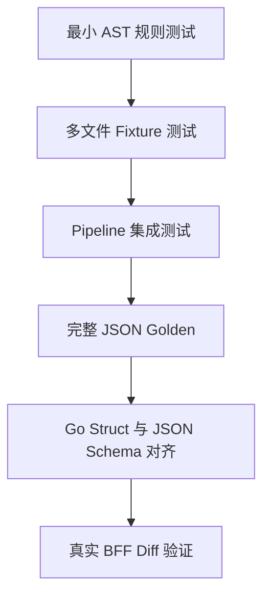

### 13.2 规则测试

每类规则至少包含正例和反例：

- Function、Method、Type、Var、Const Symbol。
- Call、Value、Type Reference。
- Package Alias、局部变量遮蔽和 Receiver 解析。
- Annotation Method/Path。
- Route、Group、Wrapper、Middleware 和跨函数 Group Flow。
- 接口注释与路由漂移、同一 Controller 方法多条注释、多条路由汇聚到同一条注释。
- 动态路由路径、无法解析的 Controller 方法。
- Diff 新增、修改、删除、EOF 删除和非法输入。
- Module require/replace、Import Usage 和忽略配置。
- IM SDK、Broadcast 双锚点、Payload/Event/Control。
- Generated gRPC Unary、Streaming、Receiver Binding 和歧义拒绝。
- 循环、菱形依赖、同一方法多条路由、稳定排序和去重。

### 13.3 Pipeline 与契约测试

必须验证：

1. CLI 到 JSON 的完整流程。
2. stdout 只包含 JSON，stderr 承载错误和可选 Timings。
3. 相同输入重复执行得到字节相同的 JSON。
4. `summary` 等于所有 Source 摘要的去重并集。
5. `endpointSourcesSummary` 能反查每个正式 Endpoint。
6. Endpoint 到 gRPC 与 gRPC 到 Endpoint 满足同一 Call Graph 关系。
7. Diff 传播、接口到 gRPC、gRPC 到接口三条路径共用同一份接口身份目录，产出的接口集合完全一致。
8. `endpointSourcesSummary` 的 File、Module 和 gRPC Chain 都从来源指向 Endpoint。
9. 同一接口的路由候选在跨 Controller 方法、变更根和来源合并后不丢失。
10. Go Struct、JSON Tag、Schema Required 和 Render 字段保持一致。
11. `endpoint-assets` 有独立 Schema，输出顺序可重复。
12. 用注册路径（含注释没覆盖到的那些）查 `endpoint-assets` 能命中，且 `endpoint` 回报的是所属的正式接口身份而非查询入参；完全未注册的路径仍以 `endpoint_not_found` 失败。
13. 瞬态 Change、Module Usage 和 Route Group Flow 不泄漏到 `facts` JSON。
14. 空集合使用 `[]`，可选 `moduleSources` 无内容时省略。
15. Golden Sample 能完整展示传播树和来源摘要。
16. 符号链接逃逸、超预算和取消都以稳定错误码失败，不产生部分 JSON。

### 13.4 真实 BFF 验证

| 项目                   | 重点                                                   |
| ---------------------- | ------------------------------------------------------ |
| `sl-sc1-admin-bff`   | Annotation、同方法多路由、Middleware、IM、Module Change |
| `sl-sc1-bff-service` | 跨函数 Group Flow、BFF gRPC Client、IM                 |
| `sl-sc2-admin-bff`   | 项目差异和零配置兼容性                                 |

每次真实验证保留：

- 基线分支、目标分支和 Diff 生成方式。
- 原始 Diff。
- 完整 JSON。
- 受影响 Endpoint 和 IM 数量。
- 每个关键 Endpoint 的来源链路。
- 人工确认的正确结果、误报、漏报和不支持写法。
- 各 Pipeline Stage Timings。

### 13.5 验收口径

| 维度           | 验收要求                                                          |
| -------------- | ----------------------------------------------------------------- |
| 支持语法正确性 | 支持矩阵中的正例必须命中，反例不得形成正式结论                    |
| 来源可解释性   | 每个正式 Endpoint 至少能反查一个 File、Module 或 gRPC 来源        |
| 路由语义       | 接口身份与路由候选按第 3.3 节规则输出                             |
| IM 精度        | 静态 Event 进入摘要，动态 Event 只进入未解析树节点                |
| gRPC 精度      | 只有接收者类型满足 Client 命名契约（见 10.1）且唯一确定才形成调用 |
| Module 精度    | Module 变化只从真实 Import Usage 进入传播                         |
| 删除能力       | 只输出删除块能够证明的 Route/Annotation，不补猜旧项目             |
| 契约稳定性     | 相同输入得到字节级稳定 JSON，Schema 与结构一致                    |
| 降级透明性     | 无法解析的事实有稳定 Diagnostic Code                              |
| 资源安全       | 取消、超时或预算超限明确失败，不输出被截断结果                    |
| 路径安全       | 词法路径和符号链接真实路径都不能逃逸项目根                        |
| 真实项目回归   | 已标注真实 Diff 样本的预期 Endpoint 集合保持稳定                  |

## 14. CLI 与集成

### 14.1 命令

| 命令                | 用途                                                                          |
| ------------------- | ----------------------------------------------------------------------------- |
| `impact`          | 输入 Diff 和/或完整 gRPC 接口名，输出 BFF HTTP/IM 影响                        |
| `endpoint-assets` | 查询 BFF Endpoint 依赖的上游 gRPC 接口                                        |
| `facts`           | 输出项目源码事实和 Diagnostic                                                 |
| `schema`          | 输出`facts`、`impact`、`endpoint-assets` 或 `grpc-impact` JSON Schema |
| `grpc-impact`     | 后端服务入站契约分析，使用独立技术方案                                        |

### 14.2 BFF Diff 分析

```bash
go-analyzer impact \
  --project <absolute-project-path> \
  --diff <absolute-diff-path> \
  --format json
```

带 Module 过滤配置：

```bash
go-analyzer impact \
  --project <absolute-project-path> \
  --diff <absolute-diff-path> \
  --impact-config <absolute-config-path> \
  --format json
```

### 14.3 gRPC 双向查询

Endpoint 到 gRPC：

```bash
go-analyzer endpoint-assets \
  --project <absolute-project-path> \
  --endpoint "GET /admin/api/bff-web/post/sale/:salesId/activity/winners"
```

gRPC 到 Endpoint：

```bash
go-analyzer impact \
  --project <absolute-project-path> \
  --grpc "/gopkg.inshopline.com.sc1.app.modules.medium.activity_user.proto.ActivityUserService/listWinnerBySalesId"
```

Diff 与 gRPC 来源合并：

```bash
go-analyzer impact \
  --project <absolute-project-path> \
  --diff <absolute-diff-path> \
  --grpc "/gopkg.inshopline.com.sc1.app.modules.medium.activity_user.proto.ActivityUserService/listWinnerBySalesId"
```

### 14.4 调试

```bash
go-analyzer facts \
  --project <absolute-project-path>

go-analyzer schema --type facts
go-analyzer schema --type impact
go-analyzer schema --type endpoint-assets

go-analyzer impact \
  --project <absolute-project-path> \
  --diff <absolute-diff-path> \
  --diagnostics-output <absolute-diagnostic-path> \
  --timings
```

### 14.5 Build Context

```bash
go-analyzer impact \
  --project <absolute-project-path> \
  --diff <absolute-diff-path> \
  --goos linux \
  --goarch amd64 \
  --tags "feature_new,enterprise" \
  --cgo false
```

调用方不传时使用 Go 环境默认值。

### 14.6 集成运行清单

Impact JSON 为了保持业务契约精简，不内嵌 Analyzer Version、Build Context 和 Git 身份。Nexus 或 CI 必须把以下运行清单与 JSON 一起保存：

| 字段                          | 用途                 |
| ----------------------------- | -------------------- |
| Analyzer Version 或二进制摘要 | 确定解析规则版本     |
| Project Commit                | 确定变更后源码快照   |
| Diff Base/Head 或 Diff 摘要   | 确定变化输入         |
| GOOS、GOARCH、Tags、cgo       | 重建条件编译文件集合 |
| Impact Config 摘要            | 重建 Module 过滤行为 |
| 命令类型和输入 Endpoint/gRPC  | 重建查询模式         |

缺少这份清单时，只能阅读影响结论，不能承诺跨环境复现字节相同的结果。

## 15. 交付里程碑

技术方案按可独立验收的能力拆分：

| 里程碑                 | 主要产物                                                       | 退出条件                                          |
| ---------------------- | -------------------------------------------------------------- | ------------------------------------------------- |
| M1 项目与事实底座      | Project Loader、AST Index、Fact Store、facts JSON              | 多文件声明、构建条件、稳定 ID 和 Schema 可验收    |
| M2 接口注释与路由      | 接口注释、Group、路由、中间件、关联、接口身份目录               | 三类查询共用接口身份并支持 BFF 典型注册模式       |
| M3 Diff 与传播         | Unified Diff、Change Map、Reverse Graph、Impact Tree           | Function/Type/DTO/Route 变化可到达 Endpoint       |
| M4 删除、Module 与 IM  | 删除 Route 恢复、go.mod Usage、IM Fact                         | 三类特殊来源可进入统一输出                        |
| M5 gRPC 双向查询       | Client 命名契约提取、GrpcCall、CallGraph、endpoint-assets Schema | Endpoint 与 gRPC 方法身份可以双向查询             |
| M6 输出与真实验证      | Golden、Schema、Source Summary、Smoke Script                   | 三个真实 BFF 完成标注样本验证                     |
| M7 工程化加固          | Diagnostic、Timings、稳定排序、路径安全、取消与资源预算        | CI 可重复运行，错误、降级和终止行为稳定           |

每个里程碑都必须同时交付：

- 领域 Fact。
- Extractor 或 Mapper。
- 查询关系。
- 对外 JSON 投影。
- Schema 对齐测试。
- 正例、反例和至少一个端到端 Fixture。

## 附录 A：主要关系词

| Relation                   | 含义                                        |
| -------------------------- | ------------------------------------------- |
| `call`                   | 父节点调用子节点，或影响反向传播中的 Caller |
| `type_ref`               | 上层声明使用下层 Type                       |
| `value_ref`              | 上层声明使用下层 Function/Var/Const 值      |
| `registered_handler`     | 路由注册了指定的 Controller 方法            |
| `route_dependency`       | Route 注册表达式依赖某个 Symbol             |
| `middleware_symbol`      | Middleware Binding 使用某个 Symbol          |
| `handler_annotation`     | Controller 方法关联到它的接口注释           |
| `annotation_endpoint`    | Endpoint 身份来自 Annotation                |
| `route_endpoint`         | 没有可用 Annotation，Endpoint 来自 Route    |
| `deleted_route_endpoint` | Endpoint 来自删除 Route 恢复                |
| `im_payload`             | 变化路径命中 IM Payload 依赖                |
| `im_event_value`         | 变化路径命中 IM Event 值依赖                |
| `im_control`             | 变化路径命中 IM 发送条件依赖                |
| `may_call`               | Endpoint 静态上可以到达 gRPC 调用           |

## 附录 B：核心术语

第 1、2 节使用“中文表述”列的说法，第 3 节起使用“术语”列，二者指同一个对象。术语首次出现的定义见第 0.1 节。

| 术语                     | 中文表述           | 含义                                                                          |
| ------------------------ | ------------------ | ----------------------------------------------------------------------------- |
| AST                      | 语法树             | Go 源码解析后的抽象语法树                                                     |
| Symbol                   | 代码声明           | Function、Method、Type、Package-level Var/Const 的声明身份                    |
| Fact                     | 静态事实           | 从源码、依赖或本次分析输入中得到的类型化静态数据                              |
| Store                    | 代码事实仓库       | 单次 Pipeline 内保存 Fact 的共享容器                                          |
| Extractor                | 事实提取器         | 从 AST 或 Generated Dependency 产生某类 Fact 的模块                           |
| Linker                   | 事实关联器         | 连接已经存在的 Fact 身份                                                      |
| ChangeFact               | 变更起点           | Diff 定位出的传播起点                                                         |
| ReferenceFact            | 引用关系           | Symbol 之间的 Call、Value 或 Type 依赖                                        |
| Reverse Graph            | 反向引用索引       | 从被依赖 Symbol 反查引用者的索引                                              |
| Route Graph              | 路由索引           | 从 Controller 方法、Group 或中间件查到路由与接口注释的索引                     |
| Call Graph               | 调用索引           | Caller 与 Callee 之间的可执行调用索引                                         |
| IM Graph                 | IM 索引            | 从 Sender 查到 IM Event 及其依赖的索引                                        |
| EndpointCatalog          | 接口身份目录       | 统一注释优先、无注释才路由兜底、Controller 方法与路由候选的只读视图            |
| Handler                  | Controller 方法    | 被路由注册、真正处理请求的那个函数或方法。正文统一称“Controller 方法”；`handler` 只作为 JSON 输出字段名和关系名保留，两者指同一个对象 |
| Annotation               | 接口注释           | Controller 方法注释中声明的 HTTP 请求方法和路径                                |
| Route                    | 路由注册           | `GET`、`POST` 等静态路由注册                                              |
| Endpoint                 | HTTP 接口          | 规范化的 HTTP Method 和 Path                                                  |
| IM Event                 | 出站 IM 事件       | BFF 主动发送给前端或消息通道的事件名                                          |
| gRPC 方法身份            | gRPC 方法身份      | `<生成包 import 路径>.<Service>/<GoMethod>` 形式的身份，全部来自本项目源码，不读生成代码 |
| Client 命名契约          | Client 命名契约    | protoc-gen-go-grpc 的生成规则：client 接口必为 `<Service>Client`，且不与消费它的代码同包声明；分析器据此判定调用点，不需要 Catalog。为排除同样以 `Client` 结尾的手写业务 client（Redis/HTTP 封装等），额外要求类型来自 `gopkg.inshopline.com/` 域名下、且不属于被分析项目自己的 module（见 10.1） |
| Module                   | 依赖模块           | go.mod 中声明的一项 Go 依赖                                                   |
| Resolved                 | 已确定             | 静态证据能够唯一确定                                                          |
| Unresolved               | 未确定             | 只能保留原始表达式，不能确定运行时值                                          |
| Diagnostic               | 诊断               | 不阻断其它可用分析、但需要保留的解析问题                                      |
| Golden                   | 黄金样本           | 用完整预期 JSON 验证输出契约的测试样本                                        |
