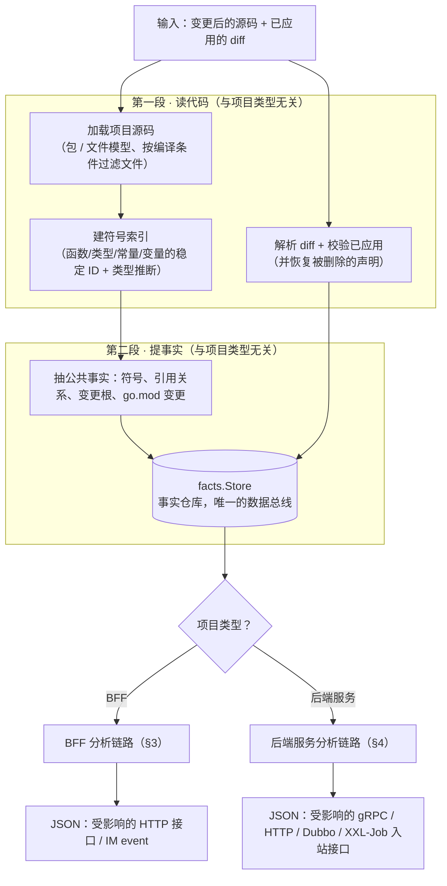
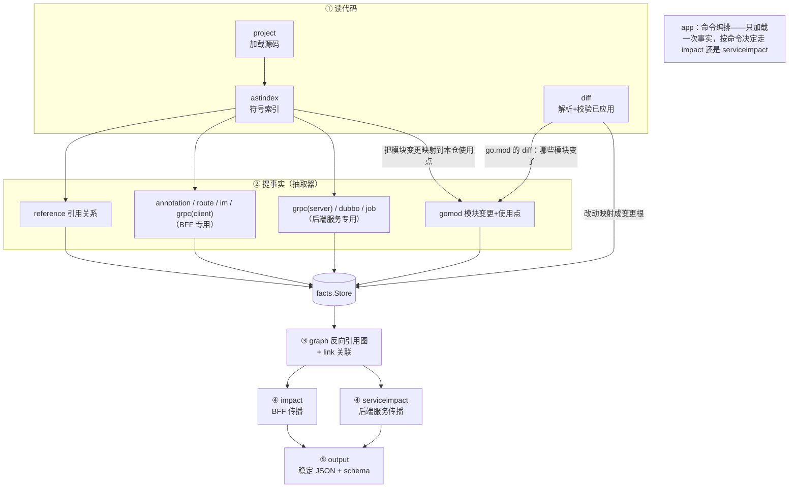
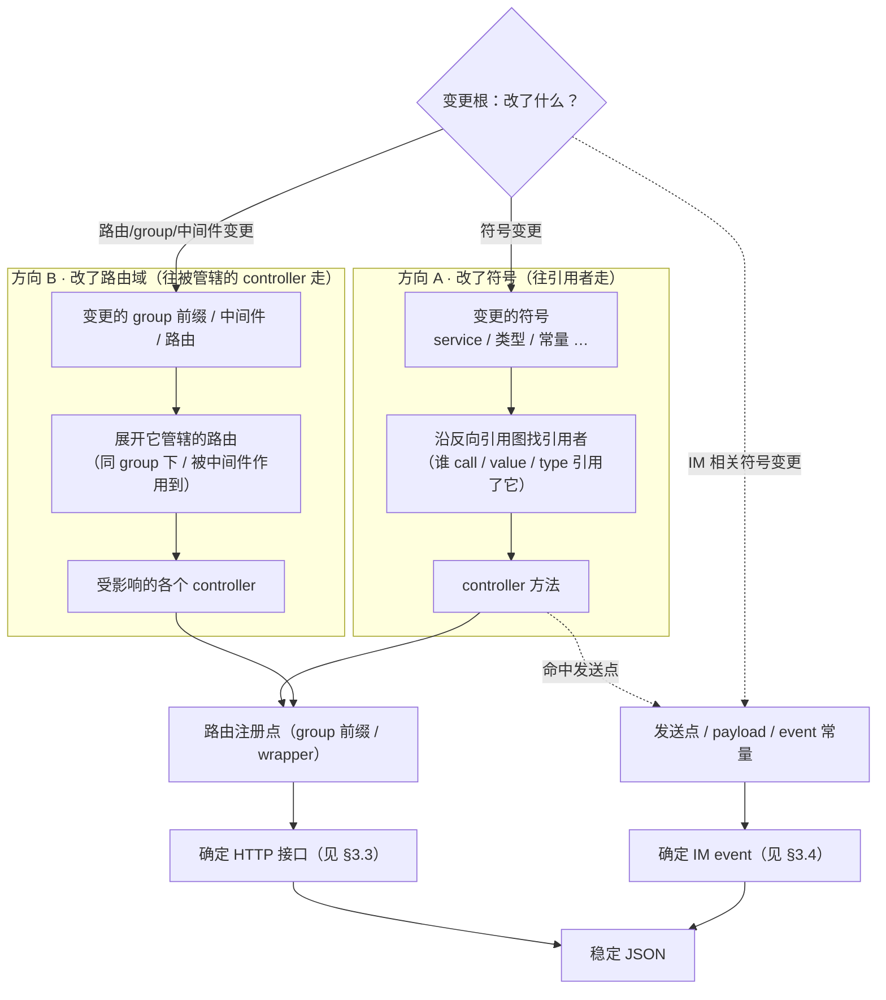
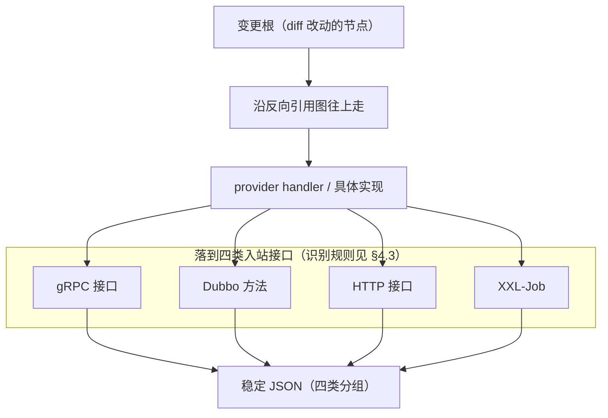

# Go 服务影响范围分析能力 · 技术方案

## 1. 背景与要解决的问题

前端 `React + TypeScript` 项目已经验证过一套影响范围分析模型：

```text
代码 diff → 找出变更的语义节点 → 沿依赖往上传播 → 落到业务入口
```

它回答的是"这次改动会影响哪些入口、要回归哪些范围"。现在要把同一套方法用到 **Go 服务**上。

**现在的痛点**：改完一段 Go 代码，没人说得准它挂在哪几个对外接口下面。于是要么凭经验猜（容易漏测），要么保守地全量回归（成本高）。我们要做的是一个**只根据代码里能证明的事实**来回答问题、不猜运行时行为的分析器。

它面向**单个 Go 服务项目**，处理两类项目、回答两个不同的问题：

| 项目类型                                  | 要回答的问题                                                                                            | 分析结果                      |
| ----------------------------------------- | ------------------------------------------------------------------------------------------------------- | ----------------------------- |
| **BFF 项目**                        | 这次 diff（或某个上游 gRPC 接口）会影响哪些**对外 HTTP 接口**和**主动推给前端的 IM 消息**？ | HTTP 接口 / IM event          |
| **后端服务项目**（sc1-server 这类） | 这次 diff 会影响哪些**对外暴露的入站接口**？                                                      | gRPC / HTTP / Dubbo / XXL-Job |

这两类项目除了共用底层的"读代码、建索引"能力，分析逻辑完全分开，互不影响。文档 §2 讲公共底座，§3 讲 BFF 怎么走，§4 讲后端服务怎么走。

### 目标项目

- BFF：`sl-sc1-admin-bff`、`sl-sc1-bff-service`、`sl-sc2-admin-bff`
- 后端服务：`sc1-server`、`sc2-server` 这类 gRPC / Dubbo 服务端

它们大致都是 `router → controller → service → remote` 的分层，用 `lego.RouterGroup`（类似 Gin）注册路由，但前缀写法、wrapper、中间件各仓不一样。所以分析器不能为某一个仓写死规则，要能识别这一类项目的通用写法。

### 设计原则

1. **只报能证明的关系**。反射、运行时注入、外部 SDK 内部调用、动态路由这些静态看不透的，一律不猜；看不透的地方降级成诊断或"未解析"标记，不混进结论。
2. **事实优先（facts-first）**。抽取层只负责从代码里提取事实，图和查询层只读事实，输出层只做稳定的格式投影。三层之间只通过一个共享的事实仓库 `facts.Store` 传数据。
3. **输出稳定可回归**。对外 JSON 有 schema 约束，结论和诊断信息分开放。
4. **业务方零配置**。路由 / 注解 / 中间件的写法由分析器内置识别，不需要业务方写语法配置。
5. **宁缺毋滥**。少报一个不确定的关系，也不要报一个"看着对其实错"的结论。

---

## 2. 公共底座（两类项目共用）

### 2.1 整体怎么跑

一句话：**先把源码变成"可查询的事实"，再按项目类型分成两条独立的分析链路各自出结果**。分三段：

- **第一段 · 读代码**：加载项目源码，建立符号索引，同时解析 diff 并校验它确实已经打到当前源码上。
- **第二段 · 提事实**：把符号、引用关系、被 diff 改动的节点等，统一抽成事实存进 `facts.Store`。这一段和项目类型无关。
- **第三段 · 分链路出结果**：从事实仓库开始，按项目是 BFF 还是后端服务，走两条完全独立的链路，各自产出稳定 JSON。



**分叉之后两条链路不共用任何东西**（各自的抽取器、传播图、输出格式都独立），只共同读第二段产出的那份事实。

### 2.2 依赖分析：怎么把一处改动追到对外接口

这是底座里最关键的一个设计点，两条链路都靠它。核心就是做**依赖分析**——建一张"谁用了谁"的引用关系图，从改动的地方顺着这张图往上找，直到找到对外接口。

为什么不能只看"函数调用"？Go 服务里，controller 常常**不是被调用的，而是被当成一个值传进注册函数**。比如：

```go
broadcastGroup.GET(
    "/record",
    sa2.ControllerWithReqResp(broadcast.BroadcastAdminApi.QueryBroadcastRecord),
)
```

这里 `QueryBroadcastRecord` 没有被"调用"，它是作为**函数值**传给了 `GET`。如果只记"函数调用"关系，就追不到这种"被当值传参"的注册关系。

所以我们记录的引用关系覆盖**三种**，比只看调用更全：

| 引用关系 | 代码长什么样 | 例子 | 为什么要记 |
| --- | --- | --- | --- |
| `call`（调用） | 被调用 | `QueryBroadcastRecord()` | 常规调用依赖 |
| `value`（取值） | 被当值 / 函数值引用（含传参、赋值） | `GET("/x", ...QueryBroadcastRecord)` | controller 被注册函数当值传走，靠它才追得到路由 |
| `type`（类型） | 被当类型用（参数、返回值、字段、组合字面量、泛型参数） | `func(...) *OrderResp` 引用了 `OrderResp` | **改了 struct/类型会真实影响接口的出入参**，必须追 |

第三种（类型）值得单独强调：如果改了一个 struct 或类型——比如给 `OrderResp` 加个字段、改个 tag——它本身不是函数，但它被某个 controller 当**返回值/请求体**用了，这次改动就实打实影响了那个接口的响应结构。所以类型改动也要沿"谁把它当类型用了"这条关系往上追，一直追到把它当出入参的 controller，落到接口。

一句话：一个 service 方法改了、或一个 struct 改了，都能顺着"谁用了它"一路往上——追到 controller，再追到路由注册那一行，最后落到对外接口。

两条链路都从**变更根**（diff 改动映射出的起点）出发，沿这张图遍历，区别在**终点不同**——也在**遍历方向不同**（见 §3.2 的两个方向）。

### 2.3 diff 必须已经应用到当前源码（不是改动前的旧代码）

两条链路的 `--diff` 都要求：**`--project` 指向的源码，必须是这份 diff 应用之后的版本**（也就是"改动后"的代码，不是改动前）。因为分析要靠 diff 里的行号去源码里定位改了哪个函数/类型，如果源码还是旧的、或根本没打这个 diff，行号就对不上，会定位到错误的位置、算出一个"看着有效其实是错的"结论。所以底座会先校验：diff 过期、为空、路径越界、或改动的文件有语法错误，一律直接报错退出，不带病往下算。

**被删除声明的恢复（重点）。** 有一类改动很特殊：**删掉一个接口**。删除后，源码里已经没有这个函数了——它不在当前代码里，正常遍历根本碰不到它，这次删除就会被漏掉。为此底座会从 diff 的**删除块**（`-` 开头的行）里，把被删掉的那段声明**重建出来**（单行、多行都支持），当成一个"曾经存在、现在被删"的节点放回分析。这样"这个 controller/路由被删了 → 对应的 HTTP 接口下线了"才能作为一条影响被传播出来，而不是无声消失。输出里这类会用带 `deleted_` 前缀的关系标出来，让调用方知道是删除影响。

### 2.4 整体架构分层（模块怎么串起来）

这一节就是整个项目的**架构分层**：数据自上而下流经四层——**读代码 → 提事实 → 建图/关联 → 分链路传播 → 输出**，`facts.Store` 是中间的总线，之后按项目类型分到两个传播模块。



> **关于 gomod 的两个输入**（容易混淆）：模块**"哪些变了"**来自 **go.mod 的 diff**（新增/删除的 require/replace 行），不是从符号索引里推的；`gomod` 再用项目源码 + 符号索引把这些模块变更**映射到本仓的使用点**（哪些文件 import 了它），才能继续往接口传播。所以它同时吃"diff"（变更）和"项目索引"（使用点）两个输入。

各模块职责与产出：

| 模块                  | 做什么                                                                                          | 产出什么                       |
| --------------------- | ----------------------------------------------------------------------------------------------- | ------------------------------ |
| `project`           | 加载项目，建立包 / 文件模型，按编译条件（GOOS/tags 等）过滤掉不参与编译的文件                   | 可遍历的项目源码模型           |
| `astindex`          | 给每个声明（函数/方法/类型/常量/变量）建稳定 ID，做类型和值类型推断                             | 符号索引，供引用解析用         |
| `diff`              | 解析 unified diff，校验它确实已应用，恢复被删声明                                               | 变更块、被删声明               |
| `facts`             | 定义所有事实类型、事实仓库`facts.Store`、置信度模型                                           | 事实的存取接口（数据总线）     |
| `extract/reference` | 扫描项目内的调用 / 类型引用 / 取值引用                                                          | "谁引用了谁"的引用事实         |
| `extract/gomod`     | 解析 go.mod 的 require/replace 变更，定位到本仓的使用点                                         | 模块变更 → 本仓使用点的关联   |
| `graph`             | 用引用事实建反向引用图，并保证遍历顺序稳定（结果可回归）                                        | 可从变更根往上走的传播图       |
| `diagnostics`       | 记录抽取失败或降级（比如某个非变更文件解析不了）                                                | 诊断项（不进结论，走调试通道） |
| `config`            | 解析可选的模块变更过滤配置，字段严格校验                                                        | 过滤规则                       |
| `app`               | 命令编排：只加载一次事实，按命令决定走哪条链路                                                  | 对外命令的执行入口             |
| `output`            | 把链路结果投影成稳定 JSON，并能导出 JSON Schema                                                 | 对外 JSON + schema             |
| （BFF 专用）          | `annotation` / `route` / `im` / `grpc`(client) / `link` / `impact` / `dependency` | 见 §3                         |
| （后端服务专用）      | `route`+`link` / `grpc`(server) / `dubbo` / `job` / `serviceimpact`                 | 见 §4                         |

**一条硬约束**：任何模块都不能直接去读另一个抽取器的内部 AST 状态，跨模块只能通过 `facts.Store` 交换数据。这样加新能力时不会牵一发动全身。

### 2.5 事实与置信度

事实仓库里的主要事实（公共部分）：`SymbolFact`（声明身份）、`ReferenceFact`（引用关系）、`ChangeFact`（diff 映射出的变更根）。BFF 和后端服务各自还有专属事实，分别在 §3、§4 讲。

每条传播关系带一个**置信度**：`high / medium / low`。规则是**取最弱一环**——一条链路上任何一跳是 low，整条就是 low。反查一个接口"会不会被这次改动影响到"时，要看**所有能到它的路径**里最弱的那条，而不是只看最短的一条，否则会把置信度算高。置信度是给调用方排回归优先级用的。

---

## 3. BFF 分析链路

### 3.1 这条链路回答什么

算出：**受影响的对外 HTTP 接口** + **受影响的出站 IM event**。它接受两种输入，可单独给、也可一起给：

- **一份 BFF 的 diff**：分析这次代码改动影响了哪些接口 / IM event。
- **一个上游 gRPC 接口**（canonical 完整方法名）：反查当前 BFF 里哪些接口用到了它——这是一等输入，专门支持"上游 gRPC 改了，下游 BFF 哪些接口受影响"的场景。

具体参数：

- 输入：`--project`（绝对路径）+ 至少一个 `--diff`（已应用）或 `--grpc`（完整方法名），两者可以一起给。
- 输出：一份 JSON。顶层 `summary` 汇总受影响的接口和 IM event；`fileSources[]` 保留每个变更文件的原始 diff 和从它出发的完整传播树；如果改了 go.mod，还有 `moduleSources[]`。

### 3.2 流程：两个传播方向

变更根不是只有一种，"改了什么"决定往哪个方向传播。分析器按变更类型分派成**两个方向**（对应上游 gRPC 反查是第三个入口）：

- **方向 A —— 改了符号**（service / controller / 类型 / 常量 / 变量）：从这个符号出发，沿反向引用图往"**谁引用了我**"的方向走，一路追到注册它的路由，落到接口。
- **方向 B —— 改了路由域**（group 前缀 / 中间件 / 路由本身）：从这个 group / 中间件 / 路由出发，往"**我管辖了哪些 controller**"的方向展开（同 group 下的路由、被这个中间件作用到的路由），对每个受影响 controller 落到接口。

> **中间件本质上就是个普通函数/方法，那怎么确定它是"中间件"、要走方向 B？** 分析器不靠命名去猜。在 route 抽取阶段，`group.Use(Auth)` 这种挂载会被记成一条**中间件绑定**，link 阶段再把 `Auth` 解析成它对应的具体符号。所以判定依据是：**这个符号是不是某条 `.Use()` 绑定的目标**。当改动的符号命中某条中间件绑定时，就触发方向 B 的扩散（扩到该 group 下受它作用的 controller）；同时它也还是个符号，方向 A 的常规引用传播照常进行——两者叠加，不冲突。



> IM 传播本质上属于方向 A 的一个分支：payload / event 常量 / 发送控制逻辑是符号，改了之后同样沿反向引用图往上走，只是终点是 IM event 而不是 HTTP 接口（见 §3.4）。

### 3.3 传播的终点（一）：HTTP 接口的路径以谁为准

这是本链路最需要说清楚的地方。一个 controller 身上可能有**两处**路径信息：

1. **controller 注解**：开发者在注释里显式写的，比如
   ```go
   // @Get /admin/api/bff-web/mc/broadcast/record
   func (api *adminBroadcastApi) QueryBroadcastRecord(...) {}
   ```
2. **路由注册**：`g.GET("/record", controller)` 这行，加上它所在 group 的前缀拼出来的路径。

**策略是"注解优先（annotation-first）"，判定顺序如下：**

| 情况                                    | 接口路径以谁为准                                                                                                                        |
| --------------------------------------- | --------------------------------------------------------------------------------------------------------------------------------------- |
| controller 有注解                          | **以注解的 method + path 为准**（正式结论）。路由解析出的路径作为辅助证据放进同级 `routes[]` 一起输出，但**不覆盖**注解。 |
| controller 没有注解                        | 用路由解析出的 method + path 兜底。                                                                                                     |
| 同一 controller 注册在多个 URL（别名路由） | 见下方"别名"。                                                                                                                          |

**为什么以注解为准？** BFF 的路由前缀可能来自常量、helper 函数参数、wrapper、跨函数传递的 group——纯靠 AST 把这些拼起来，很容易拼出一个"看着精确其实错"的路径。注解是开发者显式声明的，更可信。但注解也可能和实际注册**漂移**（对不上），所以路由解析出的路径也一并放进 `routes[]`，让这种漂移对调用方可见，而不是藏起来。

```json
{
  "method": "POST",
  "path": "/admin/api/bff-web/orders",   // 正式结论，来自注解
  "routes": [{ "method": "POST", "path": "/api/bff-web/orders" }]  // 辅助证据，来自路由
}
```

**别名路由（重点，会输出两条）**：同一个 controller 有时注册在多个不同 URL（新老路径并存），其中只有一个对得上注解。**这时两条路径都会作为独立接口输出**，不会因为注解只写了一个就把另一个吞掉。

判定规则：如果某条路由自己的 method+path 不匹配任何注解，**且**这个 controller 的注解已经被它的其它路由全部认领了，就判定这条是"别名"，用它**自己的 method/path** 单独作为一个接口输出。这样挂在别名路径上的中间件 / group 改动才不会被漏报。判定必须严格要求"注解全被别的路由认领"——否则会误伤"单路由 + 注解漂移"的正常情况（那种情况应保留注解身份）。

举个具体例子。controller `GetCustomer` 注解写的是新路径，同时注册了新旧两条：

```go
// @Get /admin/api/bff-web/mc/customer/:customerId   ← 注解只写了新路径
func (api *customerApi) GetCustomer(...) {}

adminGroup.GET("/admin/api/bff-web/mc/customer/:customerId", ...GetCustomer)  // 路由1：对得上注解
ucGroup.GET("/uc/customers/:customerId",                     ...GetCustomer)  // 路由2：旧别名，对不上注解
```

改动命中 `GetCustomer` 后，输出**两个**受影响接口：

```json
[
  {
    "method": "GET",
    "path": "/admin/api/bff-web/mc/customer/:customerId",   // 路由1 → 注解身份（annotation-first）
    "relation": "handler_annotation"
  },
  {
    "method": "GET",
    "path": "/uc/customers/:customerId",                    // 路由2 → 别名，用自己的路径
    "relation": "route_endpoint"
  }
]
```

**两个方向的典型传播路径（对应 §3.2 的方向 A / B）：**

```text
方向 A（改符号）：
  service 方法改了      → 引用它的 controller → 注册它的路由 → 该 controller 的注解 → HTTP 接口
  controller 改了       → 注册它的路由 → 注解 → HTTP 接口

方向 B（改路由域）：
  group 前缀改了        → 这个 group 下管辖的所有 controller → 各自的注解 → 各自的 HTTP 接口
  group.Use(中间件) 改了 → 该 group 后续注册的 controller → 各自的注解
  中间件函数体改了       → 它被挂载的位置 → 受该中间件作用的 controller → 各自的注解
```

### 3.4 传播的终点（二）：IM event 怎么确定

BFF 会主动往前端推 IM 消息，这也是要回归的对象。识别分两步：**先判断"这里确实是一次对外广播发送"，再确定 event 名**。

**第一步：怎么判断是一次广播发送。** 有两种发送写法，对应两种识别方式：

**方式一 · 协议型（业务自己按协议拼 HTTP 发广播）**——识别依据是代码里**同时**出现两个字面量锚点：scheme `broadcast://` 和 endpoint `/broadcast/send`。两个都在才算数（只出现一个不算），这样能避免把普通 HTTP 请求误判成广播。

```go
// 业务自己拼一个广播请求：两个锚点都在 → 判定为一次广播发送
url := "broadcast://im" + "/broadcast/send"
httpClient.Post(url, buildPayload("POST", "LOCK_INVENTORY_UPDATE", body))
```

**方式二 · SDK 型（调用公共 IM SDK）**——识别依据是**精确的 import path + 精确的函数名**：import 必须正好是 `gopkg.inshopline.com/sc1/commons/utils/bus/notify/im`，函数名在内置清单里（`SendIm` / `SendImAsync` / `SendImToUid` / `SendImToUidAsync`）。命中后，按该函数固定的参数布局取值——这几个函数都是 **event 在第 3 个参数、payload 在第 4 个参数**。

```go
import im "gopkg.inshopline.com/sc1/commons/utils/bus/notify/im"

// 精确 import + 函数名命中 → event 取第3参、payload 取第4参
im.SendIm(ctx, uid, eventName, payload)
//                 └ event    └ payload
```

> 如果 SDK 函数被调用但实参数量对不上（比如少传了）——不静默放过，而是记一条诊断（`IMSDKArgumentMismatch`），说明这次发送没被分析，避免"以为分析到了其实没有"。

**第二步：确定 event 名。** event 名由 channel + event 常量静态拼出来，比如 channel=`POST`、常量=`LOCK_INVENTORY_UPDATE`，拼成 `POST/LOCK_INVENTORY_UPDATE`。当发送分支来自 if/else 等条件时，会沿条件把可能的取值都传播出来，并正确处理分隔符（channel 为空时不加分隔符）。

**传播**：payload 类型 / event 常量 / 发送控制逻辑改了 → 沿本仓调用链往上传播（用不动点迭代，直到不再有新变化）→ 落到具体的 event 字符串。

**拼不出确定字符串的**（动态拼接的 event）→ 标成 `im_event_unresolved` 保留在传播树里，但**不计入** IM 数量统计，避免误报。输出只保留能静态确定的 event 字符串，不含 appId / mode / payload。

### 3.5 附带能力：BFF ↔ gRPC 依赖查询

这是独立于 diff 传播的查询能力。

**关键问题：一个调用 `x.GetOrder(...)` 长得和普通方法调用一模一样，怎么认出它是一次 gRPC 调用？** 靠的不是名字猜测，而是"生成代码建表 + 类型比对"两步：

**第一步 · 建表（扫描 protobuf 生成的 client 代码）**。protobuf 生成的 gRPC client，每个方法体里都有一句规范的传输调用，第一个参数就是完整方法名字符串：

```go
// 依赖里 protobuf 生成的 client（不是业务手写的）
func (c *orderServiceClient) GetOrder(ctx, in, ...) (*Order, error) {
    out := new(Order)
    err := c.cc.Invoke(ctx, "/order.OrderService/GetOrder", in, out, ...)  // ← 规范传输调用，藏着完整方法名
    ...
}
```

分析器扫遍这些生成代码，得到一张**内部映射表**（就是一个 map，只在分析期用、不落盘），key 是"哪个包的哪个 client 类型的哪个方法"，value 是它对应的完整 gRPC 方法名。大致长这样：

```text
key（包 + client 类型 + Go 方法）                              →  value（canonical 完整方法名）
────────────────────────────────────────────────────────────    ──────────────────────────────────
(order/pb, orderServiceClient, GetOrder)                       →  /order.OrderService/GetOrder
(order/pb, orderServiceClient, ListOrders)                     →  /order.OrderService/ListOrders
(user/pb,  userServiceClient,  GetUser)                        →  /user.UserService/GetUser
```

如果某个生成方法用了 `Invoke` 但没有暴露规范的 protobuf 方法名（有些 SDK 只把 Invoke 当内部传输用），就不入表——不满足契约就不认。

**第二步 · 比对（在 BFF 代码里查这张表）**。BFF 里一个调用 `x.GetOrder(...)`，只有当 `x` 的**静态类型**正好是表里那个生成 client 类型、方法名也在表里，才判定为 gRPC 调用，并绑定到对应的 `/order.OrderService/GetOrder`。普通函数调用的 receiver 类型查不到这张表 → 自动被排除。

所以一条 BFF → gRPC 关系必须**同时**满足三点才输出：生成代码证明了这个 operation（第一步入表）、调用的 receiver 类型能静态确定且命中表（第二步）、项目内有一条能走通的调用链。gRPC 接口的身份**只认**完整方法名 `/package.Service/Method`，不靠 Go 方法名、变量名、目录名去猜；不穿透外部 SDK 内部，不跨 BFF 仓聚合。

两个方向：

- `bff-impact --grpc /pkg.Svc/Method`：给一个上游 gRPC 接口，反查当前 BFF 里哪些 endpoint 用到了它（可和 `--diff` 合并成一份 JSON）。
- `endpoint-assets --endpoint "GET /orders/:id"`：给一个精确 endpoint，查它下游依赖哪些 gRPC 接口。

### 3.6 配置与输出

- **配置**（可选）：`--impact-config`，不给时会自动读项目里的 `.analyzer/go-impact.config.json`。目前只开放**模块版本变更的过滤**（比如忽略某些 proto 模块的版本号变动），不开放路由/注解/中间件的语法配置。配置字段严格校验，写错或用旧格式直接报错。
  ```json
  { "analyzeModuleChanges": true, "ignoredModuleChanges": ["gopkg.inshopline.com/sc1/app/modules/*/proto"] }
  ```
- **输出**：稳定 JSON，有 schema 约束。**结论里不含诊断信息**（保证接入方拿到的结构稳定），诊断走单独的调试命令看。

### 3.7 这条链路能识别的范围

diff 语义化（函数/方法/变量/常量/类型/struct 字段与 tag 的改动）、这些声明的反向引用传播、controller 注解识别、路由 / group / 中间件 / wrapper 的传播、codegen 模板生成的路由、被删路由的恢复、go.mod 变更到本仓使用点再到接口的传播、出站 IM event 传播、BFF ↔ gRPC 依赖双向查询。

---

## 4. 后端服务分析链路

### 4.1 这条链路回答什么

给一份后端服务的 diff，算出**受影响的对外入站接口**，按 `grpc` / `dubbo` / `http` / `job` 四类分组。

- 输入：`--project`（绝对路径）+ `--diff`（已应用）+ 可选 `--impact-config`。
- 输出：一份 JSON，固定按四类分组。这条链路**只分析当前这一个服务仓**，不查 BFF；跨仓串联是外部编排层的事。

### 4.2 流程



### 4.3 什么算一个"入站接口"——四类注册的识别规则

这是本链路的核心。分析器要能从代码里**认出**每一类注册，才能把改动落到具体接口上。规则如下：

**① gRPC 接口**

名字规则只用来**找到**注册入口，接口身份是**解析描述符**得到的，不是从名字猜的。分两步：

- **靠命名规则找到注册函数**：protobuf 生成的服务端注册函数形如 `RegisterOrderServiceServer`（`Register` 开头、`Server` 结尾、无 receiver）。这一步只是定位，不产生结论。
- **解析 `Xxx_ServiceDesc` 描述符拿真实身份**：找到注册函数后，去读它对应的 `OrderService_ServiceDesc` 变量——里面写着真实的 protobuf service 名和方法列表，据此得到每个方法的完整名 `/order.OrderService/GetOrder`。**身份来自描述符内容，不是把 Go 函数名当身份。**

```go
// 生成代码：描述符里才是真实的 service / method 名
var OrderService_ServiceDesc = grpc.ServiceDesc{
    ServiceName: "order.OrderService",              // ← 真实 service 名
    Methods:     []grpc.MethodDesc{{MethodName: "GetOrder"}, ...},  // ← 真实方法名
}
func RegisterOrderServiceServer(s grpc.ServiceRegistrar, srv OrderServiceServer) { ... }
//                                                        └ 注册时传入的具体实现 = handler
```

- 还要求：这个 server 接口有**唯一能证明的具体实现**（就是注册时传进去的那个 `srv`）。多实现且无法确定唯一的，不硬绑（记为待确认，不误报）。
- 接口身份：`/package.Service/Method`（来自描述符）。

**② Dubbo 方法**

- 依据：同一个导出函数里，**同时**出现 `ServiceConfig` 字面量和 `.SetProviderService(具体实现)` 调用。
- 配对：一个函数里可能有多组，按**源码顺序**把第 i 个 config 和它之后第一个还没被占用的 `SetProviderService` 配起来（这样分组写法 `config;config;call;call` 和交错写法 `config;call;config;call` 都不会配错、不重复）。
- 方法范围：`ServiceConfig` 没写 `Methods` 的（service 级导出）→ 展开该实现类型的**全部公开方法**；写了 `Methods` 的 → 只取列出的方法。
- 接口身份：Dubbo interface + method。

**③ HTTP 接口**

- 依据：服务端自己用路由语法（`g.GET / g.POST ...`）注册的入站接口，路径解析方式和 BFF 的路由一样（本地路径 + group 前缀拼接）。
- 接口身份：拼接后的 method + path。

**④ XXL-Job**

- 依据：在一个"注册函数"里往 map 塞 handler——通过函数的参数/返回值类型能证明这个 map 的 value 是 `jobx` / `xxljob` 包里的 `JobListener` / `TaskFunc` 类型。
- 取值：map 的 key（字符串字面量）= job 名，value = handler。
- 接口身份：job 名。

**四类共同的前提**：注册点必须是"活的"——注册函数确实在项目里被接线调用到，孤立的注册不计入。

### 4.4 传播与置信度

从变更根沿反向引用图往上走，走到 provider handler / 具体实现，就命中它对应的入站接口。置信度沿用底座的"最弱一环"规则：同一个接口被多条路径命中时，保留最保守（最弱）的那条，避免一条弱证据的改动经过一跳强边就被当成高置信结论。

### 4.5 输出

稳定 JSON，有 schema 约束，四类分组顺序固定（方便和回归基线对齐）。这条链路和 BFF 的输出结构完全独立，不共用。

### 4.6 这条链路能识别的范围

diff 语义化 + 反向引用传播（复用底座）、gRPC 服务端接口、Dubbo provider（含源码顺序配对）、XXL-Job、服务端 HTTP 入站接口，四类分组稳定 JSON。（Pulsar / IM 入站暂不覆盖，见 §6。）

---

## 5. 对外命令面（并入 Nexus）

这套能力将作为一项**独立能力并入 Nexus**（面向 coding agent 的 Go 工具链 CLI，`gopkg.inshopline.com/bff/nexus/v2`，`go install ...@next`），对外统一提供。

> **集成方式（明确约束）**：作为**自包含的独立能力**并入，**不复用 Nexus 已有的任何能力**（不共享 `bff` / `doc` 的解析器、模型或数据层）。做法是在 Nexus 下**新增一个 `go-analyzer` 命令族**，把本能力整包引入，命令层只做参数转发。将来若 `ts-analyzer` 也并入，就是平级再加一个 `ts-analyzer` 族，两者互不影响。

命令面：

```text
# BFF
nexus go-analyzer bff-impact       --project <绝对路径> [--diff <绝对路径>] [--grpc </pkg.Svc/Method>]... [--impact-config <绝对路径>]
nexus go-analyzer endpoint-assets  --project <绝对路径>  --endpoint "METHOD /path"...
# 后端服务
nexus go-analyzer grpc-impact      --project <绝对路径>  --diff <绝对路径>  [--impact-config <绝对路径>]
# 调试
nexus go-analyzer facts            --project <绝对路径>
nexus go-analyzer schema           --type bff-impact|grpc-impact|facts

# 将来的 ts-analyzer（示意，不在本方案范围）
# nexus ts-analyzer <...>
```

约定：

- 路径参数都要求**绝对路径**；`bff-impact` 至少给一个 `--diff` 或 `--grpc`；`--diff` 必须已应用到源码。
- 结论 JSON 走 stdout（agent 可直接 pipe），可选 `--out-dir` 按 `~/.local/nexus-ai/go-analyzer/<子命令>/<id>/` 落盘（结论和诊断分开放），对齐 Nexus 的产物布局。
- 复用 Nexus 的外壳约定（`-h` 探索、版本对齐脚本、issue 上报）——这些是 CLI 通用外壳，不算"复用已有能力"。
- 只依赖 Go 标准库，Go 1.24+。

**与 Nexus 的接触面只有两处**：命令注册点、CLI 外壳约定。除此之外和 `bff` / `doc` 零耦合，各自独立演进。

---

## 6. 后续可以继续支持的方向

以下能力现在不在覆盖范围内，属于代码里静态证明不了、或需要跨仓/额外输入的场景。等有需要时再按同一套事实模型往上加，不需要推翻现有结构：

- **前端页面影响**：把本工具输出的 HTTP 接口喂给 `ts-analyzer`，串起"后端改动 → 前端页面"。
- **跨仓传播**：上游服务 → BFF → 前端的自动串联（现在每个仓单独跑，跨仓交给外部编排）。
- **后端服务的 Pulsar / IM 入站**。
- **多实现接口分发、复杂反射 / DI 的精确分析**。
- **面向 QA 的自然语言回归报告**。

---

## 7. 风险与权衡

| 风险                            | 说明                                | 怎么应对                                                         |
| ------------------------------- | ----------------------------------- | ---------------------------------------------------------------- |
| 静态分析看不透动态路由 / 反射   | Go 服务有 wrapper / DI / 反射       | 看不透的降级成诊断或"未解析"，不进结论                           |
| 注解和实际路由对不上（BFF）     | 注解漂移                            | 注解优先出结论，同时把路由路径放进`routes[]`，漂移对调用方可见 |
| 别名路由漏报中间件影响（BFF）   | 同 controller 多 URL，只有一个匹配注解 | 严格判定别名后单独输出，不漏挂在别名上的中间件改动               |
| Dubbo provider 配错（后端服务） | 一个函数里多组 config / 实现        | 按源码顺序配对、标记已占用，防止抢占和重复                       |
| 置信度算高                      | 只看最短路径会漏掉弱环              | 看所有路径取最弱一环                                             |
| 跨仓需求                        | 上游 → BFF → 前端                 | 单仓分析 + 外部编排，预留 HTTP / gRPC 桥接输出                   |

---

## 8. 评审重点

1. **架构分叉**（公共底座 + 两条独立链路）是否清晰，是否满足"两类项目互不耦合"。
2. **BFF 的接口路径策略**（注解优先 + 路由作辅助证据 + 别名判定）是否覆盖真实注册写法。
3. **后端服务四类注册的识别规则**（§4.3）是否准确、有没有漏掉的注册形态。
4. **IM 识别锚点**（协议型双锚点 / SDK 型签名）是否够用。
5. **置信度模型**（最弱一环 + 全路径）是否满足回归排优先级的需要。
6. **并入 Nexus 的形态**（独立 `go-analyzer` 族、不复用已有能力、为 `ts-analyzer` 预留平级空间）是否符合平台方向。
