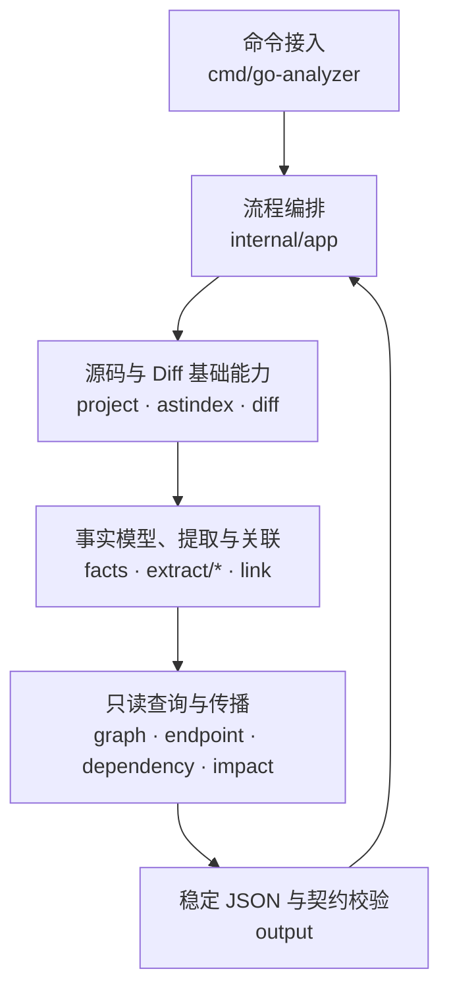
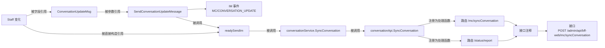

# Go 服务影响范围分析技术方案

> **这份文档回答什么**：`go-analyzer` 接收什么、产出什么、内部怎么组织，以及影响是怎么从一行代码传播到一个对外入口的。
>
> **两条独立链路**：分析器支持两类 Go 项目。它们回答不同的问题、走不同的命令、产出不同的契约，**互不依赖**：
>
> | 链路     | 问题                                                                   | 命令                            | 专属章节   |
> | -------- | ---------------------------------------------------------------------- | ------------------------------- | ---------- |
> | BFF      | 改动影响哪些 HTTP 接口？会不会触发出站 IM 事件、影响到上游 gRPC 依赖？ | `impact`、`endpoint-assets` | 第 1–3 节 |
> | 后端服务 | 改动影响哪些注册出去的服务契约（gRPC / HTTP / Dubbo / Job）？          | `grpc-impact`                 | 第 6 节    |
>
> 两条链路的业务规则完全分开：终点不同、身份规则不同、输出契约不同。它们共用的是底座——项目加载、声明索引、Diff 映射和影响传播机制，对应第 4–5 节。跨仓串联（后端 → BFF → 前端）由上层系统按接口身份完成，不在分析器内部。
>
> **怎么读**：
>
> | 章节       | 范围                                                   |
> | ---------- | ------------------------------------------------------ |
> | 第 1–3 节 | BFF 链路的能力、协议和一个贯穿全文的真实例子           |
> | 第 4–5 节 | 架构与影响传播——两条链路共用，BFF 专有之处会就地标出 |
> | 第 6 节    | 后端服务链路，自包含                                   |
> | 第 7 节    | 错误语义，两条链路共用                                 |
> | 第 8 节    | 这套能力在 Nexus 里怎么落地：目录与最终命令            |
>
> 想快速了解全貌，读第 1、3、6 节。

---

## 1. BFF 链路能做什么

> 第 1–3 节只讲 BFF 链路。后端服务链路见第 6 节。

### 1.1 一句话

给定一个 Go BFF 项目和一份 Git Diff，回答：

> 这次改动，需要回归哪些 HTTP 接口和出站 IM 事件？

处理主线是一条直线：

```text
读取 BFF 源码
  -> 记录有哪些声明、谁用了谁
  -> 把 Diff 的行号定位到具体声明
  -> 反查所有使用者
  -> 走到路由 / IM 事件 / gRPC 调用点
  -> 输出受影响的接口和原因
```

### 1.2 BFF 链路的三条能力

| 命令                | 回答的问题                                        | 输入             |
| ------------------- | ------------------------------------------------- | ---------------- |
| `impact --diff`   | 这次代码改动影响哪些 HTTP 接口和 IM 事件？        | Diff             |
| `impact --grpc`   | 上游某个 gRPC 方法变了，本 BFF 哪些接口会受影响？ | gRPC 方法身份    |
| `endpoint-assets` | 某个 BFF 接口依赖哪些上游 gRPC 接口？             | `METHOD /path` |

`impact` 的两种输入可以同时给，合并成一份 JSON 输出。

`impact --grpc` 和 `endpoint-assets` 查的是同一份依赖关系，只是方向相反——前者是"这个 gRPC 接口影响了我哪些 HTTP 接口"，后者是"这个 HTTP 接口依赖了哪些 gRPC 接口"。这两个方向必须对得上，即**双向不变量**：反查能找到的，正查也必须能找到，反之亦然；否则同一份代码关系会因为查询方向不同而给出两套互相矛盾的结论。

```text
endpoint-assets(接口 A) 包含 gRPC B
        等价于
impact --grpc B 的结果包含接口 A
```

---

## 2. BFF 的输入与输出协议

> 本节所有输出示例都是同一个真实例子的实际输出：在 `sl-sc1-admin-bff` 上给 IM 会话成员结构 `im.Staff` 加一个头像字段，结果影响了 **1 个 HTTP 接口（挂着 2 条注册路由）+ 1 个出站 IM 事件**。实际改动就是这 3 行：
>
> ```diff
> --- a/service/im/im.go
> +++ b/service/im/im.go
> @@ -25,8 +25,9 @@ type ConversationUpdateMsg struct {
>  type Staff struct {
> -	Id   string `json:"id"`
> -	Name string `json:"name"`
> +	Id     string `json:"id"`
> +	Name   string `json:"name"`
> +	Avatar string `json:"avatar"`
>  }
> ```
>
> 这个例子怎么一步步推出来的见第 3 节；它会一直用到第 5 节。

### 2.1 输入

| 输入          | 说明                                                         | 必需性          |
| ------------- | ------------------------------------------------------------ | --------------- |
| BFF 项目目录  | 含`go.mod`、**且已应用本次改动**的源码；要求绝对路径 | 必需            |
| Unified Diff  | 描述改了哪些文件哪些行；要求绝对路径                         | Diff 分析时必需 |
| gRPC 方法身份 | 形如`<生成包 import 路径>.<Service>/<GoMethod>`，可重复传  | gRPC 反查时必需 |
| 配置文件      | 过滤 go.mod 依赖的版本变化，见下                             | 可选            |

**配置文件**默认读项目内的 `.analyzer/go-impact.config.json`，不存在就按默认行为跑；也可以用 `--impact-config <绝对路径>` 显式指定。目前支持的是 go.mod 依赖变化的降级策略，后续可以按需扩展更多配置项：

```jsonc
{
  // 是否分析 go.mod 依赖变化，不写即开启
  "analyzeModuleChanges": true,

  // 忽略哪些依赖的版本变化，支持精确 module path 和 glob，默认为空即全部分析。
  // 用于降噪：部分 BFF 频繁升级 proto 依赖，而这类升级往往只是重新生成代码，
  // 每次都把引用它的接口全标记为受影响，回归范围会被版本号噪音淹没。
  "ignoredModuleChanges": [
    "gopkg.inshopline.com/sc1/app/modules/medium/activity_user/proto",
    "gopkg.inshopline.com/*/proto"
  ]
}
```

依赖变化不会直接标记全项目——只看版本号无法知道哪些代码真正用了它，那样会淹没结论。分析器先定位本项目里真实的 import 使用点，再从那里按普通代码变化继续传播；没有任何引用的依赖不产生接口影响。这类来源在输出里对应顶层的 `moduleSources`。

### 2.2 `impact` 输出协议

顶层是四个键。下面是那个真实例子的实际输出，`summary` 原样展开，两个证据字段体量大、放到 3.4 展示：

```jsonc
{
  "summary": {                       // 结论：影响了什么
    "impactedEndpointCount": 1,
    "impactedEndpoints": [
      {
        "method": "POST",
        "path": "/admin/api/bff-web/mc/syncConversation",   // 身份取自接口注释
        "routes": [                                          // 注册证据：两条都保留
          {"method": "POST", "path": "/admin/api/bff-app/mc/conversation/status/report"},
          {"method": "POST", "path": "/admin/api/bff-web/mc/syncConversation"}
        ]
      }
    ],
    "impactedIMCount": 1,
    "impactedIMEvents": ["MC/CONVERSATION_UPDATE"]
  },
  "fileSources": [ /* 每个变更文件的 Diff + 完整传播树，见 3.4 与 5.3 */ ],
  "grpcSources": [],                 // 本次没传 --grpc，故为空数组
  "endpointSourcesSummary": [ /* 按接口反查影响来源，见 3.4 */ ]

  // "moduleSources": [] —— 第五个键，只在 go.mod 形成有效依赖变化时才出现。
  // 本次 go.mod 没变，故不存在；上面四个键恒定存在。
}
```

三层深度对应三种用法：`summary` 给 CI 判断回归范围；`fileSources` 给人工核对证据；`endpointSourcesSummary` 回答"这个接口为什么被报出来"。计数字段恒等于对应数组的长度。

**为什么 `routes` 有 2 条，接口却只有 1 个？** 因为 `SyncConversation` 这个 Controller 方法被注册了**两次**，分别挂在 Web 和 App 两套路由前缀下：

```go
// router/mc/conversation.go —— Web 端
func InitConversationRouter(adminWebGroup *lego.RouterGroup) {
	adminWebGroup.POST("/mc/syncConversation", sa2.ControllerWithReqResp(conversation.ConversationApi.SyncConversation))
}

// router/app/mc/conversation.go —— App 端，前缀要多拼一层
func InitAppConversationRouter(adminAppGroup *lego.RouterGroup) {
	appGroup := adminAppGroup.Group("/mc/conversation")
	appGroup.POST("/status/report", sa2.ControllerWithReqResp(conversation.ConversationApi.SyncConversation))
}
```

但 Controller 方法上方只写了**一条**接口注释：

```go
// @Post /admin/api/bff-web/mc/syncConversation
func (c *conversationApi) SyncConversation(...) (bool, error)
```

接口身份以接口注释为准，所以这里对外只有一个正式接口——注释声明的那个。App 那条注册路径没有对应注释，它不构成一个独立的接口身份，而是作为**注册证据**留在 `routes` 里。

于是 `impactedEndpoints` 的每个条目同时给两组信息：

| 字段                  | 是什么                                         | 本例的值                                                                        |
| --------------------- | ---------------------------------------------- | ------------------------------------------------------------------------------- |
| `method` / `path` | 对外正式身份，来自接口注释                     | `POST /admin/api/bff-web/mc/syncConversation`                                 |
| `routes`            | 同一个 Controller 方法的**全部**注册证据 | 两条：Web 的`/mc/syncConversation`、App 的 `/mc/conversation/status/report` |

这样拆的原因是两组信息回答的问题不同：`method/path` 回答"这次改动破坏了哪个对外契约"，`routes` 回答"实际有哪些 URL 能打到这段代码"。两组信息都对外提供，具体回归到哪一层由业务方按自己的诉求取舍——只关心契约就看 `method/path`，要覆盖全部可调用路径就看 `routes`。完整理由见 4.3 第②条，这个例子的推导过程见 3.4。

注册路径虽然不是接口身份，但仍然可以直接用来查询——拿 App 那条真实 URL 查 `endpoint-assets`，会回报它所属的那个正式接口：

```bash
$ nexus go-analyzer endpoint-assets --project <绝对路径> \
    --endpoint "POST /admin/api/bff-app/mc/conversation/status/report"
# endpoint: POST /admin/api/bff-web/mc/syncConversation   ← 回报正式身份，而非入参
# routes:   两条都在
```

调用方手上往往只有从前端代码或网关日志拿到的真实 URL，这条回退保证它们仍然查得到。

**IM 事件**只输出事件名字符串数组。事件名拼不出静态值时不进 `summary`，只在传播树里以未解析节点保留。

**稳定性**：同一份源码 + Diff + 配置，必须产出字节级稳定的 JSON。数组有固定排序、Map 按稳定键序列化、空集合输出 `[]` 而非 `null`。

### 2.3 `endpoint-assets` 输出协议

接口到 gRPC 的正向查询，独立契约。

这一条能力换了个接口举例：第 3 节那个例子的链路里没有 gRPC 调用，展示不了这个契约。下面是同一个项目里另一个真实接口的实际输出：

```jsonc
{
  "project": {"module": "sc1-admin-bff"},
  "endpointAssets": [{
    "endpoint": {"method": "GET", "path": "/admin/api/bff-web/post/sale/:salesId/activity/winners"},
    "routes": [{"method": "GET", "path": "/admin/api/bff-web/post/sale/:salesId/activity/winners"}],
    "handlers": [{
      "id": "func:sc1-admin-bff/controller/post/activity::ListWinner",
      "kind": "func", "name": "ListWinner", "file": "controller/post/activity/activity.go"
    }],
    "dependencies": {
      "grpc": [{
        "identity": "gopkg.inshopline.com/sc1/app/modules/medium/proto/gen/activity_user_api.ActivityUserService/ListWinnerBySalesId",
        "goMethod": "ListWinnerBySalesId",
        "chains": [{
          "symbols": [{"name": "ListWinner"}, {"name": "ListWinnerBySalesId"}],
          "callSite": {"file": "remote/grpc/post/activity.go", "line": 42, "column": 9}
        }]
      }]
    }
  }]
}
```

这段是真实输出。`identity` 是这条 gRPC 依赖的唯一身份，形如 `<生成包 import 路径>.<Service>/<GoMethod>`

```go
// remote/grpc/post/activity.go —— 本项目的业务代码，不是生成代码
func ListWinnerBySalesId(ctx context.Context, req *activityUser.ListWinnerBySalesIdReq) (*activityUser.PageActivityWinnerWithAvatarResp, error) {
	return live.ActivityUserClient.ListWinnerBySalesId(ctx, req)
}
```

调用点 `live.ActivityUserClient.ListWinnerBySalesId(...)` 里，`live.ActivityUserClient` 是一个包级变量，分析器判断的不是这个变量名，而是它声明时的**静态类型**——`remote/grpc/live/activity.go` 里这行声明：

```go
var ActivityUserClient activityUser.ActivityUserServiceClient
```

真正满足命名契约的是类型名 `ActivityUserServiceClient`，不是变量名 `ActivityUserClient`（两者恰好长得像，纯属巧合）。哪怕把这个变量改名成任意名字，只要静态类型不变，识别结果不受影响——这一点已经用最小复现验证过。

分析器要求同时满足四个条件才判定为一次 gRPC 调用：

1. **类型来自调用方所在包之外的另一个包**——generated client 接口从不与消费它的业务代码同包声明；
2. **类型名以 `Client` 结尾**——protoc-gen-go-grpc 生成的 client 接口永远命名为 `<Service>Client`，去掉这个后缀就是 `Service`（这里是 `ActivityUserService`）；
3. **类型所在包的 import 路径以公司内网域名 `gopkg.inshopline.com/` 开头**——真实项目验证过，所有生成包（含跨团队的 `ai/chatbot`、`sc/background`、`armor`、`member`、`product`、`billing` 等，不限于本项目所属团队）无一例外落在这个域名下；
4. **类型所在包不属于被分析项目自己的 module**——排除项目自己手写的包装类型恰好落在该域名下的情况

四段信息（第一段是满足条件 1/3/4 的类型 import 路径,第二段是条件 2 去掉后缀得到的 Service,第三段是调用的方法名）全部能从调用点本身 + 项目自己的 `go.mod` 证明，不需要去读 `live.ActivityUserClient` 声明在哪个包、那个包里的生成代码长什么样。

`impact --grpc` 走反查方向，用的是这份 endpoint-assets 数据里同一套 `chains` 关系，只是从"gRPC 方法"出发找"依赖它的 HTTP 接口"。这个方向查出来的 consumer 关系固定标记为 `may_call`，表示源码里存在一条从该接口走到这个 gRPC 方法的调用路径。

### 2.4 CLI 与 CI 集成

```bash
nexus go-analyzer impact --project <绝对路径> --diff <绝对路径> --format json
nexus go-analyzer endpoint-assets --project <绝对路径> --endpoint "GET /admin/api/..."
nexus go-analyzer impact --project <绝对路径> --grpc "example.com/gen/pkg.Service/GoMethod"
```

集成约定：

- JSON 写 stdout，错误和 `--timings` 写 stderr，两者不混。
- 成功退出码 0；"没有受影响接口"是**成功**结果（空数组 + 计数 0），不用错误表达。
- 失败时不输出半份 JSON，只给稳定错误码（`invalid_argument`、`diff_snapshot_mismatch`、`grpc_call_ambiguous` 等），调用方按码分类，不解析自然语言。
- 可选 `--diagnostics-output <绝对路径>` 把本次分析的诊断单独写一个文件，不污染正式 JSON。
- 影响 JSON 不内嵌分析器版本和构建条件。需要跨环境复现时，CI 侧要把「分析器版本 + 项目 commit + Diff 摘要 + 配置摘要」和 JSON 一起存档。

---

## 3. BFF 真实例子走完全程

本节的所有数据都是在 `sl-sc1-admin-bff` 上真实跑出来的，不是构造的。

### 3.1 改动

给会话成员结构加一个头像字段：

```diff
--- a/service/im/im.go
+++ b/service/im/im.go
@@ -25,8 +25,9 @@ type ConversationUpdateMsg struct {
 type Staff struct {
-	Id   string `json:"id"`
-	Name string `json:"name"`
+	Id     string `json:"id"`
+	Name   string `json:"name"`
+	Avatar string `json:"avatar"`
 }
```

三行改动，只碰了一个结构体，没有碰任何 Controller 或路由。

### 3.2 源码链路

`Staff` 被 IM 广播消息体引用，这个消息体又被会话服务和 Controller 一路用上去：

```go
// service/im/im.go —— IM 消息体引用 Staff
type ConversationUpdateMsg struct {
	LookList  []*Staff `json:"lookList"`
	InputList []*Staff `json:"inputList"`
}

func SendConversationUpdateMessage(ctx context.Context, msg *ConversationUpdateMsg) {
	im.SendImBroadcastMessage(ctx, &msg.MerchantID, constant.ConversationUpdate, constant.MC, fn)
}

// service/mc/conversation_service.go —— 组装消息并发送
// 注意这里直接构造了 im.Staff，所以 readySendIm 也直接引用了被改的类型
func (c *conversationService) readySendIm(...) {
	lookList = append(lookList, &im.Staff{Id: splits[1], Name: name})
	im.SendConversationUpdateMessage(ctx, msg)
}

func (c *conversationService) SyncConversation(...) { ...; c.readySendIm(...) }

// controller/conversation/conversation_api.go —— HTTP 入口
// @Post /admin/api/bff-web/mc/syncConversation
func (c *conversationApi) SyncConversation(...) (bool, error) {
	mc.ConversationService.SyncConversation(...)
}
```

所以 `Staff` 有**两条**通往上层的路径：一条经消息体 `ConversationUpdateMsg`，一条被 `readySendIm` 直接构造引用。3.4 会再回到这一点——精简链路只展示最短的那条。

这个 Controller 方法被注册在**两条路由**上（`router/mc/conversation.go` 的 Web 端、`router/app/mc/conversation.go` 的 App 端，注册代码见 2.2），而它只有一条接口注释。这个不对称决定了最终结论的形状。

### 3.3 真实运行

```bash
nexus go-analyzer impact --project /path/to/sl-sc1-admin-bff --diff /tmp/demo.diff --format json --timings
```

全程 0.36 秒，输出 71 KB。各阶段耗时（真实 stderr）：

```text
timing project_load=192ms       timing reference_extract=53ms
timing ast_index=9ms            timing im_extract=69ms
timing route_extract=20ms       timing impact_analyze=110ms
```

### 3.4 真实输出

结论部分（`summary`）已在 2.2 原样展开：1 个 HTTP 接口 + 1 个 IM 事件 `MC/CONVERSATION_UPDATE`。这里看它的**来源证据**——真实 `endpointSourcesSummary`：

```json
[
  {
    "method": "POST", "path": "/admin/api/bff-web/mc/syncConversation",
    "sources": [{
      "sourceType": "file", "sourceFile": "service/im/im.go",
      "rootSymbols": [{
        "id": "type:sc1-admin-bff/service/im::Staff",
        "kind": "type", "name": "Staff", "file": "service/im/im.go"
      }],
      "chains": [[
        "type Staff", "method readySendIm", "method SyncConversation", "method SyncConversation",
        "route POST /admin/api/bff-app/mc/conversation/status/report",
        "annotation POST /admin/api/bff-web/mc/syncConversation",
        "POST /admin/api/bff-web/mc/syncConversation"
      ]]
    }]
  }
]
```

三行改动、完全没碰路由和 Controller，全靠类型引用链推到了一个 HTTP 接口加一个 IM 事件。

这条 `chains` 的尾部值得注意——`route` 和 `annotation` 不是同一条路径：

```text
... -> route POST /admin/api/bff-app/mc/conversation/status/report   ← 注册证据（App 那条）
    -> annotation POST /admin/api/bff-web/mc/syncConversation        ← 对外身份（注释）
    -> POST /admin/api/bff-web/mc/syncConversation                   ← 结论
```

传播是从 App 那条路由走上来的，落地的接口身份却取自注释。看起来"对不上"，其实正是接口身份规则在起作用：注释是这个 Controller 方法唯一的对外身份来源，两条注册路由都汇聚到它，而两条路由又都完整保留在该接口的 `routes` 字段里，所以从证据到结论没有断点。

---

## 4. 架构设计

> 本节的分层对两条链路都适用。4.2 的执行顺序以 BFF 为例，其中第 7、9 步（接口身份目录、gRPC 反查）是 BFF 专有的。4.3 两条决策中第②条只属于 BFF，后端服务用注册证据定身份，见 6.2。

### 4.1 分层


```mermaid
flowchart TB
    CLI["命令接入<br/>cmd/go-analyzer"]
    APP["流程编排<br/>internal/app"]
    BASE["源码与 Diff 基础能力<br/>project · astindex · diff"]
    FACT["事实模型、提取与关联<br/>facts · extract/* · link"]
    QUERY["只读查询与传播<br/>graph · endpoint · dependency · impact"]
    OUT["稳定 JSON 与契约校验<br/>output"]

    CLI --> APP
    APP --> BASE --> FACT --> QUERY --> OUT
    OUT --> APP
```

| 层         | 负责                                   | 不负责       |
| ---------- | -------------------------------------- | ------------ |
| 命令接入   | 参数、绝对路径校验、stdout/stderr 分离 | 任何分析规则 |
| 流程编排   | 按顺序驱动各阶段、错误归一化、耗时统计 | 具体语法识别 |
| 基础能力   | 加载项目、建声明索引、解析校验 Diff    | 判断业务影响 |
| 事实与关联 | 从语法树提取原子事实，连接稳定身份     | 产出最终结论 |
| 查询与传播 | 建只读索引、双向查询、生成传播树       | 修改事实     |
| 输出       | 排序、去重、渲染 JSON                  | 补造代码关系 |

依赖方向单向向下，禁止反向：输出层不能回头调提取器，提取器不能调传播层，CLI 里不写分析逻辑。

### 4.2 一次分析的执行顺序

```text
1. 校验参数与绝对路径
2. 解析并校验 Diff（与源码快照比对，不一致直接失败）
3. 加载项目、建立声明索引
4. 提取事实（声明、引用、注释、路由、中间件、IM、可选 gRPC）
5. 关联事实（路由表达式 -> Controller 方法 -> 接口注释）
6. 冻结成只读快照
7. 建查询索引与接口身份目录
8. 从变更起点传播
9. 可选执行 gRPC 反查
10. 渲染稳定 JSON
```

`--grpc` 和 `endpoint-assets` 与纯 Diff 分析走的是同一套源码加载——gRPC 身份不依赖生成代码，不需要额外加载依赖包，见 4.3。

### 4.3 两条关键决策

**① 先抽事实，再做查询。** 分析器不是读一遍源码直接回答"哪些接口受影响"，而是先把源码翻译成一堆原子事实（"某个类型被某个方法当返回值用了"、"某条路由注册了某个方法"），之后所有查询只读这些事实。

这样带来四个好处：每个提取器只认一类写法，新增协议不牵动已有规则；传播时不用反复重新解析源码；事实层可以脱离结论单独核对，验证"数据抽对了没有"；输出层没有机会临时补造一条代码关系。

**② 接口身份以接口注释为准，路由并列输出。** 规则只有两条：

```text
Controller 方法有接口注释 -> 注释就是它唯一的对外身份来源；
                            所有注册路由（含注释没覆盖到的）只作为 routes 证据
Controller 方法无接口注释 -> 才按路由兜底，每条路由各自成为一个接口
```

为什么以注释为准：真实 BFF 的路由前缀往往分散在多层 Group、跨多个函数传递——3.4 例子里 App 端那条 `/status/report` 的完整路径 `/admin/api/bff-app/mc/conversation/status/report` 就是逐层拼出来的，静态拼接随时可能残缺；而接口注释是给下游系统看的对外契约，本身写全了。

为什么注释没覆盖到的路由不单独算接口：它们没有对外契约背书。真实项目里这类路由绝大多数并不是"另一个接口"，而是同一个接口的另一种写法或历史遗留——路径参数写法不同（`{id}` 与 `:id`）、前缀没拼全、注释相对注册漂移。把它们各自算一个接口，等于把这些噪音当成结论报出去。

但也不能只输出注释——注释可能和实际注册漂移，所以两者并列：`routes` 完整列出全部注册证据，漂移就暴露在同一个条目里，而不是被拆成两个看起来无关的接口。回归要覆盖的 URL 也在 `routes` 里，一个都不少。

这条规则只允许有一个实现入口（`internal/endpoint` 产出的只读接口身份目录）。影响传播、gRPC 正查、gRPC 反查是三条独立代码路径，如果各自实现一遍"注释优先、没注释才用路由兜底"，三者迟早给出不同的接口集合，1.2 节那条双向不变量就守不住了。同理，"拿注册路径也要查得到"这条回退也做在目录里，三条路径自动共享。

---

## 5. 影响是怎么传播的

> 本节对两条链路都适用：反向引用方向、变更起点优先级、遍历算法和预算保护是共用的，差异只在"终点是什么"。

### 5.1 方向：反查使用者

写代码时依赖从上层指向底层；影响传播正好相反，从被改的声明出发反查"谁用了它"：


```mermaid
flowchart LR
    STAFF["Staff 变化"]
    MSG["ConversationUpdateMsg"]
    SEND["SendConversationUpdateMessage"]
    IM["IM 事件<br/>MC/CONVERSATION_UPDATE"]
    READY["readySendIm"]
    SVC["conversationService.SyncConversation"]
    CTRL["conversationApi.SyncConversation"]
    R1["路由 /mc/syncConversation"]
    R2["路由 /status/report"]
    ANNO["接口注释"]
    E1["接口<br/>POST /admin/api/bff-web/mc/syncConversation"]

    STAFF -->|"被字段引用"| MSG
    STAFF -->|"被直接构造引用"| READY
    MSG -->|"被参数引用"| SEND
    SEND --> IM
    SEND -->|"被调用"| READY
    READY -->|"被调用"| SVC
    SVC -->|"被调用"| CTRL
    CTRL -->|"注册为处理函数"| R1
    CTRL -->|"注册为处理函数"| R2
    R1 --> ANNO
    R2 --> ANNO
    ANNO --> E1
```

两条路由汇聚到同一条注释、再落到同一个接口，这就是 4.3② 那条身份规则在图上的样子。

为此建四种只读索引，它们都只读第 4 节那些提取出来的事实，不复制第二套数据：

| 索引         | 作用                             | 在本例中                                                    |
| ------------ | -------------------------------- | ----------------------------------------------------------- |
| 反向引用索引 | 从被用的声明反查所有使用者       | 从`Staff` 找到 `ConversationUpdateMsg`、`readySendIm` |
| 路由索引     | 从代码声明落到路由与接口注释     | 从`SyncConversation` 找到两条路由                         |
| 调用索引     | 沿可执行调用关系正反查           | 本例未用到——它只服务 gRPC 双向查询                        |
| IM 索引      | 判断当前路径是否命中某个 IM 事件 | 命中`MC/CONVERSATION_UPDATE`                              |

### 5.2 从 Diff 行到变更起点

Diff 给的是"某文件第几行变了"，但传播需要的是"从哪个声明开始往上找"。这一步就是把行号翻译成声明，翻译结果叫**变更起点**。

第 3 节的例子最直观：Diff 里变的是 `service/im/im.go` 的一行 struct Tag，翻译出的起点是 `Staff` 这个类型——不是整个 `im.go` 文件。这个差别很关键：如果起点是文件，`im.go` 里其它类型（`LockInventoryUpdateMsg` 等）的下游也会被算进来，结论直接变成一堆无关接口。

所以规则是**尽量往细里定位**：一行代码如果同时落在多个东西里面，取最里面那个。

```go
func InitPostSaleRouter(adminWebGroup *lego.RouterGroup) {
	saleGroup := adminWebGroup.Group("/post/sale/:salesId")   // 改这行 -> 起点是这个 Group
	readGuard := AddPostReadGuard(saleGroup)
	readGuard.Use(newFlowControlMid())                        // 改这行 -> 起点是这条中间件绑定
	readGuard.GET("/activity/winners", listWinner)            // 改这行 -> 起点是这条路由
	log.Info("router ready")                                  // 这行不属于以上任何一种
	                                                          //   -> 退回一级，起点是整个函数
}
```

这四行都在同一个函数体里。如果不做区分、一律算作"改了 `InitPostSaleRouter`"，那么改任何一行都等于说"这个函数注册的路由全都可能受影响"——而它注册了十几条，回归范围凭空放大十倍。

从细到粗的完整顺序是：接口注释 → 路由 Group → 路由注册 → 中间件绑定 → 包住这行的最小函数/方法/类型/变量/常量 → 实在定位不到就只能算到文件。前面四种是路由相关的特殊结构，需要单独识别，否则它们会被笼统算成"改了外层函数"。

补充两点：改 struct 字段或 Tag 时起点是所在的类型（第 3 节就是这么从一行 Tag 走到 `Staff` 的）；同一个目标上的相邻改动行会合并，改三行不会产生三个重复起点。

### 5.3 遍历与终点

每个变更起点独立生成一棵树，用递归深度优先遍历。直接看第 3 节那次改动真实跑出来的传播树（IM 分支，字段为实际输出）：

```jsonc
{
  "id": "type:sc1-admin-bff/service/im::Staff",
  "kind": "type", "name": "Staff", "level": 0,
  "children": [{
    "id": "type:sc1-admin-bff/service/im::ConversationUpdateMsg",
    "kind": "type", "relation": "type_ref", "raw": "Staff", "level": 1,
    "children": [{
      "id": "func:sc1-admin-bff/service/im::SendConversationUpdateMessage",
      "kind": "func", "relation": "type_ref", "raw": "ConversationUpdateMsg", "level": 2,
      "children": [
        {"id": "im_event:MC/CONVERSATION_UPDATE", "kind": "im_event",
         "relation": "im_payload", "level": 3, "children": []},
        {"id": "method:sc1-admin-bff/service/mc:conversationService:readySendIm",
         "kind": "method", "relation": "call", "raw": "im.SendConversationUpdateMessage",
         "level": 3, "children": []}
        // 省略：readySendIm 之下继续走到 SyncConversation、Controller 和两条路由，
        // 并在该层再次挂出同一个 IM 事件节点
      ]
    }]
  }]
}
```

对着这棵树，遍历规则就是四条：

| 规则                                                           | 在这棵树上的表现                                                                                                                             |
| -------------------------------------------------------------- | -------------------------------------------------------------------------------------------------------------------------------------------- |
| 从当前声明反查所有直接使用它的上层声明，逐层递归               | `Staff`（level 0）查到用它的 `ConversationUpdateMsg`（level 1），再查到用消息体的 `SendConversationUpdateMessage`（level 2），一路向上 |
| 每层顺带查这个声明关联的路由、中间件和 IM 事件，命中就产出终点 | level 2 的`SendConversationUpdateMessage` 关联到 IM 事件，于是 level 3 挂出 `im_event:MC/CONVERSATION_UPDATE`                            |
| 上层声明若已经在当前这条路径上，标记成环、不再往下             | 本例无环；有环时该节点只保留标记，不会无限展开                                                                                               |
| 同一父节点下 ID 与`relation` 都相同的子节点合并              | 避免同一条关系在同一层重复挂两次                                                                                                             |

树里每个节点都带一个 `relation`，回答"我为什么会出现在父节点下面"。对着上面这棵树读：

| 节点                              | `relation`   | 读作                                            |
| --------------------------------- | -------------- | ----------------------------------------------- |
| `ConversationUpdateMsg`         | `type_ref`   | 它的字段里用到了父节点`Staff`                 |
| `SendConversationUpdateMessage` | `type_ref`   | 它的参数里用到了父节点`ConversationUpdateMsg` |
| `MC/CONVERSATION_UPDATE`        | `im_payload` | 父节点这个函数发出了这个 IM 事件                |
| `readySendIm`                   | `call`       | 它调用了父节点这个函数                          |

没有 `relation`，这棵树就只是一堆 ID 的嵌套，看不出"凭什么说改 `Staff` 会影响到这个接口"。

最后是两条运行约束：

- **环只标记不展开。** 记录路径只为了判断有没有绕回来；同一个声明出现在不同分支里是正常的，不算环。
- **终点全局去重，证据各自保留。** 同一个接口被两个变更起点影响时，`summary` 里只出现一次，但两个起点各自的 `fileSources` 都保留完整链路。

---

## 6. 后端服务链路

> 本节自包含。它与第 1–3 节是**两套独立的业务规则**：终点不同、身份规则不同、输出契约不同。共用的是第 4–5 节那套底座——项目加载、声明索引、Diff 映射和影响传播机制。

### 6.1 它回答什么

两条链路做的是同一件事——从 Diff 出发找到目标终点，差别只在终点是什么：

```text
BFF：      改动 -> HTTP 接口、出站 IM 事件、上游 gRPC 调用
后端服务：  改动 -> 注册出去的服务契约（gRPC / HTTP / Dubbo / Job）
```

正因为两条链路各自的终点类型、身份规则、输出契约都不一样，后端服务走的是独立命令，不复用 BFF 的接口身份规则，也**不查询任何 BFF 项目**：

```bash
nexus go-analyzer grpc-impact --project <绝对路径> --diff <绝对路径> --format json
```

命令名沿用历史，实际覆盖四种入口，不只 gRPC。跨仓串联（后端契约 → 哪些 BFF 在调 → 哪些页面）属于上层编排，分析器只按稳定接口身份产出自己这一段。

### 6.2 四类入口契约

正式终点只有四种，都要求有**真实注册证据**才进结论：

| 入口类型           | 身份                                          | 注册证据要求                                                             |
| ------------------ | --------------------------------------------- | ------------------------------------------------------------------------ |
| `grpc_operation` | `<生成包 import 路径>.<Service>/<GoMethod>` | 实际的`RegisterXxxServer` 调用 + 已解析的实现类型上一个形状匹配的方法  |
| `http_endpoint`  | 请求方法 + 完整路径                           | 静态路由注册语句                                                         |
| `dubbo_method`   | Dubbo 接口名 + 方法名                         | `ServiceConfig`、`SetProviderService`、`MethodMapper` 三类证据齐备 |
| `job`            | 任务名                                        | 静态任务名 + 唯一 handler                                                |

gRPC 身份的推导方式与 BFF 侧对称，同样不读生成代码：`RegisterXxxServer` 这个函数名本身就是证据——去掉 `Register` 前缀、`Server` 后缀就是 `Service`，import 路径来自调用点，方法名来自已解析出的实现类型自身的方法（要求签名形如 `func(ctx context.Context, req T) (R, error)`，即 gRPC unary handler 的标准形状）。

真实入口条目（`sc1-server` 实际输出）：

```json
{
  "id": "grpc:gopkg.inshopline.com/sc1/app/modules/inbox/proto/inbox_biz.BizInboxService/GetMessageList",
  "kind": "grpc_operation",
  "identity": "gopkg.inshopline.com/sc1/app/modules/inbox/proto/inbox_biz.BizInboxService/GetMessageList",
  "identityResolution": "static",
  "registration": {"file": "modules/inbox/internal/grpc/wire_set.go", "line": 35, "column": 2}
}
```

```json
{
  "id": "http:route:method:sc1-server/modules/inbox/internal/web:Router:InitInternal:GET:/messages:5",
  "kind": "http_endpoint",
  "identity": "GET /sc1-internal/officialmsg/v1/messages",
  "identityResolution": "static",
  "method": "GET",
  "path": "/sc1-internal/officialmsg/v1/messages",
  "localPath": "/messages",
  "registration": {"file": "modules/inbox/internal/web/router.go", "line": 30, "column": 2}
}
```

两个字段值得注意：

- `registration` 指向**注册那行代码**，而不是业务实现——这是判断"这个入口是否真的对外开放"的依据。
- `identityResolution` 标记身份是静态确定的还是符号化的。动态 HTTP 路径或 Dubbo version 表达式标记为 `symbolic`，保留原始表达式，**不伪造运行时值**。

### 6.3 输出协议

顶层与 BFF 同形，但结论按协议分组：

```jsonc
{
  "summary": {                  // 全局去重的入口契约，固定四个分组
    "grpc": [], "dubbo": [], "http": [], "job": []
  },
  "fileSources": [],            // 每个变更文件的 Diff + 完整传播树
  "moduleSources": [],          // 仅 go.mod 形成有效依赖变化时出现
  "entrySourcesSummary": {      // 反查：某个入口为什么受影响，同样四分组
    "grpc": [], "dubbo": [], "http": [], "job": []
  }
}
```

分组固定存在，没有命中的协议输出空数组而不是省略字段，调用方不用做存在性判断。

### 6.4 一个真实例子

在 `sc1-server` 上给一个消息 DTO 加一个字段：

```diff
--- a/modules/inbox/internal/model/inbox/ec_get_message_dto.go
+++ b/modules/inbox/internal/model/inbox/ec_get_message_dto.go
@@ -68,6 +68,7 @@ type GetMessageItem struct {
 	AttachmentUrl  string `json:"attachment_url,omitempty"`
+	AttachmentName string `json:"attachment_name,omitempty"`
 	ConversationId string `json:"conversation_id"`
```

真实结果：**6 个 gRPC 入口 + 3 个 HTTP 入口**，dubbo 和 job 未命中。全程 3.6 秒，输出 237 KB。

入口反查里的真实链路：

```text
type GetMessageItem
  -> type InboxImEvent
  -> method SendConversationImWithType
  -> method DeleteMessage          （biz 层）
  -> method DeleteMessage          （provider 层，实现 gRPC server 接口）
  -> grpc_operation gopkg.inshopline.com/sc1/app/modules/inbox/proto/inbox_biz.BizInboxService/DeleteMessage
```

这条链路说明了两件事：一是同一个 DTO 会同时被 gRPC provider 和内部 HTTP 路由用到，所以一次改动跨越了两类入口；二是链路终点是**注册出去的契约**，而不是 provider 方法本身——只有该实现确实被 `RegisterXxxServer` 注册过，才会形成正式结论。

### 6.5 与 BFF 链路的关键差异

| 维度         | BFF 链路                                                 | 后端服务链路                         |
| ------------ | -------------------------------------------------------- | ------------------------------------ |
| 终点范围     | 对外 HTTP 接口 + 额外一层出站（IM 事件、上游 gRPC 调用） | 只有注册出去的入口契约，没有额外一层 |
| 终点类型     | HTTP 接口、IM 事件、上游 gRPC                            | gRPC / HTTP / Dubbo / Job 入口契约   |
| 接口身份来源 | Controller 注释优先，路由兜底                            | 注册证据本身，没有注释优先的概念     |
| 双向查询     | 有（接口 ↔ gRPC）                                       | 无，只有 Diff → 入口一个方向        |
| 结论分组     | 扁平列表                                                 | 固定按四种协议分组                   |

差异只在这张表列出的几项。两条链路**共用同一套传播机制**——第 5 节讲的反向引用方向、变更起点优先级、DFS 遍历和预算保护全部适用，所以本节不重复，读第 5 节即可。

---

## 7. 错误与诊断

> 本节对两条链路都适用。

**直接失败**（不输出任何正式 JSON）：路径不是绝对路径；项目缺少或无法解析 `go.mod`；Diff 为空、格式非法或是合并提交的多父格式；Diff 路径逃逸项目根；Diff 与源码快照不一致；本次改动命中的 Go 文件无法解析；输出无法按契约渲染。

**记录诊断并继续**：未改动的文件局部解析失败；Controller 或接收者无法唯一解析；路由路径或 IM 事件名是动态表达式；删除块只能恢复局部证据；依赖变化在本项目没有真实引用点。

真实项目上的诊断量级很小（`sl-sc1-admin-bff` 共 17 条，其中 12 条是路由 Wrapper 推断、5 条是接口多实现歧义），说明主流写法覆盖是够的，剩下的是需要人工确认的边角。

`impact` 成功只表示流水线跑完，不表示所有动态写法都被覆盖到。怀疑有缺口时先看 `--diagnostics-output` 写出的诊断文件——它记录的正是分析器看到了、但静态上不敢下结论的那些位置。

---

## 8. 在 Nexus 里怎么落地

### 8.1 放在哪个目录

Nexus 仓库（`gopkg.inshopline.com/bff/nexus/v2`）的目录组织有一条固定规律：**一个顶层命令组 = 一个 `cmd` 分组 + 一个同名的 `internal/` 子树**，命令文件按 `cmd/<group>_<subcommand>.go` 扁平命名。

```text
cmd/
  bff.go                       # nexus bff 命令组（已有的 bff/list-ops、bff/gen-controller 等）
  bff_list_ops.go
  bff_gen_controller.go
  grpc.go                      # nexus grpc 命令组
  grpc_gen_openapi.go
  doc.go
  ...
  go_analyzer.go               # ← 新增：nexus go-analyzer 命令组入口
  go_analyzer_impact.go        # ← 新增：impact 子命令（BFF 链路）
  go_analyzer_grpc_impact.go   # ← 新增：grpc-impact 子命令（后端服务链路）
  go_analyzer_endpoint_assets.go # ← 新增：endpoint-assets 子命令

internal/
  bff/                         # 已有：bff 代码生成核心逻辑
  doc/                         # 已有：文档构建/部署
  goanalyzer/                  # ← 新增：影响分析的核心实现
    pipeline.go                # 流程编排（§4.2）
    impact.go                  # BFF 影响分析入口
    grpc_impact.go             # 后端服务影响分析入口
    ...
```

`internal/goanalyzer/` 是从 go-analyzer 仓库搬进来的核心实现。它保持独立——不调用 Nexus 已有的 `internal/bff`、`internal/transform` 等包，也不被它们调用。原因在下一段。

### 8.2 不复用 Nexus 已有能力，只新增开发

go-analyzer 是独立的 Go module（`gopkg.inshopline.com/bff/go-analyzer`），所有核心代码都在 `internal/` 下。Go 的 internal 包可见性规则决定了 **Nexus 作为另一个 module 无法 import 它**——所以"在 Nexus 里开发"不是把它当依赖引进来，而是把这套代码搬进 Nexus 的 `internal/goanalyzer/` 里。

搬进来之后为什么不复用 Nexus 已有的 `internal/bff`、`internal/transform`？因为它们解决的问题不同：

| Nexus 已有能力              | 做什么                                     | 为什么不能复用                                                                            |
| --------------------------- | ------------------------------------------ | ----------------------------------------------------------------------------------------- |
| `internal/bff/controller` | 从 OpenAPI schema 生成 Controller 模板代码 | 代码生成，吃 schema 吐`.go` 文件；影响分析吃的是**源码 + Diff**，吐的是 JSON 结论 |
| `internal/transform/*`    | schema → 代码/文档的格式转换              | 单向转换器；影响分析需要的是反向引用图和传播树，没有对应的转换器可复用                    |
| `internal/openapi`        | OpenAPI 3.0 解析                           | 解析的是 schema 文档；影响分析解析的是 Go AST，两套输入                                   |

因此 `internal/goanalyzer/` 是一个**自包含的新增包**：自己加载项目源码、自己建声明索引、自己跑传播算法。它只通过 Cobra 命令（`cmd/go_analyzer_*.go`）这一层薄壳接入 Nexus 的命令树，之下不碰任何 Nexus 已有包。

### 8.3 最终命令

接入后，对外命令的命名空间是 `nexus go-analyzer`，子命令沿用 go-analyzer 仓里已稳定的名字：

```bash
# BFF 链路：改动影响哪些 HTTP 接口，会不会触发出站 IM 事件
nexus go-analyzer impact \
  --project /absolute/path/to/bff \
  --diff /absolute/path/to/change.diff \
  --format json

# 上游 gRPC 接口变了，反查本 BFF 受影响的接口
nexus go-analyzer impact \
  --project /absolute/path/to/bff \
  --grpc example.com/gen/pkg.Service/GoMethod

# 正向查询：某个 BFF 接口依赖哪些上游 gRPC
nexus go-analyzer endpoint-assets \
  --project /absolute/path/to/bff \
  --endpoint "GET /admin/api/..."

# 后端服务链路：改动影响哪些注册出去的服务契约
nexus go-analyzer grpc-impact \
  --project /absolute/path/to/service \
  --diff /absolute/path/to/change.diff \
  --format json
```

`nexus go-analyzer` 与 `nexus bff`、`nexus grpc`、`nexus doc` 并列，是 Nexus 顶层的一个新命令组。**子命令、flag、JSON 输出契约都与独立运行 go-analyzer 二进制时完全一致**——接入 Nexus 只换了入口命名空间，不换分析能力和输出格式。

命令组的 flag 约定也遵循 Nexus 已有习惯：JSON 写 stdout、诊断和 `--timings` 写 stderr 两者不混；`--diagnostics-output` 把本次分析的 sidecar 诊断写到独立文件；失败时只给稳定错误码、不输出半份 JSON（详见第 7 节）。

---

## 附录：术语

括号里是代码和 JSON 输出中使用的标识符。

| 名词            | 是什么                                                                                                                                                    |
| --------------- | --------------------------------------------------------------------------------------------------------------------------------------------------------- |
| Controller 方法 | 真正处理一个 HTTP 请求的 Go 函数或方法（输出里写作`handler`）                                                                                           |
| 接口注释        | 写在 Controller 方法上方、声明它对外是哪个接口的注释（`annotation`）                                                                                    |
| 路由注册        | 把 Controller 方法挂到路由上的那行代码（`route`）                                                                                                       |
| HTTP 接口       | 归一化后的「请求方法 + 路径」，本方案对外的正式结论单位（`endpoint`）；身份以接口注释为准，方法上完全没有注释时才按路由兜底                             |
| 注册路径        | 路由实际注册出的完整 URL。同一个 Controller 方法的全部注册路径都列在该接口的`routes` 里；注释没覆盖到的那些不构成接口身份，但保留为证据，也仍可用于查询 |
| gRPC 方法身份   | `<生成包 import 路径>.<Service>/<GoMethod>`，全部来自本项目自己的源码，不读生成代码                                                                     |
| 出站 IM 事件    | BFF 主动发给前端或消息通道的事件名（`im_event`）                                                                                                        |
| 静态事实        | 从源码读出的一条原子数据（`fact`）                                                                                                                      |
| 变更起点        | Diff 定位到的那个具体声明，传播从它开始                                                                                                                   |
| 诊断            | 某处写法静态上无法唯一确定时留下的记录；不阻断分析，也不进正式结论（`diagnostic`）                                                                      |
| 可能调用        | 源码中存在一条能走到某处的调用路径，但不保证每次请求都走到（`may_call`）                                                                                |

后端服务链路专有：

| 名词       | 是什么                                                                                 |
| ---------- | -------------------------------------------------------------------------------------- |
| 入口契约   | 后端服务对外暴露的一个可被调用的入口，是该链路的正式结论单位                           |
| 注册证据   | 证明某段实现真的被挂到对外入口上的那行代码（如`RegisterXxxServer` 调用）             |
| 静态身份   | 入口身份能从源码唯一确定（`identityResolution: static`）                             |
| 符号化身份 | 入口身份含运行时才确定的部分，保留原始表达式不伪造（`identityResolution: symbolic`） |
