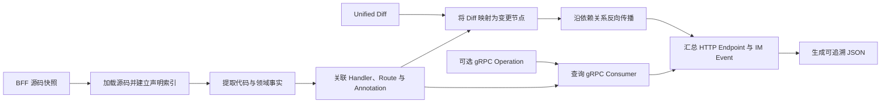
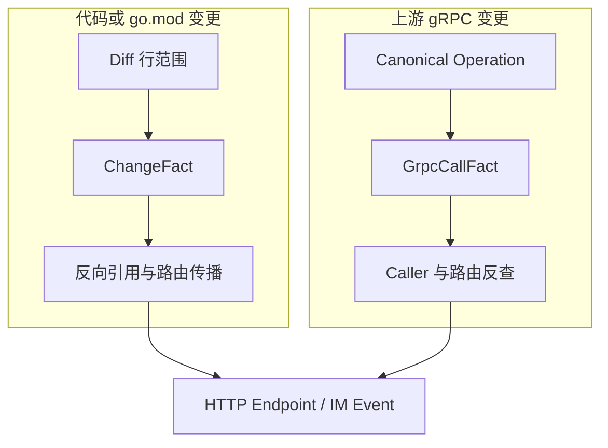
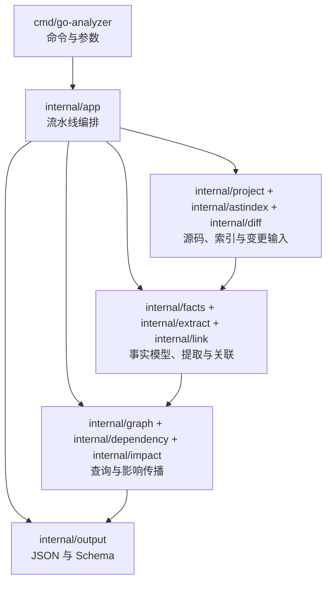

# Go BFF 影响范围分析技术方案

## 1. 方案目标

`go-analyzer` 用静态代码证据回答一个核心问题：

> 一份 BFF 代码变更，最终会影响哪些 HTTP Endpoint 和出站 IM Event？

它还支持围绕 BFF 的 gRPC 双向查询：

- 给定一个 BFF Endpoint，查询它可能调用的上游 gRPC Operation。
- 给定一个上游 gRPC Operation，查询当前 BFF 中可能受影响的 Endpoint。

分析结果不仅要给出 Endpoint 列表，还必须解释：

- 变更来自哪个文件、模块或 gRPC Operation。
- Diff 命中了哪个代码声明或注册语句。
- 影响经过了哪些函数、类型、路由和中间件。
- Endpoint 的 HTTP Method 和 Path 来自哪条静态证据。

本方案面向单个 Go 项目。跨服务、跨 BFF 和前端页面的串联由外部编排层完成。

### 1.1 输入与输出

| 输入                  | 说明                                                         |
| --------------------- | ------------------------------------------------------------ |
| 变更后的 BFF 源码快照 | Diff 必须已经应用到该源码快照                                |
| Unified Diff          | 描述文件、行范围和删除内容                                   |
| 可选的 gRPC Operation | 使用`/package.Service/Method` 形式的 canonical full method |
| Go Build Context      | GOOS、GOARCH、build tags、cgo                                |
| 可选影响配置          | 仅控制 module change 的分析与过滤                            |

| 输出          | 说明                                           |
| ------------- | ---------------------------------------------- |
| HTTP Endpoint | 规范化后的 Method、Path 以及路由辅助证据       |
| IM Event      | 能静态确定的出站事件名                         |
| 完整传播树    | 从每个变更根到业务入口的可审计路径             |
| 来源反查摘要  | 从 Endpoint 反查影响它的文件、模块或 gRPC 来源 |

### 1.2 范围边界

本方案只输出能够被静态证据支持的关系。以下情况不推测运行时结果：

- 反射和运行时动态路由表。
- 无法唯一解析的依赖注入或接口分发。
- 外部 SDK 内部隐藏的调用。
- 完全动态的 Path、Event 或 Handler。
- 仅凭名称相似度推断的 gRPC Operation。

后端服务端 gRPC Provider、Dubbo、XXL-Job 等入站契约分析不在本文展开。它们可以共用项目加载、AST 索引、事实模型和图查询底座，但应使用独立技术方案描述。

## 2. 先看一条完整分析链路

本节使用一个最小 BFF 示例解释“代码变更为什么会影响某个 Endpoint”。后续章节再展开每个阶段的实现。

### 2.1 示例代码

请求模型：

```go
package model

type Address struct {
	City string `json:"city"`
}

type CreateOrderRequest struct {
	Address Address `json:"address"`
}
```

Controller：

```go
package controller

import "example.com/type-impact/model"

type OrderAPI struct{}

var API = &OrderAPI{}

// @Post /orders
func (api *OrderAPI) Create(req model.CreateOrderRequest) {
	// ...
}
```

路由注册：

```go
package router

import "example.com/type-impact/controller"

func Init(group *Group) {
	group.POST("/orders", controller.API.Create)
}
```

现在 Diff 修改了 `Address.City` 的 JSON tag：

```diff
 type Address struct {
-    City string `json:"city_name"`
+    City string `json:"city"`
 }
```

虽然 Diff 没有直接修改 Controller 或路由，`POST /orders` 仍然应被判定为受影响，因为它的请求类型依赖了 `Address`。

### 2.2 分析器如何得到结论

| 阶段         | 输入                           | 产生的数据                                  | 回答的问题                             |
| ------------ | ------------------------------ | ------------------------------------------- | -------------------------------------- |
| 1. 加载项目  | Go 源码、go.mod、Build Context | AST 文件、Package、声明索引                 | 项目中有哪些代码声明？                 |
| 2. 提取事实  | AST 与声明索引                 | Symbol、Reference、Annotation、Route 等事实 | 声明之间如何关联？业务入口注册在哪里？ |
| 3. 关联事实  | Route、Handler、Annotation     | Link 事实和已解析 Handler                   | 这条路由最终绑定哪个 Controller？      |
| 4. 映射 Diff | Diff 行范围与事实位置          | `ChangeFact(Address)`                     | 本次变更命中了哪个语义节点？           |
| 5. 影响传播  | ChangeFact 与只读查询图        | 从`Address` 到 Endpoint 的传播树          | 谁依赖这个变更？能否到达业务入口？     |
| 6. 输出投影  | 传播树与入口摘要               | 稳定 JSON                                   | 哪些 Endpoint 受影响，为什么？         |

事实提取后，分析器掌握以下关键关系：

```text
CreateOrderRequest --type reference--> Address
OrderAPI.Create    --type reference--> CreateOrderRequest
router.Init        --value reference-> OrderAPI.Create
POST /orders       --registered handler--> OrderAPI.Create
OrderAPI.Create    --annotation------> POST /orders
```

`ReferenceFact` 在源码中的方向是“引用者依赖被引用者”。影响传播需要反向查询，因此运行时图的方向为：

```text
Address
  -> CreateOrderRequest
  -> OrderAPI.Create
  -> route POST /orders
  -> annotation POST /orders
  -> endpoint POST /orders
```

### 2.3 最终结果

轻量摘要直接回答“影响了什么”：

```json
{
  "summary": {
    "impactedEndpointCount": 1,
    "impactedEndpoints": [
      {
        "method": "POST",
        "path": "/orders",
        "routes": [
          {
            "method": "POST",
            "path": "/orders"
          }
        ]
      }
    ],
    "impactedIMCount": 0,
    "impactedIMEvents": []
  }
}
```

来源反查摘要解释“为什么受影响”：

```json
{
  "method": "POST",
  "path": "/orders",
  "sources": [
    {
      "sourceType": "file",
      "sourceFile": "model/model.go",
      "rootSymbols": [
        {
          "kind": "type",
          "name": "Address",
          "file": "model/model.go"
        }
      ],
      "chains": [
        [
          "type Address",
          "type CreateOrderRequest",
          "method Create",
          "route POST /orders",
          "annotation POST /orders",
          "POST /orders"
        ]
      ]
    }
  ]
}
```

完整传播树保留在 `fileSources[].symbols` 中，用于排查每一条引用边和路由证据。

## 3. 总体处理流程

### 3.1 主流程


```mermaid
flowchart LR
    SOURCE["BFF 源码快照"]
    DIFF["Unified Diff"]
    GRPC["可选 gRPC Operation"]

    LOAD["加载源码并建立声明索引"]
    EXTRACT["提取代码与领域事实"]
    LINK["关联 Handler、Route 与 Annotation"]
    CHANGE["将 Diff 映射为变更节点"]
    PROPAGATE["沿依赖关系反向传播"]
    QUERY["查询 gRPC Consumer"]
    ENDPOINT["汇总 HTTP Endpoint 与 IM Event"]
    OUTPUT["生成可追溯 JSON"]

    SOURCE --> LOAD --> EXTRACT --> LINK
    DIFF --> CHANGE
    LINK --> CHANGE
    CHANGE --> PROPAGATE --> ENDPOINT
    GRPC --> QUERY
    LINK --> QUERY --> ENDPOINT
    ENDPOINT --> OUTPUT
```

这张图只表达数据如何流动。代码目录与模块映射放在第 10 节，避免在读者理解主流程前引入内部包名。

### 3.2 运行顺序

一次 `impact` 分析应按以下顺序执行：

1. 校验命令参数和路径。
2. 读取、解析并校验 Unified Diff。
3. 加载变更后的项目源码并建立 AST 声明索引。
4. 提取 Symbol、Reference、Annotation、Route、Middleware、IM 等事实。
5. 关联 Route、Handler 和 Annotation。
6. 按需建立 generated gRPC client catalog 并提取 BFF 调用点。
7. 将 Diff 映射为 `ChangeFact`，恢复可证明的删除路由证据。
8. 将 go.mod 变化映射到本仓真实使用点。
9. 从每个 ChangeFact 执行影响传播。
10. 合并可选的 gRPC Operation 反向查询结果。
11. 构建稳定 JSON 和来源摘要。

Diff 分支和 gRPC 输入分支共享同一份项目事实，不重复加载项目。

### 3.3 两类影响源


```mermaid
flowchart TB
    subgraph FILE["代码或 go.mod 变更"]
        F1["Diff 行范围"]
        F2["ChangeFact"]
        F3["反向引用与路由传播"]
        F1 --> F2 --> F3
    end

    subgraph RPC["上游 gRPC 变更"]
        G1["Canonical Operation"]
        G2["GrpcCallFact"]
        G3["Caller 与路由反查"]
        G1 --> G2 --> G3
    end

    F3 --> RESULT["HTTP Endpoint / IM Event"]
    G3 --> RESULT
```

- Diff 来源回答“当前 BFF 的代码变化影响什么”。
- gRPC 来源回答“当前 BFF 中哪些 Endpoint 可能消费这个上游 Operation”。
- 两类来源可以同时输入，并在同一份输出中保留各自证据。

## 4. 核心数据模型

### 4.1 `facts.Store` 是什么

`facts.Store` 是一次分析过程中的**类型化事实仓库**，不是事件总线，也不负责执行传播。

它按事实类型保存切片，核心形态如下：

```go
type Store struct {
	Project     ProjectFact
	Symbols     []SymbolFact
	References  []ReferenceFact
	Annotations []AnnotationFact
	RouteGroups []RouteGroupFact
	Routes      []RouteRegistrationFact
	Middleware  []MiddlewareBindingFact
	Links       []LinkFact
	IMEvents    []IMEventFact
	Modules     []ModuleDependencyFact

	GrpcOperations []GrpcOperationFact
	GrpcCalls      []GrpcCallFact

	RouteGroupFlows []RouteGroupFlowFact
	Changes         []ChangeFact
	ModuleChanges   []ModuleChangeFact
	ModuleUsages    []ModuleUsageFact
	Diagnostics     []DiagnosticFact
}
```

后端协议事实（`GrpcProviderFact`、`DubboProviderFact`、`JobRegistrationFact`）由后端服务分析链路写入同一个 Store，不在本文展开。

事实分成三类：

| 类别         | 示例                                                   | 生命周期                                |
| ------------ | ------------------------------------------------------ | --------------------------------------- |
| 项目代码事实 | Symbol、Reference、Route、Annotation、GrpcCall、Module | 从源码抽取，可输出到 facts JSON         |
| 分析期事实   | Change、ModuleChange、ModuleUsage、RouteGroupFlow      | 单次影响分析使用，不进入公开 facts JSON |
| 诊断事实     | 解析失败、歧义、降级原因                               | 用于排障，不混入正式影响摘要            |

### 4.2 事实如何写入和读取


```mermaid
flowchart LR
    INIT["初始化 Store"]
    BASE["写入项目、模块和 Symbol"]
    DOMAIN["各 Extractor 写入领域事实"]
    LINK["Linker 补充关联事实"]
    CHANGE["Diff Mapper 写入 ChangeFact"]
    READONLY["Graph 与 Impact 只读消费"]
    DOC["Output 只做文档投影"]

    INIT --> BASE --> DOMAIN --> LINK --> CHANGE --> READONLY --> DOC
```

约束如下：

1. `app` 是唯一了解完整执行顺序的编排层。
2. Extractor 可以读取 Project 和 AST Index，只能写入自己负责的事实。
3. Extractor 之间不得共享私有 AST 缓存，也不得直接调用彼此。
4. Linker 只做已有事实之间的身份对齐。
5. ChangeFact 必须在领域事实和 Link 构建完成后写入。
6. Graph、Dependency 和 Impact 阶段把 Store 视为只读快照。
7. Output 不得重新扫描 AST 或补推业务关系。

### 4.3 代表性事实

#### SymbolFact

表示一个稳定的代码声明：

```json
{
  "id": "method:example.com/type-impact/controller:OrderAPI:Create",
  "kind": "method",
  "package_path": "example.com/type-impact/controller",
  "receiver": "OrderAPI",
  "name": "Create",
  "span": {
    "file": "controller/controller.go",
    "start_line": 10,
    "end_line": 13
  }
}
```

#### ReferenceFact

表示 `FromSymbol` 依赖 `ToSymbol`：

```json
{
  "kind": "type",
  "from_symbol": "method:example.com/type-impact/controller:OrderAPI:Create",
  "to_symbol": "type:example.com/type-impact/model::CreateOrderRequest",
  "span": {
    "file": "controller/controller.go",
    "start_line": 11,
    "end_line": 11
  }
}
```

引用类型包括：

- `call`：函数或方法调用。
- `value`：函数值、变量值、注册参数。
- `type`：参数、返回值、字段、组合字面量和泛型参数中的类型引用。

#### RouteRegistrationFact

表示一条路由注册：

```json
{
  "method": "POST",
  "local_path": "/orders",
  "resolved_path": "/orders",
  "handler_raw": "controller.API.Create",
  "handler_symbol": "method:example.com/type-impact/controller:OrderAPI:Create",
  "route_func": "func:example.com/type-impact/router::Init",
  "file": "router/router.go"
}
```

#### ChangeFact

表示 Diff 命中的传播根：

```json
{
  "kind": "symbol_changed",
  "symbol_id": "type:example.com/type-impact/model::Address",
  "file": "model/model.go",
  "ranges": [
    {
      "start_line": 4,
      "end_line": 4
    }
  ],
  "source": "git_diff"
}
```

`ChangeFact` 不是源码固有事实。它在 Diff 映射完成后写入 Store，并作为影响传播的入口。

## 5. 项目加载与 Diff 处理

### 5.1 项目加载

项目加载阶段应：

1. 从项目根的 go.mod 获取 module path。
2. 识别嵌套 module，并按距离源码文件最近的 go.mod 恢复 import path。
3. 根据 GOOS、GOARCH、build tags 和 cgo 应用 Go build constraints。
4. 排除 `_test.go`、`vendor`、`testdata`、`node_modules` 和 Go 工具链忽略目录。
5. 为每个源码文件保存 AST、FileSet、Package、相对路径和 import alias。
6. 为 function、method、type、package-level var/const 建立稳定 Symbol ID。

声明索引负责回答：

- 某个 Diff 行号位于哪个最小声明内。
- 某个 selector 或 method value 指向哪个项目内 Symbol。
- 某个变量、字段或 constructor 的静态类型能否唯一确定。

只有候选唯一且证据明确时，类型和 Symbol 才能标记为 resolved。

### 5.2 变更后快照约束

项目路径必须指向 Diff 已应用后的源码快照。分析前应校验：

1. Diff 非空并符合 Unified Diff 语法。
2. Diff 路径不能逃逸项目根目录。
3. 新增或修改后的上下文与磁盘源码一致。
4. 被删除文件在变更后快照中不存在。
5. Diff 命中的 Go 文件能够被 AST 解析。

这项约束保证 Diff 行号、AST Span 和变更语义属于同一份源码。

### 5.3 Diff 到 ChangeFact

Diff 行范围按以下优先级映射：

```text
Annotation
  -> Route Group
  -> Route Registration
  -> Middleware Binding
  -> [后端协议层级：Job Registration -> Dubbo Method -> Dubbo Service]
  -> 最小包含 Symbol
  -> File Fallback
```

后端协议层级仅在后端服务分析链路中生效（Middleware Binding 与 Symbol 之间的可扩展位），BFF 分析链路不涉及。

规则：

- 优先选择更具体的领域事实，避免把一条 Route 变更退化成整个函数变更。
- 同时命中多个 Symbol 时选择 Span 最小的声明。
- 相邻行命中同一目标时合并为一个 ChangeFact。
- File Fallback 只保留来源证据，不默认扩大到整个 Package 或项目。

### 5.4 删除证据恢复

变更后源码中已经不存在被删除的 Route 或 Handler，因此删除分析需要读取 Diff 删除块：

1. 将删除行包装为临时 Go 代码并解析 Route Call。
2. 使用常规 Route Parser 恢复 Method、Local Path、Handler 和 Wrapper。
3. 只结合变更后同一 Route Function 内的 Group 恢复 Prefix。
4. 完整删除 Handler 时，可恢复合成 Symbol、Annotation 和 ChangeFact。
5. 无法证明完整 Path 或 Handler 时保留 Diagnostic，不伪造 Endpoint。

删除恢复只补充传播所需的局部证据，不尝试重建旧版本完整 AST。

### 5.5 go.mod 变化

go.mod 变化不能直接扩散到全仓。处理流程为：

```text
require / replace 变化
  -> ModuleChangeFact
  -> 本仓 import usage
  -> 对应 Symbol 或 File ChangeFact
  -> 正常影响传播
```

没有真实 import usage 的 Module Change 标记为 `module_unreferenced`，不产生业务入口影响。

影响配置只控制 Module Change：

```json
{
  "analyzeModuleChanges": true,
  "ignoredModuleChanges": [
    "gopkg.inshopline.com/sc1/app/modules/*/proto"
  ]
}
```

配置应拒绝未知字段和非法 Glob，避免错误配置被静默忽略。

## 6. BFF 领域事实提取

### 6.1 Annotation

Annotation Extractor 从 Handler 注释提取 HTTP Method 和 Path：

```go
// @Post /admin/api/bff-web/orders
func (api *OrderAPI) Create(...) {}
```

它只记录注释声明，不负责路由拼接，也不判断最终 Endpoint 是否已注册。

### 6.2 Route、Group 与 Middleware

Route Extractor 应识别：

- `GET`、`POST`、`PUT`、`PATCH`、`DELETE` 等注册调用。
- Group Prefix 和父子 Group。
- Group 作为函数参数或返回值的跨函数流转。
- `.Use()` 中间件及其语句顺序。
- Handler Wrapper 和 Group Wrapper。
- Package Var、Struct Field、Method Value 等可静态解析的 Handler。
- Nexus 或 Codegen 生成的标准路由模板。

例如：

```go
admin := root.Group("/admin")
web := admin.Group("/api/bff-web")
web.Use(Auth())
web.POST("/orders", controller.API.Create)
```

应产生：

```text
RouteGroup(/admin)
  -> RouteGroup(/api/bff-web)
  -> Middleware(Auth)
  -> RouteRegistration(POST /orders)
  -> ResolvedPath(POST /admin/api/bff-web/orders)
```

中间件必须记录语句顺序。同一个 Group 中，`.Use()` 只影响它之后注册的 Route。

### 6.3 Reference

Reference Extractor 建立项目内依赖边：

```text
FromSymbol depends on ToSymbol
```

除了函数调用，还必须覆盖函数值和类型引用，否则无法分析以下场景：

```go
group.POST("/orders", controller.API.Create) // value reference

func Create(req model.CreateOrderRequest)    // type reference
```

无法唯一解析的目标保留原始表达式和 Diagnostic，不生成指向任意候选的确定关系。

### 6.4 Link

Linker 将语法事实对齐到稳定身份：

```text
Route.HandlerRaw
  -> Handler Symbol
  -> Handler Annotation
```

它可以读取 AST Index 和已有 Route、Annotation、Middleware 事实，但不能重新承担完整项目扫描。

Link 完成后：

- Route 可以查询到唯一 Handler Symbol。
- Handler 可以查询到 Annotation。
- Middleware 表达式可以查询到对应 Symbol。
- Wrapper 内引用可以成为 Route Dependency。

### 6.5 出站 IM Event

IM 分析分为三步：

1. 识别可信 Transport。
2. 静态求值 Event。
3. 记录 Event、Payload 和 Control Dependency。

可信 Transport 有两类识别机制：

- **SDK 函数精确匹配**：import path 为 `gopkg.inshopline.com/sc1/commons/utils/bus/notify/im`，函数名为 `SendIm`、`SendImAsync`、`SendImToUid` 或 `SendImToUidAsync`，event 取第 4 个参数（0-based index 3）、payload 取第 5 个参数（0-based index 4）。import path 或函数名不匹配时拒绝，参数数量不足时记录 Diagnostic。
- **协议双锚点发现**：项目代码中同时出现 `"broadcast://"` scheme 锚和 `"/broadcast/send"` endpoint 锚时，识别 `BroadcastParams` 复合字面量包装（Event 字段 + Payload 参数）或直接协议发送（Body 赋值 + `.Event(topic)` 调用）。

静态求值可以覆盖：

- String Literal 和 Const。
- 字符串拼接。
- Imported Const。
- 可证明的 Typed Enum 与静态字符串表。
- Wrapper 参数替换。
- `if/else` 字符串相等条件形成的 Event 分支。

动态 Event 作为 unresolved 节点保留在完整树中，不进入 `impactedIMEvents` 摘要。

## 7. 影响传播

### 7.1 查询图

事实提取和关联完成后，分析阶段从 Store 构建只读查询视图：

| 查询图       | 作用                                                 |
| ------------ | ---------------------------------------------------- |
| ReverseGraph | 从被依赖 Symbol 查询引用它的 Symbol                  |
| RouteGraph   | 查询 Handler、Group、Middleware、Annotation 和 Route |
| CallGraph    | 从 Endpoint Handler 正向查询可执行调用链             |
| IMGraph      | 匹配传播路径上的 IM Event 依赖                       |

查询图只保存索引和邻接关系，不复制第二套业务事实，也不修改 Store。

### 7.2 ChangeFact 的入口规则

| Change Kind             | 传播入口                                  |
| ----------------------- | ----------------------------------------- |
| `symbol_changed`      | 从 Symbol 沿 ReverseGraph 和领域依赖传播  |
| `annotation_changed`  | 直接解析对应 Annotation Endpoint          |
| `route_changed`       | 直接展开该 Route                          |
| `route_deleted`       | 输出恢复出的删除 Route 证据               |
| `route_group_changed` | 展开该 Group 和 Descendant Group 的 Route |
| `middleware_changed`  | 展开该 Middleware 挂载后受作用的 Route    |
| `file_changed`        | 保留文件级根，不自动扩大范围              |

### 7.3 Symbol 传播算法

对每个 `symbol_changed` 根独立构建传播树：

```text
function expand(current, path):
  for each ref in ReverseGraph.Referrers(current):
    if ref in path: mark cycle, skip
    path.add(ref)
    expand(ref, path)
    path.remove(ref)

  for each route in RouteGraph.DependentRoutes(current):
    resolve handler annotation or route fallback
    emit endpoint terminal

  for each route in RouteGraph.DependentMiddlewareRoutes(current):
    resolve handler annotation or route fallback
    emit endpoint terminal

  collect IMGraph.EventsForPath(current path)

expand(changed symbol, {changed symbol})
```

遍历约束：

- 递归 DFS，使用 Path Map 做当前路径上的 Cycle Detection（同一 Symbol 可出现在不同分支）。
- 同一父节点下相同 ID + Relation 的子节点在展开后合并，避免菱形依赖指数展开。
- 相同 Endpoint 全局去重，但保留不同来源和不同根的传播树。
- 输出前对 Map、Set 和 Slice 统一稳定排序。

### 7.4 Endpoint 身份

BFF Endpoint 使用 Annotation-first 规则：

1. Handler 存在 Annotation 时，Annotation 的 Method 和 Path 是正式 Endpoint。
2. 静态解析出的 Route 作为同级 `routes[]` 辅助证据。
3. Handler 没有 Annotation 时，使用静态 Route Method 和 Resolved Path。
4. Method 统一转换为大写，Path 执行一致的规范化。

示例：

```json
{
  "method": "POST",
  "path": "/admin/api/bff-web/orders",
  "routes": [
    {
      "method": "POST",
      "path": "/api/bff-web/orders"
    }
  ]
}
```

正式 Endpoint 与 Route 证据分开表达，可以暴露 Annotation 和 Route 漂移，又不会用不完整的动态路由覆盖接口身份。

### 7.5 Group、Middleware 与 Wrapper

- Group Prefix 变化影响该 Group 和 Descendant Group 下的 Route。
- Group 跨函数传递时，Guard、Factory 和 Middleware 依赖传播到其后代 Route。
- Middleware 函数变化只影响其绑定后注册的 Route。
- Wrapper 中引用的 Symbol 变化只影响使用该 Wrapper 的 Route。
- 无法静态证明 Group Prefix 或 Handler 的 Route 不生成虚构 Endpoint。

## 8. BFF 与上游 gRPC 的关系

本节只讨论 BFF 作为 gRPC Client 的出站依赖，不展开后端 Server Provider 分析。

### 8.1 Generated Client Catalog

gRPC Operation 必须由 generated transport 证明：

- Generated Marker。
- Unary RPC 的 `Invoke`，或 Streaming RPC 的 `NewStream`。
- Canonical Full Method 字符串。
- Generated Constructor、Client Interface 和 Concrete Client Method 的绑定。

Operation 的唯一身份为：

```text
/package.Service/Method
```

Go Method 名、变量名、目录名和 Protobuf Message 名都不能单独证明 gRPC Operation。

### 8.2 BFF 调用点

调用 `client.GetOrder(...)` 只有同时满足以下条件才形成 `GrpcCallFact`：

1. Generated Catalog 中存在对应 Operation。
2. Receiver 静态类型唯一绑定到 Generated Client。
3. 调用位于项目内可执行 Function 或 Method 中。

关系标记为 `may_call`：静态调用链证明该 Endpoint 可能到达此调用，但不承诺每次请求都一定执行。

### 8.3 双向查询

正向查询：

```text
Endpoint
  -> Handler
  -> Project CallGraph
  -> GrpcCallFact
  -> Canonical Operation
```

反向查询：

```text
Canonical Operation
  -> GrpcCallFact
  -> Caller
  -> Handler
  -> Route / Annotation
  -> Endpoint
```

同一项目快照和 Build Context 下应满足：

```text
endpoint-assets(A) 包含 gRPC B
iff
impact --grpc B 包含 Endpoint A
```

## 9. 输出契约

### 9.1 顶层结构

`impact` 输出字段顺序固定为：

```json
{
  "summary": {},
  "fileSources": [],
  "grpcSources": [],
  "endpointSourcesSummary": []
}
```

`moduleSources` 只在 go.mod 形成语义 Module Change 时出现；出现时位于 `fileSources` 之后、`grpcSources` 之前。其它数组即使为空也输出空数组。

| 字段                       | 消费目的                                                 |
| -------------------------- | -------------------------------------------------------- |
| `summary`                | 快速获取全局去重后的 Endpoint 和 IM Event                |
| `fileSources`            | 查看每个普通 Diff 文件的原始 Patch、变更根和完整传播树   |
| `moduleSources`          | 查看 Module Change、真实 Usage 和传播结果                |
| `grpcSources`            | 查看输入 gRPC Operation、BFF Consumer 和 Call-site Chain |
| `endpointSourcesSummary` | 从 Endpoint 反查 File、Module 或 gRPC 来源               |

### 9.2 完整树与轻量摘要

输出同时保留三种视图：

```text
summary
  适合 CI、测试平台和默认消费

fileSources / moduleSources / grpcSources
  适合审计完整证据

endpointSourcesSummary
  适合解释某个 Endpoint 为什么受影响
```

三种视图只能是同一份分析结果的不同投影，不允许各自执行影响判断。

`endpointSourcesSummary` 中：

- File Source 保留 Source File、Root Symbols 和最短人读链路。
- Module Source 保留 Module Path、Change Type、Version 和 Usage Root。
- gRPC Source 保留 Canonical Full Method 和不同 Call-site Chain。

### 9.3 确定性

相同项目快照、Diff、gRPC 输入和 Build Context 必须产生字节级稳定的 JSON：

- 所有数组定义稳定排序规则。
- 所有 Set 和 Map 在输出前转换为有序切片。
- Endpoint、Event、Root 和 Chain 使用确定性去重键。
- 空集合统一输出 `[]`，不输出 `null`。
- JSON Schema、Go 输出结构和 Golden Sample 保持一致。

## 10. 模块与目录设计

模块按照处理阶段组织，而不是按照命令复制一套实现。


```mermaid
flowchart TB
    CLI["cmd/go-analyzer<br/>命令与参数"]
    APP["internal/app<br/>流水线编排"]
    BASE["internal/project + internal/astindex + internal/diff<br/>源码、索引与变更输入"]
    FACT["internal/facts + internal/extract + internal/link<br/>事实模型、提取与关联"]
    QUERY["internal/graph + internal/dependency + internal/impact<br/>查询与影响传播"]
    OUT["internal/output<br/>JSON 与 Schema"]

    CLI --> APP
    APP --> BASE
    APP --> FACT
    APP --> QUERY
    APP --> OUT
    BASE --> FACT
    FACT --> QUERY
    QUERY --> OUT
```

### 10.1 分层职责

| 层     | 模块                                                             | 职责                                      |
| ------ | ---------------------------------------------------------------- | ----------------------------------------- |
| 接入层 | `cmd/go-analyzer`                                              | 子命令、Flag、绝对路径校验、stdout/stderr |
| 编排层 | `internal/app`                                                 | 阶段顺序、抽取模式、Typed Error、Metrics  |
| 基础层 | `internal/project`、`internal/astindex`、`internal/diff`   | 项目加载、声明索引、Diff 解析与校验       |
| 事实层 | `internal/facts`、`internal/extract/*`、`internal/link`    | 类型化事实、领域提取、身份关联            |
| 查询层 | `internal/graph`、`internal/dependency`、`internal/impact` | 只读图、双向查询、传播树                  |
| 输出层 | `internal/output`                                              | 稳定文档投影、JSON、Schema                |

### 10.2 依赖规则

1. `cmd` 不包含 AST、传播或 JSON 业务拼装逻辑。
2. `app` 负责顺序，不实现协议专属 AST 匹配。
3. `extract` 依赖 Project、AST Index 和 Facts，不依赖 Impact 或 Output。
4. `link` 只连接已有事实，不重新实现 Extractor。
5. `graph`、`dependency` 和 `impact` 不修改源码事实。
6. `output` 不依赖 Extractor 私有实现，不补推业务结论。
7. 新协议应先定义原子事实和准入证据，再增加查询与输出投影。

## 11. 错误、诊断与可观测性

### 11.1 错误语义

以下问题应终止正式分析：

- 项目路径或 Diff 路径非法。
- Unified Diff 无法解析。
- Diff 与变更后源码快照不一致。
- Diff 命中的 Go 文件无法解析。
- gRPC 严格查询所需依赖或 Generated Catalog 无法建立。
- 输出契约无法完成稳定序列化。

正式分析不得在关键证据缺失时输出半份结果。

### 11.2 Diagnostic

可恢复问题进入 Diagnostic：

- 非变更文件解析失败。
- 动态 Route Path 或 IM Event。
- Handler、Receiver 或 Interface Binding 存在歧义。
- 删除证据只能局部恢复。
- Module Change 无真实 Usage。

Diagnostic 用于 `facts` 排障，不计入正式 Endpoint 或 IM Event 数量。

### 11.3 性能与指标

一次命令只加载一次项目并共用 AST Index 和 Store。主要阶段应记录耗时：

- Project Load。
- AST Index。
- 各类 Extractor。
- Link。
- Diff Map。
- Impact Analyze。
- Output Build 和 Render。

Metrics 只写 stderr，JSON stdout 只包含稳定业务文档。

性能设计要求：

- AST 文件和声明查询建立索引，避免重复全仓扫描。
- Generated gRPC 依赖按需加载，不遍历无关依赖图。
- 图遍历使用 Cycle Detection 和共享子图缓存。
- 大型 Map 和 Set 只在最终输出阶段排序。

### 11.4 安全与隔离

- 所有 Diff 路径在规范化后必须位于项目根目录。
- 分析器只读取源码、go.mod、Diff 和必要的 Go 依赖元数据。
- 不执行被分析项目代码。
- 不将机器绝对路径写入业务事实或设计文档示例。
- 输出中的源码位置统一使用项目相对路径。

## 12. 测试与验收

### 12.1 单元测试

每条静态规则应使用最小 Fixture 覆盖正例和反例：

- Symbol ID 和 Span。
- Call、Value、Type Reference。
- Annotation 解析。
- Route Group、Middleware 顺序和 Wrapper。
- Handler 与 Annotation Link。
- Diff 行范围映射和相邻根合并。
- 删除 Route 与 Handler 恢复。
- Module Change 与 Usage。
- IM Event 静态求值和 unresolved。
- Generated gRPC Client Catalog、Receiver Binding 和双向查询。
- 图循环、菱形依赖和稳定排序。

### 12.2 集成与契约测试

- 使用完整 CLI Pipeline 运行最小项目。
- 使用 Golden JSON 验证完整传播树和字段顺序。
- 校验 Go 输出结构与 JSON Schema 对齐。
- 验证 stdout 只包含 JSON，stderr 承载 Error 和 Timings。
- 验证 `endpoint-assets` 与 `impact --grpc` 的双向不变量。
- 对相同输入重复执行并比较字节输出。

### 12.3 真实 BFF 验证

真实项目验证以以下项目族为主：

| 项目                   | 验证重点                                               |
| ---------------------- | ------------------------------------------------------ |
| `sl-sc1-admin-bff`   | Annotation、Route Alias、Middleware、IM、Module Change |
| `sl-sc1-bff-service` | Route Group Flow、BFF gRPC Client、IM                  |
| `sl-sc2-admin-bff`   | BFF 项目族差异和零配置兼容性                           |

每次验证应保留：

- 原始 Diff。
- 完整分析 JSON。
- 受影响 Endpoint 和 IM Event 数量。
- 关键 Source Chain。
- 人工确认的误报、漏报和不支持范式。

### 12.4 验收标准

1. Function、Method、DTO、Const 和 Var 变化可以传播到可证明的 Endpoint。
2. Route、Group、Middleware 和 Wrapper 变化只影响真实依赖它们的 Route。
3. Annotation 和 Route 漂移不会生成错误的 Endpoint Identity。
4. 静态 IM Event 进入摘要，动态 Event 只保留 unresolved 证据。
5. Endpoint 与 gRPC Operation 支持双向查询并满足不变量。
6. go.mod 变化只从真实 Module Usage 传播。
7. 删除 Route 和 Handler 能恢复可证明证据，无法恢复时不猜测。
8. 每个 Endpoint 可以反查 Source File、Module 或 gRPC Operation。
9. 相同输入产生字节级稳定 JSON。
10. 关键证据缺失时正式分析失败，不输出误导性部分结果。

## 13. CLI 与集成

### 13.1 核心命令

| 命令                | 用途                                                         |
| ------------------- | ------------------------------------------------------------ |
| `impact`          | 输入 Diff 和/或 gRPC Operation，输出 BFF Endpoint 与 IM 影响 |
| `grpc-impact`     | 后端服务入站契约影响分析（详见独立技术方案）                 |
| `endpoint-assets` | 查询 Endpoint 依赖的上游 gRPC Operation                      |
| `facts`           | 输出项目事实和 Diagnostic，用于排障                          |
| `schema`          | 输出稳定 JSON Schema（`--type facts\|impact\|grpc-impact`）  |

项目和文件路径参数必须使用绝对路径。设计文档、配置文件和输出中的源码位置使用项目相对路径。

`impact` 和 `grpc-impact` 均支持可选的 `--impact-config` 参数指定影响配置文件（绝对路径）；未提供时自动尝试读取项目根下 `.analyzer/go-impact.config.json`。

`impact` 至少接收一个 Diff 或 gRPC Operation：

```text
impact --diff
  分析 BFF 代码和 go.mod 变化

impact --grpc
  分析上游 gRPC Operation 在当前 BFF 的消费者

impact --diff --grpc
  共用一次项目事实构建，保留两类来源
```

### 13.2 集成边界

CLI 适合作为 CI、Nexus 或其它编排平台的稳定接入层：

- JSON 写入 stdout。
- Timings 和错误写入 stderr。
- 非法输入返回非零退出码。
- 调用方显式选择命令，不依赖目录名猜测项目类型。
- 上层系统通过 Endpoint 和 Canonical gRPC Operation 串联多个项目结果。

## 14. 后续扩展

以下能力不改变 BFF 主流程，但应使用独立设计文档：

- 后端服务端 gRPC、HTTP、Dubbo 和 XXL-Job 入站契约影响。
- 多仓 gRPC 到 BFF 再到前端页面的自动编排。
- 更精确的接口多实现和依赖注入分析。
- 增量 AST、事实缓存和大仓并行分析。
- 基于静态证据生成 QA 回归建议。

扩展时必须保持以下原则：

1. 先定义可验证的原子事实。
2. 再定义事实之间的静态关系。
3. 最后定义影响终点和输出契约。
4. 不在 Output 或 CLI 中堆叠协议特例。

## 附录 A：事实生产者与消费者

| Fact                      | 主要生产者                          | 主要消费者                     |
| ------------------------- | ----------------------------------- | ------------------------------ |
| `ProjectFact`           | Project Loader                      | Output、Dependency             |
| `SymbolFact`            | AST Index                           | Diff Mapper、Graph、Impact     |
| `ReferenceFact`         | Reference Extractor                 | ReverseGraph、CallGraph        |
| `AnnotationFact`        | Annotation Extractor                | Linker、RouteGraph、Impact     |
| `RouteGroupFact`        | Route Extractor                     | Diff Mapper、RouteGraph        |
| `RouteRegistrationFact` | Route Extractor、删除恢复           | Linker、RouteGraph、Impact     |
| `MiddlewareBindingFact` | Route Extractor                     | Linker、RouteGraph、Impact     |
| `LinkFact`              | Linker                              | RouteGraph、Dependency、Impact |
| `IMEventFact`           | IM Extractor                        | IMGraph、Impact                |
| `GrpcOperationFact`     | Generated Client Catalog            | Dependency、Output             |
| `GrpcCallFact`          | gRPC Client Extractor               | CallGraph、Dependency          |
| `ModuleChangeFact`      | go.mod Diff Mapper                  | Module Usage、Output           |
| `ModuleDependencyFact`  | go.mod Loader                       | Module Change、Output          |
| `ModuleUsageFact`       | Module Usage Mapper                 | ChangeFact Mapper、Output      |
| `RouteGroupFlowFact`    | Route Extractor                     | Route Group Prefix 解析        |
| `ChangeFact`            | Diff Mapper、删除恢复、Module Usage | Impact                         |
| `DiagnosticFact`        | 所有可降级阶段                      | Facts Output                   |

## 附录 B：核心术语

| 术语                     | 含义                                                |
| ------------------------ | --------------------------------------------------- |
| Symbol                   | Function、Method、Type、Var 或 Const 的稳定声明身份 |
| Fact                     | 从源码或输入中提取的原子静态证据                    |
| ChangeFact               | Diff 映射得到的影响传播根                           |
| Link                     | Route、Handler、Annotation 等事实之间的身份关联     |
| ReverseGraph             | 从被依赖者反查引用者的运行时索引                    |
| Endpoint                 | 规范化后的 HTTP Method 与 Path                      |
| Source Chain             | 从变更根到 Endpoint 的人读传播路径                  |
| Canonical gRPC Operation | `/package.Service/Method` 形式的稳定 RPC 身份     |
| Resolved                 | 静态证据能够唯一确定                                |
| Symbolic / Unresolved    | 保留表达式或局部证据，但不伪造运行时值              |
