# Go BFF 影响范围分析技术方案

> 文档定位：描述 `go-analyzer` 如何从 Go BFF 源码、Git Diff 和可选的上游 gRPC 接口，得到可解释的 HTTP 接口与出站 IM 事件影响范围。
>
> 设计口径：本文描述方案应具备的行为和模块职责，不记录开发进度。后端服务的 gRPC Provider、Dubbo 和 XXL-Job 分析使用独立方案，本文只保留命令边界。

## 0. 阅读指南

这套方案可以先记成一条主线：

```text
读取 BFF 源码
  -> 记录代码声明和依赖关系
  -> 把 Diff 定位到具体声明
  -> 反查所有使用者
  -> 到达路由或 IM 事件
  -> 输出受影响接口和原因
```

不同读者可以按下面的顺序阅读：

| 读者 | 建议章节 | 能回答的问题 |
| --- | --- | --- |
| 业务与测试负责人 | 第 1、2、3、8 节 | 输入什么、输出什么、为什么某个接口受影响 |
| 架构与技术评审 | 第 3、4、5、7、10、12 节 | 核心决策、数据模型、模块边界、传播算法 |
| 开发与维护人员 | 第 5 至 14 节、附录 | 每个模块怎样实现、怎样调试和验收 |
| 接入方 | 第 8、11、14 节 | JSON 契约、错误语义、CLI 使用方式 |

全文按以下层次组织：

1. 先说明系统边界和一条完整案例。
2. 再明确最容易产生歧义的关键设计决策。
3. 然后展开事实模型、处理流水线和传播算法。
4. 最后说明输出契约、模块分层、错误语义、测试和交付里程碑。

评审时需要守住五条不变量：

| 不变量 | 含义 |
| --- | --- |
| 同一 Endpoint 语义 | Diff、gRPC 正查和 gRPC 反查必须共用同一套 Endpoint 身份规则 |
| 单一事实来源 | 结论只能来自 Fact、Link 或查询图，Output 不补推代码关系 |
| 来源链同向 | `endpointSourcesSummary` 中所有 Chain 都从影响来源指向 Endpoint |
| 集合一致 | `summary`、各类 Source 摘要和 `endpointSourcesSummary` 必须表达同一组 Endpoint |
| 显式降级 | 无法唯一证明时只能失败、记录 Diagnostic 或输出 Unresolved，不允许猜测 |

## 1. 问题、输入与输出

### 1.1 要解决的问题

`go-analyzer` 面向单个 Go BFF 项目回答：

> 一次代码变更，静态上可能影响哪些 HTTP 接口和出站 IM 事件？

它还提供 BFF 与上游 gRPC 接口之间的双向查询：

- 给定一个 BFF HTTP 接口，查询代码中能够到达的上游 gRPC 接口。
- 给定一个完整 gRPC 接口名，反查当前 BFF 中能够到达该调用的 HTTP 接口。

这里的“能够到达”表示源码中存在一条静态调用路径。

例如 gRPC 调用位于 `if` 分支中，分析器能够证明请求处理代码可能走到该调用，但不能证明每次请求都会执行该分支。因此，这类关系统一表达为 `may_call`。

### 1.2 系统边界

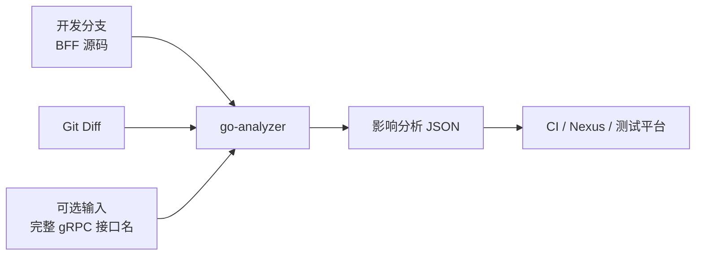
```mermaid
flowchart LR
    DEV["开发分支<br/>BFF 源码"]
    GIT["Git Diff"]
    GRPC["可选输入<br/>完整 gRPC 接口名"]
    ANALYZER["go-analyzer"]
    JSON["影响分析 JSON"]
    CI["CI / Nexus / 测试平台"]

    DEV --> ANALYZER
    GIT --> ANALYZER
    GRPC --> ANALYZER
    ANALYZER --> JSON --> CI
```

分析器只处理一个项目目录，不负责：

- 自动拉取多个仓库。
- 把后端、BFF 和前端结果自动串成跨仓链路。
- 判断运行时分支一定会不会执行。
- 验证代码中的注释、路由或业务配置是否正确。
- 执行服务、注册真实路由表或采集运行时调用链。

跨仓串联由上层系统使用 HTTP Method、HTTP Path 和完整 gRPC 接口名完成。

### 1.3 输入

| 输入 | 说明 | 是否必需 |
| --- | --- | --- |
| BFF 项目目录 | 包含 `go.mod`、且已经应用本次代码修改的项目目录；CLI 要求绝对路径 | 是 |
| Unified Diff 文件 | 描述当前代码相对基线的文件和行变化；CLI 要求绝对路径 | Diff 分析时必需 |
| 完整 gRPC 接口名 | 例如 `/shopline.order.v1.OrderService/GetOrder`，可以重复传入 | gRPC 反查时必需 |
| Go 构建条件 | GOOS、GOARCH、Build Tags 和 cgo，决定哪些条件编译文件参与分析 | 否 |
| 影响过滤配置 | 控制 `go.mod` 模块变化是否参与传播 | 否 |

`impact` 命令至少需要 Diff 或 gRPC 接口之一，两者也可以同时提供。

### 1.4 输出

一次 `impact` 分析输出一个 JSON 文档，顶层按阅读顺序组织：

```jsonc
{
  "summary": {
    // 全局去重后的 HTTP 接口和 IM 事件
  },
  "fileSources": [
    // 普通源码文件的 Diff、传播树和来源内摘要
  ],
  // 仅在 go.mod 形成有效模块变化时出现
  "moduleSources": [],
  "grpcSources": [
    // 输入的 gRPC 接口及其 BFF 消费链路
  ],
  "endpointSourcesSummary": [
    // 按 HTTP 接口反查文件、模块或 gRPC 来源
  ]
}
```

其中：

- `summary` 用于快速回答“影响了什么”。
- `fileSources`、`moduleSources`、`grpcSources` 用于回答“影响从哪里来”。
- `endpointSourcesSummary` 用于回答“这个接口为什么受影响”。

输出组织方式与 `ts-analyzer` 保持相同的阅读层次，但 Go 语言的事实节点和 TypeScript 不完全相同。

### 1.5 静态分析口径

为了避免把能力边界误读为准确率承诺，本文统一采用以下口径：

| 维度 | 方案口径 |
| --- | --- |
| 影响含义 | 只要存在可证明的静态依赖路径，就属于“可能受影响” |
| Go 解析 | 使用 AST、声明索引和轻量类型推断，不执行完整程序，也不等同于完整 `go/types` 类型检查 |
| 接口来源 | Controller Annotation 是接口身份，Route Registration 是注册证据；具体规则见第 3.3 节 |
| 控制流 | 能识别语句和调用关系，不证明运行时条件、数据值或分支互斥 |
| 动态表达式 | 保留原始表达式和 Diagnostic，不猜测运行时值 |
| 项目范围 | 分析项目目录中的生产 Go 文件；不分析 `_test.go`、`vendor` 和 `testdata` |
| 注册可达性 | 识别静态路由注册语句，不额外证明注册函数一定从 `main` 被调用 |
| 删除分析 | 基于 Diff 删除块恢复路由所需证据，不重建完整旧版本项目 |

因此，结果表示“在本方案支持的静态语法范围内可以证明的影响”，不是运行时调用追踪。

## 2. 一条完整分析链路

本节只回答一件事：

> 修改 `Address`，为什么会报告 `POST /orders` 受影响？

### 2.1 示例源码

下面一个代码块表示三个文件，使用文件注释分隔：

```go
// ---------- model/model.go ----------
package model

type Address struct {
	City string `json:"city"`
}

type CreateOrderRequest struct {
	Address Address `json:"address"`
}

// ---------- controller/controller.go ----------
package controller

import "example.com/type-impact/model"

type OrderAPI struct{}

var API = &OrderAPI{}

// @Post /orders
func (api *OrderAPI) Create(req model.CreateOrderRequest) {
	// 创建订单
}

// ---------- router/router.go ----------
package router

import "example.com/type-impact/controller"

func Init(group *Group) {
	group.POST("/orders", controller.API.Create)
}
```

本次 Diff 只修改 `Address.City` 的 JSON Tag：

```diff
 type Address struct {
-    City string `json:"city_name"`
+    City string `json:"city"`
 }
```

Controller 和路由没有直接变化，但 `OrderAPI.Create` 的参数最终使用了 `Address`，所以接口需要进入回归范围。

### 2.2 六个处理阶段

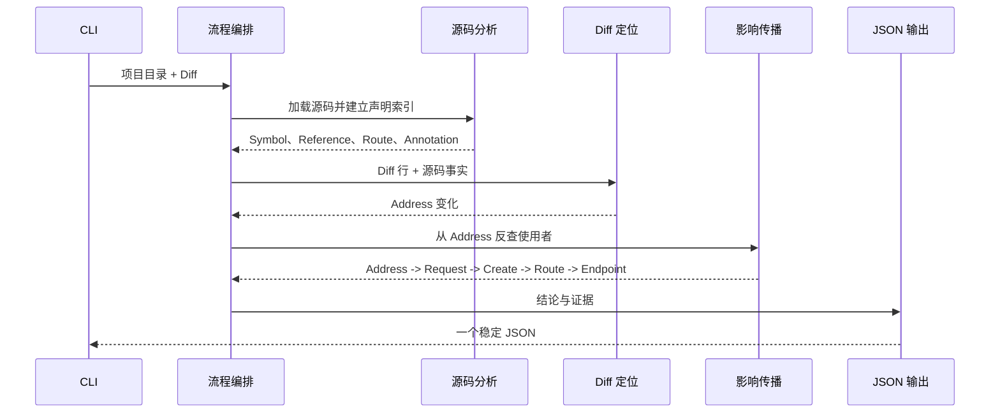
```mermaid
sequenceDiagram
    participant CLI as CLI
    participant APP as 流程编排
    participant SRC as 源码分析
    participant DIFF as Diff 定位
    participant IMPACT as 影响传播
    participant OUT as JSON 输出

    CLI->>APP: 项目目录 + Diff
    APP->>SRC: 加载源码并建立声明索引
    SRC-->>APP: Symbol、Reference、Route、Annotation
    APP->>DIFF: Diff 行 + 源码事实
    DIFF-->>APP: Address 变化
    APP->>IMPACT: 从 Address 反查使用者
    IMPACT-->>APP: Address -> Request -> Create -> Route -> Endpoint
    APP->>OUT: 结论与证据
    OUT-->>CLI: 一个稳定 JSON
```

| 阶段 | 示例中的处理 | 产物 |
| --- | --- | --- |
| 项目加载 | 解析三个 Go 文件 | AST 文件和 Package |
| 事实提取 | 识别类型、方法、函数值、注释和路由 | `SymbolFact`、`ReferenceFact`、`AnnotationFact`、`RouteRegistrationFact` |
| 事实关联 | 将 `controller.API.Create` 解析到 `OrderAPI.Create` | Route、Handler、Annotation 之间的 Link |
| Diff 定位 | 修改行落在 `Address` 声明中 | `ChangeFact(Address)` |
| 影响传播 | 反查谁使用 `Address` | 到达 `POST /orders` 的传播树 |
| 输出投影 | 去重、排序并构建来源摘要 | `summary`、`fileSources`、`endpointSourcesSummary` |

### 2.3 依赖方向与影响方向

写代码时的依赖方向是：

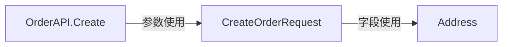
```mermaid
flowchart LR
    CREATE["OrderAPI.Create"]
    REQUEST["CreateOrderRequest"]
    ADDRESS["Address"]

    CREATE -->|"参数使用"| REQUEST
    REQUEST -->|"字段使用"| ADDRESS
```

本次从 `Address` 的变化出发，要反查“谁使用了它”，所以影响方向与依赖方向相反：


```mermaid
flowchart LR
    ADDRESS["Address 变化"]
    REQUEST["CreateOrderRequest"]
    CREATE["OrderAPI.Create"]
    ROUTE["Route POST /orders"]
    ANNO["Annotation POST /orders"]
    ENDPOINT["Endpoint POST /orders"]

    ADDRESS -->|"被字段引用"| REQUEST
    REQUEST -->|"被参数引用"| CREATE
    CREATE -->|"注册为 Handler"| ROUTE
    ROUTE -->|"关联 Handler 注释"| ANNO
    ANNO -->|"声明接口身份"| ENDPOINT
```

后文所说的“反向引用查询”，就是从被修改声明开始，持续查找直接或间接使用它的上层声明。

### 2.4 完整输出示例

下面是该最小项目对应的完整 JSON 结构。`symbols` 中除了 Symbol 节点，也会递归包含 Route、Annotation 和 Endpoint 节点；字段名为输出契约的既有名称。

<details>
<summary>展开完整 JSON</summary>

```json
{
  "summary": {
    "impactedEndpointCount": 1,
    "impactedEndpoints": [
      {
        "method": "POST",
        "path": "/orders",
        "routes": [
          {
            "method": "POST",
            "path": "/orders"
          }
        ]
      }
    ],
    "impactedIMCount": 0,
    "impactedIMEvents": []
  },
  "fileSources": [
    {
      "sourceFile": "model/model.go",
      "diff": "diff --git a/model/model.go b/model/model.go\n--- a/model/model.go\n+++ b/model/model.go\n@@ -3,3 +3,3 @@\n type Address struct {\n-\tCity string `json:\"city_name\"`\n+\tCity string `json:\"city\"`\n }\n",
      "symbols": {
        "type:example.com/type-impact/model::Address": {
          "id": "type:example.com/type-impact/model::Address",
          "kind": "type",
          "name": "Address",
          "file": "model/model.go",
          "package": "example.com/type-impact/model",
          "level": 0,
          "children": [
            {
              "id": "type:example.com/type-impact/model::CreateOrderRequest",
              "kind": "type",
              "name": "CreateOrderRequest",
              "file": "model/model.go",
              "package": "example.com/type-impact/model",
              "relation": "type_ref",
              "raw": "Address",
              "level": 1,
              "children": [
                {
                  "id": "method:example.com/type-impact/controller:OrderAPI:Create",
                  "kind": "method",
                  "name": "Create",
                  "file": "controller/controller.go",
                  "package": "example.com/type-impact/controller",
                  "relation": "type_ref",
                  "raw": "model.CreateOrderRequest",
                  "level": 2,
                  "children": [
                    {
                      "id": "func:example.com/type-impact/router::Init",
                      "kind": "func",
                      "name": "Init",
                      "file": "router/router.go",
                      "package": "example.com/type-impact/router",
                      "relation": "value_ref",
                      "raw": "controller.API.Create",
                      "level": 3,
                      "children": []
                    },
                    {
                      "id": "route:func:example.com/type-impact/router::Init:POST:/orders:1",
                      "kind": "route",
                      "name": "POST /orders",
                      "file": "router/router.go",
                      "relation": "registered_handler",
                      "raw": "controller.API.Create",
                      "level": 3,
                      "children": [
                        {
                          "id": "annotation:method:example.com/type-impact/controller:OrderAPI:Create:POST:/orders:0",
                          "kind": "annotation",
                          "name": "POST /orders",
                          "file": "controller/controller.go",
                          "relation": "handler_annotation",
                          "raw": "@Post /orders",
                          "level": 4,
                          "children": [
                            {
                              "id": "endpoint:POST:/orders",
                              "kind": "endpoint",
                              "name": "POST /orders",
                              "file": "controller/controller.go",
                              "relation": "annotation_endpoint",
                              "level": 5,
                              "children": [],
                              "method": "POST",
                              "path": "/orders"
                            }
                          ],
                          "method": "POST",
                          "path": "/orders"
                        }
                      ],
                      "method": "POST",
                      "path": "/orders"
                    }
                  ]
                }
              ]
            }
          ]
        }
      },
      "impactedEndpoints": [
        {
          "method": "POST",
          "path": "/orders",
          "routes": [
            {
              "method": "POST",
              "path": "/orders"
            }
          ]
        }
      ],
      "impactedIMEvents": []
    }
  ],
  "grpcSources": [],
  "endpointSourcesSummary": [
    {
      "method": "POST",
      "path": "/orders",
      "sources": [
        {
          "sourceType": "file",
          "sourceFile": "model/model.go",
          "rootSymbols": [
            {
              "id": "type:example.com/type-impact/model::Address",
              "kind": "type",
              "name": "Address",
              "file": "model/model.go"
            }
          ],
          "chains": [
            [
              "type Address",
              "type CreateOrderRequest",
              "method Create",
              "route POST /orders",
              "annotation POST /orders",
              "POST /orders"
            ]
          ]
        }
      ]
    }
  ]
}
```

</details>

### 2.5 三种阅读方式

同一份结果支持三种阅读深度：

```text
summary
  -> 只看最终影响了哪些接口和 IM 事件

fileSources / moduleSources / grpcSources
  -> 查看来源、原始输入和递归传播证据

endpointSourcesSummary
  -> 从某个接口反查影响它的来源和最短人读链路
```

`endpointSourcesSummary[].chains` 为每个来源根只选择一条最短链路，方便快速确认；全部已展开分支仍保留在详细 Source 证据中。

## 3. 关键设计决策

这一节集中说明最容易产生歧义的方案口径。后续模块都必须遵守这些决策。

### 3.1 Facts-first

分析器先把源码转换为类型化事实，再执行关联和查询：

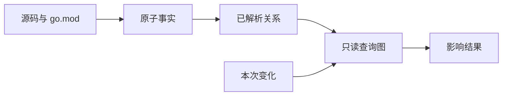
```mermaid
flowchart LR
    SOURCE["源码与 go.mod"]
    FACTS["原子事实"]
    LINKS["已解析关系"]
    CHANGES["本次变化"]
    QUERY["只读查询图"]
    RESULT["影响结果"]

    SOURCE --> FACTS --> LINKS
    LINKS --> QUERY
    CHANGES --> QUERY --> RESULT
```

采用 Facts-first 的原因：

- 每个 Extractor 只负责识别一种静态事实，避免协议规则互相调用。
- 影响传播不需要反复扫描 AST。
- `facts` 命令可以独立检查“数据是否抽取正确”。
- Route、IM、gRPC 等领域能力可以共用 Symbol 和 Reference。
- 输出层只能整理结果，不能临时补造代码关系。

### 3.2 AST 与轻量类型解析

方案使用：

- `go/parser` 和 `go/ast` 读取语法、注释和源码位置。
- 声明索引为 Function、Method、Type、Package-level Var/Const 建立身份。
- Import、显式类型、构造函数返回类型、Struct Field 和受约束的接口绑定用于轻量类型推断。
- 只有候选唯一且证据满足规则时，才建立确定的 Symbol 关系。

方案不把轻量索引描述成完整 Go 类型系统。以下情况可能无法唯一解析：

- 反射或运行时依赖注入。
- 多实现接口的动态分发。
- 外部 SDK 内部隐藏的调用。
- 运行时构造的 Handler、Route Path 或 Event。
- 无法静态确定接收者类型的 Method Call。

无法解析时写入 Diagnostic，不按名称相似度选择候选。

### 3.3 Endpoint 身份采用 Annotation-first

HTTP 接口输出同时包含：

```json
{
  "method": "POST",
  "path": "/admin/api/bff-web/orders",
  "routes": [
    {
      "method": "POST",
      "path": "/api/bff-web/orders"
    }
  ]
}
```

两组字段的职责不同：

| 字段 | 来源 | 含义 |
| --- | --- | --- |
| `method/path` | Controller Annotation 优先；没有 Annotation 时使用 Route | 对外接口身份 |
| `routes` | 静态解析到的 Route Registration | 该 Handler 在代码中如何注册 |

具体匹配规则：

| Handler 情况 | Endpoint 身份 | `routes` |
| --- | --- | --- |
| 没有 Annotation | 使用每条可解析 Route 的 Method/Path | 保留可解析 Route |
| Route 与 Annotation 的 Method/Path 对应 | 使用 Annotation | 保留 Handler 的可解析 Route |
| Annotation 与 Route 不一致 | 保留 Annotation 身份，不用 Route 静默覆盖 | 展示不一致的 Route 证据 |
| 同一 Handler 注册多个别名，且 Annotation 已被其它 Route 对应 | 未对应的 Route 作为独立别名 Endpoint | 保留全部 Route |
| Diff 直接修改 Annotation | 直接以 Annotation 作为影响终点 | 同时附带能解析到的 Route |

Annotation-first 是本方案的业务协议，不表示 Annotation 一定比运行时 Route 正确。并列输出两类证据，正是为了让上层系统和人工评审看到两者是否一致。

该规则只能有一个实现入口。`internal/endpoint` 基于 Annotation、Route、Link 和 Handler 构建只读 `EndpointCatalog`：

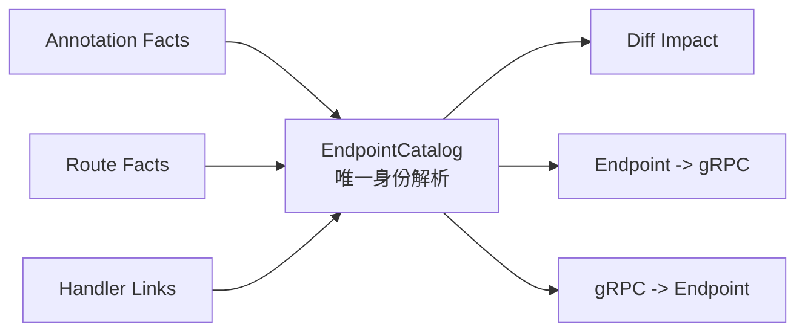
```mermaid
flowchart LR
    ANNO["Annotation Facts"]
    ROUTE["Route Facts"]
    LINK["Handler Links"]
    CATALOG["EndpointCatalog<br/>唯一身份解析"]
    IMPACT["Diff Impact"]
    FORWARD["Endpoint -> gRPC"]
    REVERSE["gRPC -> Endpoint"]

    ANNO --> CATALOG
    ROUTE --> CATALOG
    LINK --> CATALOG
    CATALOG --> IMPACT
    CATALOG --> FORWARD
    CATALOG --> REVERSE
```

`internal/impact`、`internal/dependency` 和 `internal/output` 不得各自复制 Annotation-first、Route Fallback 或 Alias 判断。这样才能保证：

```text
EndpointCatalog 中存在 Endpoint A
  -> A 可以作为 Diff 传播终点
  -> A 可以作为 endpoint-assets 输入
  -> A 可以出现在 impact --grpc 的 Consumer 中
```

### 3.4 Diff 使用变更后源码

输入项目目录表示变更后的源码快照，Diff 负责提供：

- 哪些文件发生变化。
- 新版本中的新增或修改行号。
- 被删除的原始行。
- 用于校验 Diff 与源码快照一致的上下文。

项目源码负责提供完整声明和依赖关系。Diff 不单独承担 Go 语义解析。

### 3.5 两类图服务不同问题

Diff 影响传播和 gRPC 依赖查询不能混用一张无类型图：

| 查询 | 使用的边 | 原因 |
| --- | --- | --- |
| 代码变化影响哪些 Endpoint | Call、Value、Type 的反向引用边 | DTO、变量和函数值变化都可能影响入口 |
| Endpoint 调用了哪些 gRPC | 只使用可执行 Call 边 | Type/Value 依赖不代表会执行 RPC |
| gRPC 影响哪些 Endpoint | 从 gRPC Call Site 沿 Call 边反查 Handler | 保证链路表达的是可执行调用关系 |

### 3.6 正式结论与 Diagnostic 分离

- `impact` JSON 只输出正式的 Endpoint、IM 和来源证据。
- 项目加载和事实提取阶段无法解析、存在歧义或发生降级的情况进入 `facts` JSON 的 `diagnostics`。
- 变更文件本身无法解析时，分析直接失败。
- 未变化文件的局部解析失败可以记录 Diagnostic 并继续。

因此，`impact` 命令成功表示流水线完成，不表示所有动态代码都已被覆盖。需要排查零结果或可疑缺口时，应使用相同 Project 和 Build Context 运行 `facts`，并与 `impact` 结果一起保存。

Diff 映射、删除恢复和 Module Usage 属于本次分析会话，相关 Diagnostic 不能通过另一次无 Diff 的 `facts` 完整重建。

MVP 保持正式影响 JSON 纯净；会话级 Diagnostic 按第 11.2 节通过独立结构化结果交付，不能用非结构化日志冒充正式结果。

## 4. 总体架构与运行顺序

### 4.1 模块协作

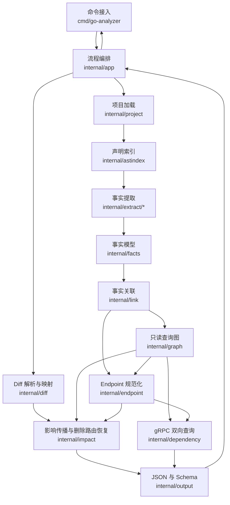
```mermaid
flowchart TB
    CLI["命令接入<br/>cmd/go-analyzer"]
    APP["流程编排<br/>internal/app"]
    PROJECT["项目加载<br/>internal/project"]
    AST["声明索引<br/>internal/astindex"]
    DIFF["Diff 解析与映射<br/>internal/diff"]
    FACTS["事实模型<br/>internal/facts"]
    EXTRACT["事实提取<br/>internal/extract/*"]
    LINK["事实关联<br/>internal/link"]
    GRAPH["只读查询图<br/>internal/graph"]
    ENDPOINT["Endpoint 规范化<br/>internal/endpoint"]
    DEPENDENCY["gRPC 双向查询<br/>internal/dependency"]
    IMPACT["影响传播与删除路由恢复<br/>internal/impact"]
    OUTPUT["JSON 与 Schema<br/>internal/output"]

    CLI --> APP
    APP --> PROJECT --> AST
    APP --> DIFF
    AST --> EXTRACT
    EXTRACT --> FACTS
    FACTS --> LINK
    LINK --> GRAPH
    LINK --> ENDPOINT
    GRAPH --> ENDPOINT
    GRAPH --> DEPENDENCY
    ENDPOINT --> DEPENDENCY
    DIFF --> IMPACT
    GRAPH --> IMPACT
    ENDPOINT --> IMPACT
    IMPACT --> OUTPUT
    DEPENDENCY --> OUTPUT
    OUTPUT --> APP --> CLI
```

### 4.2 一次 `impact` 的执行顺序


```mermaid
flowchart LR
    A["1. 校验参数与绝对路径"]
    B["2. 解析并校验 Diff"]
    C["3. 加载项目与声明索引"]
    D["4. 提取并关联 BFF 事实"]
    E["5. 映射代码与 Module 变化"]
    F["6. Freeze 事实快照"]
    G["7. 构建 Graph 与 EndpointCatalog"]
    H["8. 传播代码影响"]
    I["9. 可选执行 gRPC 反查"]
    J["10. 构建并渲染 JSON"]

    A --> B --> C --> D --> E --> F --> G --> H --> I --> J
```

没有 Diff、只有 gRPC 输入时，跳过第 2、5、8 步，也不加载 Module Change 配置。

没有 gRPC 输入时，不加载 Generated Client 依赖，避免增加普通 Diff 分析的耗时和失败面。

### 4.3 阶段输入与产物

| 阶段 | 读取 | 写入或返回 |
| --- | --- | --- |
| Project Load | 项目目录、Build Context | Package、File、AST、Module Path |
| AST Index | AST | Symbol 和轻量类型索引 |
| Fact Extraction | AST、Index | Annotation、Route、Reference、IM、gRPC 等事实 |
| Link | Route、Handler、Annotation | `LinkFact` 和已解析 Handler |
| Diff Map | Diff 行、源码事实 | `ChangeFact` |
| Module Map | go.mod Diff、Import | `ModuleChangeFact`、`ModuleUsageFact` |
| Freeze 与 Query View | 完整 Fact Store | 只读 Snapshot、Graph、EndpointCatalog |
| Impact | Change、只读查询图 | 每个变化根的传播树 |
| gRPC Query | 完整接口名、Call Graph | BFF Consumer 和调用链 |
| Output | 传播树和查询结果 | 稳定 JSON |

## 5. 数据模型

### 5.1 五层数据

为了理解数据生命周期，可以把一次分析分成五层：

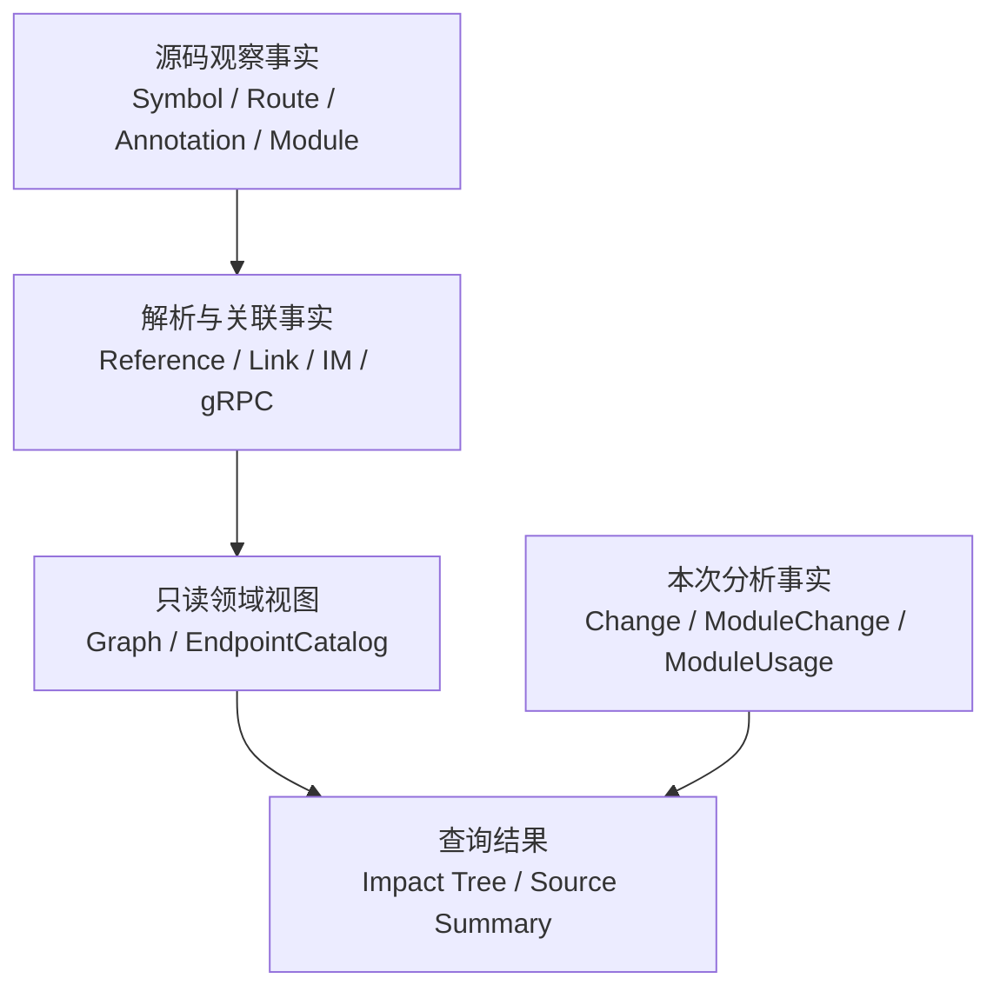
```mermaid
flowchart TB
    OBSERVED["源码观察事实<br/>Symbol / Route / Annotation / Module"]
    DERIVED["解析与关联事实<br/>Reference / Link / IM / gRPC"]
    SESSION["本次分析事实<br/>Change / ModuleChange / ModuleUsage"]
    VIEW["只读领域视图<br/>Graph / EndpointCatalog"]
    RESULT["查询结果<br/>Impact Tree / Source Summary"]

    OBSERVED --> DERIVED --> VIEW
    VIEW --> RESULT
    SESSION --> RESULT
```

| 层 | 生命周期 | 是否进入 `facts` JSON |
| --- | --- | --- |
| 源码观察事实 | 随项目源码变化 | 是 |
| 解析与关联事实 | 随项目源码和解析规则变化 | 是 |
| 只读领域视图 | 随完整 Fact 快照变化 | 否 |
| 本次分析事实 | 只属于一次 Diff 分析 | 否 |
| 查询结果 | 只属于一次命令输出 | 进入 `impact` JSON |

### 5.2 核心事实

| Fact | 回答的问题 |
| --- | --- |
| `ProjectFact` | 分析的是哪个 Module，使用什么构建条件 |
| `SymbolFact` | 项目中有哪些函数、方法、类型、包级变量和常量 |
| `ReferenceFact` | 哪个 Symbol 以 Call、Value 或 Type 方式依赖哪个 Symbol |
| `AnnotationFact` | 哪个 Handler 注释声明了什么 HTTP 接口 |
| `RouteGroupFact` | Group 的变量、Prefix 和父子关系是什么 |
| `RouteGroupFlowFact` | Group 如何跨函数参数或返回值流转 |
| `RouteRegistrationFact` | 哪个 Group 注册了什么 Method、Path 和 Handler |
| `MiddlewareBindingFact` | 哪个 Group 在什么顺序绑定了什么 Middleware |
| `LinkFact` | Route、Handler 和 Annotation 如何对应 |
| `IMEventFact` | 哪个 Sender 发送什么 Event，依赖什么 Payload 或条件 |
| `GrpcOperationFact` | Generated Client 方法对应哪个完整 gRPC 接口 |
| `GrpcCallFact` | BFF 中哪个 Caller 调用了哪个 Generated Client 方法 |
| `ModuleDependencyFact` | go.mod 声明了哪些 require，以及它们关联的 replace |
| `ChangeFact` | 本次 Diff 命中了哪个传播起点 |
| `ModuleChangeFact` | 哪个 Module 发生新增、删除、升级、降级或替换 |
| `ModuleUsageFact` | 变化 Module 在本项目的真实 Import 使用入口 |
| `DiagnosticFact` | 哪条静态证据无法解析、存在歧义或发生降级 |

### 5.3 Fact 之间如何关联

Fact 不复制其它对象，而是通过稳定 ID 关联：

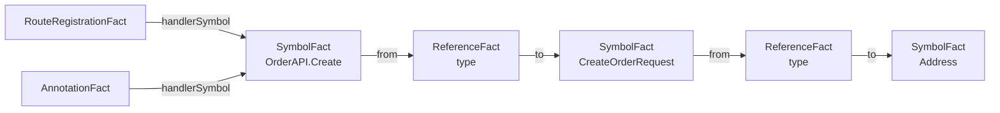
```mermaid
flowchart LR
    ADDRESS["SymbolFact<br/>Address"]
    REF1["ReferenceFact<br/>type"]
    REQUEST["SymbolFact<br/>CreateOrderRequest"]
    REF2["ReferenceFact<br/>type"]
    CREATE["SymbolFact<br/>OrderAPI.Create"]
    ROUTE["RouteRegistrationFact"]
    ANNO["AnnotationFact"]

    REQUEST -->|"from"| REF1 -->|"to"| ADDRESS
    CREATE -->|"from"| REF2 -->|"to"| REQUEST
    ROUTE -->|"handlerSymbol"| CREATE
    ANNO -->|"handlerSymbol"| CREATE
```

主要关联字段：

- `ReferenceFact.fromSymbol` 指向引用者。
- `ReferenceFact.toSymbol` 指向被引用声明。
- `RouteRegistrationFact.handlerSymbol` 指向 Handler。
- `AnnotationFact.handlerSymbol` 指向注释所属 Handler。
- `LinkFact.fromID/toID` 保存已经解析清楚的关系。
- `ChangeFact.symbolID/targetID` 指向本次变化根。
- `GrpcCallFact.callerSymbol/operationID` 连接业务调用点和 gRPC 接口。

### 5.4 ID 的稳定含义

Symbol ID 采用以下形式：

```text
func:<package>::<name>
method:<package>:<receiver>:<name>
type:<package>::<name>
var:<package>::<name>
const:<package>::<name>
```

“稳定”表示同一份源码快照和同一解析规则会得到相同 ID。它是输出中的关联键，应被调用方视为不透明字符串，不承诺代码重命名、文件移动或路由语句顺序变化后仍保持不变。

Route、Annotation、IM 和 gRPC Fact 也有各自的确定性 ID，用于去重和证据关联。

### 5.5 Store 生命周期

`facts.Store` 是一次流水线内的共享事实容器：


```mermaid
flowchart LR
    LOAD["项目加载"]
    EXTRACT["Extractor"]
    LINK["Linker"]
    MAP["Diff / Module Mapper"]
    FREEZE["只读查询阶段"]
    OUTPUT["输出投影"]

    LOAD --> EXTRACT --> LINK --> MAP --> FREEZE --> OUTPUT
```

约束：

1. `internal/app` 是唯一了解完整执行顺序的编排层。
2. Extractor 只能写入自己负责的事实。
3. Extractor 不直接调用其它 Extractor。
4. Linker 只连接已经存在的事实。
5. Change 和 Module Usage 在源码事实完成后写入。
6. 所有写入结束后建立逻辑 Freeze 边界；Graph、Endpoint、Dependency 和 Impact 只接收只读快照。
7. Output 不重新扫描 AST，也不补推业务关系。

“Freeze”是架构约束，不应只依赖调用顺序约定。事实构建 API 应把可写 Builder 与只读 Snapshot 分离，避免查询阶段意外追加或覆盖 Fact。

完整 Store 字段见附录 A。

## 6. 项目加载与事实提取

### 6.1 项目加载

项目根目录必须包含 `go.mod`。加载阶段：

1. 读取 Module Path。
2. 递归扫描项目目录下的 `.go` 文件。
3. 跳过 `_test.go`，以及名称以 `.`、`_` 开头的文件或目录、`vendor`、`node_modules` 和 `testdata`。
4. 根据 GOOS、GOARCH、Build Tags 和 cgo 应用 Go Build Constraints。
5. 使用 `parser.ParseComments` 解析 AST。
6. 按 Package Path 组织文件。
7. 为嵌套 `go.mod` 下的源码使用对应 Module Path 建立声明身份。

例如：

```text
transport_linux.go   仅 GOOS=linux 时参与分析
transport_darwin.go  仅 GOOS=darwin 时参与分析
feature_new.go       仅指定 feature_new Build Tag 时参与分析
```

这里的“参与分析”表示文件通过构建条件过滤，不表示其 Package 一定从 `main` 可达。

CLI 的一次分析单元仍是 `--project` 根目录对应的根 Module：

- 根 `go.mod` 决定项目身份、Module Change 和 Generated Dependency 发现。
- 嵌套 Module 的源码可以获得正确 Package Identity，但嵌套 `go.mod` 不并入根 Module 的依赖变化分析。
- 需要完整分析多个 Module 时，编排层必须分别以每个 Module 根目录调用分析器，再按稳定接口身份汇总。

### 6.2 声明索引

索引覆盖：

- Package-level Function。
- Receiver Method。
- Type Declaration。
- Package-level Var。
- Package-level Const。

Struct Field 和局部变量不建立独立 Symbol，但会作为类型或值解析证据。Struct Field 或 Tag 的 Diff 归属到所在 Type。

### 6.3 Reference 提取

只分析函数调用不足以覆盖 BFF：

```go
group.POST("/orders", controller.API.Create) // Create 作为函数值

func Create(req model.CreateOrderRequest) {} // Create 使用请求类型
```

因此 Reference 分为：

| Kind | 示例 | 影响传播用途 |
| --- | --- | --- |
| `call` | `service.Load()` | 被调函数变化影响哪些 Caller |
| `value` | `controller.API.Create` 作为参数 | Handler、变量或常量变化影响哪些使用者 |
| `type` | 参数使用 `CreateOrderRequest` | DTO、字段或 Tag 变化影响哪些方法 |

目标必须唯一解析到项目内 Symbol 才形成确定 Reference。外部调用不会伪造为项目内 Symbol。

### 6.4 Annotation 提取

Annotation Extractor 从 Handler 注释中提取 HTTP Method 和 Path：

```go
// @Post /admin/api/bff-web/orders
func (api *OrderAPI) Create(...) {}
```

Annotation 必须绑定到明确的 Function 或 Method Symbol。普通注释不会产生 HTTP Endpoint。

### 6.5 Route、Group 与 Middleware 提取

典型路由：

```go
admin := root.Group("/admin")
web := admin.Group("/api/bff-web")
web.Use(Auth())
web.POST("/orders", controller.API.Create)
```

分析器记录：

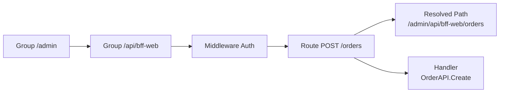
```mermaid
flowchart LR
    G1["Group /admin"]
    G2["Group /api/bff-web"]
    MW["Middleware Auth"]
    ROUTE["Route POST /orders"]
    PATH["Resolved Path<br/>/admin/api/bff-web/orders"]
    HANDLER["Handler<br/>OrderAPI.Create"]

    G1 --> G2 --> MW --> ROUTE --> PATH
    ROUTE --> HANDLER
```

支持的静态关系包括：

- Group Prefix 和父子 Group。
- Group 作为函数参数传递。
- 函数直接返回 Group。
- 项目内 Route Wrapper 和 Handler Wrapper。
- Package Var、Struct Field 和 Method Value 形式的 Handler。
- 同一 Group 中 Route 和 Middleware 的源码语句顺序。

Middleware 影响采用静态顺序语义：

- 同一 Route Function 中，`.Use()` 只关联源码顺序在它之后的 Route。
- 跨 Route Function 的同一 Group 传播不使用单函数内的语句顺序比较。
- 分支条件不会被证明为互斥，结果保持 `may-impact` 语义。

### 6.6 Link

Route 最初只保存原始 Handler 表达式：

```go
controller.API.Create
```

Link 阶段将它解析为稳定 Method Symbol，再关联 Handler Annotation：

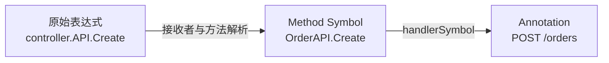
```mermaid
flowchart LR
    RAW["原始表达式<br/>controller.API.Create"]
    HANDLER["Method Symbol<br/>OrderAPI.Create"]
    ANNO["Annotation<br/>POST /orders"]

    RAW -->|"接收者与方法解析"| HANDLER
    HANDLER -->|"handlerSymbol"| ANNO
```

无法唯一确定 Handler 时：

- Route Fact 保留 `handlerRaw`。
- `handlerSymbol` 留空。
- 写入 Diagnostic。
- 不按同名方法猜测。

## 7. Diff、Module 与影响传播

### 7.1 Unified Diff 解析

Diff Parser 接受标准 Git Unified Diff，提取：

- `OldPath`、`NewPath` 和文件状态。
- 新版本中的新增行范围。
- 删除块的旧行号、新版本锚点和原始文本。
- 每个文件的原始 Patch。
- 用于校验变更后源码的上下文和新增行。

解析器明确拒绝 Combined Diff。二进制 Patch 不进入 Go 语义映射。

### 7.2 Diff 与源码快照校验

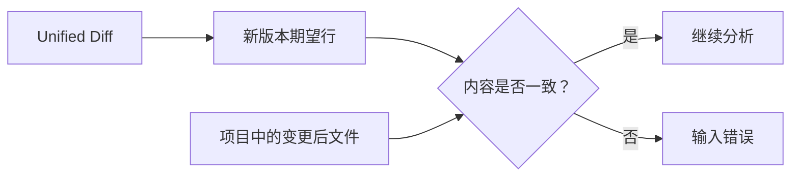
```mermaid
flowchart LR
    DIFF["Unified Diff"]
    EXPECT["新版本期望行"]
    SOURCE["项目中的变更后文件"]
    CHECK{"内容是否一致？"}
    NEXT["继续分析"]
    ERROR["输入错误"]

    DIFF --> EXPECT --> CHECK
    SOURCE --> CHECK
    CHECK -->|"是"| NEXT
    CHECK -->|"否"| ERROR
```

校验包括：

- Diff 路径在词法清理和符号链接解析后都必须位于项目根目录内。
- Diff 命中的源码文件不得通过符号链接指向项目目录之外。
- 删除文件在变更后目录中必须不存在。
- 新增和上下文行必须与变更后源码一致。
- 纯删除区域使用删除块与锚点补充校验。
- 变更后的 Go 文件必须能够解析。

路径安全属于输入契约，不是部署建议。即使分析目录来自受信任的 CI Checkout，也不能只用 `filepath.Clean` 代替真实路径边界校验。

### 7.3 变化行映射

Diff 只有文件和行号。映射阶段按以下优先级为每一行选择一个最具体的变化根：

```text
Annotation
  -> Route Group
  -> Route Registration
  -> Middleware Binding
  -> 后端协议扩展位：Job Registration
  -> 后端协议扩展位：Dubbo Method
  -> 后端协议扩展位：Dubbo Service
  -> 最小包含的 Function / Method / Type / Var / Const
  -> File Fallback
```

同一目标上的相邻变化行合并为一个 ChangeFact。

BFF `impact` 不构建 Job 或 Dubbo Fact，因此三个后端协议扩展位在 BFF 流水线中没有候选。它们保留在共用 Diff Mapper 中，供独立的后端入站契约分析使用；本文不展开其传播规则。

该映射属于“声明级变化”：

- 修改函数体任意行，变化根是该 Function 或 Method。
- 修改 Struct Field 或 Tag，变化根是所在 Type。
- 修改 Route 调用，变化根是该 Route。
- 普通注释或格式变化如果落在声明 Span 中，也会映射到该声明。
- 方案不比较新旧 AST 是否语义等价。

### 7.4 Diff 支持边界

| 变化 | 处理 |
| --- | --- |
| 新增或修改 Go 行 | 映射到变更后源码事实 |
| 删除 Route | 从删除块恢复 Method、Path、Handler 等必要证据 |
| 删除 Handler 与 Annotation | 在删除块证据足够时恢复合成事实 |
| 删除普通 Symbol | 尽量映射到存活声明；否则降级为 File 并记录 Diagnostic |
| 删除整个文件 | 保留文件来源；只有可恢复的领域证据进入正式结论 |
| 只有路径变化、没有 Hunk 的纯 Rename | 不产生声明级传播根 |
| Binary Diff | 不进行 Go 语义传播 |
| Combined Diff | 直接拒绝 |

### 7.5 删除 Route 恢复

```diff
 func Init(group *Group) {
-    group.POST("/orders", controller.API.Create)
 }
```

处理过程：

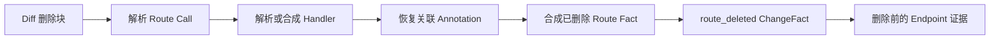
```mermaid
flowchart LR
    BLOCK["Diff 删除块"]
    PARSE["解析 Route Call"]
    HANDLER["解析或合成 Handler"]
    ANNO["恢复关联 Annotation"]
    ROUTE["合成已删除 Route Fact"]
    CHANGE["route_deleted ChangeFact"]
    ENDPOINT["删除前的 Endpoint 证据"]

    BLOCK --> PARSE --> HANDLER --> ANNO --> ROUTE --> CHANGE --> ENDPOINT
```

恢复只使用删除块、当前声明索引和可证明的 Group 上下文，不构造完整旧版本项目。证据不足时保留 Diagnostic，不猜测接口。

### 7.6 go.mod 变化

`go.mod` 版本变化不能直接扩散到整个项目。处理过程为：

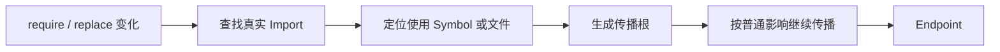
```mermaid
flowchart LR
    MOD["require / replace 变化"]
    IMPORT["查找真实 Import"]
    USAGE["定位使用 Symbol 或文件"]
    CHANGE["生成传播根"]
    WALK["按普通影响继续传播"]
    ENDPOINT["Endpoint"]

    MOD --> IMPORT --> USAGE --> CHANGE --> WALK --> ENDPOINT
```

Module Usage 分为：

| Basis | 含义 |
| --- | --- |
| `matched_import_usage` | 可以定位到使用该 Module 的具体 Symbol |
| `matched_file_usage` | 只能定位到 Import 所在文件中的声明 |
| `module_unreferenced` | 项目中没有匹配 Import，不产生 Endpoint 影响 |

Module 结论表示“依赖清单变化可能通过本仓 Import 使用点影响接口”，不表示分析器比较了依赖升级前后的 API 实现。

### 7.7 Module 噪音配置

配置只控制 `go.mod` Module Change：

```json
{
  "analyzeModuleChanges": true,
  "ignoredModuleChanges": [
    "gopkg.inshopline.com/sc1/app/modules/*/proto"
  ]
}
```

规则：

- `analyzeModuleChanges` 未配置时默认为 `true`。
- `false` 表示关闭全部 Module Change 分析。
- `ignoredModuleChanges` 是忽略列表，支持精确 Module Path 和 `path.Match` 风格 Glob。
- 未知字段、空模式和非法 Glob 直接报错。
- 配置不影响 Annotation、Route、Middleware、IM 或 gRPC 解析。

配置路径：

- `--impact-config` 显式指定时必须是绝对路径。
- 未指定时尝试读取项目内 `.analyzer/go-impact.config.json`。
- 默认文件不存在时使用空配置。
- 只有存在 `--diff` 时才加载配置；仅有 `--grpc` 时不读取自动发现配置。
- 没有 `--diff` 却显式传入 `--impact-config` 属于无效参数组合，直接失败。

### 7.8 影响查询图

事实关联完成后，构建四种只读索引：

| 查询图 | 方向 | 用途 |
| --- | --- | --- |
| Reverse Graph | `ToSymbol -> References FromSymbol` | 从变化声明反查所有使用者 |
| Route Graph | Handler/Group/Middleware -> Route/Annotation | 从代码声明落到 HTTP 接口 |
| Call Graph | Caller <-> Callee | BFF 与 gRPC 双向查询 |
| IM Graph | Sender -> IM Event 及依赖 | 判断变化路径命中哪个 Event |
| Endpoint Catalog | Handler <-> Endpoint，并聚合 Route 候选 | 统一 Diff 和 gRPC 查询的接口身份 |

### 7.9 不同变化根如何传播

| Change Kind | 入口行为 |
| --- | --- |
| `symbol_changed` | 沿 Call、Value、Type 反向引用展开 |
| `annotation_changed` | 直接生成 Annotation Endpoint |
| `route_changed` | 展开 Route、Handler 和 Endpoint |
| `route_deleted` | 展开恢复出的删除 Route |
| `route_group_changed` | 展开 Group 和所有静态子 Group 的 Route |
| `middleware_changed` | 展开受静态顺序影响的 Route |
| `file_changed` | 保留文件根，不扩大到整个 Package 或项目 |

### 7.10 DFS 传播与资源边界

每个 ChangeFact 独立产生一棵树：

```text
展开(当前 Symbol, 当前 DFS 路径):
  查找所有直接使用当前 Symbol 的上层 Symbol
  对每个上层 Symbol:
    如果已经存在于当前路径:
      标记 cycle，不再递归
    否则:
      加入当前路径
      递归展开
      从当前路径移除

  查找当前 Symbol 关联的 Route、Middleware 和 IM Event
  生成能够证明的 Endpoint 或 IM 终点
  合并同一父节点下 ID 与 Relation 相同的子节点
```

约束：

- Path Set 只用于当前 DFS 分支的循环识别。
- 同一个 Symbol 可以出现在不同的有效分支。
- 每个变化根保留自己的来源原因，不跨根覆盖。
- Endpoint 和已解析 IM Event 在摘要中全局去重。
- 所有集合在输出前稳定排序。

循环检测只能阻止环路无限递归，不能限制有向无环图中的路径组合数量。为避免大仓或异常 Diff 占满进程资源，运行时必须同时具备：

| 保护 | 行为 |
| --- | --- |
| Context 取消 | CLI 接收进程信号，上层 API 可以主动取消 |
| 阶段超时 | Project Load、Dependency Load 和 Impact Walk 可以分别终止 |
| 节点预算 | 限制单 Root 与整次分析产生的节点总数 |
| 深度预算 | 防止异常调用链或类型链耗尽调用栈 |
| 输入预算 | 限制 Diff 总大小、单行大小和文件数量 |

任何预算超限都返回稳定的 Typed Analysis Error，不输出被截断后却看似完整的正式 JSON。跨命令缓存、SCC/DAG 压缩和多 Change Root 复用可以独立优化，但不能改变查询语义和稳定排序。

## 8. 输出契约

### 8.1 顶层结构

没有有效 Module Change 时：

```json
{
  "summary": {
    "impactedEndpointCount": 0,
    "impactedEndpoints": [],
    "impactedIMCount": 0,
    "impactedIMEvents": []
  },
  "fileSources": [],
  "grpcSources": [],
  "endpointSourcesSummary": []
}
```

存在有效 Module Change 时，`moduleSources` 位于 `fileSources` 和 `grpcSources` 之间：

```jsonc
{
  "summary": {},
  "fileSources": [],
  "moduleSources": [],
  "grpcSources": [],
  "endpointSourcesSummary": []
}
```

JSON Object 的字段顺序用于稳定输出和人工阅读，调用方应按字段名解析，不依赖位置。

### 8.2 `summary`

```go
type ImpactSummary struct {
	ImpactedEndpointCount int
	ImpactedEndpoints     []EndpointSummary
	ImpactedIMCount       int
	ImpactedIMEvents      []string
}
```

计数始终等于对应去重数组长度。

Endpoint 的去重键是：

```text
Uppercase(Method) + NUL + Path
```

`routes` 不参与 Endpoint 身份去重；同一 Endpoint 的多个 Route 候选会合并。

### 8.3 `fileSources`

```go
type FileSourceImpact struct {
	SourceFile        string
	Diff              string
	Symbols           map[string]ImpactNode
	ImpactedEndpoints []EndpointSummary
	ImpactedIMEvents  []string
}
```

说明：

- `sourceFile` 使用项目相对路径和 `/` 分隔符。
- `diff` 保留该文件的原始 Patch。
- `symbols` 按变化根 ID 保存递归影响树。
- `symbols` 是既有契约字段名，树中可以包含非 Symbol 的 Route、Annotation、Endpoint 和 IM 节点。
- 无法映射到 Symbol 的文件根使用内部聚合键 `__non_symbol__`。
- `impactedEndpoints` 和 `impactedIMEvents` 是该文件来源内的去重摘要。

### 8.4 `ImpactNode`

| 字段 | 含义 |
| --- | --- |
| `id` | Symbol 或领域 Fact 的确定性 ID |
| `kind` | `func`、`method`、`type`、`route`、`annotation`、`endpoint`、`im_event` 等 |
| `name` | 人类可读名称 |
| `file` | 项目相对源码文件 |
| `package` | Go Package Path |
| `relation` | 相对父节点的关系，例如 `call`、`type_ref`、`registered_handler` |
| `raw` | 原始表达式或协议证据 |
| `level` | 根为 0 的树深度 |
| `cycle` | 该节点在当前 DFS 路径中形成循环 |
| `method/path` | Route、Annotation 或 Endpoint 的 HTTP 信息 |
| `fullMethod` | gRPC 终点的完整接口名 |
| `children` | 递归子节点，空时输出 `[]` |

Impact JSON 不输出普通节点的源码行列 Span。需要精确行列和完整 Diagnostic 时，使用 `facts` 命令并按 Fact ID 关联。

### 8.5 `moduleSources`

每个 Module Source 包含：

- Module Path。
- Change Type。
- 变化前后 Version。
- 变化前后 Replace。
- Usage Basis。
- 按真实使用文件组织的 `sourceFiles`。

`sourceFiles` 与普通 `fileSources` 使用相同的传播树结构。

### 8.6 `grpcSources`

每个 gRPC Source 包含：

- 完整 gRPC 接口身份。
- BFF Consumer Endpoint。
- Route 候选。
- `may_call` 关系。
- Handler。
- Generated Client Binding。
- 从 Handler 到 gRPC Call Site 的调用链。

### 8.7 `endpointSourcesSummary`

```json
{
  "method": "POST",
  "path": "/orders",
  "sources": [
    {
      "sourceType": "file",
      "sourceFile": "model/model.go",
      "rootSymbols": [],
      "chains": []
    }
  ]
}
```

`sourceType` 取值：

- `file`
- `module`
- `grpc`

同一 Endpoint 可以同时包含多种来源。每个来源保留：

- 文件、Module 或完整 gRPC 接口信息。
- File/Module 来源中能到达该 Endpoint 的变化根。
- 每个来源到 Endpoint 的一条最短人读链路。

所有 `chains` 使用统一方向：

```text
file:
  changed symbol -> caller -> handler -> route/annotation -> endpoint

module:
  changed module -> import usage -> caller -> handler -> route/annotation -> endpoint

grpc:
  grpc full method -> generated client -> call site -> caller -> handler -> endpoint
```

`rootSymbols` 只描述 File/Module 的代码变化根。gRPC 来源的根是 `grpcFullMethod`，不是 Go Symbol，因此输出空 `rootSymbols`，其完整来源身份由 `grpcFullMethod` 和 Chain 首节点表达。

### 8.8 稳定性

同一分析器版本、同一项目源码、同一 Diff、同一 gRPC 输入、同一 Build Context 和同一配置应产生字节级稳定 JSON：

- Slice 使用固定排序规则。
- Map 以稳定键序列化。
- Endpoint、IM、Fact 和 Chain 使用确定性去重键。
- 必填集合为空时输出 `[]`，不输出 `null`。
- 可选的 `moduleSources` 无内容时省略。
- Go 输出结构、JSON Schema 和 Golden Sample 保持一致。

四个结果视图还必须满足集合不变量。设 `key(endpoint) = Uppercase(Method) + NUL + Path`：

```text
summary.endpointKeys
  = union(fileSources[].impactedEndpoints)
  ∪ union(moduleSources[].sourceFiles[].impactedEndpoints)
  ∪ union(grpcSources[].impactedEndpoints)
  = endpointSourcesSummary.endpointKeys
```

同一 Endpoint 在多个 Handler、Root 或 Source 下出现时，`routes` 取所有已证明 Route 候选的去重并集，不能由后写入的来源覆盖先前证据。

Impact JSON 不包含：

- 绝对项目路径。
- Build Context。
- Diagnostic。
- Schema Version 或 Analyzer Version。
- Timings。

Schema 通过 `schema --type impact` 单独获取。

## 9. BFF 出站 IM

### 9.1 识别原则

IM 分析先证明“这是 IM 发送”，再解析 Event、Payload 和条件依赖。只看到名为 `Event` 的方法或字段不足以认定为 IM。

### 9.2 公共 SDK

精确匹配 Import：

```text
gopkg.inshopline.com/sc1/commons/utils/bus/notify/im
```

以及函数：

```text
SendIm
SendImAsync
SendImToUid
SendImToUidAsync
```

以 `SendIm` 为例：

```go
notifyim.SendIm(ctx, "app", "group", "order/created", payload)
```

第 4 个参数是 Event，第 5 个参数是 Payload。Import、函数名或参数位置不满足协议时不生成 IM Fact。

### 9.3 Broadcast 协议

项目中必须同时存在：

```text
broadcast://
/broadcast/send
```

满足双锚点后，再识别：

- `BroadcastParams{Event: ...}` Wrapper。
- 同一发送对象上的 `Body` 赋值。
- `.Event(topic)` 调用。

双锚点和对象绑定用于降低普通 `Event` 方法或 `Body` 字段造成的误报。

### 9.4 Event 求值与传播

Event 支持：

- String Literal。
- Const。
- 字符串拼接。
- Imported Const。
- 可证明的 Enum 与字符串表。
- 项目内函数返回值模板传播。

IM Fact 同时记录：

- Sender Symbol。
- Event 原始表达式和静态值。
- Payload 依赖。
- Event Value 依赖。
- Control 依赖。
- 证据 Span。

动态 Event 使用 `resolved=false`：

- 在完整树中输出 `im_event_unresolved`。
- 不进入 `impactedIMEvents`。
- 不增加 `impactedIMCount`。

## 10. BFF 上游 gRPC 依赖

### 10.1 Generated Client Catalog

Generated Client Catalog 是：

> 从 Protobuf 生成代码提取的“Go Client 方法到完整 gRPC 接口名”的对照表。

Generated 文件通常包含：

```go
// Code generated by protoc-gen-go-grpc. DO NOT EDIT.

const OrderService_GetOrder_FullMethodName =
	"/shopline.order.v1.OrderService/GetOrder"

func (c *orderServiceClient) GetOrder(
	ctx context.Context,
	in *GetOrderRequest,
	opts ...grpc.CallOption,
) (*GetOrderResponse, error) {
	out := new(GetOrderResponse)
	err := c.cc.Invoke(
		ctx,
		OrderService_GetOrder_FullMethodName,
		in,
		out,
		opts...,
	)
	return out, err
}
```

Catalog 使用以下证据：

1. Generated Marker。
2. `Invoke` 或 `NewStream` 调用。
3. 完整接口字符串。
4. Client Interface。
5. Concrete Client Method。
6. Constructor、Interface 和实现方法之间的绑定。

得到：

```text
OrderServiceClient.GetOrder
  -> /shopline.order.v1.OrderService/GetOrder
```

完整接口名由三部分组成：

```text
/protobuf-package.Service/Method
```

它是跨仓串联的稳定身份，不能只按 Go 方法名匹配。

### 10.2 BFF 调用点

```go
type OrderGateway struct {
	client orderv1.OrderServiceClient
}

func (g *OrderGateway) LoadOrder(ctx context.Context, id string) error {
	_, err := g.client.GetOrder(ctx, &orderv1.GetOrderRequest{Id: id})
	return err
}

// @Get /orders/:id
func (api *OrderAPI) Detail(ctx *Context) {
	_ = api.gateway.LoadOrder(ctx, ctx.Param("id"))
}

func Init(group *Group) {
	group.GET("/orders/:id", controller.API.Detail)
}
```

只有同时满足以下条件才产生 `GrpcCallFact`：

1. Catalog 中存在该 Client Method 与完整接口名。
2. 调用 Receiver 的静态类型可以唯一解析到对应 Generated Client。
3. 调用位于项目内 Function 或 Method 中。

不会根据变量名、目录名、Message 名或相似方法名猜测 gRPC 接口。

### 10.3 双向查询

Endpoint 到 gRPC：

```text
GET /orders/:id
  -> OrderAPI.Detail
  -> OrderGateway.LoadOrder
  -> client.GetOrder
  -> /shopline.order.v1.OrderService/GetOrder
```

gRPC 到 Endpoint：

```text
/shopline.order.v1.OrderService/GetOrder
  -> client.GetOrder Call Site
  -> OrderGateway.LoadOrder
  -> OrderAPI.Detail
  -> GET /orders/:id
```

两种查询共用只包含 Call Reference 的 `CallGraph`。

从 Endpoint 向下查询时，按 Symbol 记忆“到 gRPC Call Site 的相对后缀链”，减少菱形调用图中的重复计算。循环边不继续展开。

两个方向都必须从同一个 `EndpointCatalog` 读取 Endpoint 与 Handler，不得分别扫描 Annotation 或 Route。由此形成双向不变量：

```text
endpoint-assets(A) 包含 gRPC B
  <=> impact --grpc B 包含 Endpoint A
```

合法的 gRPC Full Method 在当前 BFF 中没有 Consumer 时，`impact --grpc` 仍成功返回该 gRPC Source，`consumers` 和 `impactedEndpoints` 为空。

输入 Endpoint 不存在时，`endpoint-assets` 整体失败，不返回部分查询结果。

### 10.4 `endpoint-assets` 输出

`endpoint-assets` 是独立的稳定 JSON 契约：

```jsonc
{
  "project": {
    "module": "example.com/bff"
  },
  "endpointAssets": [
    {
      "endpoint": {"method": "GET", "path": "/orders/:id"},
      "routes": [{"method": "GET", "path": "/router/orders/:id"}],
      "handlers": [
        {
          "id": "method:example.com/bff/controller:OrderAPI:Detail",
          "kind": "method",
          "name": "Detail",
          "file": "controller/order.go"
        }
      ],
      "dependencies": {
        "grpc": [
          {
            "fullMethod": "/shopline.order.v1.OrderService/GetOrder",
            "protoPackage": "shopline.order.v1",
            "service": "OrderService",
            "method": "GetOrder",
            "clients": [],
            "chains": []
          }
        ]
      }
    }
  ]
}
```

其中：

- `endpoint` 是查询使用的正式 Endpoint 身份。
- `routes` 是该 Endpoint 对应 Handler 的静态注册证据。
- `handlers` 是与 Endpoint 关联的项目内 Symbol。
- `clients` 是 Generated Client Binding。
- `chains` 从 Handler 沿可执行 Call 走到 gRPC Call Site，并保留 Call Site 行列。
- 没有上游 gRPC 依赖时，`dependencies.grpc` 输出 `[]`。

该契约与 `facts`、`impact` 一样要求稳定排序、空数组和独立 JSON Schema。

### 10.5 依赖加载

只有 `facts`、`endpoint-assets` 或带 `--grpc` 的 `impact` 需要加载 gRPC Generated Client 依赖。

依赖发现使用只读 `go list`：

- 使用与项目相同的 Build Context。
- 屏蔽环境中的 Workspace 和额外 GOFLAGS。
- 根据项目选择 readonly 或 vendor Module Mode。
- 执行前后核对 `go.mod` 和 `go.sum` 未被修改。

命令仍可能需要本机 Module Cache、私有仓库凭据或网络环境。严格 gRPC 查询无法建立 Catalog 时直接失败，不输出部分 gRPC 结论。

## 11. 错误、Diagnostic 与可观测性

### 11.1 直接失败

以下情况不生成正式 JSON：

| 场景 | 原因 |
| --- | --- |
| 项目、Diff、显式配置或诊断输出路径不是绝对路径 | CLI 输入不符合契约 |
| 项目根缺少或无法解析 `go.mod` | 无法建立 Package 身份 |
| Diff 为空、格式非法或为 Combined Diff | 无法可靠定位变化 |
| Diff 路径逃逸项目根 | 输入不安全 |
| Diff 与变更后源码不匹配 | 行号和事实位置不可信 |
| Diff 命中的变更后 Go 文件无法解析 | 可能漏掉本次变化 |
| 配置包含未知字段或非法 Glob | 过滤行为不可信 |
| 严格 gRPC 查询无法建立依赖或 Catalog | gRPC 结论不完整 |
| 输出无法按 JSON 契约渲染 | 调用方无法安全消费 |

### 11.2 记录 Diagnostic 并继续

| 场景 | Diagnostic 作用 |
| --- | --- |
| 未变化 Go 文件无法解析 | 说明项目事实可能局部缺失 |
| Handler 或 Receiver 无法唯一解析 | 说明相关 Route 或 Call 无确定绑定 |
| Route Path 或 IM Event 是动态表达式 | 保留原始表达式，不伪造值 |
| 删除块只能恢复局部证据 | 说明删除分析发生降级 |
| Module 变化没有真实 Import | 说明没有业务传播入口 |
| Module Usage 只能定位到文件 | 说明传播精度降级 |

正式 `impact` JSON 不包含 Diagnostic。项目加载和事实提取类 Diagnostic 进入 `facts` JSON。

Diff 映射、删除恢复和 Module Usage 的 Diagnostic 属于分析会话，由应用层以独立的结构化结果承载。CLI 是否展示会话 Diagnostic 由显式开关控制，不能默认混入 stdout。

应用 API 返回：

```go
type RunResult struct {
	Output      []byte
	Diagnostics []DiagnosticFact
	Metrics     PipelineMetrics
}
```

CLI 通过可选的 `--diagnostics-output <absolute-path>` 原子写入：

```json
{
  "diagnostics": []
}
```

未传该参数时不生成 Sidecar。Sidecar 写入失败视为命令失败，不能先输出正式 JSON 再留下不完整的诊断文件。

### 11.3 错误输出

- JSON 写 stdout。
- Help 写 stdout。
- Flag 错误、Analysis Error 和普通错误写 stderr。
- Typed Analysis Error 使用：

```text
error_code=<code> message=<message>
```

- 成功退出码为 0。
- 错误退出码为非 0。
- “没有受影响接口”是成功结果，使用空数组和计数 0，不通过错误表达。

所有 Fatal Error 在离开 `internal/app` 前都必须归一化为稳定错误码，至少覆盖：

| 错误类别 | 稳定码示例 |
| --- | --- |
| CLI 输入 | `invalid_argument` |
| 项目加载 | `project_load_failed` |
| Diff 解析或快照不一致 | `diff_invalid`、`diff_snapshot_mismatch` |
| 配置 | `impact_config_invalid` |
| gRPC 依赖或绑定 | `dependency_load_failed`、`grpc_call_ambiguous` |
| 资源预算 | `analysis_budget_exceeded`、`analysis_cancelled` |
| 输出契约 | `output_render_failed` |

错误信息可以补充上下文，但调用方只能依赖错误码分类，不能解析自然语言。

### 11.4 Timings

传入 `--timings` 时，stderr 按流水线顺序输出：

```text
timing project_load=...
timing ast_index=...
timing reference_extract=...
timing impact_analyze=...
timing impact_render=...
```

不传 `--timings` 时不输出耗时。

主要观测阶段：

- Diff Read、Parse 和 Validate。
- Project Load。
- AST Index。
- 各类 Fact Extraction。
- Link。
- Diff Map。
- Deleted Route Recovery。
- Module Diff 和 Usage Map。
- Impact Analyze。
- gRPC Dependency、Catalog 和 Query。
- Output Build 和 Render。

### 11.5 结果数据安全

`impact` JSON 可能包含：

- 原始 Git Patch。
- Handler、Route、Annotation 和 Event 的原始表达式。
- 项目相对文件路径和 Package Path。

`facts` JSON 还包含项目根目录和更完整的源码位置、Diagnostic 与依赖证据，敏感级别不低于 `impact`。

因此产物应按源码数据处理。上层系统需要控制访问、存储周期和日志范围，不应把完整 JSON 写入公开日志；对外展示前应移除本机绝对路径。

## 12. 模块分层

| 模块 | 负责 | 不负责 |
| --- | --- | --- |
| `cmd/go-analyzer` | 命令、Flag、绝对路径、stdout/stderr | AST 规则和影响传播 |
| `internal/app` | Pipeline 编排、Mode、错误转换、Timings | 具体协议语法 |
| `internal/project` | Module、Build Context、文件、AST、依赖发现 | Endpoint 结论 |
| `internal/astindex` | 声明身份和轻量类型解析 | Diff 和输出 |
| `internal/facts` | 共享 Fact 数据结构 | 执行查询 |
| `internal/extract/*` | 从 AST 或 Generated Dependency 提取事实 | 跨 Fact 传播 |
| `internal/link` | Route、Handler、Annotation 和 Middleware Symbol 关联 | 重新扫描项目 |
| `internal/diff` | Unified Diff 解析、校验和 Change 映射 | 业务 Endpoint 汇总 |
| `internal/graph` | Reverse、Route、Call、IM 查询视图 | 修改 Store |
| `internal/endpoint` | Annotation-first、Route Fallback、Alias 和 Handler 的统一 EndpointCatalog | Diff 或 gRPC 专属传播 |
| `internal/dependency` | 基于 EndpointCatalog 和 CallGraph 执行 Endpoint 与 gRPC 双向查询 | 重复实现 Endpoint 身份 |
| `internal/impact` | Change 传播树和删除 Route 恢复 | CLI 和 JSON Schema |
| `internal/output` | JSON 投影、排序、去重和 Schema | 生产业务 Fact |
| `internal/config` | Module Change 过滤配置 | Route 或协议配置 |

依赖原则：

```text
project / astindex / facts
  -> extract / link / diff
  -> graph / endpoint
  -> dependency / impact
  -> output
  -> app
  -> cmd
```

禁止：

- CLI 内直接写 AST 规则。
- Output 反向调用 Extractor。
- Extractor 直接调用 Impact。
- Graph 或 Output 修改源码事实。
- 不同 Extractor 共享私有 AST 缓存。
- Impact 与 Dependency 各自实现一套 Endpoint 身份规则。

新增一种 BFF 协议时，应按顺序定义：

1. 最低静态证据。
2. 原子 Fact。
3. Extractor。
4. 与 Symbol、Route 或 Endpoint 的关系。
5. Diagnostic 降级行为。
6. 查询与输出投影。
7. 正例、反例和真实项目样本。

## 13. 测试与验收

### 13.1 测试分层

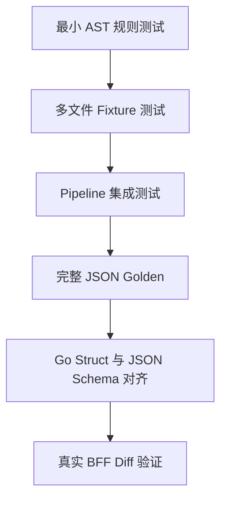
```mermaid
flowchart TB
    UNIT["最小 AST 规则测试"]
    FIXTURE["多文件 Fixture 测试"]
    PIPELINE["Pipeline 集成测试"]
    GOLDEN["完整 JSON Golden"]
    CONTRACT["Go Struct 与 JSON Schema 对齐"]
    REAL["真实 BFF Diff 验证"]

    UNIT --> FIXTURE --> PIPELINE --> GOLDEN --> CONTRACT --> REAL
```

### 13.2 规则测试

每类规则至少包含正例和反例：

- Function、Method、Type、Var、Const Symbol。
- Call、Value、Type Reference。
- Package Alias、局部变量遮蔽和 Receiver 解析。
- Annotation Method/Path。
- Route、Group、Wrapper、Middleware 和跨函数 Group Flow。
- Annotation/Route 漂移、同 Handler 多 Annotation 和 Route Alias。
- 动态 Route Path 和无法解析 Handler。
- Diff 新增、修改、删除、EOF 删除和非法输入。
- Module require/replace、Import Usage 和忽略配置。
- IM SDK、Broadcast 双锚点、Payload/Event/Control。
- Generated gRPC Unary、Streaming、Receiver Binding 和歧义拒绝。
- 循环、菱形依赖、别名 Route、稳定排序和去重。

### 13.3 Pipeline 与契约测试

必须验证：

1. CLI 到 JSON 的完整流程。
2. stdout 只包含 JSON，stderr 承载错误和可选 Timings。
3. 相同输入重复执行得到字节相同的 JSON。
4. `summary` 等于所有 Source 摘要的去重并集。
5. `endpointSourcesSummary` 能反查每个正式 Endpoint。
6. Endpoint 到 gRPC 与 gRPC 到 Endpoint 满足同一 Call Graph 关系。
7. Diff、Endpoint 到 gRPC、gRPC 到 Endpoint 共用 EndpointCatalog，Alias 集合完全一致。
8. `endpointSourcesSummary` 的 File、Module 和 gRPC Chain 都从来源指向 Endpoint。
9. 同一 Endpoint 的 Route 候选在跨 Handler、Root 和 Source 合并后不丢失。
10. Go Struct、JSON Tag、Schema Required 和 Render 字段保持一致。
11. `endpoint-assets` 有独立 Schema，输出顺序可重复。
12. 瞬态 Change、Module Usage 和 Route Group Flow 不泄漏到 `facts` JSON。
13. 空集合使用 `[]`，可选 `moduleSources` 无内容时省略。
14. Golden Sample 能完整展示传播树和来源摘要。
15. 符号链接逃逸、超预算和取消都以稳定错误码失败，不产生部分 JSON。

### 13.4 真实 BFF 验证

| 项目 | 重点 |
| --- | --- |
| `sl-sc1-admin-bff` | Annotation、Route Alias、Middleware、IM、Module Change |
| `sl-sc1-bff-service` | 跨函数 Group Flow、BFF gRPC Client、IM |
| `sl-sc2-admin-bff` | 项目差异和零配置兼容性 |

每次真实验证保留：

- 基线分支、目标分支和 Diff 生成方式。
- 原始 Diff。
- 完整 JSON。
- 受影响 Endpoint 和 IM 数量。
- 每个关键 Endpoint 的来源链路。
- 人工确认的正确结果、误报、漏报和不支持写法。
- 各 Pipeline Stage Timings。

### 13.5 验收口径

| 维度 | 验收要求 |
| --- | --- |
| 支持语法正确性 | 支持矩阵中的正例必须命中，反例不得形成正式结论 |
| 来源可解释性 | 每个正式 Endpoint 至少能反查一个 File、Module 或 gRPC 来源 |
| 路由语义 | Annotation 身份和 Route 候选按第 3.3 节规则输出 |
| IM 精度 | 静态 Event 进入摘要，动态 Event 只进入未解析树节点 |
| gRPC 精度 | 只有 Generated Catalog 与唯一 Receiver Binding 同时成立才形成调用 |
| Module 精度 | Module 变化只从真实 Import Usage 进入传播 |
| 删除能力 | 只输出删除块能够证明的 Route/Annotation，不补猜旧项目 |
| 契约稳定性 | 相同输入得到字节级稳定 JSON，Schema 与结构一致 |
| 降级透明性 | 无法解析的事实有稳定 Diagnostic Code |
| 资源安全 | 取消、超时或预算超限明确失败，不输出被截断结果 |
| 路径安全 | 词法路径和符号链接真实路径都不能逃逸项目根 |
| 真实项目回归 | 已标注真实 Diff 样本的预期 Endpoint 集合保持稳定 |

## 14. CLI 与集成

### 14.1 命令

| 命令 | 用途 |
| --- | --- |
| `impact` | 输入 Diff 和/或完整 gRPC 接口名，输出 BFF HTTP/IM 影响 |
| `endpoint-assets` | 查询 BFF Endpoint 依赖的上游 gRPC 接口 |
| `facts` | 输出项目源码事实和 Diagnostic |
| `schema` | 输出 `facts`、`impact`、`endpoint-assets` 或 `grpc-impact` JSON Schema |
| `grpc-impact` | 后端服务入站契约分析，使用独立技术方案 |

### 14.2 BFF Diff 分析

```bash
go-analyzer impact \
  --project <absolute-project-path> \
  --diff <absolute-diff-path> \
  --format json
```

带 Module 过滤配置：

```bash
go-analyzer impact \
  --project <absolute-project-path> \
  --diff <absolute-diff-path> \
  --impact-config <absolute-config-path> \
  --format json
```

### 14.3 gRPC 双向查询

Endpoint 到 gRPC：

```bash
go-analyzer endpoint-assets \
  --project <absolute-project-path> \
  --endpoint "GET /orders/:id"
```

gRPC 到 Endpoint：

```bash
go-analyzer impact \
  --project <absolute-project-path> \
  --grpc "/shopline.order.v1.OrderService/GetOrder"
```

Diff 与 gRPC 来源合并：

```bash
go-analyzer impact \
  --project <absolute-project-path> \
  --diff <absolute-diff-path> \
  --grpc "/shopline.order.v1.OrderService/GetOrder"
```

### 14.4 调试

```bash
go-analyzer facts \
  --project <absolute-project-path>

go-analyzer schema --type facts
go-analyzer schema --type impact
go-analyzer schema --type endpoint-assets

go-analyzer impact \
  --project <absolute-project-path> \
  --diff <absolute-diff-path> \
  --diagnostics-output <absolute-diagnostic-path> \
  --timings
```

### 14.5 Build Context

```bash
go-analyzer impact \
  --project <absolute-project-path> \
  --diff <absolute-diff-path> \
  --goos linux \
  --goarch amd64 \
  --tags "feature_new,enterprise" \
  --cgo false
```

调用方不传时使用 Go 环境默认值。

### 14.6 集成运行清单

Impact JSON 为了保持业务契约精简，不内嵌 Analyzer Version、Build Context 和 Git 身份。Nexus 或 CI 必须把以下运行清单与 JSON 一起保存：

| 字段 | 用途 |
| --- | --- |
| Analyzer Version 或二进制摘要 | 确定解析规则版本 |
| Project Commit | 确定变更后源码快照 |
| Diff Base/Head 或 Diff 摘要 | 确定变化输入 |
| GOOS、GOARCH、Tags、cgo | 重建条件编译文件集合 |
| Impact Config 摘要 | 重建 Module 过滤行为 |
| 命令类型和输入 Endpoint/gRPC | 重建查询模式 |

缺少这份清单时，只能阅读影响结论，不能承诺跨环境复现字节相同的结果。

## 15. 交付里程碑

技术方案按可独立验收的能力拆分：

| 里程碑 | 主要产物 | 退出条件 |
| --- | --- | --- |
| M1 项目与事实底座 | Project Loader、AST Index、Fact Store、facts JSON | 多文件声明、构建条件、稳定 ID 和 Schema 可验收 |
| M2 Annotation 与 Route | Annotation、Group、Route、Middleware、Link、EndpointCatalog | 三类查询共用 Endpoint 身份并支持 BFF 典型注册模式 |
| M3 Diff 与传播 | Unified Diff、Change Map、Reverse Graph、Impact Tree | Function/Type/DTO/Route 变化可到达 Endpoint |
| M4 删除、Module 与 IM | 删除 Route 恢复、go.mod Usage、IM Fact | 三类特殊来源可进入统一输出 |
| M5 gRPC 双向查询 | Generated Catalog、GrpcCall、CallGraph、endpoint-assets Schema | Endpoint 与完整 gRPC 接口可以双向查询 |
| M6 输出与真实验证 | Golden、Schema、Source Summary、Smoke Script | 三个真实 BFF 完成标注样本验证 |
| M7 工程化加固 | Diagnostic、Timings、稳定排序、路径安全、取消与资源预算 | CI 可重复运行，错误、降级和终止行为稳定 |

每个里程碑都必须同时交付：

- 领域 Fact。
- Extractor 或 Mapper。
- 查询关系。
- 对外 JSON 投影。
- Schema 对齐测试。
- 正例、反例和至少一个端到端 Fixture。

## 16. 后续独立议题

以下能力不改变本文主流程，但需要单独设计和排期：

- 完整 `go/types` 或 SSA 辅助解析。
- 从 `main` 或 Router Root 出发的注册可达性证明。
- 旧版本源码快照与通用删除 Symbol 恢复。
- AST 语义 Diff，过滤纯格式和普通注释变化。
- SCC/DAG 压缩和跨 Root 公共子图复用。
- 增量 AST、Fact Cache 和多 Change Root 复用。
- 输出 Schema Version、Analyzer Version、Build Context 和输入指纹。
- 多 Module 仓库的一次性编排与聚合。
- 更精确的 CFG、分支互斥和 Middleware 控制流分析。
- 跨仓 gRPC、BFF 和前端页面自动编排。

扩展仍遵守：

```text
先定义最低静态证据
  -> 再定义 Fact
  -> 再定义关系和传播终点
  -> 最后定义稳定输出契约
```

## 附录 A：BFF Store 字段

下面展示 BFF 主流程使用的 Store 字段。后端入站协议 Fact 由独立方案描述，不在本文展开。

```go
type Store struct {
	// 项目根、Module Path 和 Build Context
	Project ProjectFact

	// Function、Method、Type、Package-level Var/Const
	Symbols []SymbolFact

	// Handler Annotation
	Annotations []AnnotationFact

	// Route Group、Prefix 和父子关系
	RouteGroups []RouteGroupFact

	// Group 跨函数参数或返回值流转，仅供分析期使用
	RouteGroupFlows []RouteGroupFlowFact

	// Route Method、Path、Group、Handler 和 Wrapper
	Routes []RouteRegistrationFact

	// Middleware、Group 和源码顺序
	Middleware []MiddlewareBindingFact

	// Call、Value、Type 引用
	References []ReferenceFact

	// go.mod require/replace
	Modules []ModuleDependencyFact

	// 出站 IM Event、Sender、依赖和证据
	IMEvents []IMEventFact

	// Generated Client 中的完整 gRPC 接口
	GrpcOperations []GrpcOperationFact

	// BFF 对 Generated Client 的调用点
	GrpcCalls []GrpcCallFact

	// Route -> Handler、Handler -> Annotation 等关联
	Links []LinkFact

	// 本次 Diff 的传播根，仅供分析期使用
	Changes []ChangeFact

	// 本次 go.mod Diff 的 Module 变化，仅供分析期使用
	ModuleChanges []ModuleChangeFact

	// 变化 Module 的 Import Usage，仅供分析期使用
	ModuleUsages []ModuleUsageFact

	// 可恢复的不确定性
	Diagnostics []DiagnosticFact
}
```

公开 `facts` JSON 不包含：

- `RouteGroupFlows`
- `Changes`
- `ModuleChanges`
- `ModuleUsages`

## 附录 B：主要关系词

| Relation | 含义 |
| --- | --- |
| `call` | 父节点调用子节点，或影响反向传播中的 Caller |
| `type_ref` | 上层声明使用下层 Type |
| `value_ref` | 上层声明使用下层 Function/Var/Const 值 |
| `registered_handler` | Route 注册指定 Handler |
| `route_dependency` | Route 注册表达式依赖某个 Symbol |
| `middleware_symbol` | Middleware Binding 使用某个 Symbol |
| `handler_annotation` | Handler 关联 Controller Annotation |
| `annotation_endpoint` | Endpoint 身份来自 Annotation |
| `route_endpoint` | 没有可用 Annotation，Endpoint 来自 Route |
| `deleted_route_endpoint` | Endpoint 来自删除 Route 恢复 |
| `im_payload` | 变化路径命中 IM Payload 依赖 |
| `im_event_value` | 变化路径命中 IM Event 值依赖 |
| `im_control` | 变化路径命中 IM 发送条件依赖 |
| `may_call` | Endpoint 静态上可以到达 gRPC 调用 |

## 附录 C：核心术语

| 术语 | 含义 |
| --- | --- |
| AST | Go 源码解析后的抽象语法树 |
| Symbol | Function、Method、Type、Package-level Var/Const 的声明身份 |
| Fact | 从源码、依赖或本次分析输入中得到的类型化静态数据 |
| Store | 单次 Pipeline 内保存 Fact 的共享容器 |
| Extractor | 从 AST 或 Generated Dependency 产生某类 Fact 的模块 |
| Linker | 连接已经存在的 Fact 身份 |
| ChangeFact | Diff 定位出的传播起点 |
| ReferenceFact | Symbol 之间的 Call、Value 或 Type 依赖 |
| Reverse Graph | 从被依赖 Symbol 反查引用者的索引 |
| EndpointCatalog | 统一 Annotation-first、Route Fallback、Alias、Handler 与 Route 候选的只读视图 |
| Handler | 被 Route 注册的 Controller Function 或 Method |
| Annotation | Handler 注释中声明的 HTTP Method 和 Path |
| Route | `GET`、`POST` 等静态路由注册 |
| Endpoint | 规范化的 HTTP Method 和 Path |
| IM Event | BFF 主动发送给前端或消息通道的事件名 |
| 完整 gRPC 接口名 | `/protobuf-package.Service/Method` 形式的接口身份 |
| Generated Client Catalog | Go Client Method 到完整 gRPC 接口名的对照表 |
| Resolved | 静态证据能够唯一确定 |
| Unresolved | 只能保留原始表达式，不能确定运行时值 |
| Diagnostic | 不阻断其它可用分析、但需要保留的解析问题 |
| Golden | 用完整预期 JSON 验证输出契约的测试样本 |
