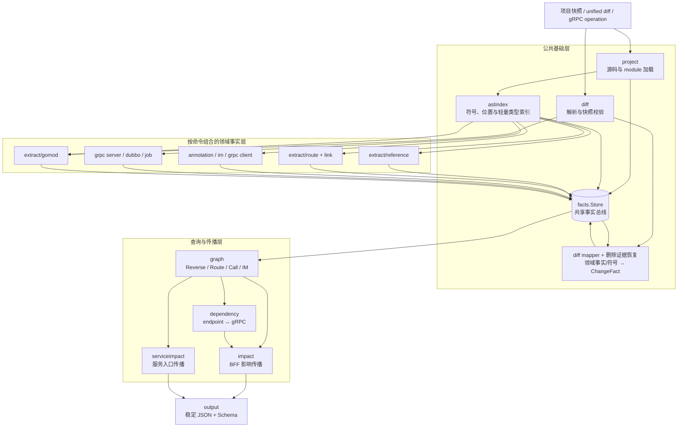
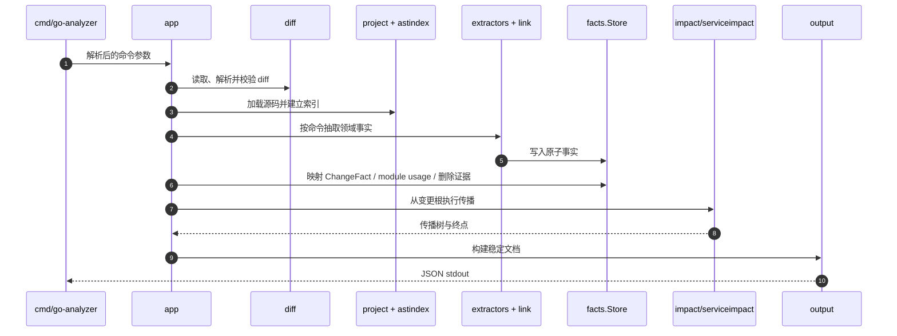
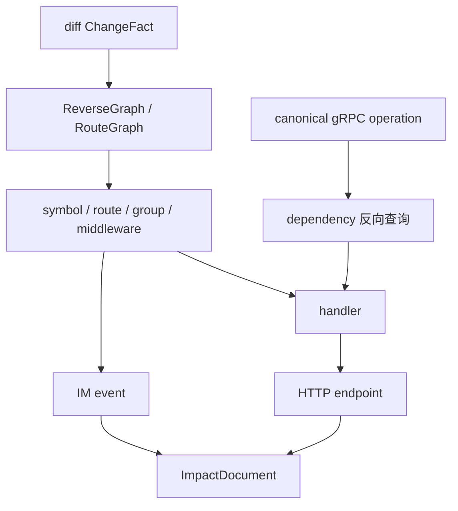
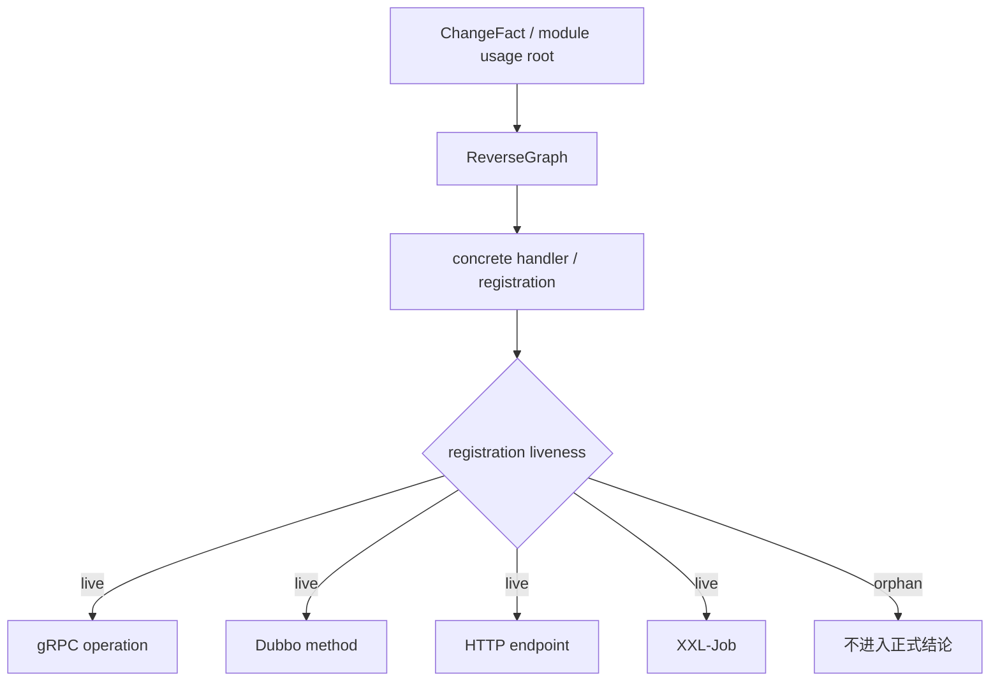

# Go 服务影响范围分析技术方案

## 0. 文档定位

本文定义 `go-analyzer` 的目标、架构、模块边界、分析语义、输出契约和验收标准，作为开发、评审和测试的共同依据。

文中的“应”“必须”“不得”表示方案约束；模块名称表示规划中的代码边界，不表示开发进度。方案只讨论可由静态代码证据支持的能力，不把运行时猜测包装成确定结论。

## 1. 背景与目标

Go 服务中的一处代码变更，可能通过调用、函数值传递、类型引用、路由注册、中间件或协议注册影响多个业务入口。仅依赖目录结构或函数调用图，无法稳定回答“这次变更需要回归哪些接口”。

本方案采用以下统一模型：

```text
变更输入
  -> 变更语义节点
  -> 项目内依赖传播
  -> 已注册业务入口
  -> 可追溯的影响结论
```

分析器面向单个 Go 项目，覆盖两类分析场景：

| 场景 | 核心问题 | 终点 |
| --- | --- | --- |
| BFF 影响分析 | 一份 BFF diff 或一个上游 gRPC operation 会影响哪些前端可见能力？ | HTTP endpoint、出站 IM event |
| 后端服务影响分析 | 一份服务端 diff 会影响哪些入站契约？ | gRPC operation、HTTP endpoint、Dubbo method、XXL-Job |

目标项目包括：

- BFF：`sl-sc1-admin-bff`、`sl-sc1-bff-service`、`sl-sc2-admin-bff`。
- 后端服务：`sc1-server`、`sc2-server` 及结构相近的 Go 服务。

### 1.1 目标

1. 将 unified diff 精确映射到函数、方法、类型、变量、常量及领域注册事实。
2. 建立 call、value、type 三类项目内引用关系，支持从被引用者反查引用者。
3. 识别 BFF 路由、注解、route group、中间件、wrapper 和出站 IM event。
4. 建立 BFF endpoint 与 generated gRPC client operation 的双向依赖查询。
5. 识别后端服务中已注册的 gRPC、HTTP、Dubbo 和 XXL-Job 入站契约。
6. 将 `go.mod` 的 require/replace 变化映射到本仓使用点，再传播到业务入口。
7. 输出稳定、可校验、可追溯的 JSON，并提供对应 JSON Schema。

### 1.2 非目标

以下能力不纳入本期范围：

- 反射、运行时路由表、动态依赖注入和无法唯一确定的接口分发。
- 外部 SDK 内部隐藏调用的穿透分析。
- 多仓自动编排；单仓之间只通过 HTTP endpoint 或 canonical gRPC method 等稳定身份衔接。
- 前端页面影响分析。
- 后端服务的 Pulsar/IM 入站契约。
- 基于启发式分数的影响置信度排序。
- 自然语言回归报告生成。

## 2. 设计原则

### 2.1 证据优先

每条正式结论必须能回溯到 AST、generated transport、引用边、路由或协议注册证据。无法证明的关系应拒绝输出，或以 diagnostic、`symbolic`、`unresolved` 等非确定语义表达。

### 2.2 Facts-first

抽取器只负责产生原子事实；图与查询层只消费事实；影响分析层负责传播；输出层只负责稳定投影。模块之间通过 `facts.Store` 交换领域事实，不共享抽取器私有状态。

### 2.3 命令显式选择分析语义

分析器不得通过目录名或代码特征猜测项目类型。调用方通过 `impact` 或 `grpc-impact` 显式选择 BFF 链路或后端服务链路。

### 2.4 保守而可解释

静态分析无法确定动态值时，不伪造运行时结果。输出应保留原始表达式、注册位置、传播树和轻量来源摘要，使结论可审查。

### 2.5 稳定契约

相同项目快照、diff 和 build context 必须产生字节级稳定的 JSON。数组排序、去重规则、空数组语义和字段兼容性应由 schema 与 golden test 共同约束。

### 2.6 单仓边界

一次运行只分析一个项目。跨服务、跨 BFF 或 Go 到前端的传播，由外部编排层组合多个单仓结果。

## 3. 输入与命令边界

### 3.1 核心命令

| 命令 | 输入 | 用途 |
| --- | --- | --- |
| `impact` | `--project`，以及至少一个 `--diff` 或 `--grpc`，可选 `--impact-config` | BFF HTTP/IM 影响分析 |
| `endpoint-assets` | `--project`、一个或多个 `--endpoint` | 查询 endpoint 依赖的 gRPC operation |
| `grpc-impact` | `--project`、`--diff`，可选 `--impact-config` | 后端服务入站契约影响分析 |
| `facts` | `--project` | 输出事实快照与 diagnostics，用于排障 |
| `schema` | `--type facts\|impact\|grpc-impact` | 输出稳定 JSON Schema |

路径参数必须使用绝对路径。除不加载项目的 `schema` 外，项目分析命令应接受统一的 Go build context 参数：

- `--goos`
- `--goarch`
- `--tags`
- `--cgo`

### 3.2 变更后快照约束

`--project` 必须指向 diff 应用后的源码快照。分析器应在建立影响结论前完成以下校验：

1. diff 非空且符合 unified diff 语法。
2. diff 中的路径不能逃逸项目根目录。
3. 新增或修改后的上下文行与磁盘源码一致。
4. 被删除文件在变更后快照中不存在。
5. diff 涉及的 Go 文件必须能被解析；非变更文件的解析失败可进入 diagnostics。

该约束保证 diff 行号、AST span 和变更语义节点属于同一份源码快照。

### 3.3 gRPC 输入

`impact --grpc` 只接受 canonical full method：

```text
/package.Service/Method
```

Go selector 名、变量名、目录名或 protobuf message 名不得作为 operation 身份的推断依据。

## 4. 总体架构

### 4.1 逻辑架构


```mermaid
flowchart TB
    INPUT["项目快照 / unified diff / gRPC operation"]

    subgraph BASE["公共基础层"]
        PROJECT["project<br/>源码与 module 加载"]
        INDEX["astindex<br/>符号、位置与轻量类型索引"]
        DIFF["diff<br/>解析与快照校验"]
        CHANGE["diff mapper + 删除证据恢复<br/>领域事实/符号 → ChangeFact"]
        FACTS[("facts.Store<br/>共享事实总线")]
        PROJECT --> INDEX
        PROJECT --> FACTS
        INDEX --> FACTS
        DIFF --> CHANGE
        FACTS --> CHANGE
        CHANGE --> FACTS
    end

    subgraph DOMAIN["按命令组合的领域事实层"]
        REF["extract/reference"]
        ROUTE["extract/route + link"]
        BFFEX["annotation / im / grpc client"]
        SVCEX["grpc server / dubbo / job"]
        GOMOD["extract/gomod"]
    end

    subgraph QUERY["查询与传播层"]
        GRAPH["graph<br/>Reverse / Route / Call / IM"]
        DEP["dependency<br/>endpoint ↔ gRPC"]
        BFFIMP["impact<br/>BFF 影响传播"]
        SVCIMP["serviceimpact<br/>服务入口传播"]
    end

    OUTPUT["output<br/>稳定 JSON + Schema"]

    INPUT --> PROJECT
    INPUT --> DIFF
    INDEX --> REF
    INDEX --> ROUTE
    INDEX --> BFFEX
    INDEX --> SVCEX
    DIFF --> GOMOD
    INDEX --> GOMOD
    REF --> FACTS
    ROUTE --> FACTS
    BFFEX --> FACTS
    SVCEX --> FACTS
    GOMOD --> FACTS
    FACTS --> GRAPH
    GRAPH --> DEP
    GRAPH --> BFFIMP
    GRAPH --> SVCIMP
    DEP --> BFFIMP
    BFFIMP --> OUTPUT
    SVCIMP --> OUTPUT
```

`project`、`astindex`、`diff`、`facts`、`reference`、`route`、`link`、`gomod` 和基础图结构规划为两条链路共用的底座。领域抽取器与传播终点按命令组合，不要求每次运行加载所有事实。

### 4.2 命令编排

| 命令模式 | 领域事实 | gRPC 依赖策略 | 服务入口事实 | 终端模块 |
| --- | --- | --- | --- | --- |
| `impact --diff` | annotation、route/link、reference、IM | client `off` | 不加载 | `impact` |
| `impact --grpc` | annotation、route/link、reference、IM | client `strict` | 不加载 | `dependency` + `output` |
| `impact --diff --grpc` | 两类 source 共用一次项目事实构建 | client `strict` | 不加载 | `impact` + `dependency` |
| `endpoint-assets` | annotation、route/link、reference、IM | client `strict` | 不加载 | `dependency` |
| `grpc-impact` | route/link、reference、gRPC server、Dubbo、Job | server 定向加载；依赖发现/catalog 构建失败即终止（provider 绑定歧义降级为诊断，见 §11.2） | 加载 | `serviceimpact` |
| `facts` | BFF 事实与服务入口事实 | client/server `diagnostic` | diagnostic | 事实快照，不执行影响传播 |

模式语义：

- `off`：不发现 gRPC client 依赖，避免纯 diff 分析承担额外依赖加载成本。
- `strict`：关键依赖或 catalog 构建失败时返回 typed error，不输出半份正式结果。
- `diagnostic`：记录失败原因并继续输出其它可用事实。

### 4.3 运行时序


```mermaid
sequenceDiagram
    autonumber
    participant CLI as cmd/go-analyzer
    participant APP as app
    participant D as diff
    participant P as project + astindex
    participant E as extractors + link
    participant F as facts.Store
    participant A as impact/serviceimpact
    participant O as output

    CLI->>APP: 解析后的命令参数
    APP->>D: 读取、解析并校验 diff
    APP->>P: 加载源码并建立索引
    APP->>E: 按命令抽取领域事实
    E->>F: 写入原子事实
    APP->>F: 映射 ChangeFact / module usage / 删除证据
    APP->>A: 从变更根执行传播
    A-->>APP: 传播树与终点
    APP->>O: 构建稳定文档
    O-->>CLI: JSON stdout
```

`app` 应保证一次命令只加载一次项目基础事实，并显式记录各 pipeline stage 的耗时。耗时信息只能写入 stderr。

## 5. 模块职责

| 模块 | 职责 | 明确禁止 |
| --- | --- | --- |
| `cmd/go-analyzer` | 子命令分派、flag 解析、绝对路径校验、stdout/stderr 边界 | AST 规则、传播规则、JSON 业务拼装 |
| `internal/app` | pipeline 编排、抽取模式、错误语义、stage metrics | 协议专属 AST 匹配 |
| `internal/project` | 读取 go.mod、加载源码、构建 package/file 模型、应用 build constraints、按需加载依赖包 | 影响传播和业务入口判断 |
| `internal/astindex` | 声明 ID、源码位置、selector/method、receiver、字段和轻量值类型解析 | 输出业务结论 |
| `internal/diff` | unified diff 解析、变更后快照校验、行范围到领域事实/符号的映射 | 调用图遍历 |
| `internal/facts` | 定义原子事实、稳定 ID、SourceSpan、Evidence 和共享 Store | AST 扫描和输出兼容逻辑 |
| `internal/extract/annotation` | 解析 handler 注释中的 HTTP method/path | 路由拼接 |
| `internal/extract/route` | 识别 route group、route registration、middleware、wrapper 及跨函数 group flow | 决定 BFF endpoint 正式身份 |
| `internal/extract/reference` | 提取 call/value/type 引用，解析项目内 callable 与轻量接口绑定 | 直接产生影响结论 |
| `internal/extract/im` | 识别出站 IM transport、静态求值 event、构建 event/payload/control 依赖 | HTTP endpoint 传播 |
| `internal/extract/grpc` | 分别构建 generated client catalog、BFF gRPC call fact、generated server catalog 和 provider fact | 通过名称相似度猜 operation |
| `internal/extract/dubbo` | 识别 ServiceConfig、provider 绑定和 method 映射 | 无注册证据的方法枚举 |
| `internal/extract/job` | 识别静态 job name 与 handler 绑定 | 接受动态 job name 进入正式结果 |
| `internal/extract/gomod` | 解析 require/replace，计算 module change，并定位本仓 usage | 把整个仓库无条件视为受影响 |
| `internal/link` | 将 route handler、annotation 和 middleware 表达式对齐到稳定 symbol | 自行扫描协议终点 |
| `internal/graph` | 基于 Store 建立只读 ReverseGraph、RouteGraph、CallGraph、IMGraph | 修改事实或生成 JSON |
| `internal/dependency` | 在 CallGraph 与 RouteGraph 上提供 endpoint ↔ gRPC 双向查询 | 物理绑定某个 BFF 仓库 |
| `internal/impact` | 从 ChangeFact 构造 BFF 传播树；定向恢复 diff 中被删除的 route/handler 证据 | 后端服务契约投影 |
| `internal/serviceimpact` | 将变更传播到已注册 gRPC/HTTP/Dubbo/Job 契约 | 使用 BFF annotation 作为服务端 HTTP 身份 |
| `internal/diagnostics` | 维护诊断码、严重级别、去重和 facts 投影 | 将 warning 混入正式 impact summary |
| `internal/config` | 严格解析 module change 过滤配置 | 开放业务语法配置 |
| `internal/output` | 文档投影、去重、排序、空数组归一化、JSON Schema | 从 AST 或 raw 文本补推业务事实 |

### 5.1 依赖规则

1. extractor 可以读取 `project.Project` 与 `astindex.Index`，并向 `facts.Store` 写入事实。
2. extractor 之间不得读取彼此的私有 AST 缓存。
3. `link` 可以读取索引和已有 route/annotation/middleware facts，并写入标准关联结果。
4. `graph`、`dependency`、`impact` 和 `serviceimpact` 应优先消费 Store，不重复扫描全项目 AST。
5. 删除恢复是特例：它可以读取 diff 删除块，并向 Store 与符号索引补充合成证据；该过程必须发生在传播前。
6. `output` 不得承担事实抽取或影响判断。

## 6. 核心事实模型

### 6.1 公共事实

| Fact | 语义 |
| --- | --- |
| `ProjectFact` | 项目根、module path、build context |
| `SymbolFact` | function、method、type、var、const 的稳定声明身份 |
| `ReferenceFact` | 项目内 call/value/type 引用 |
| `ChangeFact` | diff 或 module usage 形成的传播根，仅在分析期流转 |
| `ModuleDependencyFact` | go.mod dependency/replace 快照 |
| `ModuleChangeFact` | require/replace 的语义变化，仅在分析期流转 |
| `ModuleUsageFact` | 变更 module 在本仓的使用入口，仅在分析期流转 |
| `DiagnosticFact` | 可恢复失败、降级或歧义 |

### 6.2 HTTP 与路由事实

| Fact | 语义 |
| --- | --- |
| `AnnotationFact` | handler 注释声明的 method/path |
| `RouteGroupFact` | group 变量、prefix、父子关系和 route function |
| `RouteGroupFlowFact` | group 参数/返回值的跨函数传播，仅在分析期流转 |
| `RouteRegistrationFact` | method、local/resolved path、handler、wrapper、注册位置 |
| `MiddlewareBindingFact` | group 上按语句顺序挂载的 middleware |
| `LinkFact` | route → handler、handler → annotation 的稳定关联 |

`RouteRegistrationFact` 同时服务于 BFF HTTP endpoint 和后端服务 HTTP 入站契约，不应归入某一条链路的私有模型。

### 6.3 协议事实

| Fact | 语义 |
| --- | --- |
| `IMEventFact` | 出站 event、sender、event/payload/control 依赖及解析状态 |
| `GrpcOperationFact` | canonical gRPC operation |
| `GrpcCallFact` | BFF 调用点、generated client binding 与 operation |
| `GrpcProviderFact` | server registration、具体实现、handler 与 operation |
| `DubboProviderFact` | Dubbo interface/method/config 与具体 handler |
| `JobRegistrationFact` | 静态 job name、注册函数和 handler |

### 6.4 身份与确定性

- symbol ID 应包含 symbol kind、package path、receiver type 和名称；同包多个 `init` 等特殊声明还应保证唯一性。
- endpoint ID 应由规范化后的 HTTP method 与 path 构成。
- gRPC operation 只以 canonical full method 为身份。
- service contract 应使用 `static` 或 `symbolic` 表示身份解析方式。
- IM event 应使用 `Resolved` 区分确定字符串和动态表达式。
- 事实可携带 `EvidenceFact` 与 `SourceSpan`，用于 facts 排障和终点注册定位。

方案不定义 `high/medium/low` 置信度。关系满足准入证据才进入正式结论；证据不足时进入 diagnostic 或 unresolved/symbolic 表达。

## 7. 项目加载与 AST 索引

### 7.1 项目加载

`project` 应：

1. 从项目根 go.mod 获取 module path。
2. 支持项目内嵌套 module，并按距离文件最近的 go.mod 恢复 package import path。
3. 使用 `go/build.Context` 处理 GOOS、GOARCH、build tags 和 cgo。
4. 排除 `_test.go`、`vendor`、`testdata`、`node_modules` 以及 Go 工具链忽略的点号/下划线前缀文件和目录。
5. 为每个文件保存 AST、FileSet、package、绝对磁盘路径和 import alias 映射。
6. 将非变更文件解析失败记录为 diagnostic，并允许其它文件继续参与分析。

### 7.2 AST 索引

`astindex` 应为声明建立稳定索引，并提供：

- 行列位置到最小包含 symbol 的查询。
- package function、receiver method、type、var、const 定位。
- selector method、函数值和 imported symbol 解析。
- 变量、字段、constructor 返回值和 interface binding 的保守类型解析。
- 文件相对路径到 AST file 的缓存。

类型解析只有在候选唯一且证据明确时才标记为 resolved。多候选或仅凭命名推断的结果不得越过协议准入门槛。

## 8. Diff 与模块变更

### 8.1 ChangeFact 映射

diff 行范围应按以下优先级映射到最具体的变更根：

```text
annotation
  -> route group
  -> route registration
  -> middleware binding
  -> job registration
  -> Dubbo method config
  -> Dubbo service config
  -> 最小包含 symbol
  -> file fallback
```

同一范围内命中多个 symbol 时，应选择 span 最小的声明；span 相同时按稳定 ID 排序。相邻行命中同一目标时应合并，避免产生碎片化根节点。

文件 fallback 只保留来源证据，不应把整个项目或整个 package 默认标记为受影响。

### 8.2 删除证据恢复

变更后快照中不存在被删声明，因此删除分析需要定向读取 diff 删除块：

1. 将删除行包装为临时 Go 代码，解析单行或多行 route call。
2. 使用与常规 route 相同的 call parser，恢复 method、local path、handler 表达式和 wrapper。
3. 结合变更后同一 route function 内的 group facts 恢复可证明的 prefix；不得从其它函数的同名 group 借用前缀。
4. 对完整被删 handler 声明，恢复合成 `SymbolFact`、annotation 和 ChangeFact，并重新尝试 route linking。
5. 无法恢复 package、handler、group 或 path 时记录 diagnostic，保留局部证据，不伪造完整 endpoint。

删除恢复只针对 route 和 handler 领域证据，不等价于重建完整旧版本 AST。

### 8.3 go.mod 语义变化

`extract/gomod` 应分别处理：

- require added/removed/upgraded/downgraded。
- replace added/removed/changed。
- module path、版本和 replacement 前后值。

模块变化应先映射到本仓 import usage；只有存在明确 usage 时才从对应文件/symbol 继续传播。无法定位 symbol 但文件明确 import 该 module 时，可使用文件级 usage；完全无引用时应标记 `module_unreferenced`，不得扩散到所有入口。

`impact-config` 只允许控制 module change：

```json
{
  "analyzeModuleChanges": true,
  "ignoredModuleChanges": [
    "gopkg.inshopline.com/sc1/app/modules/*/proto"
  ]
}
```

配置应严格拒绝未知字段、非法 glob 和旧 schema。未显式传入配置时，可读取项目内 `.analyzer/go-impact.config.json`；文件不存在时采用默认行为。

## 9. 引用、关联与图查询

### 9.1 引用关系

只构建 call graph 不足以覆盖 Go 注册式代码。`ReferenceFact` 应覆盖：

| Kind | 示例 | 用途 |
| --- | --- | --- |
| `call` | `service.Load()` | 常规调用传播 |
| `value` | `g.GET("/x", controller.List)` | 函数值、变量值和注册参数传播 |
| `type` | `func Load() *OrderResp` | 请求/响应类型、字段和组合字面量传播 |

反向引用图的方向为：

```text
被引用 symbol -> 引用它的 symbol
```

因此 service 方法、常量或 DTO 类型变更都可以向 controller 和注册入口传播。

### 9.2 Route 与 Link

`extract/route` 负责记录语法事实，`link` 负责身份对齐：

```text
route expression
  -> handler raw expression
  -> stable handler symbol
  -> handler annotation
```

路由抽取应覆盖：

- `GET/POST/PUT/PATCH/DELETE/...` 注册。
- `Group` 前缀和父子 group。
- group 作为函数参数或返回值的跨函数 flow。
- `Use` 中间件及语句顺序。
- handler wrapper 和 group wrapper。
- package var、struct field、method value 等可静态解析的 handler。
- Nexus/codegen 生成的标准 route 模板。

### 9.3 图职责

- `ReverseGraph`：symbol 的引用者查询。
- `RouteGraph`：handler、group、middleware、annotation 与 route 的领域查询。
- `CallGraph`：endpoint 到 gRPC call 的正向可执行调用链。
- `IMGraph`：传播路径与 IM event dependency 的精确匹配。

图遍历必须：

1. 对当前 DFS path 做 cycle detection。
2. 对共享子图做缓存或去重，避免菱形调用图指数展开。
3. 保留 distinct gRPC call-site chain，不能只保留首条路径。
4. 对所有 map/set 输出施加稳定排序。

## 10. BFF 影响分析

### 10.1 分析流程


```mermaid
flowchart TB
    D["diff ChangeFact"] --> R["ReverseGraph / RouteGraph"]
    G["canonical gRPC operation"] --> Q["dependency 反向查询"]

    R --> S["symbol / route / group / middleware"]
    S --> H["handler"]
    H --> E["HTTP endpoint"]
    S --> I["IM event"]

    Q --> H
    E --> O["ImpactDocument"]
    I --> O
```

diff 根的处理顺序应由目标 fact 决定：

1. route：直接展开该注册。
2. route group：展开该 group 及 descendant group 的路由。
3. middleware：只展开挂载后受其作用的路由。
4. annotation：直接落到 annotation endpoint。
5. symbol：沿反向引用、route dependency、中间件绑定和 IM dependency 传播。
6. file：保留文件级根，不无条件扩大范围。

### 10.2 Endpoint 身份

BFF endpoint 采用 annotation-first：

1. handler 存在 annotation 时，annotation 的规范化 method/path 是正式 endpoint。
2. route 解析结果作为同级 `routes[]` 辅助证据，不覆盖 annotation。
3. handler 无 annotation 时，使用静态解析出的 route method/path fallback。
4. method 统一规范化为大写。

示例：

```json
{
  "method": "POST",
  "path": "/admin/api/bff-web/orders",
  "routes": [
    {
      "method": "POST",
      "path": "/api/bff-web/orders"
    }
  ]
}
```

同一 handler 注册多个 URL 时，只有在 annotation 已被其它 route 明确匹配后，未匹配 route 才可作为独立别名 endpoint 输出。单 route 与 annotation 漂移时，应保留 annotation 身份，并将 route 作为证据，避免把漂移误判为别名。

### 10.3 Route group 与中间件传播

- group prefix 变化应影响该 group 及 descendant group 下的 route。
- group 跨函数参数/返回值流转时，guard、factory 和 middleware 依赖应传播到 descendant route。
- middleware binding 应记录 statement index；一个 `.Use()` 只影响同 group 中位于其后的 route。
- middleware 函数体变化既可以沿普通反向引用传播，也可以通过 middleware binding 扩展到受管辖 route。
- wrapper 中引用的 symbol 应作为 route dependency，变化时只影响依赖该 wrapper 的 route。

### 10.4 出站 IM event

IM 识别分为 transport 准入、静态求值和摘要传播。

#### 协议型 transport

项目源码中必须同时存在以下两个字面量锚点，二者可以位于不同声明：

```text
broadcast://
/broadcast/send
```

只有双锚点成立时，项目内相关调用链才可作为协议型 IM transport 候选。单个锚点不得触发识别。

#### SDK 型 transport

SDK 适配器应使用精确 import path、函数名和参数位置匹配：

```text
gopkg.inshopline.com/sc1/commons/utils/bus/notify/im
```

支持的函数：

- `SendIm`
- `SendImAsync`
- `SendImToUid`
- `SendImToUidAsync`

event 与 payload 分别取 `call.Args[3]` 和 `call.Args[4]`。命中 SDK 身份但参数数量不足时，应产生 `im_sdk_argument_mismatch` diagnostic。

#### Event 求值与传播

静态求值应覆盖：

- string literal、const 和 imported const。
- 字符串拼接。
- typed enum、iota 与 `String()` 字符串表（仅覆盖 `return table[idx]` 这种表驱动 `String()` 与静态字符串表；`switch` 分支式 `String()` 不解析，对应 event 落为 unresolved，而非误判）。
- wrapper 参数替换。
- if/else 字符串相等条件形成的 event 分支。

摘要引擎应通过有界不动点迭代传播 event、payload 和 control dependency。可确定 event 进入 `impactedIMEvents`；动态 event 以 `im_event_unresolved` 保留在树中，但不进入正式摘要和数量统计。

### 10.5 BFF 与 gRPC 依赖

#### Client catalog

只扫描带 generated marker 的 protobuf/gRPC client 文件。每个 operation 必须由 generated transport 证明：

- unary RPC：`Invoke`。
- streaming RPC：`NewStream` 与 `ServiceDesc.Streams`。
- full method：字符串字面量或 generated package string const。
- client binding：generated constructor 的返回接口类型、Go method 与 concrete client method。

同一 client binding 映射到冲突 operation 或 streaming mode 时，应视为 catalog 硬错误。

#### BFF 调用点

BFF 调用 `x.GetOrder(...)` 只有同时满足以下条件才形成 `GrpcCallFact`：

1. catalog 中存在 generated operation。
2. receiver 静态类型唯一解析到对应 generated client binding。
3. 调用位于项目内可执行 function/method 中。

使用 protobuf message、相同 Go method 名或业务代码直接调用 `Invoke/NewStream`，都不足以证明 gRPC 依赖。

#### 双向查询

- `endpoint-assets`：endpoint handler 沿 CallGraph 正向查找 gRPC call。
- `impact --grpc`：canonical operation 反查 call site、caller、handler 与 endpoint。

两条查询在同一项目快照和 build context 下应满足：

```text
endpoint-assets(A) 包含 gRPC B
iff
impact --grpc B 包含 endpoint A
```

反查关系统一标记为 `may_call`，表示静态调用链可达，不承诺每次请求一定执行 RPC。

### 10.6 BFF 输出契约

`impact` 顶层字段：

| 字段 | 语义 |
| --- | --- |
| `summary` | 全局去重的 endpoint 与已解析 IM event |
| `fileSources` | 普通 diff 文件、原始 patch、changed root 和完整传播树 |
| `moduleSources` | 可选的 module change、usage 文件与传播树 |
| `grpcSources` | 输入 gRPC operation 及其 BFF consumer/call-site 证据 |
| `endpointSourcesSummary` | endpoint 反查 file/module/grpc source 的轻量摘要 |

`fileSources`、`grpcSources`、`endpointSourcesSummary` 即使为空也应输出空数组；`moduleSources` 仅在形成 module semantic change 时出现。

`endpointSourcesSummary` 应位于顶层最后，包含：

- endpoint method/path。
- source type：`file`、`module` 或 `grpc`。
- source file 或 module/gRPC 元数据。
- 能到达 endpoint 的 root symbols。
- file/module source 中每个 root 到 endpoint 的最短人读链路；gRPC source 保留 distinct call-site chains。

完整树是审计依据，source summary 是消费便利视图；二者不得形成不同的影响结论。

## 11. 后端服务影响分析

### 11.1 分析流程


```mermaid
flowchart TB
    C["ChangeFact / module usage root"]
    R["ReverseGraph"]
    H["concrete handler / registration"]
    L{"registration liveness"}

    C --> R --> H --> L
    L -->|live| G["gRPC operation"]
    L -->|live| D["Dubbo method"]
    L -->|live| W["HTTP endpoint"]
    L -->|live| J["XXL-Job"]
    L -->|orphan| X["不进入正式结论"]
```

服务链路共用 symbol、reference、route/link、diff 和 gomod 底座，但使用独立的 `serviceimpact` 终点模型。服务端 HTTP 身份来自 route registration，不采用 BFF controller annotation 语义。

### 11.2 gRPC server

gRPC server catalog 应以 generated server 代码中的以下证据为准：

- `ServiceDesc` 中的 service name、Methods 和 Streams。
- `RegisterXxxServer` 的 server interface。
- generated handler 与 Go method 的对应关系。
- canonical full method。

generated server 文件优先从项目源码读取，并按最近的 go.mod 恢复嵌套 module import path。项目内不存在时，只按实际 `RegisterXxxServer` import 定向加载依赖包，不扫描无关依赖图。

provider 绑定应解析注册调用传入的具体实现，包括可静态证明的：

- composite literal 或 `new(T)`。
- constructor 返回类型。
- interface 返回值中唯一的项目内 concrete type。
- struct field 或 receiver field。
- 泛型容器中可恢复的 concrete type。

无 concrete candidate 与存在多个 candidate 是两类不同 diagnostic。两种情况都不得猜实现；注册事实及 canonical operation 仍可保留，并以 registration symbol 作为可传播入口。

### 11.3 Dubbo

Dubbo provider 必须同时具备：

1. 同一函数中的 `ServiceConfig`。
2. 位于其后的 `.SetProviderService(concrete)`。
3. 可解析的 provider concrete type。
4. 方法绑定分两步确定：`ServiceConfig.Methods` 决定**暴露哪些协议方法名**（为空则取 concrete type 的全部公开方法，见下）；每个方法名再经 `MethodMapper` 或唯一公开 Go method **映射到具体 Go handler**。

一个函数存在多组 config/provider 时，应按源码顺序将每个 config 绑定到其后第一个未消费的 `SetProviderService`，兼容：

```text
config; call; config; call
config; config; call; call
```

`Methods` 为空表示 service 级导出，应展开 concrete provider 的全部公开方法；`Methods` 非空时只产生列出的方法。Dubbo version 为动态表达式时，保留 `dubboVersionExpression` 并将 identity 标记为 `symbolic`。

### 11.4 HTTP

服务端 HTTP 契约由 route registration 产生：

- 静态 resolved path：identity 为 `METHOD resolvedPath`，标记 `static`。
- 无法解析完整 prefix/path：保留 local path 与 path expression，标记 `symbolic`。
- handler 无法解析或注册点不具备 liveness 时，不进入正式契约。

### 11.5 XXL-Job

Job 注册识别应满足：

1. 注册函数的参数或返回值能证明存在 `map[string]JobListener` 或 `map[string]TaskFunc`。
2. value 类型来自 `jobx` 或 `xxljob` 包。
3. map key 是 string literal、本地 string const 或 imported string const。
4. map value 按固定优先级解析到 function/method handler（直接函数、导入函数、selector method 等）；对象型 listener 可绑定到 `Execute` method。终点唯一性由 `astindex` 解析器保证。

动态 job name 或无法唯一解析的 handler 不进入正式结果。

### 11.6 Registration liveness

四类服务入口都必须通过 liveness gate。注册函数满足以下任一条件即可视为 live：

1. 在项目内存在入向引用。
2. 函数名为 `main`。
3. 函数名以 `Register` 或 `Initialize` 开头。

除此之外的孤立注册只保留 facts，不进入正式 summary。命名约定是框架启动场景的受控例外，应通过测试限定范围，不能扩展为任意名称启发式。

### 11.7 服务入口传播

`serviceimpact` 应：

1. 为 gRPC、HTTP、Dubbo、Job 建立统一 `Contract` 投影视图，但不在 `facts.Store` 中复制第二套泛化 fact。
2. 从 ChangeFact 沿 ReverseGraph 到 concrete handler、implementation 或 registration symbol。
3. 对 route/group/middleware、Dubbo method config 和 Dubbo service config 提供领域直达规则。
4. 对 Dubbo service config 变化扩展到同一 interface 的全部 method。
5. 只输出通过真实注册与 liveness gate 的契约。
6. 按 contract ID 去重，同时保留每个 source 的传播树。

### 11.8 服务入口输出契约

`grpc-impact` 顶层字段：

| 字段 | 语义 |
| --- | --- |
| `summary` | 全局服务入口结论 |
| `fileSources` | 每个 diff 文件的传播树及当前 source impacts |
| `moduleSources` | 可选的 module change 传播 |
| `entrySourcesSummary` | contract 反查 file/module source |

`summary`、`fileSources[].impacts` 和 `entrySourcesSummary` 必须统一按以下四组组织：

```json
{
  "grpc": [],
  "dubbo": [],
  "http": [],
  "job": []
}
```

四个数组即使为空也必须输出。每个 contract 应包含：

- 稳定 ID、kind 和 identity。
- `identityResolution`。
- 协议专属身份字段。
- registration file/line/column。

BFF `ImpactDocument` 与服务入口文档可以保持“summary + sources + reverse summary”的形状一致，但字段模型和 schema 必须相互独立。

## 12. Diagnostics、错误与可观测性

### 12.1 Diagnostics

diagnostics 用于表达可恢复问题，例如：

- 非变更文件解析失败。
- route path、handler、group 或 wrapper 无法解析。
- 被删 symbol 无法恢复。
- IM SDK 参数布局漂移或摘要迭代触顶。
- gRPC dependency 加载失败。
- gRPC server concrete implementation unresolved/ambiguous。
- go.mod 变化无法解析为 module semantic change。

diagnostics 只在 `facts` 输出中公开。`impact` 与 `grpc-impact` 不应混入 diagnostics，以保持正式契约稳定。

### 12.2 硬错误

以下情况应终止正式分析：

- 必填参数缺失或路径不是绝对路径。
- diff 非法、为空、越界或未应用到源码。
- 变更 Go 文件存在语法错误。
- 输出格式不受支持。
- strict 模式下 gRPC dependency/catalog/call binding 失败。
- generated catalog 对同一 binding 给出冲突 operation。
- impact config 字段或 glob 非法。

### 12.3 可观测性

`--timings` 应按 stage 输出耗时到 stderr，不污染 stdout JSON。stage 至少覆盖：

- project load、AST index。
- diff read/parse/validate/map。
- 各领域 extractor。
- module usage。
- impact analyze。
- document build/render。

## 13. 非功能设计

### 13.1 确定性

- 所有事实数组按稳定 ID 排序。
- map key 在输出前排序。
- endpoint、event、contract、source、chain 统一去重。
- nil slice 归一为空数组。
- 相同输入应产生字节级一致 JSON。

### 13.2 性能

- 一次命令只构建一次基础项目与 AST 索引。
- 按相对路径缓存 AST file 查询。
- change mapping 先按文件建立领域 fact 索引。
- ReverseGraph、RouteGraph 和 CallGraph 建立只读索引，避免传播时重复全表扫描。
- gRPC dependency 查询应缓存共享子图，避免菱形调用图组合爆炸。
- gRPC dependency package 只在需要的命令模式加载。
- gRPC server 依赖只按实际注册 import 定向加载。
- IM 不动点传播必须设置迭代上限并输出触顶 diagnostic。

### 13.3 安全与隔离

- diff 路径必须经过项目根 containment 校验。
- 分析过程只读目标项目，不改写业务源码。
- 不执行被分析项目代码。
- 不调用业务运行时服务或数据库。generated gRPC 依赖发现可以调用 `go list`，运行环境必须能解析目标项目的 module dependency；正式结论不能依赖业务接口的网络返回值。

### 13.4 依赖策略

核心分析器优先只依赖 Go 标准库，降低分发成本和依赖供应链风险。若引入第三方库，必须证明其对 Go 语义解析准确性或性能有不可替代价值。

## 14. CLI 与 Nexus 集成

核心二进制的稳定命令名定义为：

```text
go-analyzer impact
go-analyzer endpoint-assets
go-analyzer grpc-impact
go-analyzer facts
go-analyzer schema
```

若通过 Nexus 暴露，可由 Nexus 命令层提供 BFF 语义更明确的别名：

```text
nexus go-analyzer bff-impact      -> go-analyzer impact
nexus go-analyzer endpoint-assets -> go-analyzer endpoint-assets
nexus go-analyzer grpc-impact     -> go-analyzer grpc-impact
nexus go-analyzer facts           -> go-analyzer facts
nexus go-analyzer schema          -> go-analyzer schema
```

Nexus 适配层只负责命令注册、参数转发和产物布局，不复用或改写 analyzer 的 AST、facts、传播和输出模型。核心 schema 类型仍使用 `impact`，避免因外壳别名产生第二套契约。

## 15. 测试与验证

### 15.1 单元测试

每个模块应覆盖正例、反例和歧义场景：

- project：build constraints、nested module、忽略目录、解析诊断。
- astindex：重名声明、selector、interface binding、constructor、字段类型。
- diff：新增/修改/删除/rename/binary、CRLF、越界、未应用快照。
- reference：call/value/type、method value、链式 receiver、同名 symbol。
- route/link：group flow、wrapper、middleware 顺序、动态 path、别名、未解析 handler。
- IM：协议双锚点、SDK 精确匹配、条件分支、动态 event、迭代上限。
- gRPC client：unary/streaming、full-method const、receiver 歧义、冲突 catalog。
- gRPC server：本仓/依赖 generated code、唯一/缺失/多 concrete implementation。
- Dubbo：交错与分组配对、service/method config、动态 version。
- Job：静态/导入常量、listener method、动态 name。
- impact/serviceimpact：cycle、liveness、直接领域变更、module usage。
- output：排序、去重、空数组、schema 和 reverse summary。

### 15.2 集成与契约测试

- 使用最小 fixture 验证完整 CLI pipeline。
- 使用 golden JSON 验证 facts、impact 和 grpc-impact 的稳定输出。
- 对 schema 与 Go 文档结构做字段对齐测试。
- 验证 stdout 只含 JSON，stderr 承载 error/timings。
- 验证 `endpoint-assets` 与 `impact --grpc` 的双向不变量。

### 15.3 真实项目验证

| 项目族 | 验证重点 |
| --- | --- |
| `sl-sc1-admin-bff` | annotation、route alias、middleware、IM、module change |
| `sl-sc1-bff-service` | route group flow、BFF gRPC client、IM |
| `sl-sc2-admin-bff` | BFF 项目族差异与零配置兼容性 |
| `sc1-server` | gRPC server、Dubbo、Job、HTTP、nested/generated package |
| `sc2-server` | 服务注册范式差异与反例 |

真实项目验证应同时保留：

- 原始 diff。
- 分析 JSON。
- endpoint/contract 数量。
- 关键 source chain。
- 人工确认的误报、漏报和不支持范式。

## 16. 验收标准

1. BFF 业务函数、DTO、route、group、中间件和 wrapper 变化可以传播到可证明的 HTTP endpoint。
2. 可确定的出站 IM event 可以传播到摘要，动态 event 只进入 unresolved 树节点。
3. endpoint 与 generated gRPC operation 支持双向查询，且结果满足双向不变量。
4. gRPC、HTTP、Dubbo、XXL-Job 只有具备注册证据和 liveness 时才成为服务入口结论。
5. go.mod 变化只从真实 module usage 传播，过滤配置可控且严格。
6. 删除 route/handler 能恢复可证明证据；无法恢复时不伪造 endpoint。
7. 每条结论可以从 source summary 回到完整传播树与注册证据。
8. 相同输入产生稳定 JSON，三类 schema 与输出结构一致。
9. strict 分析不输出半份结果；diagnostic 模式保留其它可用事实。
10. 核心链路不依赖项目类型自动探测和主观置信度。

## 17. 风险与权衡

| 风险 | 影响 | 方案 |
| --- | --- | --- |
| 动态 route、反射或 DI | 无法得到唯一终点 | diagnostic 或 symbolic/unresolved，不猜运行时值 |
| annotation 与 route 漂移 | BFF endpoint 身份冲突 | annotation-first，route 作为辅助证据 |
| 多 URL handler | 别名漏报或漂移误判 | 只有 annotation 被其它 route 匹配后才认定别名 |
| route wrapper 多样 | handler/group 解析遗漏 | AST 通用规则 + 标准模板适配 + unresolved diagnostic |
| gRPC receiver 类型不明确 | 普通方法被误认成 RPC | generated catalog 与唯一静态 receiver 双重准入 |
| gRPC server 多实现 | handler 绑定错误 | 区分 unresolved/ambiguous，保留注册事实但拒绝猜实现 |
| Dubbo 多 provider | config 与 concrete provider 配错 | 按源码顺序且单次消费配对 |
| module 升级扇出过大 | 影响范围噪音 | usage 映射、basis 标记和 module ignore 配置 |
| 单仓边界 | 无法直接给出全链路页面影响 | 以 endpoint/gRPC 稳定身份交给外部编排 |

## 18. 演进方向

以下扩展应沿 facts-first 结构增加独立事实、查询和输出语义：

- 后端服务 Pulsar/IM producer 与 consumer。
- 多仓 gRPC → BFF → frontend 编排。
- 更精确的接口多实现与 DI 分析。
- 基于输出证据生成 QA 回归建议。
- 增量 AST/facts 缓存与大仓并行分析。

新增协议时，应先定义原子事实与最低证据，再定义传播终点和输出契约；不得直接在 `output` 或 analyzer 中堆叠协议特例。
