# Go BFF 影响范围分析技术方案

## 1. 这套分析要解决什么

`go-analyzer` 用静态代码分析回答：

> 一次 BFF 代码变更，需要回归哪些 HTTP 接口和出站 IM 事件？

它还支持 BFF 与上游 gRPC 接口的双向查询：

- 给定一个 BFF 接口，查询代码中能够到达的上游 gRPC 接口。
- 给定一个上游 gRPC 接口，反查当前 BFF 中能够到达该调用的 HTTP 接口。

这里的“能够到达”表示源码中存在一条完整调用路径。例如某个 gRPC 调用位于 `if` 分支中，静态分析能证明接口代码可以走到该调用，但不能保证每次请求都会执行这个分支。因此，对外关系使用 `may_call` 表达“代码路径可达”，它不是准确率或置信度不确定。

### 1.1 使用者需要提供什么

| 输入 | 通俗说明 | 是否必需 |
| --- | --- | --- |
| BFF 项目目录 | 当前分支、已经包含本次代码改动的 Go 项目；CLI 中使用绝对路径 | 是 |
| Git Diff 文件 | 例如当前分支相对 master 的 Unified Diff，用于定位本次改了哪些行 | Diff 分析时必需 |
| 上游 gRPC 接口 | 完整接口名，例如 `/shopline.order.v1.OrderService/GetOrder` | gRPC 反查时必需 |
| 代码筛选条件 | GOOS、GOARCH、Build Tags 和 cgo，用来决定哪些条件编译文件参与分析；一般使用默认值即可 | 否 |
| 影响过滤配置 | 用于关闭或忽略指定的 go.mod 依赖变化，减少无效影响噪音 | 否 |

“代码筛选条件”的作用可以用一个例子理解：

```go
//go:build linux

package transport
```

这类文件只在目标系统为 Linux 时参与编译。指定 `--goos linux` 后，分析器才会把它纳入本次源码分析。没有跨平台或特殊 Build Tag 的项目通常不需要显式传入这些参数。

### 1.2 会得到什么

一次分析输出一个 JSON 文件。顶层结构与 `ts-analyzer` 的组织方式基本对齐：

1. `summary` 给出最终受影响接口。
2. `fileSources`、`moduleSources`、`grpcSources` 保存不同变更来源的详细证据。
3. `endpointSourcesSummary` 从接口反查“它为什么受影响”。

Go 与 TypeScript 的语言事实不同，因此内部树节点字段不会完全相同，但消费结构和阅读方式保持一致。

下面是结构示意。注释只用于解释，不属于实际 JSON：

```jsonc
{
  "summary": {
    // 全局去重后的受影响 HTTP 接口
    "impactedEndpoints": [],
    // 全局去重后的出站 IM 事件
    "impactedIMEvents": []
  },
  // 按普通代码 Diff 文件保存原始 Diff、变更点和完整传播树
  "fileSources": [],
  // 仅在 go.mod 产生有效依赖变化时出现
  "moduleSources": [],
  // 以上游 gRPC 接口作为输入时，保存 BFF 调用点和接口证据
  "grpcSources": [],
  // 按 HTTP 接口反查文件、依赖模块或 gRPC 来源
  "endpointSourcesSummary": []
}
```

`endpointSourcesSummary` 固定放在最后，方便使用者先看结论和完整来源，最后按接口进行反查。

## 2. 用一个案例看懂完整流程

本节只关注一件事：修改一个请求类型后，分析器为什么会报告 `POST /orders` 受影响。

### 2.1 示例项目

下面一个代码块表示三个不同文件，用文件注释分隔：

```go
// ---------- model/model.go ----------
package model

type Address struct {
	City string `json:"city"`
}

type CreateOrderRequest struct {
	Address Address `json:"address"`
}

// ---------- controller/controller.go ----------
package controller

import "example.com/type-impact/model"

type OrderAPI struct{}

var API = &OrderAPI{}

// @Post /orders
func (api *OrderAPI) Create(req model.CreateOrderRequest) {
	// 创建订单
}

// ---------- router/router.go ----------
package router

import "example.com/type-impact/controller"

func Init(group *Group) {
	group.POST("/orders", controller.API.Create)
}
```

本次 Diff 只修改了 `Address.City` 的 JSON Tag：

```diff
 type Address struct {
-    City string `json:"city_name"`
+    City string `json:"city"`
 }
```

虽然 Controller 和路由没有直接改动，但 `OrderAPI.Create` 的请求参数最终使用了 `Address`，因此 `POST /orders` 需要回归。

### 2.2 六步得到结论

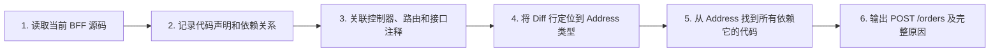
```mermaid
flowchart LR
    A["1. 读取当前 BFF 源码"]
    B["2. 记录代码声明和依赖关系"]
    C["3. 关联控制器、路由和接口注释"]
    D["4. 将 Diff 行定位到 Address 类型"]
    E["5. 从 Address 找到所有依赖它的代码"]
    F["6. 输出 POST /orders 及完整原因"]

    A --> B --> C --> D --> E --> F
```

| 步骤 | 在示例中发生了什么 | 中间结果 |
| --- | --- | --- |
| 读取源码 | 解析三个 Go 文件 | 找到 `Address`、`CreateOrderRequest`、`OrderAPI.Create` 和 `Init` |
| 记录关系 | 识别类型使用和函数值使用 | 知道谁依赖谁 |
| 关联路由 | 将 `controller.API.Create` 解析成稳定的方法声明 | 知道 `POST /orders` 注册了哪个 Controller |
| 定位 Diff | 修改行落在 `Address` 声明内部 | 产生“Address 发生变化”的变更起点 |
| 传播影响 | 从被修改类型寻找引用它的类型、方法和路由 | 得到一条到达 HTTP 接口的路径 |
| 输出结果 | 汇总接口并保留证据 | 得到摘要、完整传播树和接口来源摘要 |

为什么必须先记录和关联代码，再定位 Diff？

Diff 只提供文件名和行号，本身不知道这一行属于类型、方法还是路由。分析器先理解完整源码，才能将 `model/model.go:4` 准确定位为 `Address`，再沿代码关系传播。

### 2.3 “依赖方向”和“影响方向”

从写代码的角度，依赖关系是：

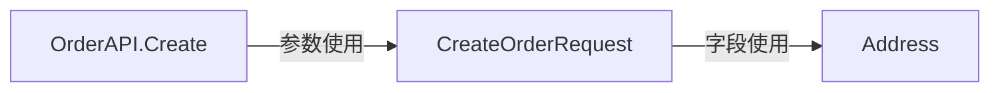
```mermaid
flowchart LR
    CREATE["OrderAPI.Create"]
    REQUEST["CreateOrderRequest"]
    ADDRESS["Address"]

    CREATE -->|"参数使用"| REQUEST
    REQUEST -->|"字段使用"| ADDRESS
```

这表示 `Create` 依赖 `CreateOrderRequest`，`CreateOrderRequest` 又依赖 `Address`。

本次从 `Address` 的变化出发，需要反过来找“谁使用了它”，所以影响传播方向与代码依赖方向相反：

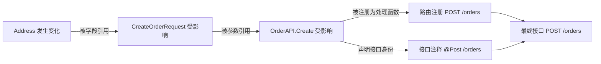
```mermaid
flowchart LR
    ADDRESS["Address 发生变化"]
    REQUEST["CreateOrderRequest 受影响"]
    CREATE["OrderAPI.Create 受影响"]
    ROUTE["路由注册 POST /orders"]
    ANNOTATION["接口注释 @Post /orders"]
    ENDPOINT["最终接口 POST /orders"]

    ADDRESS -->|"被字段引用"| REQUEST
    REQUEST -->|"被参数引用"| CREATE
    CREATE -->|"被注册为处理函数"| ROUTE
    CREATE -->|"声明接口身份"| ANNOTATION
    ROUTE --> ENDPOINT
    ANNOTATION --> ENDPOINT
```

本文后续所说的“反向引用查询”，就是从被修改的声明出发，反查所有直接或间接使用它的代码。

### 2.4 输出为什么同时有 `method/path` 和 `routes`

示例的接口摘要为：

```json
{
  "method": "POST",
  "path": "/orders",
  "routes": [
    {
      "method": "POST",
      "path": "/orders"
    }
  ]
}
```

这两组字段承担不同职责：

| 字段 | 来源 | 用途 |
| --- | --- | --- |
| `method`、`path` | Controller 上的接口注释；没有注释时才使用静态路由结果 | 作为接口的正式身份 |
| `routes` | `group.POST(...)` 等真实路由注册代码 | 作为接口实际如何注册的辅助证据 |

采用这个策略是因为 BFF 的路由经常经过 Group Prefix、Wrapper 或跨函数传递，静态分析得到的注册路径可能不完整；而 Controller 注释通常是下游系统使用的接口身份。两者同时输出还可以发现注释与路由不一致的问题。

例如：

```json
{
  "method": "POST",
  "path": "/admin/api/bff-web/orders",
  "routes": [
    {
      "method": "POST",
      "path": "/api/bff-web/orders"
    }
  ]
}
```

这里正式接口身份来自注释，`routes` 则明确展示静态解析到的注册路径，没有用其中一个悄悄覆盖另一个。

### 2.5 如何看接口来源摘要

```json
{
  "method": "POST",
  "path": "/orders",
  "sources": [
    {
      "sourceType": "file",
      "sourceFile": "model/model.go",
      "rootSymbols": [
        {
          "kind": "type",
          "name": "Address",
          "file": "model/model.go"
        }
      ],
      "chains": [
        [
          "type Address",
          "type CreateOrderRequest",
          "method Create",
          "route POST /orders",
          "annotation POST /orders",
          "POST /orders"
        ]
      ]
    }
  ]
}
```

字段含义：

- `method/path`：正在解释的 HTTP 接口。
- `sources`：影响该接口的所有来源，同一个接口可以同时受多个文件、Module 或 gRPC 接口影响。
- `sourceType`：来源类型，可能是 `file`、`module` 或 `grpc`。
- `sourceFile`：本例的变化来自 `model/model.go`。
- `rootSymbols`：Diff 首先命中的代码声明，本例是 `Address`。
- `chains`：从变化声明走到接口的简化路径，适合快速人工确认。

完整递归证据保留在 `fileSources[].symbols`；这里的 `chains` 是同一结论的精简阅读视图，不会重新计算影响范围。

## 3. 一次分析在系统中怎样运行

### 3.1 总体流程

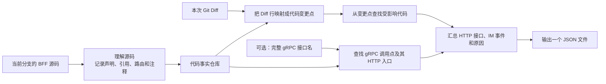
```mermaid
flowchart LR
    SOURCE["当前分支的 BFF 源码"]
    DIFF["本次 Git Diff"]
    RPC["可选：完整 gRPC 接口名"]

    UNDERSTAND["理解源码<br/>记录声明、引用、路由和注释"]
    STORE["代码事实仓库"]
    MAP["把 Diff 行映射成代码变更点"]
    WALK["从变更点查找受影响代码"]
    RPCQUERY["查找 gRPC 调用点及其 HTTP 入口"]
    RESULT["汇总 HTTP 接口、IM 事件和原因"]
    JSON["输出一个 JSON 文件"]

    SOURCE --> UNDERSTAND --> STORE
    DIFF --> MAP
    STORE --> MAP --> WALK --> RESULT
    RPC --> RPCQUERY
    STORE --> RPCQUERY --> RESULT
    RESULT --> JSON
```

图中的两个分支分别回答：

- **代码 Diff 分支**：当前 BFF 的代码变化会影响哪些接口？
- **gRPC 输入分支**：当前 BFF 的哪些接口在代码上能够到达这个上游 gRPC 调用？

两个分支共用一次源码理解结果，不会重复解析项目。

### 3.2 各阶段的输入和产物

| 阶段 | 做什么 | 产生什么 |
| --- | --- | --- |
| 源码理解 | 解析 Go 文件，识别声明、类型使用、函数调用、路由、注释、IM 和 gRPC 调用 | 代码事实仓库 |
| Diff 定位 | 用文件和行号找到最具体的代码声明或注册语句 | 一个或多个变更起点 |
| 影响传播 | 反查谁使用变更起点，并在路由注册处结束 | 带完整原因的 HTTP 接口和 IM 事件 |
| gRPC 反查 | 从完整 gRPC 接口名找到 BFF 调用点，再反查 HTTP 入口 | gRPC 来源及接口调用链 |
| 输出整理 | 对结论去重、排序，并按来源生成完整和精简视图 | 稳定 JSON |

## 4. 代码事实仓库

### 4.1 它是什么

分析器需要先把不同 Go 文件中的信息连接起来，才能回答“谁依赖谁”。`facts.Store` 就是一次分析过程中的临时数据容器：

- 它不是数据库。
- 它不是事件消息总线。
- 它不执行影响传播。
- 它只按类型保存从源码和本次 Diff 中得到的静态数据。

核心结构如下。注释说明了每个字段是什么以及由哪里产生：

```go
type Store struct {
	Project ProjectFact // 项目根、module path 和本次代码筛选条件；由项目加载阶段写入
	Modules []ModuleDependencyFact // 当前 go.mod 的 require/replace 依赖

	Symbols []SymbolFact // 函数、方法、类型、包级变量和常量
	References []ReferenceFact // Symbol 之间的 call/value/type 依赖边

	Annotations []AnnotationFact // Controller 注释中的 HTTP Method 和 Path
	RouteGroups []RouteGroupFact // 路由 Group、Prefix 和父子关系
	RouteGroupFlows []RouteGroupFlowFact // Group 作为参数或返回值时的跨函数流转
	Routes []RouteRegistrationFact // GET/POST 等路由注册及其处理函数
	Middleware []MiddlewareBindingFact // Group 上挂载的中间件和语句顺序
	Links []LinkFact // Route -> Handler、Handler -> Annotation 的关联结果

	IMEvents []IMEventFact // 出站 IM 事件及其 Event/Payload/条件依赖
	GrpcOperations []GrpcOperationFact // Generated Client 中声明的完整 gRPC 接口
	GrpcCalls []GrpcCallFact // BFF 代码中对 Generated Client 的调用点

	Changes []ChangeFact // 本次 Diff 映射出的代码变更起点
	ModuleChanges []ModuleChangeFact // 本次 go.mod Diff 中的依赖版本变化
	ModuleUsages []ModuleUsageFact // 发生变化的 Module 在本项目中的真实引用位置
	Diagnostics []DiagnosticFact // 无法解析、存在歧义或降级处理的原因
}
```

### 4.2 从示例看 Store 里有什么

下面只展示与 `Address` 案例有关的数据，源码位置等辅助字段暂时省略；字段名和 Symbol ID 形式与对应 Fact 定义保持一致。`changes` 仅在内存中参与影响分析，不会出现在 `facts` 命令的公开 JSON 中：

```jsonc
{
  "symbols": [
    {
      "id": "type:example.com/type-impact/model::Address",
      "name": "Address",
      "kind": "type"
    },
    {
      "id": "type:example.com/type-impact/model::CreateOrderRequest",
      "name": "CreateOrderRequest",
      "kind": "type"
    },
    {
      "id": "method:example.com/type-impact/controller:OrderAPI:Create",
      "name": "Create",
      "kind": "method"
    }
  ],
  "references": [
    {
      // CreateOrderRequest 的字段使用 Address
      "kind": "type",
      "from_symbol": "type:example.com/type-impact/model::CreateOrderRequest",
      "to_symbol": "type:example.com/type-impact/model::Address"
    },
    {
      // Create 方法的参数使用 CreateOrderRequest
      "kind": "type",
      "from_symbol": "method:example.com/type-impact/controller:OrderAPI:Create",
      "to_symbol": "type:example.com/type-impact/model::CreateOrderRequest"
    }
  ],
  "annotations": [
    {
      "id": "annotation:method:example.com/type-impact/controller:OrderAPI:Create:POST:/orders:0",
      "handler_symbol": "method:example.com/type-impact/controller:OrderAPI:Create",
      "method": "POST",
      "path": "/orders"
    }
  ],
  "routes": [
    {
      "id": "route:func:example.com/type-impact/router::Init:POST:/orders:1",
      "method": "POST",
      "local_path": "/orders",
      "resolved_path": "/orders",
      "handler_raw": "controller.API.Create",
      "handler_symbol": "method:example.com/type-impact/controller:OrderAPI:Create"
    }
  ],
  "links": [
    {
      "kind": "route_to_handler",
      "from_id": "route:func:example.com/type-impact/router::Init:POST:/orders:1",
      "to_id": "method:example.com/type-impact/controller:OrderAPI:Create"
    },
    {
      "kind": "handler_to_annotation",
      "from_id": "method:example.com/type-impact/controller:OrderAPI:Create",
      "to_id": "annotation:method:example.com/type-impact/controller:OrderAPI:Create:POST:/orders:0"
    }
  ],
  "changes": [
    {
      // 这一项不是源码固有数据，而是本次 Diff 定位后追加的外部输入
      "kind": "symbol_changed",
      "symbol_id": "type:example.com/type-impact/model::Address",
      "file": "model/model.go",
      "source": "git_diff"
    }
  ]
}
```

### 4.3 数据结构之间如何关联

`ReferenceFact` 不复制 Symbol 内容，而是通过 `from` 和 `to` 中的稳定 Symbol ID 关联两条 `SymbolFact`：

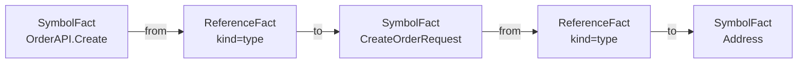
```mermaid
flowchart LR
    CREATE["SymbolFact<br/>OrderAPI.Create"]
    REF1["ReferenceFact<br/>kind=type"]
    REQUEST["SymbolFact<br/>CreateOrderRequest"]
    REF2["ReferenceFact<br/>kind=type"]
    ADDRESS["SymbolFact<br/>Address"]

    CREATE -->|"from"| REF1
    REF1 -->|"to"| REQUEST
    REQUEST -->|"from"| REF2
    REF2 -->|"to"| ADDRESS
```

同样：

- `RouteRegistrationFact.handlerSymbol` 指向 Handler 的 Symbol ID。
- `AnnotationFact.handlerSymbol` 指向同一个 Handler。
- `LinkFact` 保存 Route、Handler 和 Annotation 的明确关联。
- `ChangeFact.symbolID` 指向本次变化的 Symbol。

因此，影响传播不需要重新解析源码，只需要沿这些稳定 ID 查询关系。

### 4.4 哪些数据来自源码，哪些来自外部输入

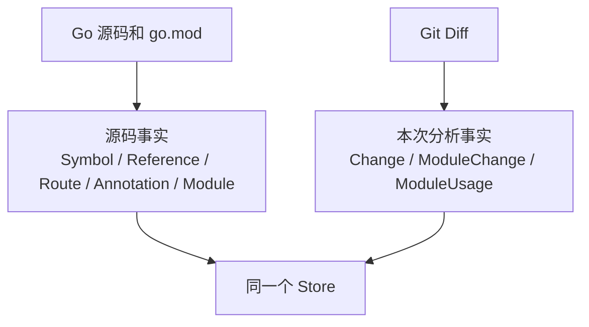
```mermaid
flowchart TB
    SOURCE["Go 源码和 go.mod"]
    CODEFACTS["源码事实<br/>Symbol / Reference / Route / Annotation / Module"]
    DIFF["Git Diff"]
    CHANGEFACTS["本次分析事实<br/>Change / ModuleChange / ModuleUsage"]
    STORE["同一个 Store"]

    SOURCE --> CODEFACTS --> STORE
    DIFF --> CHANGEFACTS --> STORE
```

- 源码事实描述“当前项目是什么样子”，可以通过 `facts` 命令输出用于排查。
- 本次分析事实描述“这次改了什么”，只在当前影响分析中使用。
- Diagnostic 单独记录无法确定的原因，不混入正式接口结论。

### 4.5 谁负责写入

流水线编排器 `internal/app` 负责按顺序调用各阶段。这里的 `app` 不是业务应用，而是 `go-analyzer` 内部的命令编排模块。

写入顺序为：

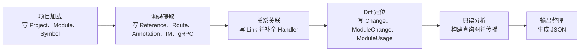
```mermaid
flowchart LR
    A["项目加载<br/>写 Project、Module、Symbol"]
    B["源码提取<br/>写 Reference、Route、Annotation、IM、gRPC"]
    C["关系关联<br/>写 Link 并补全 Handler"]
    D["Diff 定位<br/>写 Change、ModuleChange、ModuleUsage"]
    E["只读分析<br/>构建查询图并传播"]
    F["输出整理<br/>生成 JSON"]

    A --> B --> C --> D --> E --> F
```

进入只读分析阶段后，查询图和输出层不得重新扫描 Go 语法树（AST）或补造业务关系。

## 5. 源码如何变成事实

本节接着第 4 节说明 Store 中每类源码事实如何产生，不再引入第二套“领域事实”概念。

### 5.1 加载实际会参与构建的 Go 文件

项目加载阶段读取 go.mod、Go 文件和条件编译声明。

GOOS、GOARCH、Build Tags 和 cgo 的含义是：同一个仓库中并非所有文件都会同时参与构建。例如：

```text
transport_linux.go   只在 Linux 构建
transport_darwin.go  只在 macOS 构建
feature_new.go       只在指定 feature_new Build Tag 时构建
```

分析器使用与本次构建一致的条件选择文件，避免把不会参与编译的代码错误地传播到接口。一般项目使用默认环境；只有 CI 目标环境或特殊 Build Tag 与本机不同时才需要显式指定。

随后为以下声明建立稳定 Symbol：

- Function。
- Receiver Method。
- Type。
- Package-level Var。
- Package-level Const。

### 5.2 识别类型、调用和值引用

只分析函数调用不足以覆盖 BFF：

```go
group.POST("/orders", controller.API.Create) // Create 作为函数值传入

func Create(req model.CreateOrderRequest)    // 使用请求类型
```

因此引用分为：

| 类型 | 例子 | 解决的问题 |
| --- | --- | --- |
| `call` | `service.Load()` | 谁调用了被修改函数 |
| `value` | 将 `controller.Create` 传给路由 | 哪个 Handler 被注册 |
| `type` | 参数使用 `CreateOrderRequest` | DTO 或字段变化影响哪些方法 |

只有目标能够唯一解析到项目内 Symbol 时才建立确定引用；否则保留 Diagnostic，不随意选择同名声明。

### 5.3 识别接口注释、路由和中间件

接口注释：

```go
// @Post /admin/api/bff-web/orders
func (api *OrderAPI) Create(...) {}
```

路由：

```go
admin := root.Group("/admin")
web := admin.Group("/api/bff-web")
web.Use(Auth())
web.POST("/orders", controller.API.Create)
```

分析器记录：

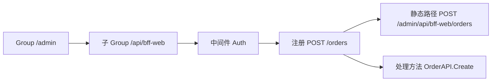
```mermaid
flowchart LR
    G1["Group /admin"]
    G2["子 Group /api/bff-web"]
    MW["中间件 Auth"]
    ROUTE["注册 POST /orders"]
    FULL["静态路径 POST /admin/api/bff-web/orders"]
    HANDLER["处理方法 OrderAPI.Create"]

    G1 --> G2 --> MW --> ROUTE --> FULL
    ROUTE --> HANDLER
```

中间件还要记录语句顺序。同一个 Group 中，`.Use()` 只影响它之后注册的路由。

Group 作为函数参数或返回值传递时，`RouteGroupFlowFact` 记录它跨函数去了哪里，从而继续拼接 Prefix 和传播 Group 上的依赖。

### 5.4 关联 Route、Handler 和 Annotation

路由源码首先提供的是表达式：

```go
controller.API.Create
```

关联阶段将它解析成稳定的 `OrderAPI.Create` 方法 Symbol，再连接该方法的接口注释：

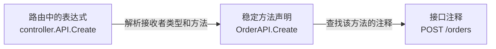
```mermaid
flowchart LR
    RAW["路由中的表达式<br/>controller.API.Create"]
    SYMBOL["稳定方法声明<br/>OrderAPI.Create"]
    NOTE["接口注释<br/>POST /orders"]

    RAW -->|"解析接收者类型和方法"| SYMBOL
    SYMBOL -->|"查找该方法的注释"| NOTE
```

Wrapper、Package Var、Struct Field 和 Method Value 也使用同一套身份解析，无法唯一确定时不伪造 Handler。

### 5.5 识别出站 IM

IM 分析先确认调用确实属于 IM，再解析 Event 和 Payload。

#### 公共 SDK 调用

精确匹配以下 Import：

```text
gopkg.inshopline.com/sc1/commons/utils/bus/notify/im
```

以及四个函数：

```text
SendIm
SendImAsync
SendImToUid
SendImToUidAsync
```

以 `SendIm` 为例：

```go
notifyim.SendIm(ctx, "app", "group", "order/created", payload)
```

第 4 个参数是 Event，第 5 个参数是 Payload。Import 或函数名不匹配时不认作 IM；参数不足时记录 Diagnostic。

#### Broadcast 协议

项目代码必须同时存在：

```text
broadcast://
/broadcast/send
```

两个锚点都存在后，才继续识别 `BroadcastParams{Event: ...}` Wrapper，或同一个发送对象上的 `Body` 赋值与 `.Event(topic)` 调用，降低普通 `Event` 方法或 `Body` 字段造成的误报。

Event 可以由 String Literal、Const、字符串拼接、Imported Const 或可证明的 Enum 计算得到。动态 Event 保留在完整证据树中，但不进入正式 IM 摘要。

### 5.6 识别 BFF 的 gRPC Client 调用

详细流程见第 8 节。这里产生两类事实：

- `GrpcOperationFact`：Generated Client 中声明的完整 gRPC 接口。
- `GrpcCallFact`：BFF 的哪个方法调用了哪个 Generated Client Method。

## 6. Diff 如何变成传播起点

### 6.1 定位修改、新增和删除

分析器读取当前分支修改后的源码，并使用 Diff 的文件名和行号定位本次变化。

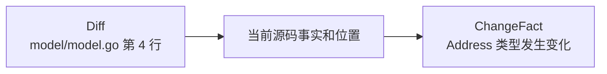
```mermaid
flowchart LR
    LINE["Diff<br/>model/model.go 第 4 行"]
    FACTS["当前源码事实和位置"]
    CHANGE["ChangeFact<br/>Address 类型发生变化"]

    LINE --> FACTS --> CHANGE
```

定位优先选择最具体的目标：

```text
接口注释
  -> 路由 Group
  -> 路由注册
  -> 中间件绑定
  -> 最小的函数、方法、类型、变量或常量声明
  -> 仅保留文件级变化
```

这样，修改 `group.POST(...)` 时会得到“路由变化”，而不是笼统地认为整个 `Init` 函数发生变化。

项目目录天然使用修改后的代码，不需要使用者额外准备旧版本源码。分析器只需校验 Diff 的文件路径和上下文确实与当前源码一致，避免拿错 Diff。

### 6.2 删除路由的例子

删除后的源码已经看不到旧路由，因此需要从 Diff 的删除行恢复必要证据：

```diff
 func Init(group *Group) {
-    group.POST("/orders", controller.API.Create)
 }
```

处理过程：

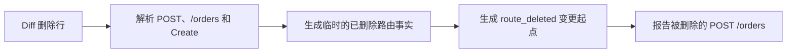
```mermaid
flowchart LR
    DELETE["Diff 删除行"]
    PARSE["解析 POST、/orders 和 Create"]
    RECOVER["生成临时的已删除路由事实"]
    CHANGE["生成 route_deleted 变更起点"]
    RESULT["报告被删除的 POST /orders"]

    DELETE --> PARSE --> RECOVER --> CHANGE --> RESULT
```

只恢复删除分析需要的 Method、Path、Handler、Group 和 Annotation，不重建整个旧版本项目。无法从删除行和当前代码证明完整接口时，记录 Diagnostic，不猜测结果。

### 6.3 go.mod 变化为什么需要特殊处理

假设 go.mod 将某个 Module 从 `v1.2.0` 升级到 `v1.3.0`。只看到版本号变化时，分析器不知道哪些 BFF 代码真正使用了它。如果直接把整个项目标记为受影响，会产生大量无关接口。

因此处理方式是：

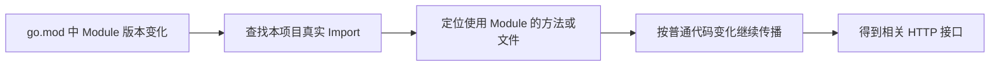
```mermaid
flowchart LR
    MOD["go.mod 中 Module 版本变化"]
    IMPORT["查找本项目真实 Import"]
    SYMBOL["定位使用 Module 的方法或文件"]
    WALK["按普通代码变化继续传播"]
    ENDPOINT["得到相关 HTTP 接口"]

    MOD --> IMPORT --> SYMBOL --> WALK --> ENDPOINT
```

完全没有 Import 使用的 Module 不产生接口影响。

### 6.4 如何过滤 Module 噪音

部分 BFF 项目会频繁升级 Proto Module。经过业务确认，如果这类升级不应作为 BFF 逻辑回归触发源，可以使用忽略列表减少噪音：

```json
{
  "analyzeModuleChanges": true,
  "ignoredModuleChanges": [
    "gopkg.inshopline.com/sc1/app/modules/*/proto"
  ]
}
```

当前配置提供：

- `analyzeModuleChanges: false`：关闭全部 go.mod 依赖变化分析。
- `ignoredModuleChanges`：黑名单语义，支持精确 Module Path 或 Glob。

未配置的 Module 仍按真实 Import 使用点传播。配置只过滤 go.mod 版本变化，不改变 Route、Annotation、Middleware 等源码解析规则。

CLI 可以通过 `--impact-config` 指定配置文件；没有指定时读取项目内：

```text
.analyzer/go-impact.config.json
```

显式传入的配置文件路径必须是绝对路径，未知字段和非法 Glob 直接报错。

## 7. 影响如何传播到 HTTP 接口

### 7.1 整体流程

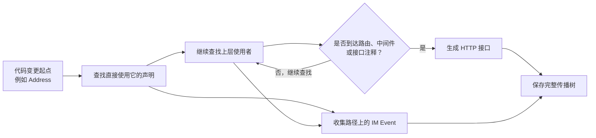
```mermaid
flowchart LR
    CHANGE["代码变更起点<br/>例如 Address"]
    USERS["查找直接使用它的声明"]
    MORE["继续查找上层使用者"]
    BINDING{"是否到达路由、中间件<br/>或接口注释？"}
    ENDPOINT["生成 HTTP 接口"]
    IM["收集路径上的 IM Event"]
    TREE["保存完整传播树"]

    CHANGE --> USERS --> MORE --> BINDING
    BINDING -->|"是"| ENDPOINT
    BINDING -->|"否，继续查找"| MORE
    USERS --> IM
    MORE --> IM
    ENDPOINT --> TREE
    IM --> TREE
```

第 2 节的案例对应：

```text
Address
  -> CreateOrderRequest
  -> OrderAPI.Create
  -> POST /orders
```

### 7.2 四类查询关系

下表不是新的处理步骤，而是传播阶段为了快速查关系而建立的四种内存索引：

| 查询关系 | 通俗说明 | 在案例中的作用 |
| --- | --- | --- |
| 反向引用索引 | 从被使用的声明反查所有使用者 | 从 `Address` 找到 `CreateOrderRequest` 和 `Create` |
| 路由索引 | 从 Handler、Group 或 Middleware 查到注册路由 | 从 `Create` 找到 `POST /orders` |
| 调用索引 | 从 Handler 沿函数调用向下查找 | 查询 Endpoint 使用了哪些 gRPC 接口 |
| IM 索引 | 判断当前传播路径是否命中某个 IM Event、Payload 或条件 | 将相关 IM Event 加入结果 |

这些索引只引用第 4 节的事实，不复制第二套业务数据，也不修改 Store。

### 7.3 不同变更起点怎样进入传播

| 变化类型 | 处理方式 |
| --- | --- |
| 函数、方法、类型、变量或常量变化 | 反查所有使用者，直到路由或 IM 终点 |
| 接口注释变化 | 直接得到该注释声明的 HTTP 接口 |
| 路由变化 | 直接分析该路由绑定的 Handler 和接口 |
| 路由删除 | 使用第 6.2 节恢复的删除证据 |
| Group Prefix 变化 | 分析该 Group 及所有子 Group 的路由 |
| Middleware 变化 | 只分析该 Middleware 挂载后注册的路由 |
| 仅能定位到文件 | 保留文件变化，不扩大到整个 Package 或项目 |

### 7.4 遍历方式

每个变更起点独立生成一棵传播树。算法使用递归深度优先遍历：

```text
展开(当前声明, 当前路径):
  查找所有直接使用当前声明的上层声明
  对每个上层声明:
    如果它已经在当前路径中:
      标记为循环，不再继续
    否则:
      将它加入当前路径
      递归展开它
      返回后从当前路径移除

  查找当前声明关联的路由和中间件
  生成能够证明的 HTTP 接口
  收集当前路径关联的 IM Event
```

约束：

- 当前路径集合只用于识别循环；同一个声明可以出现在不同的有效分支中。
- 同一父节点下重复的子节点在展开后合并，减少输出重复。
- HTTP 接口全局去重，但不同文件和不同变更起点的原因分别保留。
- 所有 Map、Set 和 Slice 在输出前稳定排序。

完整传播树需要保留不同到达路径，高扇出项目的树规模可能随有效路径数量增长。不能直接缓存依赖当前路径的完整子树，否则会破坏循环标记和 IM 匹配。需要限制时，应将“接口可达性计算”和“证据路径生成”分开；超过显式节点预算必须返回明确错误并停止分析，不得静默截断。

## 8. BFF 如何识别上游 gRPC 调用

本节只讨论 BFF 作为 gRPC Client 的出站调用。

### 8.1 什么是 Generated Client Catalog

“Generated Client Catalog”可以理解为：

> 从 Protobuf 生成代码中提取的一张“Go Client 方法 -> 完整 gRPC 接口名”的可靠对照表。

Generated 文件通常包含类似代码：

```go
// Code generated by protoc-gen-go-grpc. DO NOT EDIT.

const OrderService_GetOrder_FullMethodName =
	"/shopline.order.v1.OrderService/GetOrder"

func (c *orderServiceClient) GetOrder(
	ctx context.Context,
	in *GetOrderRequest,
	opts ...grpc.CallOption,
) (*GetOrderResponse, error) {
	out := new(GetOrderResponse)
	err := c.cc.Invoke(
		ctx,
		OrderService_GetOrder_FullMethodName,
		in,
		out,
		opts...,
	)
	return out, err
}
```

分析器从 Generated Marker、`Invoke`/`NewStream`、完整接口字符串、Client Interface 和实现方法建立对照：

```text
OrderServiceClient.GetOrder
  -> /shopline.order.v1.OrderService/GetOrder
```

这里的完整接口名由三部分组成：

```text
/protobuf package.Service/Method

/shopline.order.v1.OrderService/GetOrder
 └──── package ────┘ └ Service ┘└ Method ┘
```

它是跨仓库稳定匹配 gRPC 接口的身份。只看 Go 方法名 `GetOrder` 不够，因为不同 Service 可以存在同名方法。

### 8.2 BFF 调用的真实例子

```go
type OrderGateway struct {
	client orderv1.OrderServiceClient
}

func (g *OrderGateway) LoadOrder(ctx context.Context, id string) error {
	_, err := g.client.GetOrder(ctx, &orderv1.GetOrderRequest{Id: id})
	return err
}

// @Get /orders/:id
func (api *OrderAPI) Detail(ctx *Context) {
	_ = api.gateway.LoadOrder(ctx, ctx.Param("id"))
}

func Init(group *Group) {
	group.GET("/orders/:id", controller.API.Detail)
}
```

识别过程：

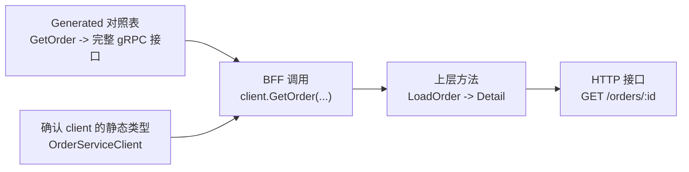
```mermaid
flowchart LR
    GENERATED["Generated 对照表<br/>GetOrder -> 完整 gRPC 接口"]
    CALL["BFF 调用<br/>client.GetOrder(...)"]
    RECEIVER["确认 client 的静态类型<br/>OrderServiceClient"]
    CALLER["上层方法<br/>LoadOrder -> Detail"]
    ROUTE["HTTP 接口<br/>GET /orders/:id"]

    GENERATED --> CALL
    RECEIVER --> CALL
    CALL --> CALLER --> ROUTE
```

只有同时满足以下证据才记录 gRPC 调用：

1. Generated 对照表存在该方法和完整接口名。
2. `client` 的静态类型能够唯一解析为对应 Generated Client。
3. 调用位于项目内可执行的方法中。

不会根据变量名、目录名、Protobuf Message 名或相似的 Go 方法名猜测接口。

### 8.3 双向查询

查询 BFF 接口依赖的 gRPC：

```text
GET /orders/:id
  -> OrderAPI.Detail
  -> OrderGateway.LoadOrder
  -> client.GetOrder
  -> /shopline.order.v1.OrderService/GetOrder
```

查询一个上游 gRPC 接口影响的 BFF 接口：

```text
/shopline.order.v1.OrderService/GetOrder
  -> client.GetOrder 调用点
  -> OrderGateway.LoadOrder
  -> OrderAPI.Detail
  -> GET /orders/:id
```

同一项目快照和代码筛选条件下，两种查询应满足：

```text
接口 A 的 gRPC 依赖包含 B
等价于
gRPC 接口 B 的 BFF 反查结果包含 A
```

## 9. 输出 JSON

### 9.1 顶层字段

实际输出按以下顺序组织：

```json
{
  "summary": {
    "impactedEndpointCount": 0,
    "impactedEndpoints": [],
    "impactedIMCount": 0,
    "impactedIMEvents": []
  },
  "fileSources": [],
  "grpcSources": [],
  "endpointSourcesSummary": []
}
```

`moduleSources` 只在 go.mod 形成有效 Module Change 时出现，位置在 `fileSources` 之后、`grpcSources` 之前。

| 字段 | 主要用途 |
| --- | --- |
| `summary` | CI 或测试平台快速读取最终结论 |
| `fileSources` | 人工查看某个代码文件的原始 Diff、变化声明和完整传播树 |
| `moduleSources` | 查看依赖版本变化、真实 Import 使用点和传播结果 |
| `grpcSources` | 查看输入的完整 gRPC 接口、BFF 调用点和 HTTP 入口 |
| `endpointSourcesSummary` | 按 HTTP 接口反查所有影响来源和简化链路 |

### 9.2 三种视图必须来自同一结论

```text
summary
  最精简：哪些接口和 IM Event 受影响

fileSources / moduleSources / grpcSources
  最完整：每个来源的原始输入和递归证据

endpointSourcesSummary
  最易解释：某个接口为什么受影响
```

输出层只整理、去重和排序分析结果，不重新扫描源码或自行判断影响。

### 9.3 稳定性

相同源码、Diff、gRPC 输入和代码筛选条件必须产生字节级稳定的 JSON：

- 数组有固定排序规则。
- Map 和 Set 在输出前转换为有序切片。
- 接口、Event、变更起点和链路使用确定性去重键。
- 空集合输出 `[]`，不输出 `null`。
- Go 输出结构、JSON Schema 和 Golden Sample 保持一致。

## 10. 代码模块怎样分层

前文先解释处理流程，本节再将每个阶段映射到代码目录。

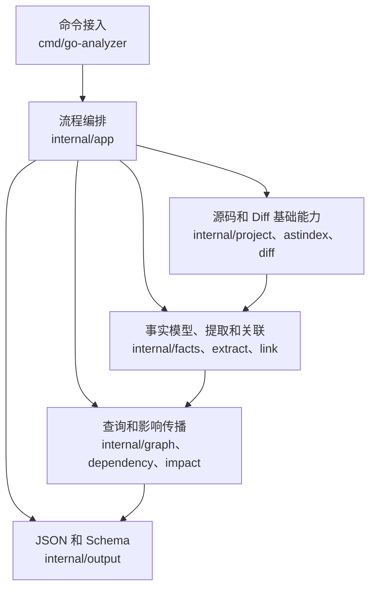
```mermaid
flowchart TB
    CLI["命令接入<br/>cmd/go-analyzer"]
    APP["流程编排<br/>internal/app"]
    BASE["源码和 Diff 基础能力<br/>internal/project、astindex、diff"]
    FACT["事实模型、提取和关联<br/>internal/facts、extract、link"]
    QUERY["查询和影响传播<br/>internal/graph、dependency、impact"]
    OUT["JSON 和 Schema<br/>internal/output"]

    CLI --> APP
    APP --> BASE
    APP --> FACT
    APP --> QUERY
    APP --> OUT
    BASE --> FACT --> QUERY --> OUT
```

| 层 | 负责什么 | 不负责什么 |
| --- | --- | --- |
| 命令接入 | 参数、绝对路径、stdout/stderr | AST 规则和影响传播 |
| 流程编排 | 按正确顺序执行各阶段、错误语义和耗时 | 具体协议语法 |
| 基础能力 | 加载项目、建立声明索引、解析和校验 Diff | 判断业务接口影响 |
| 事实与关联 | 从 AST 产生原子事实并连接稳定身份 | 输出最终影响结论 |
| 查询与传播 | 构建只读索引、双向查询和传播树 | 修改源码事实 |
| 输出 | 稳定 JSON、Schema、排序和去重 | 补造代码关系 |

新增协议时，应先定义它的原子事实和最低静态证据，再增加查询和输出；不能把协议特例堆到 CLI 或输出层。

## 11. 错误、诊断和性能

### 11.1 哪些情况停止分析

- 项目路径或 Diff 路径非法。
- Unified Diff 无法解析。
- Diff 与当前源码不匹配。
- 本次改动命中的 Go 文件无法解析。
- gRPC 严格查询无法建立 Generated 对照表。
- 最终 JSON 无法按契约生成。

关键证据缺失时不输出半份正式结果。

### 11.2 哪些情况记录 Diagnostic

- 没有改动的文件存在语法错误。
- Route Path、IM Event 或 Handler 是动态表达式。
- Receiver 或接口实现存在多个候选。
- 删除 Diff 只能恢复局部证据。
- Module 变化在本项目中没有真实使用点。

Diagnostic 用于 `facts` 命令排查，不计入正式接口和 IM Event 数量。

### 11.3 性能和观测

一次命令只加载一次项目。主要阶段记录耗时：

- Project Load。
- AST Index。
- Fact Extraction。
- Link。
- Diff Map。
- Impact Analyze。
- Output Build 和 Render。

性能约束：

- 为文件、声明和图关系建立索引，避免传播时重复扫描全仓。
- 只在 gRPC 查询需要时加载 Generated Client 依赖。
- 使用当前路径集合阻止递归环。
- 合并同一父节点下的重复子节点。
- 观测 `impact_analyze` 耗时、展开节点数和输出大小。
- 大型 Map 和 Set 只在最终输出阶段排序。

Metrics 写入 stderr，JSON stdout 只包含业务结果。

## 12. 测试和验收

### 12.1 最小案例测试

每条规则使用最小 Go 项目同时覆盖正例和反例：

- Call、Value、Type 三类引用。
- Annotation、Group、Route、Middleware 和 Wrapper。
- Diff 定位、相邻行合并和删除恢复。
- Module 变化、真实 Import 和忽略配置。
- IM SDK、Broadcast 双锚点和动态 Event。
- Generated gRPC 对照表、Receiver 类型和双向查询。
- 循环、菱形依赖、去重和稳定排序。

### 12.2 完整流程测试

- 通过 CLI 运行完整 Pipeline。
- 使用 Golden JSON 验证完整传播树和字段。
- 校验 Go 输出结构与 JSON Schema 对齐。
- 验证 stdout 只有 JSON，stderr 承载 Error 和 Timings。
- 验证 Endpoint 与 gRPC 的双向查询结果一致。
- 对相同输入重复执行并比较字节输出。

### 12.3 真实 BFF 验证

| 项目 | 验证重点 |
| --- | --- |
| `sl-sc1-admin-bff` | Annotation、Route Alias、Middleware、IM、Module Change |
| `sl-sc1-bff-service` | Route Group 跨函数流转、BFF gRPC Client、IM |
| `sl-sc2-admin-bff` | BFF 项目差异和零配置兼容性 |

每次验证保留原始 Diff、完整 JSON、接口数量、关键来源链路，以及人工确认的误报、漏报和不支持写法。

### 12.4 验收标准

1. Function、Method、DTO、Const 和 Var 变化能够传播到有证据的 HTTP 接口。
2. Route、Group、Middleware 和 Wrapper 变化只影响真实依赖它们的路由。
3. Annotation 与 Route 不一致时，同时保留正式接口身份和注册证据。
4. 静态 IM Event 进入摘要，动态 Event 只保留未解析证据。
5. Endpoint 与 gRPC 接口支持双向查询并得到一致结果。
6. go.mod 变化只从真实 Module 使用点传播，忽略配置可以控制 Proto 等噪音。
7. 删除 Route 和 Handler 能恢复可证明的接口，无法恢复时不猜测。
8. 每个 Endpoint 可以反查代码文件、Module 或 gRPC 来源。
9. 相同输入产生字节级稳定 JSON。
10. 关键证据缺失时停止正式分析，不输出误导性部分结果。

## 13. CLI 和集成

### 13.1 核心命令

| 命令 | 用途 |
| --- | --- |
| `impact` | 输入 Diff 和/或完整 gRPC 接口名，输出 BFF HTTP/IM 影响 |
| `endpoint-assets` | 查询 BFF 接口依赖的上游 gRPC 接口 |
| `facts` | 输出当前项目的源码事实和 Diagnostic，用于排查 |
| `grpc-impact` | 后端服务入站契约分析，使用独立技术方案 |
| `schema --type facts\|impact\|grpc-impact` | 输出对应 JSON Schema |

项目和文件路径参数使用绝对路径；JSON 中的源码位置统一使用项目相对路径。

`impact` 至少接收 Diff 或 gRPC 接口之一：

```text
impact --diff
  分析 BFF 代码和 go.mod 变化

impact --grpc
  反查当前 BFF 中使用指定上游 gRPC 接口的 HTTP 入口

impact --diff --grpc
  共用一次源码事实构建，在同一 JSON 中保留两类来源
```

影响配置：

```text
--impact-config <绝对路径>
```

没有传入时自动读取 `.analyzer/go-impact.config.json`。

### 13.2 Nexus 或 CI 集成

- JSON 写 stdout。
- Timings 和错误写 stderr。
- 非法输入返回非零退出码。
- 调用方显式选择命令，不根据目录名猜项目类型。
- 上层系统使用 HTTP Method/Path 和完整 gRPC 接口名串联多个项目结果。

## 14. 后续方向

以下能力使用独立方案，不在 BFF 主流程中展开：

- 后端服务端 gRPC、HTTP、Dubbo 和 XXL-Job 入站契约分析。
- 多仓 gRPC 到 BFF 再到前端页面的自动编排。
- 更精确的接口多实现和依赖注入分析。
- 增量 AST、事实缓存和大仓并行分析。
- 基于静态证据生成 QA 回归建议。

扩展仍应遵守：先定义事实，再定义关系，最后定义影响终点和输出契约。

## 附录：核心术语

| 术语 | 通俗含义 |
| --- | --- |
| Symbol | 一个可稳定定位的函数、方法、类型、包级变量或常量 |
| Fact | 从源码、go.mod 或 Diff 中得到的一条原子静态数据 |
| Store | 单次分析中保存全部 Fact 的临时数据容器 |
| ChangeFact | 本次 Diff 定位出的代码变化起点 |
| ReferenceFact | 两个 Symbol 之间的调用、值使用或类型使用关系 |
| LinkFact | Route、Handler 和 Annotation 之间已经解析清楚的关联 |
| AST | Go 源码解析后的语法树，分析器通过它理解声明、调用和表达式 |
| Handler | 接收 HTTP 请求并执行业务逻辑的 Controller 方法或函数 |
| Module | go.mod 中声明的一项 Go 依赖 |
| Diagnostic | 不影响其它可用分析继续进行、但需要保留给排查人员的解析问题 |
| 反向引用查询 | 从被修改声明反查所有直接或间接使用者 |
| Endpoint | 规范化后的 HTTP Method 和 Path |
| 来源链路 | 从代码变化起点到 Endpoint 的简化传播路径 |
| 完整 gRPC 接口名 | `/package.Service/Method` 形式的跨仓库稳定接口身份 |
| Resolved | 静态证据能够唯一确定 |
| Unresolved | 只能保留原始表达式，不能确定运行时值 |
