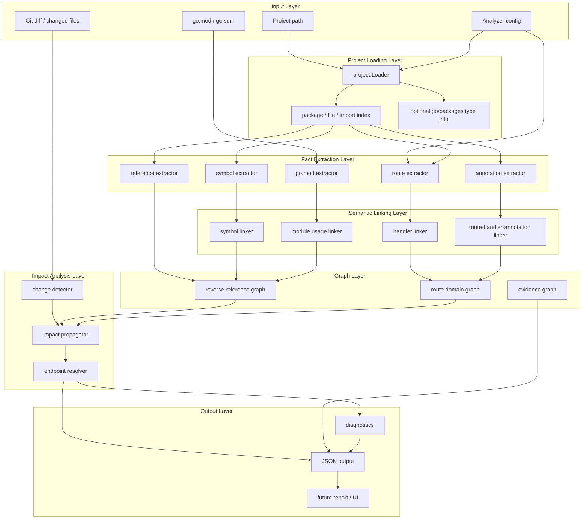
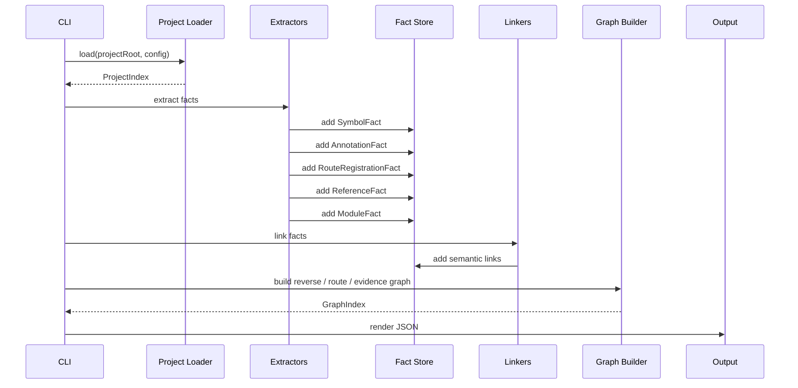
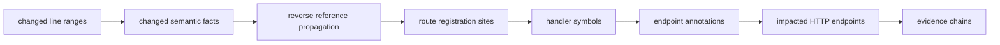

# go-analyzer MVP 架构技术方案

## 1. 文档目标

本文定义 `go-analyzer` MVP 的正式技术方案，也是当前阶段的最终汇总方案。旧版 `go-bff-impact-analysis-design.md` 中关于影响传播、route context、`go.mod` 依赖变更和降级策略的内容，已被合并到本文对应章节；后续架构讨论以本文为准。

它重点回答：

- 项目应该采用什么架构。
- 目录如何分层。
- 核心数据模型如何设计。
- MVP 如何从 Go BFF 代码中抽取准确事实。
- 后续如何从事实抽取自然演进到影响范围分析。
- 每个阶段应交付什么里程碑。

本方案基于当前目标项目 `sc1-admin-bff`、`sc1-bff-service` 的代码形态，并参考：

- `nexus/internal/transform/bff/openapi` 的 BFF annotation、route、handler 抽取能力。
- `nexus/internal/transform/go-sdk` 的 Go 文档宇宙、符号注册表、包路由索引设计。
- `visanal` 的本地 CLI、HTTP API、图数据输出和可视化产品形态。

MVP 的核心原则是：

```text
先抽取准确的代码事实，再判断代码事实是否正确。
```

因此第一版不做 annotation 与 route 注册是否一致的校验，不判断注释是否过期，不判断代码语义是否业务正确。它只负责把代码里真实存在的事实稳定、完整、可追溯地抽出来。

## 2. 产品定位

`go-analyzer` 是面向 Go BFF 项目的静态影响分析工具。它最终要回答：

```text
这次 Go BFF diff 影响了哪些 HTTP 接口？
```

但为了确保架构可长期演进，MVP 不直接跳到复杂影响分析，而先建设一个可靠的代码事实底座：

```text
Go project
  -> AST / type / comment / route facts
  -> symbol linking
  -> route-handler-annotation linking
  -> JSON facts
  -> impact analysis
```

MVP 第一阶段的输出不是“结论优先”，而是“事实优先”：

- controller 注释中写了哪些 HTTP endpoint。
- route 文件中注册了哪些 HTTP method / local path / handler。
- handler 被哪些 wrapper 包裹。
- handler 对应哪个函数或方法。
- route registration 位于哪个文件、函数、代码位置。
- controller、service、remote、util 之间存在什么引用关系。
- `go.mod` 变更涉及哪些模块，以及本仓哪些 import 使用了这些模块。

这套事实底座是后续影响传播、诊断、可视化和报告的共同基础。

## 3. 架构原则

### 3.1 Fact First

第一版只抽取事实，不做正确性裁判。

例如：

```go
appProxyRouter.GET("/mc/setting/chat_widget", sa2.ControllerWithResp(app_proxy.GetChatWidgetSetting))
```

和：

```go
// @Post /sc1-internal/app-proxy/api/mc/setting/chat_widget
func GetChatWidgetSetting(...) (...) {}
```

即使 route 是 `GET`，annotation 是 `@Post`，MVP 也只记录：

- route registration 中的 method 是 `GET`。
- annotation 中的 method 是 `POST`。
- 它们关联到同一个 handler。

是否冲突、是否过期、是否需要人工修复，放到后续 diagnostics 阶段。

### 3.2 Annotation As Endpoint Source

MVP 最终 HTTP endpoint 优先来自 controller / generated controller 注释：

```go
// @Post /admin/api/bff-web/merchant/sub/setting/channel
func (m *merchantSettingApi) UpdateSubMerchantSettingByCode(...) (...) {}
```

原因：

- annotation 通常表达稳定 API contract。
- route group path 可能来自常量、helper、wrapper、旧路径兼容、generated route。
- 第一版强行拼接所有 route path 容易制造“看起来精确但实际错误”的结果。

route AST 仍然是一等事实，但它主要承担：

- 证明 handler 被注册。
- 记录 route local path，例如 `group.POST("/sub/setting/channel", handler)`。
- 支撑 route group、middleware、wrapper 变更的影响传播。
- 为后续 diagnostics 提供比对依据。

### 3.3 Route Registration Is A First-Class Node

Go BFF 的 controller 经常不是被直接调用，而是作为函数值被 route 注册引用：

```go
group.POST(
  "/sub/setting/channel",
  sa2.ControllerWithReqResp(uc.MerchantSettingApi.UpdateSubMerchantSettingByCode),
)
```

因此 route registration 不能只是字符串，也不能只是 OpenAPI path 的中间产物。它必须成为一等事实节点：

```text
RouteRegistrationFact
  method = POST
  localPath = /sub/setting/channel
  handler = uc.MerchantSettingApi.UpdateSubMerchantSettingByCode
  wrapper = sa2.ControllerWithReqResp
  file = router/merchant/merchant.go
  function = InitUserRouter
```

### 3.4 Stable Symbol Identity

所有跨层关联必须使用稳定 Symbol ID，避免靠裸字符串碰运气。

建议格式：

```text
<kind>:<package-path>:<receiver>:<name>
```

示例：

```text
func:sc1-client-bff-service/controller/common::CheckIn
method:sc1-admin-bff/controller/uc:merchantSettingApi:UpdateSubMerchantSettingByCode
var:sc1-admin-bff/controller/uc::MerchantSettingApi
type:sc1-admin-bff/controller/uc::merchantSettingApi
route:sc1-admin-bff/router/merchant:InitUserRouter:POST:/sub/setting/channel:line14
annotation:sc1-admin-bff/controller/uc:merchantSettingApi:UpdateSubMerchantSettingByCode:POST:/admin/api/bff-web/merchant/sub/setting/channel
```

MVP 可以先用 AST + import 信息生成 Symbol ID；后续逐步引入 `go/packages` / `go/types` object identity 增强精度。

### 3.5 Evidence Chain As Product Capability

最终用户不只需要知道“影响了接口 A”，还需要知道为什么：

```text
changed service method
  -> referenced by controller method
  -> used as route handler
  -> has endpoint annotation
  -> impacted HTTP endpoint
```

因此证据链不是 debug 信息，而是核心产品能力。所有事实、边、传播结果都必须带来源位置。

## 4. 总体架构

### 4.1 分层架构



### 4.2 MVP 数据流



### 4.3 后续影响分析数据流



## 5. 建议目录结构

```text
go-analyzer/
├── cmd/
│   └── go-analyzer/
│       └── main.go
├── internal/
│   ├── app/
│   │   ├── pipeline.go
│   │   └── options.go
│   ├── config/
│   │   ├── config.go
│   │   └── defaults.go
│   ├── project/
│   │   ├── loader.go
│   │   ├── module.go
│   │   ├── package.go
│   │   └── file.go
│   ├── astindex/
│   │   ├── index.go
│   │   ├── symbol.go
│   │   ├── object.go
│   │   └── position.go
│   ├── facts/
│   │   ├── store.go
│   │   ├── id.go
│   │   ├── source.go
│   │   ├── symbol.go
│   │   ├── annotation.go
│   │   ├── route.go
│   │   ├── reference.go
│   │   ├── module.go
│   │   └── link.go
│   ├── extract/
│   │   ├── symbol/
│   │   │   ├── extractor.go
│   │   │   └── extractor_test.go
│   │   ├── annotation/
│   │   │   ├── extractor.go
│   │   │   ├── parser.go
│   │   │   └── extractor_test.go
│   │   ├── route/
│   │   │   ├── extractor.go
│   │   │   ├── context.go
│   │   │   ├── handler.go
│   │   │   ├── wrapper.go
│   │   │   └── extractor_test.go
│   │   ├── reference/
│   │   │   ├── extractor.go
│   │   │   └── extractor_test.go
│   │   └── gomod/
│   │       ├── extractor.go
│   │       └── extractor_test.go
│   ├── link/
│   │   ├── symbol.go
│   │   ├── handler.go
│   │   ├── route.go
│   │   ├── module.go
│   │   └── linker_test.go
│   ├── graph/
│   │   ├── reverse.go
│   │   ├── route.go
│   │   ├── evidence.go
│   │   └── graph_test.go
│   ├── diff/
│   │   ├── parser.go
│   │   ├── changed_range.go
│   │   └── mapper.go
│   ├── impact/
│   │   ├── analyzer.go
│   │   ├── propagation.go
│   │   ├── endpoint.go
│   │   └── analyzer_test.go
│   ├── output/
│   │   ├── schema.go
│   │   ├── json.go
│   │   └── golden_test.go
│   └── diagnostics/
│       ├── diagnostics.go
│       └── codes.go
├── testdata/
│   ├── fixtures/
│   │   ├── mini-bff/
│   │   ├── route-wrapper/
│   │   ├── generated-nexus/
│   │   └── gomod-change/
│   └── golden/
├── docs/
│   └── design/
└── README.md
```

### 5.1 目录职责

| 目录 | 职责 | 设计要求 |
| --- | --- | --- |
| `cmd/go-analyzer` | CLI 入口 | 只处理参数解析和调用 `internal/app` |
| `internal/app` | 编排 pipeline | 不写 AST 细节，不写业务规则 |
| `internal/config` | 项目规则配置 | route entry、wrapper、忽略目录、build tags |
| `internal/project` | 加载项目 | 读取 module、扫描文件、加载 package |
| `internal/astindex` | 构建基础索引 | 文件、声明、位置、import、可选类型信息 |
| `internal/facts` | 统一事实模型 | 所有 extractor 输出必须落到这里 |
| `internal/extract/*` | 事实抽取 | 每个 extractor 只负责一种事实 |
| `internal/link` | 事实关联 | route-handler、handler-annotation、module-usage |
| `internal/graph` | 图结构 | 反向引用图、route 领域图、证据图 |
| `internal/diff` | diff 解析和映射 | changed lines -> changed facts |
| `internal/impact` | 影响传播 | changed facts -> impacted endpoints |
| `internal/output` | 输出协议 | JSON schema、golden 输出 |
| `internal/diagnostics` | 降级和诊断 | 只记录问题，不阻断主流程 |

## 6. 核心数据模型

### 6.1 SourceSpan

所有事实必须可追溯到源码位置。

```go
type SourceSpan struct {
    File        string `json:"file"`
    StartLine   int    `json:"startLine"`
    StartColumn int    `json:"startColumn"`
    EndLine     int    `json:"endLine"`
    EndColumn   int    `json:"endColumn"`
}
```

### 6.2 SymbolFact

记录 Go declaration。

```go
type SymbolFact struct {
    ID          SymbolID   `json:"id"`
    Kind        SymbolKind `json:"kind"`
    PackagePath string     `json:"packagePath"`
    PackageName string     `json:"packageName"`
    Name        string     `json:"name"`
    Receiver    string     `json:"receiver,omitempty"`
    Exported    bool       `json:"exported"`
    Source      SourceSpan `json:"source"`
}
```

`SymbolKind` 包括：

- `package`
- `func`
- `method`
- `type`
- `field`
- `interface_method`
- `var`
- `const`

### 6.3 AnnotationFact

记录 controller 注释中的 HTTP endpoint。

```go
type AnnotationFact struct {
    ID            FactID     `json:"id"`
    HandlerSymbol SymbolID   `json:"handlerSymbol"`
    Method        string     `json:"method"`
    Path          string     `json:"path"`
    Raw           string     `json:"raw"`
    Source        SourceSpan `json:"source"`
}
```

示例：

```json
{
  "kind": "annotation",
  "method": "POST",
  "path": "/admin/api/bff-web/merchant/sub/setting/channel",
  "handlerSymbol": "method:sc1-admin-bff/controller/uc:merchantSettingApi:UpdateSubMerchantSettingByCode"
}
```

### 6.4 RouteRegistrationFact

记录 route 注册事实。

```go
type RouteRegistrationFact struct {
    ID             FactID      `json:"id"`
    GroupID        FactID      `json:"groupId,omitempty"`
    Method         string      `json:"method"`
    LocalPath      string      `json:"localPath"`
    ResolvedPath   string      `json:"resolvedPath,omitempty"`
    GroupExpr      string      `json:"groupExpr,omitempty"`
    HandlerRaw     string      `json:"handlerRaw"`
    HandlerSymbol  SymbolID    `json:"handlerSymbol,omitempty"`
    Wrappers       []Wrapper   `json:"wrappers,omitempty"`
    MiddlewareRefs []SymbolID  `json:"middlewareRefs,omitempty"`
    RouteFunc      SymbolID    `json:"routeFunc"`
    StatementIndex int         `json:"statementIndex"`
    Confidence     Confidence  `json:"confidence"`
    Source         SourceSpan  `json:"source"`
}
```

`LocalPath` 来自 route call 的第一个参数，例如 `"/sub/setting/channel"`。

`ResolvedPath` 是 route group context 能可靠计算时的拼接结果。MVP 可以记录，但不作为 endpoint 真值。

### 6.5 RouteGroupFact And MiddlewareBindingFact

旧方案中最容易被低估的一点是：route group 不只是 prefix，它还携带 middleware stack 和语句顺序。MVP 虽然以 annotation 作为 endpoint 真值，但仍要把 route context 抽成事实，因为 route prefix、middleware、guard wrapper 的变更都要通过它影响 route registration。

```go
type RouteGroupFact struct {
    ID              FactID     `json:"id"`
    ParentID        FactID     `json:"parentId,omitempty"`
    VarName         string     `json:"varName,omitempty"`
    Expr            string     `json:"expr"`
    PrefixRaw       string     `json:"prefixRaw,omitempty"`
    Prefix          string     `json:"prefix,omitempty"`
    RouteFunc       SymbolID   `json:"routeFunc"`
    CreatedAt       int        `json:"createdAt"`
    MiddlewareStack []FactID   `json:"middlewareStack,omitempty"`
    Source          SourceSpan `json:"source"`
    Confidence      Confidence `json:"confidence"`
}
```

```go
type MiddlewareBindingFact struct {
    ID                FactID     `json:"id"`
    GroupID           FactID     `json:"groupId"`
    MiddlewareRaw      string     `json:"middlewareRaw"`
    MiddlewareSymbols  []SymbolID `json:"middlewareSymbols,omitempty"`
    RouteFunc          SymbolID   `json:"routeFunc"`
    StatementIndex     int        `json:"statementIndex"`
    AppliesFromIndex   int        `json:"appliesFromIndex"`
    AppliesToRouteIDs  []FactID   `json:"appliesToRouteIds,omitempty"`
    Source             SourceSpan `json:"source"`
    Confidence         Confidence `json:"confidence"`
}
```

语句顺序必须进入事实模型：

```go
group.GET("/a", h1)
group.Use(m)
group.GET("/b", h2)
```

这里 `group.Use(m)` 只影响 `h2`，不影响 `h1`。如果跨函数顺序无法稳定判断，MVP 应输出 raw binding fact，并以 diagnostic 标识顺序传播不确定。

### 6.6 ReferenceFact

记录代码引用关系。

```go
type ReferenceFact struct {
    ID         FactID     `json:"id"`
    From       SymbolID   `json:"from"`
    To         SymbolID   `json:"to"`
    Kind       RefKind    `json:"kind"`
    Expr       string     `json:"expr"`
    Source     SourceSpan `json:"source"`
    Confidence Confidence `json:"confidence"`
}
```

`RefKind` 包括：

- `call`
- `method_call`
- `selector_ref`
- `type_ref`
- `var_ref`
- `field_ref`
- `handler_ref`
- `middleware_ref`
- `import_ref`

### 6.7 ModuleDependencyFact

记录 `go.mod` 依赖信息和变更。

```go
type ModuleDependencyFact struct {
    ModulePath string `json:"modulePath"`
    Version    string `json:"version"`
    Indirect   bool   `json:"indirect"`
    Replace    string `json:"replace,omitempty"`
}
```

变更信息独立建模：

```go
type ModuleChangeFact struct {
    ModulePath string `json:"modulePath"`
    OldVersion string `json:"oldVersion,omitempty"`
    NewVersion string `json:"newVersion,omitempty"`
    Kind       string `json:"kind"` // added, removed, upgraded, downgraded, replaced
}
```

`go.mod` 变更还需要落到本地使用点。MVP 不分析外部 module 版本间 diff，而是记录 changed module 与本仓 import / declaration 的关系。

```go
type ModuleUsageFact struct {
    ID            FactID     `json:"id"`
    ModulePath    string     `json:"modulePath"`
    ImportPath    string     `json:"importPath,omitempty"`
    File          string     `json:"file,omitempty"`
    Symbol        SymbolID   `json:"symbol,omitempty"`
    Basis         string     `json:"basis"`
    Source        SourceSpan `json:"source,omitempty"`
}
```

`Basis` 必须明确标识影响依据：

- `module_reference_precise`: 能定位到具体 imported symbol 或使用 declaration。
- `module_reference_file_fallback`: 只能定位到 import 该 module 的文件，使用该文件内 declaration 作为 fallback。
- `module_unreferenced`: changed module 未被本仓 import 使用。
- `module_diff_unavailable`: 无法获得外部 module diff，只能按本地 import 使用传播。

### 6.8 ChangeFact

diff 映射不应只停留在 changed files。MVP 需要把 changed line ranges 映射到语义事实。

```go
type ChangeFact struct {
    ID        FactID     `json:"id"`
    Kind      string     `json:"kind"`
    TargetID  FactID     `json:"targetId,omitempty"`
    SymbolID  SymbolID   `json:"symbolId,omitempty"`
    File      string     `json:"file"`
    Ranges    []LineRange `json:"ranges"`
    Source    string     `json:"source"` // git_diff, working_tree, explicit_file
    Confidence Confidence `json:"confidence"`
}
```

`Kind` 包括：

- `function_body_changed`
- `method_body_changed`
- `type_changed`
- `field_changed`
- `var_changed`
- `const_changed`
- `route_group_changed`
- `route_registration_changed`
- `middleware_binding_changed`
- `annotation_changed`
- `module_dependency_changed`

### 6.9 LinkFact

记录事实间关联。

```go
type LinkFact struct {
    From   FactID     `json:"from"`
    To     FactID     `json:"to"`
    Kind   LinkKind   `json:"kind"`
    Source SourceSpan `json:"source,omitempty"`
}
```

核心 link：

- `route_to_handler`
- `handler_to_annotation`
- `symbol_to_reference`
- `module_to_import`
- `middleware_to_route`
- `route_group_to_route`

## 7. 核心模块设计

### 7.1 Project Loader

职责：

- 读取 `go.mod` module path。
- 扫描 Go 文件，跳过 `.git`、`vendor`、`node_modules`、`testdata`、默认跳过 `_test.go`。
- 使用 `parser.ParseFile(..., parser.ParseComments)` 解析 AST。
- MVP 可先构建轻量 AST index，后续引入 `go/packages` 增强类型解析。

设计建议：

- loader 输出 `ProjectIndex`，不直接输出业务事实。
- loader 不做 route 规则判断。
- 对解析失败的文件生成 diagnostic，但不应让整个项目完全失败，除非 module 读取失败。

可参考：

- `nexus/internal/transform/bff/openapi/project.go`
- `nexus/internal/transform/go-sdk/collector/scanner.go`

### 7.2 AST Index

职责：

- 建立 package -> files -> declarations 索引。
- 建立 import alias -> import path 映射。
- 建立 func / method / type / var / const 基础符号表。
- 记录每个 AST node 的 `SourceSpan`。

第一版可以采用轻量索引：

```text
ProjectIndex
  ModulePath
  Packages
  Files
  Funcs
  Methods
  Types
  Vars
  Consts
```

后续增强：

- `go/packages` object identity。
- build tags。
- test package。
- workspace 多模块。

### 7.3 Annotation Extractor

职责：

- 遍历所有 `FuncDecl`。
- 读取 `FuncDecl.Doc`。
- 提取 `@Get`、`@Post`、`@Put`、`@Delete`、`@Patch`。
- 生成 `AnnotationFact`。

规则：

- method 统一大写。
- path 保留源码字符串语义，只做最小规范化：缺少 `/` 时补 `/`。
- 不检查 annotation 是否匹配 route。
- 同一个函数允许多个 annotation。
- generated controller 同样处理。

可参考：

- `nexus/internal/transform/bff/openapi/controller_route.go`

### 7.4 Route Extractor

职责：

- 从 route entry 出发，遍历 route 初始化函数。
- 识别 route group 创建。
- 识别 HTTP method call。
- 解包 handler wrapper。
- 记录 route registration fact。
- 记录 route group、middleware、wrapper 事实。

MVP 支持模式：

```go
g.Group("/prefix")
group.Group("/prefix")
group.GET("/path", handler)
group.POST("/path", wrapper(handler))
lego.MiddlewareController([]lego.MiddlewareFunc{...}, handler)
AddLiveReadGuard(group).GET("/path", handler)
apis.RegisterRouters(g)
```

route extractor 输出的是代码事实：

- `method`
- `localPath`
- `resolvedPath`，如果能可靠拼接
- `routeGroup`
- `middlewareBinding`
- `handlerRaw`
- `handlerSymbol`
- `wrappers`
- `statementIndex`
- `routeFunc`
- `source`

route extractor 必须执行 router function 内的局部数据流分析：

```text
route group = parent group + path prefix + middleware stack + statement order
```

最小支持：

- `group := g.Group("/merchant")` 生成 `RouteGroupFact`。
- `child := group.Group("/setting")` 继承 parent context。
- `group.Use(AuthMiddleware())` 生成 `MiddlewareBindingFact`。
- `group.GET/POST/...` 生成 `RouteRegistrationFact`，并记录当前 statement index。
- `group.Use(m)` 只影响同一 route function 内 statement index 更靠后的 route registration。
- `AddLiveReadGuard(group).GET(...)` 这类 wrapper call 生成派生 group context；wrapper 实现无法总结时，记录 raw wrapper fact 和 diagnostic。

不做：

- annotation 与 route 一致性判断。
- 运行时 route table 还原。
- 复杂反射 / map 分发穷举。

可参考：

- `nexus/internal/transform/bff/openapi/router.go`

### 7.5 Handler Linker

职责：

- 将 route 中的 handler 表达式解析为 `SymbolID`。
- 将 `uc.MerchantSettingApi.UpdateSubMerchantSettingByCode` 解析为实际 receiver method。
- 处理 package import alias。
- 处理 package-level var 到 receiver type 的映射。

示例：

```go
var MerchantSettingApi = &merchantSettingApi{}
```

和：

```go
uc.MerchantSettingApi.UpdateSubMerchantSettingByCode
```

应关联到：

```text
method:sc1-admin-bff/controller/uc:merchantSettingApi:UpdateSubMerchantSettingByCode
```

第一版可以用 AST var type inference，后续由 `go/types` 强化。

### 7.6 Reference Extractor

职责：

- 遍历函数体。
- 抽取调用、selector、类型、变量引用。
- 生成 `ReferenceFact`。

MVP 重点支持：

- `foo.Bar(...)` 方法调用。
- `pkg.Func(...)` 函数调用。
- `receiver.Method(...)` 当前 receiver 方法调用。
- `service.X.Method(...)` package-level var method 调用。
- handler function value 作为参数传递。

设计重点：

- 引用图方向使用正向事实 `from -> to`。
- 图构建时生成反向索引 `to -> from`。
- 对解析不准的引用标记 `confidence = low`，不丢弃。

### 7.7 Graph Builder

需要三类图。

#### Reverse Reference Graph

```text
被引用节点 -> 引用它的节点或代码位置
```

用于：

- service method 变更追到 controller。
- middleware function 变更追到 route binding。
- util function 变更追到所有调用者。

#### Route Domain Graph

```text
route group -> middleware binding -> route registration -> handler -> annotation
```

用于：

- route group 变更影响 group 下所有 route。
- middleware binding 变更影响后续 route。
- handler 关联 endpoint annotation。

route domain graph 必须保留 statement order：

```text
RouteGroup(group)
  -> RouteRegistration(GET /a, statement=1)
  -> MiddlewareBinding(m, statement=2)
  -> RouteRegistration(GET /b, statement=3)
```

当 `MiddlewareBinding(m)` 变化时，只传播到 statement index 大于 binding 的 route registration。跨函数 wrapper 如果能生成 wrapper summary，则按 summary 传播；如果不能，保留 raw fact 并输出 diagnostic。

#### Evidence Graph

记录一次影响传播的完整路径。

```text
changed symbol
  -> reference edge
  -> controller symbol
  -> route registration fact
  -> annotation fact
  -> endpoint
```

### 7.8 Impact Analyzer

MVP 后半段再建设。

职责：

- 读取 diff changed ranges。
- 将 changed ranges 映射到 facts。
- 从 changed facts 出发做反向传播。
- 经过 route graph 找到 handler 和 annotation。
- 输出 impacted endpoint 和 evidence chain。

注意：

- 如果找到 route registration 但没有 annotation，输出 diagnostic。
- 如果找到 annotation 但没有 route registration，仍可输出 annotation fact，但影响结论应标识证据不足。
- 第一版 endpoint 以 annotation 为准。

MVP 需要覆盖的传播场景：

```text
changed service method
  -> controller method referencing it
  -> route registration referencing controller
  -> controller endpoint annotation
```

```text
changed controller method
  -> route registration referencing controller
  -> controller endpoint annotation
```

```text
changed route group prefix
  -> route group context
  -> registered handlers under group
  -> handler endpoint annotations
```

```text
changed route registration
  -> route registration site
  -> handler endpoint annotation
```

```text
changed middleware binding
  -> later route registrations under same group
  -> handler endpoint annotations
```

```text
changed middleware function
  -> middleware binding site
  -> affected route registrations
  -> handler endpoint annotations
```

```text
changed shared utility
  -> callers
  -> route handlers
  -> endpoint annotations
```

```text
changed go.mod module
  -> local module usage facts
  -> local declarations using dependency
  -> reverse reference graph
  -> route handlers
  -> endpoint annotations
```

## 8. 输出协议

### 8.1 Facts 输出

MVP 应先支持：

```bash
go-analyzer facts --project /path/to/sc1-bff-service --format json
```

输出结构：

```json
{
  "project": {
    "root": "/path/to/sc1-bff-service",
    "modulePath": "sc1-client-bff-service"
  },
  "symbols": [],
  "annotations": [],
  "routes": [],
  "references": [],
  "modules": [],
  "links": [],
  "diagnostics": []
}
```

### 8.2 Route Fact 示例

```json
{
  "id": "route:sc1-admin-bff/router/merchant:InitUserRouter:POST:/sub/setting/channel:14",
  "method": "POST",
  "localPath": "/sub/setting/channel",
  "resolvedPath": "/merchant/sub/setting/channel",
  "handlerRaw": "sa2.ControllerWithReqResp(uc.MerchantSettingApi.UpdateSubMerchantSettingByCode)",
  "handlerSymbol": "method:sc1-admin-bff/controller/uc:merchantSettingApi:UpdateSubMerchantSettingByCode",
  "wrappers": [
    {
      "name": "ControllerWithReqResp",
      "raw": "sa2.ControllerWithReqResp(...)"
    }
  ],
  "routeFunc": "func:sc1-admin-bff/router/merchant::InitUserRouter",
  "source": {
    "file": "/path/to/sc1-admin-bff/router/merchant/merchant.go",
    "startLine": 21,
    "startColumn": 2,
    "endLine": 21,
    "endColumn": 103
  }
}
```

### 8.3 Endpoint Link 示例

```json
{
  "endpoint": {
    "source": "annotation",
    "method": "POST",
    "path": "/admin/api/bff-web/merchant/sub/setting/channel"
  },
  "handler": {
    "symbol": "method:sc1-admin-bff/controller/uc:merchantSettingApi:UpdateSubMerchantSettingByCode"
  },
  "routeRegistrations": [
    {
      "method": "POST",
      "localPath": "/sub/setting/channel",
      "file": "/path/to/sc1-admin-bff/router/merchant/merchant.go",
      "line": 21
    }
  ]
}
```

## 9. 配置设计

MVP 应内置默认规则，同时允许项目覆盖。

```yaml
project:
  routeEntries:
    - file: router/router.go
      func: InitRouter
  skipDirs:
    - .git
    - vendor
    - node_modules
    - testdata

route:
  httpMethods:
    - GET
    - POST
    - PUT
    - DELETE
    - PATCH
  handlerWrappers:
    - ControllerWithReqResp
    - ControllerWithResp
    - Controller
    - MiddlewareController
  routeGroupWrappers:
    - prefix: Add
    - contains: Guard
    - contains: Validator
  generatedRouteCalls:
    - RegisterRouters
    - RegisterRouter

annotation:
  methods:
    - Get
    - Post
    - Put
    - Delete
    - Patch
```

配置原则：

- 默认覆盖 `sc1-admin-bff` 和 `sc1-bff-service` 的主要模式。
- 不为某一个仓库写死业务路径。
- 特殊项目可以通过配置扩展 wrapper 和 route entry。

## 10. 与参考项目的关系

### 10.1 借鉴 nexus

`nexus` 是 MVP 最重要的工程参考。

可复用的设计思想：

- `Project` / `PackageInfo` / `FileInfo` 的轻量 AST index。
- `ControllerCommentCollector` 的 annotation 抽取。
- `RouterCollector` 的 route group 追踪、handler 解包、嵌套路由函数遍历。
- `grpc_dependency.go` 中从 route handler 往下递归 walk 函数调用的思路。
- `go-sdk` 中 `DocUniverse` / `SymbolRegister` 的统一符号宇宙概念。

不直接照搬的部分：

- `nexus` 的目标是生成 OpenAPI / 文档。
- `go-analyzer` 的目标是生成分析事实和影响证据。
- 因此 `go-analyzer` 不应把 `Route` 直接建成 OpenAPI operation，而应先进入 `FactStore`。

### 10.2 借鉴 visanal

`visanal` 适合作为产品形态参考。

可借鉴：

- CLI 启动本地服务。
- HTTP API 输出图数据。
- 单二进制 + 前端可视化。
- 节点、边、`UsedBy` 反向依赖展示。
- 后续可视化 dependency tree / impact graph。

不直接照搬：

- `visanal` 核心是 `go mod graph`，粒度是 module dependency。
- `go-analyzer` 核心是 Go 源码语义和 route domain graph，粒度是 declaration / reference / route registration / endpoint。

## 11. 可行性分析

### 11.1 技术可行

MVP 所需能力已有成熟参考：

- Go AST 解析使用标准库 `go/parser`、`go/ast`、`go/token`。
- comment 提取在 `nexus` 已验证。
- route registration 提取在 `nexus` 已覆盖大量 BFF 模式。
- module dependency 可参考 `visanal` 的 `go mod graph` 和 `go.mod` 解析经验。
- 影响图可从简单 adjacency map 开始，不需要一开始引入复杂图数据库。

### 11.2 工程可行

建议采用渐进增强：

1. 第一阶段用 AST + import alias 建立轻量事实。
2. 第二阶段引入 `go/packages` / `go/types` 提升 symbol linking 精度。
3. 第三阶段引入 SSA 或更复杂 interface dispatch。

这样即使类型加载受私有依赖、build tag、平台差异影响，MVP 仍可先产出足够有价值的代码事实。

### 11.3 风险可控

主要风险和策略：

| 风险 | 策略 |
| --- | --- |
| route path 动态拼接 | 记录 raw expr，可靠时才填 resolvedPath |
| annotation 过期 | MVP 不判断，只记录 |
| handler wrapper 多层嵌套 | wrapper 栈记录 raw 和 name |
| package 加载失败 | AST fallback + diagnostic |
| interface / DI 分发复杂 | MVP 标记 low confidence，后续 SSA 增强 |
| generated route 数量多 | 作为普通 Go 源码处理，同时标记 generated source family |
| shared util 影响过大 | 输出 evidence chain，后续做聚合和截断 |
| middleware 顺序跨函数不确定 | 同函数内精确记录 statement order，跨函数依赖 wrapper summary，无法总结则 diagnostic |
| `go.mod` 外部版本 diff 不可得 | 不分析外部 diff，按本地 import usage 传播并标记 basis |
| route handler 先存入 map / slice 再注册 | MVP 记录 unresolved raw handler，后续专项支持 |

## 12. 里程碑规划

### M0: 架构与测试夹具

目标：

- 建立项目骨架和测试策略。
- 准备最小 BFF fixture。

产出：

- `cmd/go-analyzer/main.go`
- `internal/app`
- `internal/facts`
- `testdata/fixtures/mini-bff`
- 基础 JSON golden 测试框架。

验收：

- CLI 可执行。
- 能读取 fixture project。
- 能输出空 facts JSON。

### M1: Project AST Index

目标：

- 构建轻量 Go 项目索引。

产出：

- module path 读取。
- Go 文件扫描。
- package / file / import index。
- func / method / type / var / const symbol facts。
- source span。

验收：

- 在 `mini-bff` 上输出稳定 symbol facts。
- 在 `sc1-bff-service` 上能完成扫描并输出 module path。

### M2: Annotation Facts

目标：

- 提取 controller 注释 endpoint。

产出：

- `@Get/@Post/@Put/@Delete/@Patch` parser。
- annotation facts。
- handler symbol 初步绑定。

验收：

- `sc1-bff-service` 能提取约 32 个 annotation endpoint。
- 支持同一函数多个 annotation。
- 不判断 annotation 是否匹配 route。

### M3: Route Registration Facts

目标：

- 提取 route 注册事实。

产出：

- route entry 识别。
- group context 追踪。
- HTTP method call 识别。
- localPath / resolvedPath / handlerRaw / wrapper。
- route group fact。
- middleware binding fact。
- statement index。
- `lego.MiddlewareController` 最后一个参数作为 handler。
- guard wrapper 直接链式注册支持。

验收：

- `sc1-bff-service` 能提取约 32 个 route registration。
- 能识别 `group.POST("/checkIn", sa.ControllerWithResp(common.CheckIn))`。
- 能识别 `appProxyRouter.Use(...)` 并记录 middleware binding fact。
- 能表达 `group.Use(m)` 只影响后续 route registration 的事实基础。

### M4: Handler Linking

目标：

- 将 route handler 绑定到 controller function / method。

产出：

- package alias 解析。
- package-level var receiver inference。
- handler wrapper stack。
- route -> handler link。
- handler -> annotation link。

验收：

- `uc.MerchantSettingApi.UpdateSubMerchantSettingByCode` 能关联到 receiver method。
- `common.CheckIn` 能关联到普通函数。
- generated `controller` 函数能被识别。

### M5: Reference Facts And Reverse Graph

目标：

- 建立源码引用关系和反向引用图。

产出：

- call / method_call / selector_ref / type_ref / var_ref。
- reverse reference graph。
- confidence 标记。

验收：

- controller 调 service 的引用可被抽取。
- service 调 remote / grpc client 的引用可被抽取。
- 从 service method 能反查到 controller method。

### M6: Diff Mapping

目标：

- 将 git diff 映射到 semantic facts。

产出：

- unified diff parser。
- changed file ranges。
- changed range -> enclosing symbol / route / annotation / middleware / module fact。
- route group、route registration、middleware binding、`go.mod` dependency change 对应的 `ChangeFact`。

验收：

- 修改 controller 函数体，可识别 changed method。
- 修改 route call，可识别 changed route registration。
- 修改 `group.Use(...)`，可识别 changed middleware binding。
- 修改 `go.mod`，可识别 module change。

### M7: MVP Impact Analysis

目标：

- 从 changed facts 传播到 impacted endpoint。

产出：

- changed symbol -> reverse reference propagation。
- route registration -> handler -> annotation。
- route group prefix -> route registration -> handler -> annotation。
- middleware binding/function -> affected route registration -> handler -> annotation。
- module usage -> local declaration -> endpoint。
- impacted endpoint JSON。
- evidence chain。

验收：

- service method 变更可追到 annotation endpoint。
- controller method 变更可追到 annotation endpoint。
- route registration 变更可追到对应 handler annotation。
- route group prefix 变更可追到 group 下 handler annotation。
- middleware binding 变更只影响后续 route registration。
- `go.mod` dependency change 可按 precise / file fallback / unreferenced basis 输出。

### M8: Real Project Validation

目标：

- 在真实 BFF 上验证可行性。

产出：

- `sc1-bff-service` 抽取报告。
- `sc1-admin-bff` 抽取报告。
- 典型 diff case golden。
- 误差和 diagnostics 清单。

验收：

- `sc1-bff-service` 完整抽取通过。
- `sc1-admin-bff` 主要 route / annotation / handler facts 可抽取。
- 输出数据稳定，适合作为后续 UI 或自动化输入。

## 13. 测试策略

### 13.1 Fixture Tests

每个能力配一个小 fixture：

- `mini-bff`: 普通 router -> controller -> service。
- `route-wrapper`: guard wrapper / MiddlewareController。
- `generated-nexus`: `nexus/codegen/apis/RegisterRouters`。
- `gomod-change`: go.mod dependency change。
- `direct-handler`: handler 直接注册，不经过 wrapper。
- `controller-wrapper`: `ControllerWithReqResp` / `ControllerWithResp`。
- `route-group-prefix`: group prefix 变更影响 group 下 handler。
- `middleware-order`: `group.Use` 只影响后续 handler。
- `middleware-function`: middleware 函数内部变更影响已绑定 route。
- `utility-fanout`: shared util fan-out 到多个 endpoint。
- `annotation-only`: 从 controller annotation 识别 endpoint。
- `route-annotation-mismatch`: route-derived path/method 与 annotation 不一致，只记录事实，diagnostic 后置。
- `dynamic-route-path`: 动态 route path 无法解析时保留 raw expr。
- `gomod-precise`: dependency upgrade 精准 import usage。
- `gomod-file-fallback`: dependency upgrade 文件级 fallback。
- `gomod-unreferenced`: dependency change 未被本地 import。

### 13.2 Golden Tests

对 facts JSON 做 golden 测试。

要求：

- 输出排序稳定。
- source span 稳定。
- ID 生成稳定。
- 新增字段向后兼容。

### 13.3 Real Project Smoke Tests

对真实项目跑 smoke：

```bash
go-analyzer facts --project /absolute/path/to/sc1-bff-service --format json
go-analyzer facts --project /absolute/path/to/sc1-admin-bff --format json
```

验收不要求完全无 diagnostics，但要求：

- 不 panic。
- 输出 JSON 可解析。
- annotation 和 route registration 数量在合理范围内。
- 核心 handler 可被 link。

## 14. 后续演进

### 14.1 Diagnostics

在 facts 稳定后，再做诊断：

- annotation 与 route method 不一致。
- annotation path 与 resolved route path 不一致。
- route handler 无 annotation。
- annotation 无 route registration。
- 动态 route path 无法解析。

### 14.2 UI / 可视化

参考 `visanal`：

- 本地 server。
- `/api/facts`
- `/api/impact`
- route graph 可视化。
- endpoint evidence chain 展示。

### 14.3 更强语义分析

后续增强：

- `go/packages` 全量 type info。
- interface implementation。
- SSA call graph。
- generated code source family。
- 外部 module diff。
- gRPC 跨仓传播。

### 14.4 前端 Analyzer 桥接

当 Go analyzer 输出稳定 endpoint 后，可作为前端 analyzer 输入：

```text
Go diff -> impacted HTTP endpoints -> frontend analyzer --api
```

## 15. 独立模块开发方案拆解

从最终架构看，需要拆解出细化的独立模块开发技术方案。原因是 `go-analyzer` 虽然最终是一个 pipeline，但每个基础能力都可以独立验收；如果直接写一个“大实现方案”，很容易让 extractor、linker、graph、impact 互相污染。

建议后续拆 6 份模块级方案：

- `docs/superpowers/plans/2026-06-26-project-ast-index-fact-store.md`
- `docs/superpowers/plans/2026-06-26-annotation-route-extraction.md`
- `docs/superpowers/plans/2026-06-26-handler-linking-reference-extraction.md`
- `docs/superpowers/plans/2026-06-26-diff-gomod-change-mapping.md`
- `docs/superpowers/plans/2026-06-26-graph-impact-propagation.md`
- `docs/superpowers/plans/2026-06-26-real-project-validation-diagnostics.md`

### 15.1 Project AST Index And Fact Store

范围：

- `internal/project`
- `internal/astindex`
- `internal/facts`
- `internal/output`

目标：

- 建立项目加载、基础符号索引、统一事实存储和 JSON 输出。

独立验收：

- 给定 `mini-bff`，输出 module、package、file、symbol facts。

### 15.2 Annotation And Route Extraction

范围：

- `internal/extract/annotation`
- `internal/extract/route`

目标：

- 提取 annotation endpoint、route registration、route group、middleware binding、wrapper stack。

独立验收：

- 给定 route fixture，输出稳定 annotation / route facts，不做影响分析。

### 15.3 Handler Linking And Reference Extraction

范围：

- `internal/link`
- `internal/extract/reference`

目标：

- 将 handler raw expr 绑定到 function / method symbol。
- 抽取 call / selector / type / var references。

独立验收：

- service -> controller -> route handler 链路可以通过 facts 和 links 表达。

### 15.4 Diff And go.mod Change Mapping

范围：

- `internal/diff`
- `internal/extract/gomod`

目标：

- 解析 unified diff。
- 将 changed ranges 映射到 symbol / route / middleware / module facts。
- 将 module change 映射到 local module usage facts。

独立验收：

- controller、route、middleware、go.mod 四类 diff 都能映射到 `ChangeFact`。

### 15.5 Graph And Impact Propagation

范围：

- `internal/graph`
- `internal/impact`

目标：

- 构建 reverse reference graph、route domain graph、evidence graph。
- 从 changed facts 传播到 annotation endpoint。

独立验收：

- service method、controller method、route registration、middleware binding、go.mod dependency change 都能生成 impacted endpoint 和 evidence chain。

### 15.6 Real Project Validation And Diagnostics

范围：

- `testdata`
- `internal/diagnostics`
- smoke scripts / golden tests

目标：

- 在 `sc1-bff-service`、`sc1-admin-bff` 上做真实抽取和影响分析验证。
- 建立 diagnostics 代码体系。

独立验收：

- 真实项目不 panic，JSON 可解析，关键事实数量稳定，unsupported 模式有 diagnostic。

推荐实施顺序：

```text
Project AST Index And Fact Store
  -> Annotation And Route Extraction
  -> Handler Linking And Reference Extraction
  -> Diff And go.mod Change Mapping
  -> Graph And Impact Propagation
  -> Real Project Validation And Diagnostics
```

## 16. 结论

`go-analyzer` 的标杆架构不应从“写一个 diff 脚本”开始，而应从“构建可追溯代码事实底座”开始。

MVP 的最佳路径是：

```text
Annotation endpoint extraction first
Route registration facts second
Handler and symbol linking third
Reverse graph fourth
Impact propagation last
```

这样做的好处是：

- 第一阶段就能产出可验证数据。
- route、annotation、handler、reference 都是独立事实，可单测、可 golden、可复查。
- 后续 diagnostics、影响传播、UI、AI 报告都建立在同一套事实模型之上。
- 即使遇到动态代码，也能降级输出 raw fact，而不是失败。

这套架构既能吸收 `nexus` 已验证的 BFF AST 抽取经验，也能继承 `visanal` 的本地分析产品形态，同时为 `go-analyzer` 后续成为高精度 Go BFF 影响分析平台留下足够空间。
