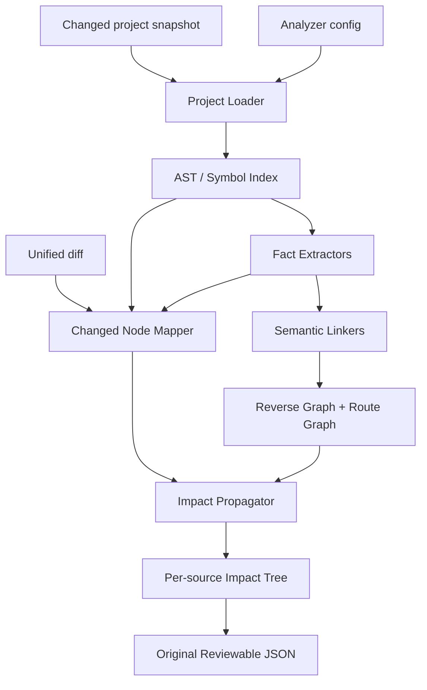

# go-analyzer 符号级影响分析架构

## 1. 文档状态

本文定义 `go-analyzer` 下一阶段的正式技术方向。

本文建立在现有 MVP 之上，不推翻已经完成的 AST、facts、route、graph 和 impact 分层。相比
`go-analyzer-mvp-architecture.md`，本文进一步明确：

- 当前只分析变更后的项目快照，双快照不在本阶段范围内。
- diff 只负责定位发生变化的语义节点，不判断函数或类型内部具体改变了什么。
- Go symbol 是影响传播的主要节点。
- route group、middleware、route、annotation 是连接 Go symbol 与 HTTP endpoint 的领域节点。
- `impact` 输出面向开发者 review 的完整原始传播树。
- compact JSON、AI skill 和自然语言回归报告均属于后续消费层能力。

## 2. 产品目标

`go-analyzer` 当前阶段只回答：

```text
一次 Go BFF diff 命中了哪些语义节点，
这些节点经过哪些 symbol、文件和 package 传播，
最终影响了哪些 HTTP endpoint？
```

目标输出必须同时满足：

1. **完整**：保留从 diff source 到 endpoint 的中间传播节点。
2. **可追溯**：每个节点和边都能回到源码位置或原始引用表达式。
3. **可 review**：开发者可以直接阅读 JSON 排查漏报和误报。
4. **可扩展**：后续可以在原始结果之上增加 compact projection 和报告 skill。
5. **确定性**：相同输入产生字节级稳定的输出。

## 3. 本阶段边界

### 3.1 包含

- 变更后项目的 Go AST 加载。
- diff 新侧行到最小 enclosing semantic node 的映射。
- func、method、type、var、const 变更。
- call、type、selector、value 等 symbol reference。
- route group、middleware、route registration、handler、annotation 关联。
- symbol 反向依赖传播。
- 传播经过的完整文件和 package。
- HTTP endpoint 终点。
- 每个 diff source 的完整影响树和 endpoint 汇总。
- diagnostics、传播深度和停止边界。

### 3.2 不包含

- Base/Head 双快照语义比较。
- 被完整删除 symbol 的精确恢复。
- 字段级、tag 级或函数内部语句级变更分类。
- 判断 annotation 是否正确或是否过期。
- 运行时 route table 还原。
- SSA、复杂 interface dispatch 和反射精确分析。
- compact skill-facing JSON。
- AI skill 和自然语言回归报告。
- 前端页面影响分析。

## 4. 核心原则

### 4.1 Symbol First

diff 的职责是找到变化发生在哪个语义节点。

```text
changed line
  -> enclosing func / method / type / var / const
  -> reverse references
  -> route domain
  -> endpoint
```

分析器不需要知道函数内部是条件变化、返回值变化还是日志变化。只要 diff 命中函数声明 span，
整个函数 symbol 都视为 changed symbol。

同理，只要 diff 命中 `TypeSpec` span，整个 type symbol 都视为 changed symbol。struct 字段、
字段类型、tag、embedded field 或类型内部注释的变化，不再拆成更细的 change kind。

### 4.2 Fact First

项目加载、事实提取、事实关联、图构建、传播和输出保持分层：

```text
Project AST
  -> Facts
  -> Links
  -> Graph Index
  -> Changed Roots
  -> Impact Trees
  -> JSON
```

extractor 不直接输出影响结论，propagator 不重新解析 AST，output 不重新执行图搜索。

### 4.3 Route Domain Is The Endpoint Boundary

普通 Go symbol graph 无法独立表达 route registration。route 不是对 handler 的普通调用，而是
把 handler 作为函数值传给注册函数。

因此传播图由两部分组成：

```text
Go symbol graph
  -> handler symbol
  -> route registration
  -> annotation
  -> HTTP endpoint
```

annotation 在当前阶段继续作为最终 endpoint method/path 的真值。route facts 提供注册关系、
route group、middleware 和 wrapper 证据。

### 4.4 Analyzer Produces Facts, Consumers Produce Reports

`go-analyzer` 只输出依赖传播事实：

- diff source。
- changed symbols。
- 完整 symbol tree。
- 中间文件和 package。
- route domain nodes。
- impacted endpoints。
- evidence 和 diagnostics。

后续 skill 可以读取原始 JSON、diff 和业务代码，把事实翻译成回归报告。但该职责不进入当前
analyzer 架构。

## 5. 总体架构



建议目录演进：

```text
internal/
├── project/          # 项目和 AST 加载
├── astindex/         # symbol identity、span 和 declaration index
├── facts/            # 原始 facts
├── extract/
│   ├── annotation/
│   ├── route/
│   ├── reference/
│   └── gomod/
├── link/             # route-handler、handler-annotation 等关联
├── diff/             # diff 解析和 changed root 映射
├── graph/            # 统一的反向索引和 route graph
├── impact/           # 传播、路径和 endpoint 聚合
└── output/           # 原始 reviewable JSON 和 schema
```

当前不引入通用 plugin framework。各 extractor 继续通过明确函数和 facts contract 协作。

## 6. 统一节点和边

### 6.1 NodeKind

传播图中的节点分为 Go symbol 和 route domain 两类：

```go
type NodeKind string

const (
    NodeKindFunc       NodeKind = "func"
    NodeKindMethod     NodeKind = "method"
    NodeKindType       NodeKind = "type"
    NodeKindVar        NodeKind = "var"
    NodeKindConst      NodeKind = "const"
    NodeKindRouteGroup NodeKind = "route_group"
    NodeKindMiddleware NodeKind = "middleware"
    NodeKindRoute      NodeKind = "route"
    NodeKindAnnotation NodeKind = "annotation"
    NodeKindEndpoint   NodeKind = "endpoint"
    NodeKindFile       NodeKind = "file"
)
```

`file` 是找不到精确 symbol 时的降级根节点，不参与普通 symbol identity。

### 6.2 NodeID

Go symbol 沿用当前稳定 ID：

```text
func:<package>::<name>
method:<package>:<receiver>:<name>
type:<package>::<name>
var:<package>::<name>
const:<package>::<name>
```

route domain ID 必须包含其 lexical owner，不能只依赖局部变量名：

```text
route_group:<route_func>:<group_var>:<declaration_ordinal>
middleware:<route_func>:<group_id>:<statement_ordinal>
route:<route_func>:<group_id>:<method>:<path>:<statement_ordinal>
annotation:<handler>:<method>:<path>:<ordinal>
endpoint:<method>:<path>
```

`RouteRegistrationFact` 和 `MiddlewareBindingFact` 必须持有 `GroupID`。`GroupVar` 只保留为
可读字段，不能作为全局 graph key。

### 6.3 EdgeKind

```go
type EdgeKind string

const (
    EdgeCall                EdgeKind = "call"
    EdgeTypeRef             EdgeKind = "type_ref"
    EdgeSelectorRef         EdgeKind = "selector_ref"
    EdgeValueRef            EdgeKind = "value_ref"
    EdgeRouteGroupContains  EdgeKind = "route_group_contains"
    EdgeMiddlewareAppliesTo EdgeKind = "middleware_applies_to"
    EdgeRegisteredHandler   EdgeKind = "registered_handler"
    EdgeHandlerAnnotation   EdgeKind = "handler_annotation"
    EdgeAnnotationEndpoint  EdgeKind = "annotation_endpoint"
)
```

代码引用 facts 继续使用正向语义：

```text
from symbol -> referenced symbol
```

影响传播时构建反向索引：

```text
referenced symbol -> symbols that depend on it
```

## 7. Changed Root Mapping

### 7.1 最小 enclosing node

一个 diff range 按优先级映射：

1. annotation。
2. route registration。
3. middleware binding。
4. route group declaration。
5. 最小 enclosing Go symbol。
6. file fallback。

Go symbol 必须使用完整 declaration span：

- `FuncDecl`：包含 doc、signature 和 body。
- `TypeSpec`：包含完整 struct/interface/alias 声明。
- `ValueSpec`：包含完整 var/const declaration，而不是只有 identifier。

同一个 range 如果同时命中多个同级 symbol，例如多名称 `ValueSpec`，允许生成多个 changed
roots，并在 source 内去重。

### 7.2 ChangeKind

ChangeKind 只表达传播起点类型，不表达代码内部语义：

```text
symbol_changed
route_group_changed
route_changed
middleware_changed
annotation_changed
file_changed
```

以下分类不再需要：

- method body changed。
- field changed。
- tag changed。
- validation changed。
- return changed。

### 7.3 单快照删除边界

当前 diff parser 主要使用新侧行号：

- 新增或修改 surviving declaration：可以映射到当前 symbol。
- surviving type 内字段或 tag 删除：可以使用新侧 hunk anchor 降级映射到 enclosing type。
- 完整删除 function、type 或文件：当前快照不存在对应 symbol，输出 file fallback 和
  `deleted_symbol_unresolved` diagnostic。

该限制在未来双快照阶段解决，本阶段不通过解析 diff 文本重建旧 AST。

## 8. Symbol Reference Extraction

### 8.1 Call Reference

保留当前已经支持的：

- 同 package 函数调用。
- imported package 函数调用。
- package-level receiver var method 调用。

### 8.2 Type Reference

新增以下 AST type reference：

- function/method 参数类型。
- function/method 返回类型。
- method receiver type。
- composite literal type。
- var declaration type。
- type alias target。
- struct field type。
- embedded type。
- slice、array、map、channel、pointer 和 function type 内部类型。
- generic type argument 和 constraint 中的项目内类型。

示例：

```go
type CreateOrderRequest struct {
    Address Address `json:"address"`
}

func (api *OrderAPI) Create(req CreateOrderRequest) Response
```

生成：

```text
type:CreateOrderRequest -> type:Address
method:OrderAPI.Create -> type:CreateOrderRequest
method:OrderAPI.Create -> type:Response
method:OrderAPI.Create -> type:OrderAPI
```

反向传播：

```text
Address changed
  -> CreateOrderRequest
  -> OrderAPI.Create
  -> route
  -> endpoint
```

struct 内字段或 tag 变化直接以 owner type 为 changed root，不需要 `FieldFact`。

### 8.3 Selector And Value Reference

新增：

- project-local var/const selector。
- function value 传递。
- route middleware symbol。
- handler wrapper 最终参数。

第一阶段使用 AST + import alias + package-level receiver inference。只有真实验收集证明精度不足时，
再引入可降级的 `go/types` resolver。

## 9. Graph Index

### 9.1 Reverse Symbol Index

```go
type ReverseGraph struct {
    ByTarget map[NodeID][]Edge
}
```

每条 edge 至少包含：

```go
type Edge struct {
    From       NodeID
    To         NodeID
    Kind       EdgeKind
    Span       SourceSpan
    Raw        string
    Confidence Confidence
}
```

### 9.2 Route Graph

Route graph 必须按稳定 ID 建立索引：

```text
GroupsByID
RoutesByID
MiddlewareByID
RoutesByGroupID
RoutesByHandler
AnnotationsByHandler
```

middleware 的语句顺序只在同一个 `RouteFunc + GroupID` 内比较，不能跨函数使用同名 group
变量传播。

### 9.3 Unified Traversal

propagator 从 changed root 出发：

1. 沿 reverse symbol edge 查找依赖者。
2. 当前节点是 handler 时进入 route graph。
3. 当前节点是 route group 或 middleware 时查找受影响 route。
4. route 进入 handler/annotation。
5. annotation 解析为 endpoint。

传播使用 BFS，以最短路径作为节点 level。每条完整路径仍保留在原始 impact tree 中。

## 10. 原始影响输出

### 10.1 输出定位

`facts` 继续输出全局事实底座，用于 extractor、linker 和 graph 调试。

`impact` 输出按 diff source 分组的完整传播树，是当前阶段的主交付物：

```text
source file
  -> changed symbol roots
  -> symbol dependency children
  -> route domain children
  -> endpoint leaves
```

当前不生成第二份 compact 输出。

### 10.2 数据模型

```go
type ImpactDocument struct {
    Meta        ImpactMeta         `json:"meta"`
    FileSources []FileSourceImpact `json:"fileSources"`
}

type ImpactMeta struct {
    SchemaVersion string           `json:"schemaVersion"`
    ProjectRoot   string           `json:"projectRoot"`
    Diagnostics   []DiagnosticFact `json:"diagnostics"`
}

type FileSourceImpact struct {
    SourceFile        string                `json:"sourceFile"`
    Diff              string                `json:"diff,omitempty"`
    Symbols           map[string]ImpactNode `json:"symbols"`
    ImpactedEndpoints []EndpointSummary     `json:"impactedEndpoints"`
}

type ImpactNode struct {
    ID           string       `json:"id"`
    Kind         NodeKind     `json:"kind"`
    Name         string       `json:"name,omitempty"`
    File         string       `json:"file,omitempty"`
    Package      string       `json:"package,omitempty"`
    Relation     EdgeKind     `json:"relation,omitempty"`
    Raw          string       `json:"raw,omitempty"`
    Span         SourceSpan   `json:"span,omitempty"`
    Confidence   Confidence   `json:"confidence,omitempty"`
    Level        int          `json:"level"`
    Cycle        bool         `json:"cycle,omitempty"`
    StopBoundary bool         `json:"stopBoundary,omitempty"`
    Children     []ImpactNode `json:"children"`
    Method       string       `json:"method,omitempty"`
    Path         string       `json:"path,omitempty"`
}

type EndpointSummary struct {
    Method string `json:"method"`
    Path   string `json:"path"`
}
```

### 10.3 示例

```json
{
  "meta": {
    "schemaVersion": "go-impact/v1alpha1",
    "projectRoot": "/project",
    "diagnostics": []
  },
  "fileSources": [
    {
      "sourceFile": "model/order.go",
      "diff": "diff --git a/model/order.go b/model/order.go\n...",
      "symbols": {
        "type:example.com/app/model::CreateOrderRequest": {
          "id": "type:example.com/app/model::CreateOrderRequest",
          "kind": "type",
          "name": "CreateOrderRequest",
          "file": "model/order.go",
          "package": "example.com/app/model",
          "level": 0,
          "children": [
            {
              "id": "method:example.com/app/controller:OrderAPI:Create",
              "kind": "method",
              "name": "Create",
              "file": "controller/order.go",
              "package": "example.com/app/controller",
              "relation": "type_ref",
              "raw": "func (api *OrderAPI) Create(req CreateOrderRequest)",
              "level": 1,
              "children": [
                {
                  "id": "route:POST:/orders",
                  "kind": "route",
                  "file": "router/order.go",
                  "package": "example.com/app/router",
                  "relation": "registered_handler",
                  "level": 2,
                  "children": [
                    {
                      "id": "annotation:POST:/orders",
                      "kind": "annotation",
                      "file": "controller/order.go",
                      "package": "example.com/app/controller",
                      "relation": "handler_annotation",
                      "level": 3,
                      "children": [
                        {
                          "id": "endpoint:POST:/orders",
                          "kind": "endpoint",
                          "relation": "annotation_endpoint",
                          "method": "POST",
                          "path": "/orders",
                          "level": 4,
                          "children": []
                        }
                      ]
                    }
                  ]
                }
              ]
            }
          ]
        }
      },
      "impactedEndpoints": [
        {
          "method": "POST",
          "path": "/orders"
        }
      ]
    }
  ]
}
```

### 10.4 树构建规则

- 每个 changed symbol 是 source 下的独立根。
- 同一父节点下相同 `NodeID + relation` 合并。
- 不跨 changed root 合并树，避免丢失 source 归因。
- 当前 traversal path 中再次出现的节点输出 `cycle: true`，不继续展开。
- 命中 stop pattern 的节点输出 `stopBoundary: true`，节点本身保留但不继续展开。
- `maxDepth = 0` 表示不限制深度。
- endpoint leaf 必须来自 annotation fact。
- `impactedEndpoints` 从所有 endpoint leaves 去重得到。
- map key、children、endpoint 和 diagnostics 必须确定性排序。
- JSON 路径使用相对 project root 的 slash path。

## 11. Diagnostics

diagnostic 必须表示“分析证据不足或发生降级”，不能静默丢失：

```text
route_dynamic_path
route_unresolved_handler
route_wrapper_unsupported
middleware_order_uncertain
annotation_missing_for_handler
package_load_failed
symbol_reference_unresolved
type_reference_unresolved
deleted_symbol_unresolved
propagation_depth_truncated
```

严重程度：

- `info`：可解释的无影响或未引用事实。
- `warning`：可能导致漏报或扩大范围的降级。
- `error`：当前 source 无法完成可信分析，但其他 source 可以继续。

除无法读取 module root、配置或 diff 等全局输入错误外，单文件和单 symbol 失败应尽量转为
diagnostic，不应中止整个项目。

## 12. 配置

现有 JSON 配置继续生效，并增加：

```json
{
  "analysis": {
    "maxDepth": 0,
    "stopPropagation": [],
    "includeRawEvidence": true,
    "includeDiff": true
  }
}
```

原则：

- 默认保留完整传播。
- `stopPropagation` 命中节点仍输出，只停止后续传播。
- `includeRawEvidence` 只控制 JSON 大小，不改变传播结果。
- 不增加字段/tag 分类配置。

## 13. 测试策略

### 13.1 Changed Root Fixtures

- function body 变化。
- method body 变化。
- struct field 名称变化。
- struct field 类型变化。
- struct tag 变化。
- type alias 变化。
- var/const declaration 变化。
- route、route group、middleware、annotation 变化。
- 无 enclosing symbol 的 file fallback。

断言只关注命中的 root symbol/fact，不判断内部变更语义。

### 13.2 Reference Fixtures

- 同 package function call。
- 跨 package function call。
- receiver method call。
- function parameter/result type。
- method receiver type。
- composite literal。
- nested struct type。
- embedded type。
- var/type/selector reference。
- function value 和 middleware symbol。

### 13.3 Propagation Fixtures

- service -> controller -> route -> endpoint。
- type -> handler -> route -> endpoint。
- nested type -> DTO -> handler -> endpoint。
- shared utility 扇出多个 endpoint。
- 同名 route group 跨函数隔离。
- middleware 只影响同 group 后续 route。
- 循环引用。
- stop propagation。
- max depth。
- 孤立 changed symbol 无 endpoint。
- 多 changed symbols 命中同一 endpoint。

### 13.4 Output Tests

- 每个 source 保留独立 symbol roots。
- tree 包含完整 file/package。
- endpoint summary 与 leaves 一致。
- cycle 和 stop boundary 正确。
- 输出无本机绝对路径。
- 相同输入字节级稳定。
- schema 和 golden output 一致。

### 13.5 Real Project Validation

真实项目 smoke 需要从“只统计 facts 数量”升级为：

- changed roots 数量。
- 每个 source 的 tree 节点数。
- impacted endpoint 数量。
- unresolved reference 数量。
- diagnostic code 分布。
- 分析耗时。

新增规则仍优先沉淀到 `testdata/fixtures`，外部 BFF 只做 smoke 和人工验收。

## 14. 兼容与迁移

当前 `facts` 输出可以保持兼容，只增加新的 reference kind。

当前 `impact` 输出与本文的树形协议不兼容。由于仍处于 alpha 阶段，应发布新的 schema：

```text
go-impact/v1alpha1
```

迁移状态：

1. 已实现内部 graph edge 和 tree propagation result。
2. 已新增树形 projection 和 golden test。
3. CLI `impact` 已切换到新协议。
4. 已更新 `docs/contracts/output-contract.md`、README 和 HANDOFF。
5. 已删除只服务旧 impact JSON 的冗余 DTO。

不要在同一个 schema version 下静默改变顶层字段。

## 15. 开发顺序

### P0：技术方案和契约

- 本文。
- 原始 impact tree schema。
- 新输出 golden fixture。

### P1：Changed Symbol Mapping

- 完整 declaration span。
- 最小 enclosing node。
- 收敛 ChangeKind。
- struct/type 变更映射。

### P2：Symbol Reference Graph

- call reference 补强。
- type reference。
- selector/value/function-value reference。
- reverse graph edge evidence。

### P3：Route Domain Graph

- GroupID。
- route group diff。
- middleware symbol。
- generated route。
- handler/annotation endpoint。

### P4：Impact Tree

- BFS path tracking。
- per-source、per-symbol tree。
- cycle、maxDepth、stopBoundary。
- endpoint leaves 和 summary。
- deterministic JSON/schema/golden。

### P5：能力闭环

- go.mod package source。
- diagnostics。
- smoke 和真实 diff 验收。
- CI。

## 16. 后续演进

完成并验证原始影响树后，再考虑：

1. compact projection。
2. 面向测试的 Go MR impact skill。
3. 自然语言回归报告。
4. Base/Head 双快照。
5. `go/types` / SSA 精度增强。
6. gRPC 跨仓传播。

这些能力都应消费当前 facts 和原始 impact tree，不反向污染 symbol extraction 与 propagation。
