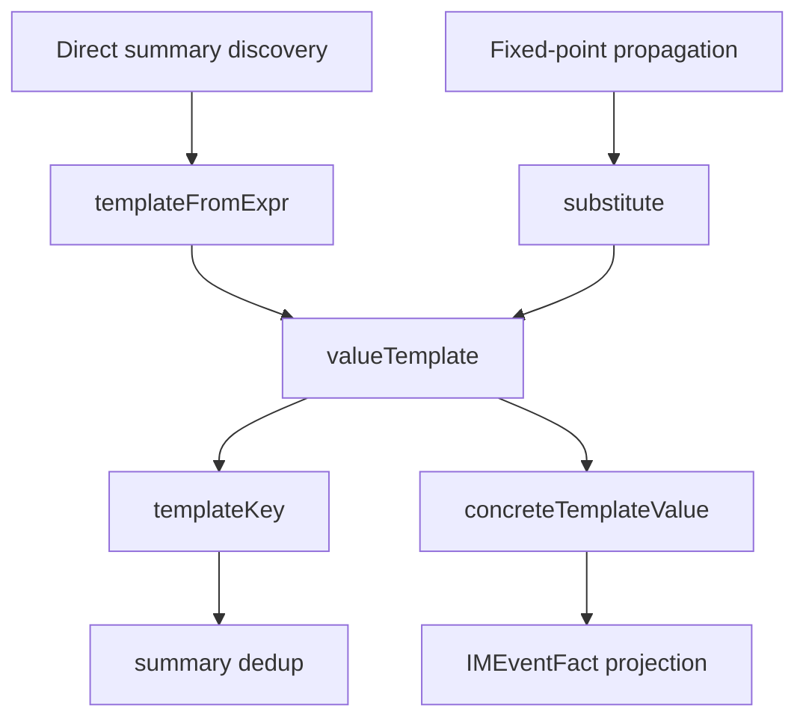

# IM Template Extraction Design

## Context

`internal/extract/im/summary.go` is the IM summary propagation layer. It currently mixes several responsibilities:

- Function indexing and reachability.
- Direct IM summary discovery.
- Fixed-point summary propagation.
- Value template construction and substitution.
- IM event fact projection.

The review backlog identifies the value template subsystem as the highest-value structural split. This design keeps runtime behavior unchanged and only extracts the template subsystem into a focused file.

## Goal

Move IM value-template logic out of `summary.go` into `template.go`, while preserving all existing output and diagnostics behavior.

The refactor should make `summary.go` easier to read as the orchestration and propagation layer, and make the template subsystem easier to test and evolve in later work.

## Non-Goals

- Do not add new IM parsing capability.
- Do not change `IMEventFact` output shape, IDs, dependency semantics, or ordering.
- Do not change protocol discovery, SDK adapter matching, direct summary discovery, or reachability.
- Do not introduce `go/types`, SSA, interface dispatch, or flow-sensitive reassignment logic.
- Do not split the whole IM extractor in this step.

## Target Files

- Add `internal/extract/im/template.go`.
- Keep `internal/extract/im/summary.go` as the propagation engine.
- Reuse existing tests in `internal/extract/im/*_test.go`.
- Add narrow template-focused tests only if the extraction creates a useful public-in-package seam.

## Extracted Responsibilities

`template.go` owns the value-template model and operations:

- `templateKind`
- `valueTemplate`
- `templateFromExpr`
- `substitute`
- `concreteTemplateValue`
- `templateKey`
- `cloneTemplate`
- `templatePrimaryParam`

These functions can remain unexported because they are package-internal implementation details.

## Remaining Responsibilities In summary.go

`summary.go` continues to own:

- `summaryEngine`
- `functionInfo`
- `functionSummary`
- Function indexing.
- Reachability.
- Direct summaries.
- Fixed-point propagation.
- Fact projection.
- Control dependency collection.
- Local call resolution.
- Symbol dependency collection.

The extracted template functions may still be methods on `summaryEngine` when they need engine state. This keeps the refactor small and avoids inventing a premature interface.

## Dependency Boundary

The template subsystem currently needs:

- `e.eval.eventValue`
- `e.eval.expressionTypeIDs`
- `e.fieldTypeIDs`
- `e.resolveLocalCall`
- `e.symbolDependencies`
- `e.index.CallableReturnTypes`
- `functionInfo.params`, `paramTypes`, and `assignments`

For this iteration, those dependencies remain direct `summaryEngine` method/field access. A separate `templateResolver` interface can be considered later if template tests or future extensions need independent construction.

## Data Flow

## Testing Strategy

Primary safety net:

- `go test -count=1 ./internal/extract/im`
- `go test -count=1 ./...`

Focused behavior checks already covered include:

- SDK event/payload separation.
- Generic JSONX payload type resolution.
- BroadcastParams wrapper propagation.
- Payload producer dependencies.
- SC2 direct protocol wrapper discovery.
- Split `data.Body = msg` direct protocol assignment.
- Legacy enum and closure wrapper resolution.
- Dynamic event unresolved behavior.
- Wrapper cycle termination.
- Summary iteration cap diagnostic.

Because this is behavior-preserving extraction, the main requirement is that all existing tests continue to pass and that `git diff` shows moved logic rather than semantic edits.

## Implementation Approach

1. Move template type definitions and template helper functions from `summary.go` to `template.go`.
2. Keep package-private names unchanged to minimize call-site churn.
3. Remove imports from `summary.go` that become template-only, such as `bytes`, `go/printer`, or `strconv`, if they are no longer used there.
4. Add imports to `template.go` for AST, token, printer, and internal packages needed by moved logic.
5. Run gofmt.
6. Run focused and full tests.

## Acceptance Criteria

- `summary.go` no longer contains value-template model definitions or template operation implementations.
- `template.go` contains the template subsystem with no exported API.
- Existing IM extraction behavior remains unchanged.
- `go test -count=1 ./internal/extract/im` passes.
- `go test -count=1 ./...` passes.
- `go vet ./...` passes.
- `git diff --check` passes.

## Follow-Up Work

After this refactor is merged, future sessions can consider:

- Introducing a narrow `templateResolver` only if it enables meaningful isolated tests.
- Caching control expressions for propagation hot paths.
- Dirty-set propagation for summary iteration.
- Adding Nexus/codegen-specific IM wrapper fixtures.
