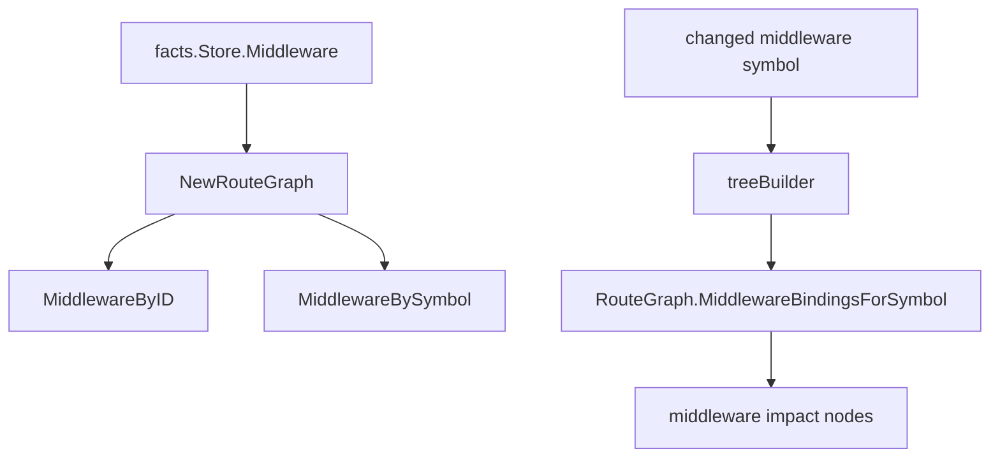

# Middleware Symbol Index Design

## Context

`internal/impact/tree_builder.go` currently finds middleware bindings for a changed middleware symbol by scanning `facts.Store.Middleware` directly. `internal/graph.RouteGraph` already owns route-domain query views such as routes by handler, dependency, group, and middleware binding ID.

This creates a small boundary leak: impact performs a route-domain query that belongs in the route graph view. It is also an avoidable linear scan for each symbol expansion.

## Goal

Move middleware-symbol lookup into `RouteGraph` by adding a stable index from middleware symbol ID to middleware binding facts.

Impact should ask the route graph for bindings instead of scanning `facts.Store.Middleware`.

## Non-Goals

- Do not change middleware impact semantics.
- Do not change `MiddlewareBindingFact`.
- Do not change route group, middleware ordering, descendant group, or cross-function group flow behavior.
- Do not change public JSON output contracts.
- Do not introduce concurrency or new dependencies.

## Target Files

- Modify `internal/graph/route.go`.
- Modify `internal/graph/graph_test.go`.
- Modify `internal/impact/tree_builder.go`.
- Modify `ARCHITECTURE.md` if the graph responsibility wording benefits from the new index.

## Proposed Architecture

Extend `RouteGraph`:

```go
type RouteGraph struct {
    MiddlewareByID     map[string]facts.MiddlewareBindingFact
    MiddlewareBySymbol map[facts.SymbolID][]facts.MiddlewareBindingFact
}
```

During `NewRouteGraph`, while indexing middleware bindings:

```go
g.MiddlewareByID[binding.ID] = binding
for _, symbol := range binding.MiddlewareSymbols {
    if symbol == "" {
        continue
    }
    g.MiddlewareBySymbol[symbol] = append(g.MiddlewareBySymbol[symbol], binding)
}
```

Expose a copy-returning query:

```go
func (g *RouteGraph) MiddlewareBindingsForSymbol(symbol facts.SymbolID) []facts.MiddlewareBindingFact
```

The query returns bindings sorted by:

1. `Span.File`
2. `StatementIndex`
3. `ID`

`treeBuilder.middlewareBindingsForSymbol` should delegate to `b.routes.MiddlewareBindingsForSymbol(symbolID)` or be removed if no longer useful.

## Data Flow



## Testing Strategy

Add a graph-level test that proves:

- A middleware binding with multiple `MiddlewareSymbols` is indexed under each symbol.
- Empty symbols are ignored.
- Returned bindings are sorted by file, statement index, and ID.
- The returned slice is a copy and cannot mutate the graph index.

Existing impact tests should continue to prove that a changed middleware symbol reaches affected routes.

Primary commands:

- `go test -count=1 ./internal/graph`
- `go test -count=1 ./internal/impact`
- `go test -count=1 ./...`

## Acceptance Criteria

- `RouteGraph` owns middleware-symbol lookup.
- Impact no longer scans `facts.Store.Middleware` for middleware symbol changes.
- Middleware impact output remains unchanged.
- Focused graph and impact tests pass.
- Full test suite and `go vet ./...` pass.
- Documentation contains no absolute workspace paths.

## Follow-Up Work

Later low-risk cleanup can apply the same pattern to other residual Store scans if they belong to graph query views.
