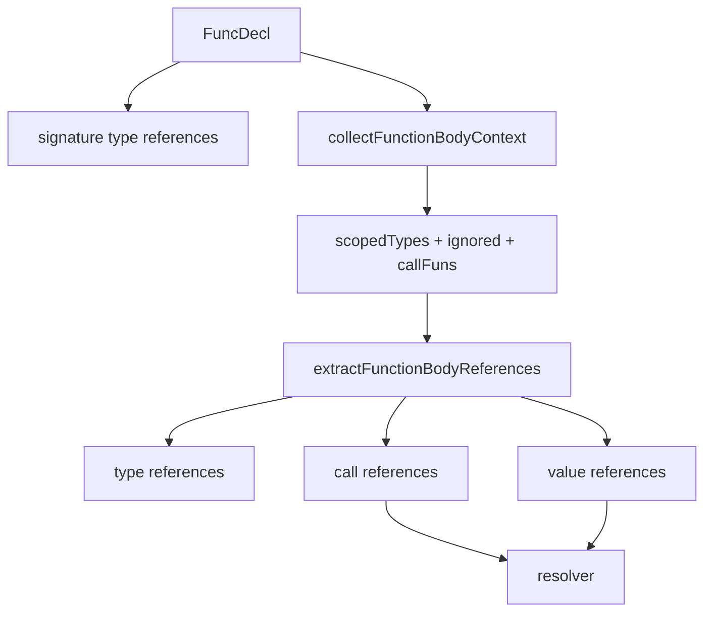

# Reference Traversal Fusion Design

## Context

`internal/extract/reference` extracts dependency edges from Go AST into `ReferenceFact` records. Function bodies currently involve several independent AST walks:

- `collectScopedValueTypes` walks the function body to infer local receiver types.
- `ignoredValuePositions` walks the body or initializer expression to mark value-reference exclusions.
- `callFunPositions` walks the body or initializer expression to mark call function positions.
- `extractValueReferences` walks the function body to emit value references.
- `extractFuncReferences` walks the function body again to emit call references and body type references.

This is correct today, but the traversal structure is harder to evolve and creates duplicated expression classification logic. The architecture review marked this as a real medium-risk refactor that should be handled in a dedicated session.

## Goal

Fuse function-body reference extraction into a smaller, explicit traversal pipeline while preserving existing behavior.

The intended steady state is:

1. Pre-scan function body once to collect local receiver type data and expression position metadata.
2. Walk function body once to emit call, type, and value reference facts.

This keeps resolver behavior stable and makes the extractor boundary clearer: traversal belongs to `extractor`, symbol resolution belongs to `resolver`.

## Non-Goals

- Do not change `ReferenceFact` schema, IDs, confidence, evidence, or ordering semantics.
- Do not change interface binding diagnostics.
- Do not change resolver algorithms or selector resolution rules.
- Do not introduce `go/types`, SSA, concurrency, or new dependencies.
- Do not attempt flow-sensitive local variable reassignment.
- Do not refactor package-level initializer extraction beyond small helper reuse.

## Target Files

- Modify `internal/extract/reference/extractor.go`.
- Modify `internal/extract/reference/values.go`.
- Modify `internal/extract/reference/scoped_types.go`.
- Add focused tests in `internal/extract/reference/extractor_test.go` only if an uncovered edge case is identified during implementation.
- Update `ARCHITECTURE.md` with the traversal boundary if the file layout or ownership becomes clearer.

## Proposed Architecture

Introduce an internal function-body context that captures precomputed metadata:

```go
type functionBodyContext struct {
    scopedTypes scopedValueTypes
    ignored     map[token.Pos]bool
    callFuns    map[token.Pos]bool
}
```

The context is built before emitting references:

```go
ctx := collectFunctionBodyContext(file, idx, fn)
```

`extractFuncReferences` keeps ownership of signature-level type references, then delegates body extraction:

```go
extractFunctionBodyReferences(p, file, idx, store, from, fn, ctx)
```

`extractFunctionBodyReferences` performs a single `ast.Inspect(fn.Body)` and handles:

- `CallExpr`: generic type arguments, type conversion detection, and call references.
- `CompositeLit`: composite literal type references.
- `SelectorExpr`: value references, using receiver-value resolution for call function positions.
- `Ident`: value references, skipping ignored positions, call function positions, and local identifiers.

Selector expressions still return `false` after value reference handling to avoid duplicate root ident value references.

## Data Flow



## Initializer Handling

Package-level initializer extraction already has a different context:

- No function-local scoped receiver types.
- It still needs ignored positions and call function positions.

For this iteration, initializer extraction may continue to use the existing helper maps. Small helper reuse is acceptable, but the main deliverable is function-body traversal clarity.

## Testing Strategy

Primary safety net:

- `go test -count=1 ./internal/extract/reference`
- `go test -count=1 ./...`

Existing tests already cover:

- Function calls.
- Package function value calls.
- Package var method calls.
- Strict interface binding success, unknown binding, and ambiguous binding.
- Generic calls and type references.
- Value references and local variable exclusion.
- Selector and method resolution edge cases.

Add a focused regression test if current coverage does not combine these in one function body:

- Generic function call with explicit type arguments.
- Composite literal type reference.
- Package-level selector value reference.
- Receiver method call using locally inferred scoped type.

The test should assert resulting reference facts, not traversal counts.

## Acceptance Criteria

- Function-body reference extraction uses one pre-scan context and one emission walk.
- `resolver` remains the resolution boundary.
- `ReferenceFact` output behavior remains unchanged.
- `go test -count=1 ./internal/extract/reference` passes.
- `go test -count=1 ./...` passes.
- `go vet ./...` passes.
- `git diff --check` passes.
- Documentation contains no absolute workspace paths.

## Follow-Up Work

After this refactor, future sessions can consider:

- Sharing expression classification helpers with initializer extraction.
- Profiling reference extraction on real BFF projects.
- Adding optional stage timings around reference extraction internals if profiling shows value.
